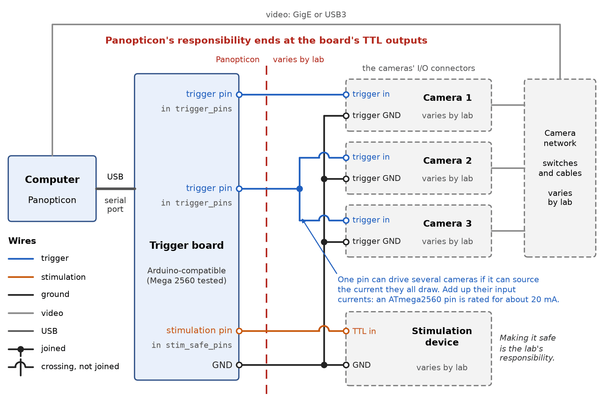
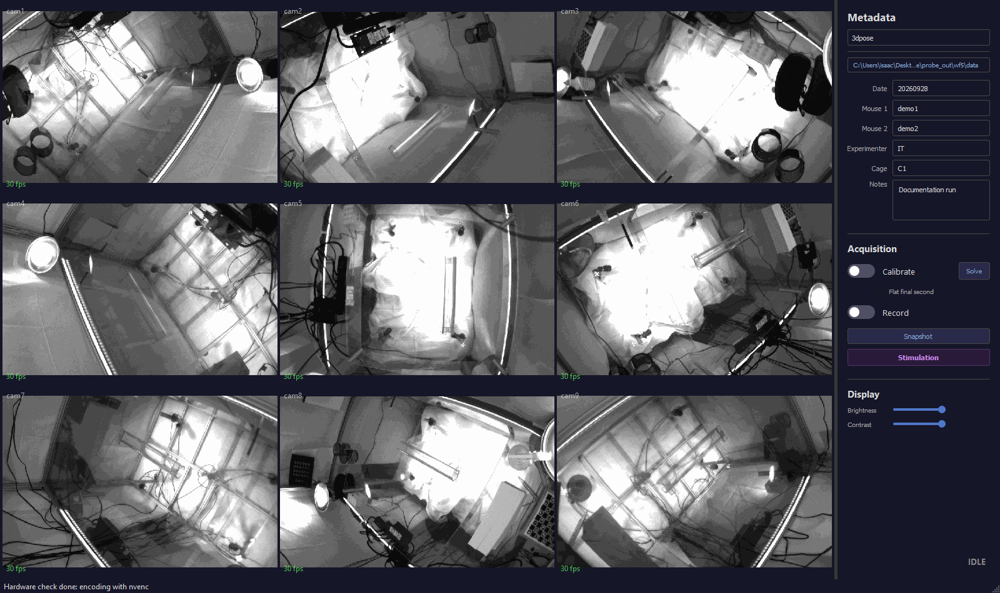
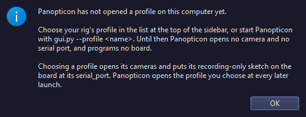
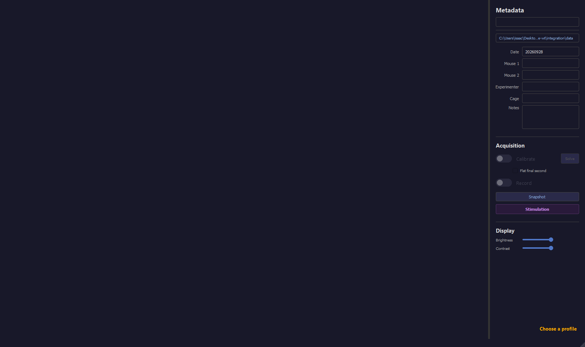

# Installation

Let's get Panopticon running on your computer. We'll install the software, put the cameras on the network, write a profile that describes your rig, and open it for the first time. By the end, every camera will be streaming live in the window.

We'll assume the rig is already built: the cameras are cabled and powered, and each camera's trigger input is wired to a pin of the trigger board. Cameras and network switches vary from lab to lab, so their own manuals cover the wiring and the menus. We'll tell you what Panopticon needs from them, and how to check it.

## Before you start

Find the row that fits you:

| You want to | Do |
|---|---|
| Try Panopticon with no cameras | Steps 1, 3 and 4 of [section 2](#2-install-the-software), then [Without any cameras](#without-any-cameras) |
| Set up a rig that's built but has never run Panopticon | All of section 2 in order, then [section 3](#3-verify-it-works) |
| Move a working rig to a new computer | Steps 1 to 5 (only this computer's side of step 5), step 7 with the old computer's files, then steps 8 to 10 and section 3 |
| Build a new rig | [Section 1](#1-what-the-rig-needs) first, then sections 2 and 3 |
| Use FLIR cameras | Section 1, steps 1, 3 and 4, then [FLIR.md](FLIR.md) |

You'll also want these handy:

- a Windows account that can run PowerShell as Administrator
- an internet connection
- each camera's serial number, printed on its label
- the trigger board and its USB cable
- a list of which board pin drives which camera, and which pin drives each stimulation device ([Set up the board](#set-up-the-board) shows how to make one)

---

## 1. What the rig needs

Skip this section if your rig already records with Panopticon. It's here to help you choose hardware, and to check your plans against a rig we know works.

### The reference rig

Every measurement in these docs comes from our rig:

| Part | Our rig |
|---|---|
| CPU | Intel Core Ultra 9 285K, 24 cores (8 performance, 16 efficiency) |
| RAM | 63.4 GiB |
| GPU | NVIDIA RTX 5080, 12 concurrent NVENC sessions |
| Cameras | 9 Basler a2A1920-165g5m (5 GigE), 1920x1200 Mono8 at 100 fps |
| Network | 3 managed multi-gigabit switches (NETGEAR MS510TXM), 3 cameras each, one 10 GbE host port per switch |
| Trigger board | Arduino Mega 2560 on `COM3`, six trigger pins shared by the nine cameras, stimulation on pin 53 |
| OS | Windows 11 |

Building a copy? Buy these parts and go straight to [section 2](#2-install-the-software).

For any other rig, the load on each part comes down to three numbers: the frame size, the frame rate and the camera count. Frames are always Mono8, one byte per pixel, so a 1920x1200 frame is 2.3 MB. A part that's too small doesn't stop the recording. It quietly loses frames instead, so size each part before you buy it ([the formulas](CONFIGURATION.md#sizing-formulas)).

Panopticon runs on 64-bit Windows, the only system we've tested.[^os]

[^os]: The thread placement settings, `configure_nic.ps1`, `make_shortcut.ps1` and the firewall rule in step 5 are Windows-only. On Linux, USB3 cameras draw their buffers from usbfs, and the launch check warns when `usbfs_memory_mb` is too small for them.

### Cameras

| Cameras | Status |
|---|---|
| Basler, GigE or USB3, through Basler's pylon SDK | Runs our rig |
| FLIR (Teledyne), GigE or USB3, through the Spinnaker SDK 4.x | In testing. Nothing has run on FLIR hardware yet ([FLIR.md](FLIR.md)) |

Every camera needs a Mono8 pixel format, the same frame size as the others, and a hardware trigger input. Panopticon won't open a camera with a different pixel format or frame size, and you can't mix vendors on one rig.[^backend]

[^backend]: Each vendor is one module in `gui_app/backends/`, and [INTERNALS.md](INTERNALS.md) lists what a module for a new vendor has to provide.

### Camera temperature

A camera without a fan cools through its housing and its mount, and one that reaches its shutdown temperature stops sending frames, even mid-recording. So plan the cooling before you mount the cameras. Mount each one on metal rather than plastic, fit heatsinks, starting with the cameras that get the least airflow, and plan for passive cooling first: some recording rooms don't allow fans, ours included.

On our rig, nine fanless a2A1920-165g5m cameras with one heatsink each levelled off at 72-78 °C at idle. They flag Critical at 76 °C and shut down at 81 °C, so there isn't much room.[^thermal] During an acquisition, Panopticon reads each camera's temperature and warns before the camera reaches the shutdown temperature it reports: at 79 °C on these cameras.

[^thermal]: Measured in September 2026. The heatsinks bought 2-4 °C, and a second heatsink on the hottest camera another 2.7 °C. Recording warmed the cameras by 0.3-0.7 °C a minute (1.1-1.3 °C before the heatsinks), so by our estimate a camera starting from the idle level of about 77.5 °C would reach 80 °C in 3-8 minutes. The Critical and shutdown levels are set in the camera's firmware and can't be raised. Please leave the camera's temperature override (`BsliDeviceTemperatureOverwriteEnable`) alone: it makes the camera report a false temperature, which its own over-temperature protection then acts on.

### A trigger source

Panopticon always triggers the cameras in hardware, because cameras left to run free drift apart. With one shared TTL trigger, frame N is the same instant in every camera,[^instant] and each frame carries the camera's count of the triggers it acquired, its [block ID](GLOSSARY.md#block-id). The trigger can come from Panopticon's own board, or from a source of yours:

| Source | In the profile | Stimulation |
|---|---|---|
| Panopticon's trigger board: an Arduino Mega 2560, or a board like it ([The trigger board](#the-trigger-board)) | `trigger_source: board` (the default), `serial_port`, `trigger_pins` | Runs on the same board |
| Your own TTL source, such as a pulse generator or a DAQ | `trigger_source: external` | Not available |

Panopticon programs its own board for you in step 8. With your own source, you start the pulses when Panopticon asks for them, and stop them yourself at the end ([more](CONFIGURATION.md#your-own-ttl-source)).

[^instant]: To within the few microseconds between trigger pins, and each camera's own trigger-to-exposure jitter.

#### Wiring the trigger line

Take your time with the wiring. A camera that misses triggers records views that aren't simultaneous with the others, and there's no fixing that afterwards. [The trigger board](#the-trigger-board) has a diagram of the whole thing. For each camera, Panopticon needs:

- **Its trigger input on a pin listed in `trigger_pins`**, or on your own source's output. On a Basler camera that's `Line1`, which Panopticon sets to trigger on the rising edge. On a FLIR camera, `camera.trigger.line` names it ([Wire the trigger](FLIR.md#2-wire-the-trigger)).
- **A common ground**, the board's GND joined to each trigger input's own ground. An opto-isolated input has a ground of its own, separate from the camera's power ground.
- **A signal the input accepts.** A Mega drives 5 V, and an opto-isolated input is driven by current. The camera's data sheet gives the input's pins, its switching threshold and the current it draws.

Any digital pin works except `0` and `1`, which carry the board's serial link, and a pin wired to a stimulation device, which goes in `stim_safe_pins` instead. Panopticon won't load a profile that breaks either rule. On a Mega, the spare serial pins `14` to `19` work too (use them last), and `A0` to `A15` are written as `54` to `69`.

One pin can drive several cameras, as long as it can supply the current they all draw. An ATmega2560 pin is rated for about 20 mA, so add up the cameras' input currents first. Our rig drives nine cameras from six pins.

> [!NOTE]
> A camera that gets too little current misses a trigger now and then. On a Basler camera the miss leaves no gap in `blockids.npy`, because its block IDs count frames rather than triggers, so the videos stay the same length while they drift apart. The block-ID rate check after each recording is what catches it ([what to do](TROUBLESHOOTING.md#the-recording-looks-fine-but-the-views-are-out-of-sync)).

Write down which pin drives which camera. The profile doesn't record it, and you'll want the list the day a camera stops triggering. The order of `trigger_pins` doesn't matter, but every pin that drives a camera has to be in it: a camera on a pin the list leaves out gets no triggers, and Panopticon [retires](GLOSSARY.md#retirement) it once it stalls.[^pins]

[^pins]: The sketch writes every pin in `trigger_pins` in one loop with interrupts off, so the pins change one after another, microseconds apart, and nothing can widen the gap. Cameras on one pin share one edge. The stimulation editor refuses a stimulation block on a camera's trigger pin, because the extra edges would advance that camera's block IDs.

### Network

USB3 cameras can skip ahead to [USB3 cameras](#usb3-cameras).

A GigE camera sends each frame as a burst of UDP packets, and a link that's close to full drops some of them. So the camera's own link, and the host port it shares with other cameras, both need room to spare.

#### The camera's own link

A camera's rate is its frame size in bits times its frame rate. A 1 Gbit/s link carries about 54 fps of a 1920x1200 frame, so 100 fps takes a 5 Gbit/s camera like the a2A1920-165g5m. At 30 fps the same frame needs 553 Mbit/s and fits a 1 Gbit/s camera, while even 1280x1024 needs 1.05 Gbit/s at 100 fps.

The link speed also decides how long a frame takes to send. The camera leaves a short [inter-packet delay](GLOSSARY.md#inter-packet-delay) between packets (`GevSCPD` on a Basler) so that cameras sharing a port don't burst into each other. A frame then takes (packets per frame) x (packet time + delay), and the sum has to fit inside the trigger period, because a camera that's still sending when the next trigger arrives ignores it. With our settings (9000-byte packets, and `GevSCPD` 10000, which is 10 µs), a 1920x1200 frame is about 260 packets:

| Link | Per packet | Per frame | At 100 fps (10 ms period) |
|---|---|---|---|
| 5 Gbit/s | 14.4 µs + 10 µs | about 6.3 ms | Fits |
| 2.5 Gbit/s | 28.8 µs + 10 µs | about 10.1 ms | Too long: the camera ignores every second trigger and records 50 fps |

So keep every camera on a port that negotiates 5 Gbit/s or more. A 2.5 Gbit/s link is sneaky: it has the bandwidth, the recording looks normal, and only the block-ID rate check afterwards shows the camera at half the trigger rate.[^slowlink]

Leave at least a millisecond of the period free. At 5 Gbit/s and 100 fps, we found that `GevSCPD` 20000 (about 8.9 ms per frame) kept the full rate, and 22000 (about 9.5 ms) halved it. Don't set the delay to 0 either, or each frame goes out as one burst and the bursts from cameras sharing a port collide at the switch.

[^slowlink]: To use a 2.5 Gbit/s link, `GevSCPD` would have to drop to about 3000 (about 8.3 ms per frame), and the rig would need testing again at that setting.

#### The host port and the switches

Add up the cameras that share a host port, and keep the total well under the port's line rate. Three 1920x1200 cameras at 100 fps send 5.53 Gbit/s, which a 10 GbE port carries with about 45% to spare. Our rig has three switches with three cameras each, and each switch has its own 10 GbE port on the computer.

On the switches, check that:

- every camera port and the uplink run at the camera's link speed. A switch with 1 GbE ports holds a 5 Gbit/s camera to 1 Gbit/s, and multi-gigabit switches often split their ports into speed blocks.
- every device in the path accepts 9000-byte [jumbo frames](GLOSSARY.md#jumbo-frames): the host adapter with its Jumbo Packet at 9014 bytes, and every switch port, the uplink included, with a maximum frame size of 9216. Step 5 sets both.
- a 10GBASE-T copper run uses Cat6a cable or better. A marginal cable shows up as packet loss while the link stays up.

#### USB3 cameras

USB3 cameras share the bandwidth of the host controller they plug into. Spread them over controllers, and before you record, stream them all at once at the target rate in pylon Viewer or SpinView.

### CPU

Each camera's grab loop has to finish every frame within one trigger period, 10 ms at 100 fps. A loop that falls behind never catches up, and its backlog grows in the driver's buffer pool until the pool runs out. At 1920x1200, each camera costs:

- about 0.8 ms per frame in its **grab thread**, roughly 8% of a core at 100 fps
- about 1 ms per frame in its **encoder thread**, outside Python's global interpreter lock (the [GIL](GLOSSARY.md#gil)), thanks to the default [pinned upload](GLOSSARY.md#pinned-upload)
- for GigE, the **network driver's** packet handling. Three cameras send about 78,000 packets/s into one port, which kept one core 46% busy on our rig.

The GIL is what really limits how far this scales. Only one thread can run Python at a time, and nine cameras make about 19 busy threads, so how briefly each thread holds the GIL matters more than how many cores you have ([measured](INTERNALS.md#why-a-copying-accessor-is-unaffordable)).

On a CPU with performance and efficiency cores, a grab thread on an efficiency core runs a few percent slow and never catches up. `pin_capture_threads` gives each grab thread a performance core of its own, and `capture_core_exclude` keeps those threads off the cores that carry the network traffic ([more](CONFIGURATION.md#pin_capture_threads)).

The launch check warns below 4 physical cores, but that's only the floor for running Panopticon at all. Size the CPU from the figures above.

### RAM

During an acquisition, each camera keeps frames in two places. The driver's **buffer pool** (`max_num_buffer`) holds them while the grab thread catches up, and the [NV12 ring](GLOSSARY.md#nv12-ring) holds them on their way to the encoder. With [kick-out](GLOSSARY.md#kick-out), the default, a frame waits in the ring until every camera has caught that trigger, so the ring grows with `kick_max_lag` and is usually the bigger of the two ([what the lag limit costs](CONFIGURATION.md#kick_max_lag)).

When you flip **Record** on, Panopticon adds them up and won't start if they don't fit in the free memory, since running out halfway through would lose frames. The log shows the sums on a `[hw] RAM for N cameras` line ([the formula](CONFIGURATION.md#ram)).

Budget about twice that total, to leave room for Windows and everything else: our nine cameras need about half of the rig's 63.4 GiB. The launch check warns below 16 GiB. A 16 GB machine usually gets the warning too, and it couldn't hold a six-camera recording at our settings anyway.

### GPU

Panopticon encodes H.264 on the GPU's NVENC encoder as it records, so you need an NVIDIA GPU with NVENC. The CUDA runtime comes as a Python package, so there's no CUDA toolkit to install.

Each camera needs its own NVENC session, and the driver caps how many can run at once. The cap depends on the GPU and the driver (it has been 2, 3, 5, 8 and 12), and with many cameras it's often the first limit you hit. So at every launch, Panopticon asks the driver for two more sessions than there are cameras, and it won't record with fewer than one per camera unless `encoder: auto` can fall back to the CPU. On our rig, the RTX 5080 grants 12, plenty for nine cameras.

You can ask a GPU the same question before you buy cameras for it, once you've done steps 1, 3 and 4:

```powershell
uv run python -c "from gui_app import nvenc; print(nvenc.probe_max_sessions())"
```

It prints how many sessions the driver granted, up to 24. Anything at or above your camera count is enough. If it prints `0`, close any other program that encodes on the GPU and try again.

When the GPU runs short, the CPU can encode with libx264 instead, and there's nothing extra to install for it. It competes with the grab threads for cores, though, so treat it as a fallback ([CPU_ENCODE.md](CPU_ENCODE.md)).

### Disk

With real-time encoding, the default, only H.264 reaches the disk: a few MB/s even for nine cameras, which any ordinary drive handles.

If neither the GPU nor the CPU can encode every camera live, `realtime_encode: false` writes the raw frames to `raw.bin` and encodes them after the recording. The disk then takes everything, 2.07 GB/s for nine 1920x1200 cameras at 100 fps, so you'll need a drive rated for that, or the cameras split across drives. Panopticon warns at **Record** above 1.5 GiB/s, because a consumer NVMe drive slows to about 1-2 GB/s once its write cache fills.

The launch check warns below 500 GiB free, and below 500 MiB/s of write speed, which it measures by writing 256 MiB to the output folder and deleting it again.

---

## 2. Install the software

Now let's install everything. Work through the steps in order, and each one ends with a quick check that it worked.

Using FLIR cameras? Do steps 1, 3 and 4 here, then follow [FLIR.md](FLIR.md) from its Spinnaker install onward.

### Open PowerShell

Every command on this page goes into PowerShell. Press the <kbd>Windows</kbd> key, type `powershell`, and press <kbd>Enter</kbd>. A window opens with a prompt like `PS C:\Users\you>`. Type a command (or right-click to paste one), press <kbd>Enter</kbd>, and wait for the prompt to come back.

A few commands need **PowerShell as Administrator**. Press the <kbd>Windows</kbd> key, type `powershell`, right-click **Windows PowerShell** and choose **Run as administrator**, then answer **Yes**. The title bar says *Administrator*. The window starts in `C:\Windows\system32`, so run `cd $HOME\Desktop\panopticon` before you use one of Panopticon's scripts from it.

> [!NOTE]
> No administrator password? Ask your IT staff before you start, since several of the installers need one too. If Windows asks for someone else's password, `$HOME` in that window is their folder, so type yours in full, as in `cd C:\Users\you\Desktop\panopticon`.

### Step 1 — install uv

[uv](https://docs.astral.sh/uv/) installs Python and every package Panopticon needs, and keeps them in Panopticon's own folder, away from any other Python on the computer. Install it with:

```powershell
powershell -ExecutionPolicy ByPass -c "irm https://astral.sh/uv/install.ps1 | iex"
```

When the prompt comes back, **close PowerShell and open it again**, so the new window can find uv. Then check that it worked:

```powershell
uv --version
```

You should see one line like this (a newer version is fine):

```
uv 0.11.13 (4512a3931 2026-05-10 x86_64-pc-windows-msvc)
```

If PowerShell says `The term 'uv' is not recognized`, sign out of Windows and back in.

### Step 2 — install the Basler pylon SDK

pypylon, the Python package that drives Basler cameras, runs on Basler's own SDK, so let's install that first. FLIR cameras skip this step and follow [FLIR.md](FLIR.md#1-install) instead.

1. Download the **pylon Software Suite** for Windows from <https://www.baslerweb.com/en/downloads/software-downloads/>. Our rig runs version 26.04, and a later one is fine.
2. Run the installer and keep its defaults. Where it lists camera interfaces, keep **GigE** ticked for network cameras, or **USB** for USB3 ones.
3. Restart the computer if it asks.

The Start menu now has a **Basler** folder with **pylon Viewer** and **pylon IP Configurator** in it. To check the install from PowerShell:

```powershell
Test-Path "C:\Program Files\Basler\pylon\Runtime\x64\PylonGigEConfigurator.exe"
```

You should see `True`. If you see `False`, search `C:\Program Files\Basler` in File Explorer for `PylonGigEConfigurator.exe`, and use the folder it's in wherever step 5 says `C:\Program Files\Basler\pylon\Runtime\x64`.

### Step 3 — get the code

Panopticon's code lives in a Git repository, and `git clone` copies it onto your computer. Don't worry if you've never used Git: it's just the commands below. First, check that Git is installed:

```powershell
git --version
```

If you see a version, like `git version 2.54.0.windows.1`, you're set. If PowerShell says `The term 'git' is not recognized`, download Git for Windows from <https://git-scm.com/download/win> and run the installer with all its defaults. Then close PowerShell, open a new one, and check again.

Now clone the repository. We'll put it on the Desktop to keep the paths short:

```powershell
cd $HOME\Desktop
git clone https://github.com/talmolab/panopticon.git
cd panopticon
```

Git prints its progress, and finishes with a line like `Resolving deltas: 100%`. The prompt now reads `PS C:\Users\you\Desktop\panopticon>`: you're in the **repository folder**, and every command from here on runs in it. In a new PowerShell window, come back with `cd $HOME\Desktop\panopticon`.

> [!TIP]
> Many Windows 11 computers keep the Desktop in OneDrive, which would try to sync the thousands of files uv installs. Run `[Environment]::GetFolderPath('Desktop')` to see where yours is. If the path contains `OneDrive`, clone into your home folder instead (`cd $HOME` in place of `cd $HOME\Desktop`), and read `$HOME\panopticon` wherever this page says `$HOME\Desktop\panopticon`.

### Step 4 — install the Python dependencies

Now uv can fetch everything else. On a computer with no cameras, use the command in [On a computer with no cameras](#on-a-computer-with-no-cameras) instead. Otherwise run:

```powershell
uv sync
```

The first run downloads Python and about two dozen packages into a `.venv` folder in the repository, and ends with a line like `Installed 27 packages in 42s`. Later runs only take a moment.

On the rig, check that the camera library, the window library and numpy all load:

```powershell
uv run python -c "import pypylon.pylon, PyQt5, numpy; print('ok')"
```

You should see `ok`. Anything else means the sync didn't finish, so run `uv sync` again and read its error.

Once `uv sync` has run in full, Panopticon needs no internet. Recording, encoding, the calibration solve and the post-session tools all run offline.

#### Check the GPU driver

The GPU encoder needs NVIDIA's own driver, and a fresh Windows install may only have a basic display driver. Check with:

```powershell
nvidia-smi --query-gpu=name,driver_version --format=csv
```

On our rig it prints:

```
name, driver_version
NVIDIA GeForce RTX 5080, 610.47
```

If PowerShell doesn't recognise `nvidia-smi`, or the name isn't an NVIDIA card, install the current driver for your card from <https://www.nvidia.com/Download/index.aspx> and restart. [GPU](#gpu) shows how to ask the driver how many cameras it can encode.

#### On a computer with no cameras

On a machine with no Basler cameras and no NVIDIA GPU, leave the camera and GPU packages out:

```powershell
uv sync --no-group rig
```

Then add `--no-group rig` to every `uv run` on that machine, as in `uv run --no-group rig gui.py --profile sim`. Without it, uv installs the camera and GPU packages again. `_launch.bat` leaves the flag off, so on this machine start Panopticon from PowerShell.

### Step 5 — put the cameras on the network (GigE)

USB3 cameras skip this step.

A GigE camera streams only when all of these are right:

- **The addresses.** The camera and its host adapter need addresses on the same subnet, or the camera doesn't show up at all.
- **The switches.** Every switch between them has to pass jumbo frames, or the camera shows up but sends nothing.
- **The firewall.** Windows has to let the camera's traffic through, or Panopticon can't find it or gets no frames from it.
- **The adapter**, which needs a few settings for this kind of traffic.

We'll take them one at a time.

> [!TIP]
> Moving a working rig to a new computer? The switches and cameras keep their settings, so you only need this computer's side: find the adapter names, give the adapters their addresses, configure them, open the firewall and check the network. `uv run probe_network.py` shows you which adapter hears which cameras.

#### Find the adapter names

Each switch has one cable, its uplink, running to a network port of its own on this computer, usually on an add-in network card. With everything powered, the link lights on the switches and each camera's status light should be on.

Windows gives each network port a name, like `Ethernet 3`, and the commands in this step need those names. List them with:

```powershell
Get-NetAdapter | Format-Table Name, InterfaceDescription, Status, LinkSpeed
```

On our rig, part of the output reads:

```
Name                         InterfaceDescription                         Status       LinkSpeed
----                         --------------------                         ------       ---------
Ethernet                     Intel(R) Ethernet Controller I226-V          Disconnected 0 bps
Ethernet 3                   Intel(R) Ethernet Network Adapter X710-TL    Up           10 Gbps
Ethernet 4                   Intel(R) Ethernet Network Adapter X710-TL #2 Up           10 Gbps
Ethernet 5                   Intel(R) Ethernet Network Adapter X710-TL #3 Up           10 Gbps
Wi-Fi                        Intel(R) Wi-Fi 7 BE200 320MHz                Up           172 Mbps
```

The **Name** column is what the commands take, so put your own names in place of `Ethernet 3` in every command below. Each camera port should read `Up` at its full speed. A port that stays `Disconnected` has a loose cable or a switch without power.

To find which port goes to which switch, unplug one switch's uplink and run the command again: the port that changes to `Disconnected` is that switch's. Plug it back in, repeat for each switch, and write the pairs down.

> [!WARNING]
> Leave your building network's port, and Wi-Fi, out of every command in this step. A fixed address or DHCP turned off on that port cuts the computer off the network.

#### The addressing scheme

Give each switch its own subnet, with the host adapter at `.2` and the cameras from `.3` up. A subnet like `192.168.5.0/24` holds every address that starts `192.168.5.`, and its mask is `255.255.255.0`. An address then tells you which switch a camera is on, and a camera plugged into the wrong switch simply stops answering. Here's our rig's plan:

| Subnet | Host adapter | Cameras |
|---|---|---|
| `192.168.3.0/24` | Ethernet 4 at `.2` | `.3` `.4` `.5` |
| `192.168.4.0/24` | Ethernet 5 at `.2` | `.3` `.4` `.5` |
| `192.168.5.0/24` | Ethernet 3 at `.2` | `.3` `.4` `.5` |

You're welcome to reuse ours: `192.168.3.0/24` for the first switch, `192.168.4.0/24` for the second, and so on. Just run `ipconfig` first, and if your building network or Wi-Fi already uses one of those subnets, pick another number for that switch.

Write each camera's serial number beside its address. Panopticon names the cameras `cam1` to `camN` by serial number, sorted as text across every switch, so the plan also tells you each camera's name. After any change of cabling, though, trust what `uv run probe_network.py` reads off the wire over a written plan.

**Only one switch?** pylon can assign every address for you. From an Administrator PowerShell:

```powershell
& "C:\Program Files\Basler\pylon\Runtime\x64\PylonGigEConfigurator.exe" auto-all
```

It gives every adapter and camera it finds matching addresses, though you don't get to choose which camera gets which. That takes care of [Give the adapters their addresses](#give-the-adapters-their-addresses) and [Give the cameras their addresses](#give-the-cameras-their-addresses). You still need the rest of this step.

#### Configure the switches

Watch out here: at its default settings, a managed switch lets the cameras show up in pylon Viewer and answer `ping`, and then drops every image packet. Each switch has a settings page, usually in a web browser, and its manual gives the address and the first password. If someone else set up the switches, ask them whether these settings are saved on every port in use.

Set these on every port in use, the uplink included:

| Setting | Value | Why |
|---|---|---|
| Maximum frame size | 9216 | Image packets are 9000 bytes |
| Flow control | Symmetric | Lets the switch pause a camera for a few microseconds instead of dropping its packets[^flow] |
| Energy Efficient Ethernet | Disabled | On the host adapters it caused a stall |
| Storm control | Disabled | Every measurement in these docs was made with it off |

Then save the settings in the switch, as its manual describes, so they survive a power cycle. Panopticon can't read a switch's settings, but [the packet sweep](#test-the-network-with-the-profile) in step 7 will catch any port that doesn't pass 9000-byte packets.

[^flow]: Several cameras burst into one uplink at once. Without flow control, the switch drops a packet, the camera resends it, and that camera's frame arrives late, which looks like a slow camera. Turning flow control on cut resend requests from thousands per camera to about ten ([measured](INTERNALS.md#resends-driver-choice-and-flow-control)). The grab threads print each camera's stream counters at the end of a recording, and `Resend_Request_Count` in the thousands with `Buffer_Underrun_Count` at 0 means loss in the network. Flow control is the first thing to check.

#### Give the adapters their addresses

Give each camera port the `.2` address on its switch's subnet, and turn off DHCP on it. From an Administrator PowerShell, with your own adapter name and subnet:

```powershell
New-NetIPAddress   -InterfaceAlias "Ethernet 3" -IPAddress 192.168.5.2 -PrefixLength 24
Set-NetIPInterface -InterfaceAlias "Ethernet 3" -Dhcp Disabled
```

`New-NetIPAddress` prints a couple of blocks listing the address, and `Set-NetIPInterface` prints nothing. An error saying the address already exists just means the port has it already. Repeat for each camera port.

To see the addresses a port holds, run `Get-NetIPAddress -InterfaceAlias "Ethernet 3"`. To remove one it shouldn't have, like an address from an old plan:

```powershell
Remove-NetIPAddress -InterfaceAlias "Ethernet 3" -IPAddress 192.168.9.2 -Confirm:$false
```

#### Configure the host adapters

Each camera port needs a few settings changed. You can set them in Device Manager (**Network adapters** → right-click the port → **Properties** → **Advanced**), but PowerShell is easier to repeat for each port. From an Administrator PowerShell:

```powershell
Set-NetAdapterAdvancedProperty -Name "Ethernet 3" -DisplayName "Jumbo Packet" -DisplayValue "9014 Bytes"
Set-NetAdapterAdvancedProperty -Name "Ethernet 3" -DisplayName "Receive Buffers" -DisplayValue 4096
Set-NetAdapterAdvancedProperty -Name "Ethernet 3" -DisplayName "Energy Efficient Ethernet" -DisplayValue "Disabled"
Set-NetAdapterAdvancedProperty -Name "Ethernet 3" -DisplayName "Interrupt Moderation" -DisplayValue "Disabled"
```

Each line prints nothing when it works. Here's what each setting is for:

- **Jumbo Packet** at 9014 bytes fits a 9000-byte packet plus its headers.
- **Receive Buffers** at the driver's maximum (4096 on our Intel adapters) absorbs bursts of packets.
- **Energy Efficient Ethernet** has to be off. With it on, we saw a stall: a worst frame gap of 471, and about 100,000 resend requests.
- **Interrupt Moderation** off made no measured difference, but we keep every port the same.

A newly added port doesn't inherit these, and Energy Efficient Ethernet and interrupt moderation default to on, so set them on every camera port. If a line says there's no matching display name or value, your driver uses other names. List them, and use those:

```powershell
Get-NetAdapterAdvancedProperty -Name "Ethernet 3" | Format-Table DisplayName, DisplayValue
```

To check every camera port at once, run `configure_nic.ps1 -Check` from an Administrator PowerShell in the repository folder. It prints PASS or WARN for each port's receive buffers, interrupt moderation, receive-side scaling (RSS) and DPC placement. It changes nothing, so it's safe to run even during a recording:

```powershell
powershell -ExecutionPolicy Bypass -File configure_nic.ps1 -Check
```

- **A WARN on receive buffers or interrupt moderation:** set that property as above, and check again.
- **A WARN on RSS that says `not judged`:** the window wasn't elevated, so run it again as Administrator.
- **A WARN on RSS that reads `enabled=False`:** run `Enable-NetAdapterRss -Name "Ethernet 3"` from an Administrator PowerShell.

<details>
<summary>Going further: DPC placement and the RSS queues (for a working rig)</summary>

After the first launch (step 9), you can pass the core list from the window's `[rig] capture core pool` log line, and the check also looks at whether the adapters' DPCs land on the capture cores:

```powershell
powershell -ExecutionPolicy Bypass -File configure_nic.ps1 -Check -CaptureCores 10,11,12,13
```

A WARN there needs no change, because `capture_core_exclude` in the profile already keeps the capture threads off those cores.

Without `-Check`, the script sets the RSS queue count, and its defaults restore the vendor's placement: one queue, every processor. Four queues changed nothing measurable in our tests, so this is only for testing one change at a time, from an Administrator PowerShell:

```powershell
powershell -ExecutionPolicy Bypass -File configure_nic.ps1 -Ports "Ethernet 3,Ethernet 4,Ethernet 5" -WhatIf
powershell -ExecutionPolicy Bypass -File configure_nic.ps1 -Ports "Ethernet 3,Ethernet 4,Ethernet 5"
```

`-WhatIf` shows what it would change without changing anything. Applying resets each port, so the cameras drop off the network for a few seconds: never do it during a recording. Always name the ports with `-Ports`, so the script can't touch your office adapter.

</details>

#### Give the cameras their addresses

FLIR cameras get their addresses in SpinView. For Basler cameras:

1. In the Start menu's **Basler** folder, right-click **pylon IP Configurator** and choose **Run as administrator**.
2. Find each camera in the list by its serial number.
3. Select it, tick **Static IP**, and type the address from your plan, the mask `255.255.255.0` and the gateway `0.0.0.0`. Untick **DHCP**, so the camera doesn't wait for a server every time it boots.
4. Press **Save**. The row shows the new address.

A camera keeps its address when it reboots. And don't worry if one ends up stranded on the wrong subnet: the IP Configurator finds cameras by their MAC address, so it can still reach it.

<details>
<summary>Setting an address from Python</summary>

Handy when you rebuild a rig often. Type `uv run python` in the repository folder, paste these lines at the `>>>` prompt with your camera's MAC and address, and type `exit()` when you're done:

```python
from pypylon import pylon

mac = "0030531A2B3C"                    # the camera's MAC, from its label or the IP Configurator
tl = pylon.TlFactory.GetInstance().CreateTl("BaslerGigE")
tl.BroadcastIpConfiguration(mac, True, False, "192.168.5.3", "255.255.255.0", "0.0.0.0", "")
tl.RestartIpConfiguration(mac)          # applies without a power cycle
```

</details>

#### Let the traffic through the firewall

The cameras talk over UDP, which Windows may block. From an Administrator PowerShell, let it in on the camera ports, with your own adapter names:

```powershell
New-NetFirewallRule -DisplayName "PanopticonGigE" -Direction Inbound -Action Allow -Protocol UDP -InterfaceAlias "Ethernet 3","Ethernet 4","Ethernet 5"
```

It prints the rule it made, including `Enabled : True` and `Action : Allow`.[^firewall]

One catch: a block rule beats every allow rule. If Windows once asked whether to let Python through the firewall and someone pressed **Cancel**, it may have added one. Open **Windows Defender Firewall with Advanced Security**, look under **Inbound Rules** for a Python rule whose action is **Block**, and delete it.

[^firewall]: The rule belongs to the camera adapters rather than to a program, so it works for whichever Python runs Panopticon. A rule for one program has to name the process that owns the sockets, and `.venv\Scripts\python.exe` and `pythonw.exe` are only launchers that start the Python uv installed.

#### Check the network

Now let's see which cameras answer:

```powershell
uv run probe_network.py
```

It asks every host adapter which cameras it can hear, and lists each camera's serial number, address, MAC and model. On our rig, shortened to one adapter:

```
=== GVCP discovery, per host adapter ===
Answers arrive from every camera on the segment, whatever its address,
so the adapter that hears a camera is the switch it is plugged into.

Ethernet 3  (192.168.5.0/24)
  42017507  ip=192.168.5.3      mac=00305339056A  a2A1920-165g5m
  42017508  ip=192.168.5.4      mac=00305339056B  a2A1920-165g5m
  42019425  ip=192.168.5.5      mac=003053390894  a2A1920-165g5m

=== summary ===
  9 camera(s) answered discovery
  every camera is on the correct subnet for its switch
```

You're hoping for `every camera is on the correct subnet for its switch` at the end. A camera line ending in `<-- WRONG SUBNET FOR THIS SWITCH` needs a new address ([Give the cameras their addresses](#give-the-cameras-their-addresses)). If no camera answers at all, check the power, the cables, the link lights and the firewall rule.

Then open **pylon Viewer** from the Start menu. Every camera should be in its device list on the left. Double-click one and press **Continuous Shot** to see live video. Close pylon Viewer again before you launch Panopticon, because a camera that another program holds won't open.

Discovery uses small packets, so it passes even when a switch drops 9000-byte ones. We'll test jumbo frames with your profile's settings at the end of [step 7](#test-the-network-with-the-profile).

### Step 6 — make the camera settings file (.pfs)

A Basler rig keeps its camera settings in a `.pfs` file, pylon's feature file: the frame size, pixel format, exposure, gain and packet settings. Panopticon loads it into every camera when it opens them, and a recording's exposure and gain come from it. A FLIR profile has a `camera:` block instead ([FLIR.md](FLIR.md#3-write-the-profile)).

If your cameras, frame size and wiring match ours, you can skip pylon Viewer and use the file we ship, `configs/mono8_1920x1200.pfs`. Otherwise, let's build one in pylon Viewer with one camera open, and then use it for every camera:

1. Open **pylon Viewer** and double-click a camera in its device list. Its features appear as a tree with a search box.[^guru]
2. Set these features. pylon Viewer shows each one by its display name, given here in brackets:
    - `PixelFormat` (Pixel Format): `Mono8`.
    - `Width` and `Height`: the full sensor size, 1920 and 1200 on an a2A1920-165g5m, unless you want a smaller frame. You'll copy these two numbers into the profile in step 7.
    - `ExposureAuto` and `GainAuto` (Exposure Auto, Gain Auto): `Off`, because automatic exposure drifts between cameras.
    - `ExposureTime` (Exposure Time): under the [exposure ceiling](CONFIGURATION.md#exposure-ceiling). We record at 3000 µs.
    - `Gain`: we record at 6 dB. Add infrared light before exposure, and exposure before gain.
    - `GevSCPSPacketSize` (Packet Size): 9000, once every device in the path passes jumbo frames.
    - `GevSCPD` (Inter-Packet Delay): we use 10000, for three cameras per port at 5 Gbit/s. Work yours out from [The camera's own link](#the-cameras-own-link).
    - `LineInverter` (Line Inverter) on `Line1`: select `Line1` under Line Selector first. It decides which edge of the trigger pulse the camera exposes on. With a board pin wired straight to `Line1`, leave it off.[^inverter]
3. Choose **File** → **Save Features**, and save the file in the repository's `configs` folder under a name of your own, like `configs/my_rig.pfs`.
4. Close pylon Viewer, so the camera is free for Panopticon.

[CONFIGURATION.md](CONFIGURATION.md#basler-cameras-the-pfs-file) lists every feature Panopticon depends on, and what it sets itself at each acquisition.

> [!TIP]
> Judge an exposure on a recording, never on the live preview. The preview runs at 30 fps, where almost any exposure fits. A setting over the ceiling looks fine there, then halves the frame rate once the cameras are triggered.

[^guru]: pylon Viewer hides some features at its lower visibility levels. If a search finds nothing, set the visibility to **Guru** and search again.

[^inverter]: Panopticon never changes `LineInverter`. The 3dface rig's file, `configs/mono8_mono.pfs`, turns it on because that rig is wired differently.

### Step 7 — write the rig profile

The profile is a YAML file in `profiles/` that describes everything except the camera settings: how many cameras there are, the frame rate, the trigger board's port and pins, and where the data goes. Every profile in `profiles/` shows up in the window's profile list.

Let's start from a template ([CONFIGURATION.md](CONFIGURATION.md#templates) lists them all). For Basler GigE cameras:

```powershell
Copy-Item profiles\templates\basler_gige.yaml profiles\my_rig.yaml
notepad profiles\my_rig.yaml
```

Notepad opens your copy. Each line is a field, a colon and a value, and anything after a `#` is a comment. Keep the spaces at the start of each line as they are, because YAML reads the indentation to tell which block a field belongs to.

First, change the line `name: basler_gige` to `name: my_rig`. The profile list and `--profile` both go by this name rather than the file's, so it's easiest to keep the two the same. Then fill in every value marked `SITE`:

- `pfs_path`: your `.pfs` file from step 6.
- `frame_width` and `frame_height`: the `Width` and `Height` from that file.
- `n_cameras`: how many cameras there are.
- `camera_serials`: every camera's serial number, quoted, in ascending order, so the first one is cam1. Panopticon then opens only these cameras, and tells you by name if one is missing ([why that matters](CONFIGURATION.md#camera_serials)). `uv run probe_network.py` prints the serials.
- `trigger_rate_limit`: the camera's maximum frame rate from its data sheet, like the 165 in a2A1920-165g5m ([more](CONFIGURATION.md#trigger_rate_limit)).
- `serial_port` and `trigger_pins`: the board's port, and the pins wired to the cameras. Step 8 helps you find both.
- `stim_safe_pins`: every pin wired to a stimulation device, as in `stim_safe_pins: [53]`. The template starts with an empty list, which protects nothing, so fill it in rather than deleting the line: the default you'd get then, `[53]`, is our rig's pin ([more](CONFIGURATION.md#stim_safe_pins)).
- `output_dir`: where sessions go, on your largest, fastest drive. Use forward slashes, as in `output_dir: D:/panopticon_data`, because YAML can misread a backslash.
- `board_config`: the file that describes your printed calibration board. Keep `configs/boards/charuco_8x8_15mm.yaml` if you printed a copy of our board ([Board config](CONFIGURATION.md#board-config)).
- `metadata_defaults`: your lab's defaults for the sidebar's fields.

Save the file when you're done. At the next launch, your profile appears in the list at the top of the sidebar. [A new rig, step by step](CONFIGURATION.md#configure-a-new-rig-step-by-step) goes through the other fields, and a board other than the Mega 2560 also needs `board_fqbn` and `board_max_pin` ([The trigger board](#the-trigger-board)).

> [!TIP]
> Moving a working rig to a new computer? Just copy the profile and the `.pfs` file over from the old computer's `profiles` and `configs` folders.

#### Test the network with the profile

Now for the jumbo-frame test we promised in step 5. For a GigE rig, with your profile's name in place of `my_rig`:

```powershell
uv run probe_network.py --sweep --profile my_rig
```

The sweep opens the cameras with your profile's settings, and grabs frames from each one at packet sizes from 1500 to 9000 bytes. It skips USB3 cameras, and it leaves the trigger board alone.

- A healthy path shows `complete=10/10` at every size up to 9000.
- If every size passes up to 1500 and fails from 2000, a device in that camera's path is still at 1500 bytes: a [switch port](#configure-the-switches) or the [adapter](#configure-the-host-adapters).

> [!NOTE]
> Don't test jumbo frames with `ping`. Our cameras answer only small echo requests, so `ping -f -l 8972` fails on a path that carries 9000-byte packets, and so does `ping -l 1472`. The sweep's real grabs are the test.

### Step 8 — flash the trigger firmware

Skip this step if your profile sets `trigger_source: external`.

Flashing means writing a new program, a sketch, onto the board. You won't flash anything by hand, because Panopticon writes its own sketch onto the board at the first launch. Here we'll get the board ready for it: check the wiring, list the pins in the profile, install the tool Panopticon flashes with, and find the board's port.

> [!WARNING]
> Panopticon's responsibility ends at the trigger board's TTL outputs. Whatever you connect to a stimulation pin, whether it's a laser, an LED or anything else, is your lab's to make safe. Every pin of the board floats briefly whenever the board resets or is flashed, and that happens at every launch, among other times ([When the board resets](WORKFLOW.md#when-the-board-resets) lists them). Before the first launch, agree with whoever is in charge of each stimulation device how it stays safe while the pins float.

The sketch Panopticon writes holds every `stim_safe_pins` pin low from its first line, and it carries no stimulation until you **Apply** or **Test** a paradigm in the stimulation editor. That plain version is the [recording-only sketch](GLOSSARY.md#recording-only-sketch). At every launch, Panopticon checks that the board carries it, and flashes it if not, so a session never starts with an old paradigm on the board.[^flashcheck]

[^flashcheck]: A paradigm stays in the board's memory through closing the window, a power cycle and unplugging the cable, which is why the check runs every time. Panopticon compares the sketch it builds with the one this computer last flashed, and flashes the board when they differ. Then it asks the board which sketch it runs, and flashes once more if the answer disagrees. The same check runs when you switch to a profile on another serial port. A switch between profiles on the same port flashes nothing, and if their `trigger_pins` or `stim_safe_pins` differ, the first **Calibrate** or **Record** flashes the board. Until then the board keeps the previous profile's boot guard, which may leave this profile's stimulation pins undriven.

#### The trigger board

The Arduino Mega 2560 is the board we test on, and the default. The sketch is plain Arduino code that `arduino-cli` compiles and uploads, so another Arduino-compatible board can take the Mega's place if it has:

- an `arduino-cli` core, the package that compiles and uploads for its board family (`arduino:avr` for the Mega)
- 5 V logic, or a level shifter on its outputs, when the camera and stimulation inputs need 5 V. A 3.3 V board's high level can fall below an input's switching threshold.
- a digital pin for every pin in `trigger_pins` and `stim_safe_pins`. Pins 0 and 1 are refused on every board.
- a USB serial port that either restarts the sketch when Panopticon opens it, as the Mega's does, or leaves the running sketch to answer the `RDY` handshake that Panopticon waits for at every start.

For such a board, set [`board_fqbn`](CONFIGURATION.md#board_fqbn) to its name in `arduino-cli` (`arduino-cli board listall` lists the names) and [`board_max_pin`](CONFIGURATION.md#board_max_pin) to its highest digital pin.[^tools]



Everything to the right of the dashed line varies by lab: the cameras' I/O connectors, the camera network and the stimulation device. And don't be surprised when the log calls the board `teensy` and tags its lines `[teensy]`, whatever board it is.

[^tools]: When an upload runs past its time limit, Panopticon waits for the board's flashing tool to finish before it tells you what to do. It knows the tools of the common cores: `avrdude`, `bossac`, `esptool`, `picotool`, the Teensy loader, `dfu-util`, `STM32_Programmer_CLI` and `openocd`. With any other tool it can't tell whether a write is still running, and its message says so.

#### Set up the board

1. **Make the pin list**, if the rig came without one. The pin numbers are printed beside the board's sockets, and the sockets marked GND are ground. Follow each wire from its socket to where it ends, and write the socket's number beside the camera's serial number or the device's name. If the wires are bundled or covered, ask whoever wired the rig, and please don't unplug wires to find out.
2. **Check the ground.** At least one wire should leave a GND socket and join the cameras' trigger grounds, and the stimulation device's ground too, as in the diagram. If you can't trace it, ask them too.
3. **Fill in the pins.** Every pin that drives a camera goes in `trigger_pins`, and every pin that drives a stimulation device goes in `stim_safe_pins`. Where cameras share a pin, you'll have fewer pins than cameras, and that's fine.
4. **Install `arduino-cli`**, on its own or with the Arduino IDE from <https://www.arduino.cc/en/software>, which includes it.
5. **Install the board support**, once. For a Mega:

    ```powershell
    arduino-cli core install arduino:avr
    ```

    It downloads the Mega's support files, or says they're already installed. Another board needs its own core.
6. **Close the Arduino IDE's Serial Monitor**, if it's open. It holds the port, and Panopticon needs it.

Got `arduino-cli` with the Arduino IDE? PowerShell can't find the IDE's copy by name, so for step 5 run it by its full path:

```powershell
& "C:\Program Files\Arduino IDE\resources\app\lib\backend\resources\arduino-cli.exe" core install arduino:avr
```

If that path doesn't exist, the IDE was installed for your account only:

```powershell
& "$env:LOCALAPPDATA\Programs\Arduino IDE\resources\app\lib\backend\resources\arduino-cli.exe" core install arduino:avr
```

Panopticon looks in both folders by itself, so there's nothing more to set up.[^cli]

[^cli]: Panopticon looks at the `PANOPTICON_ARDUINO_CLI` environment variable first, then `PATH`, then the Arduino IDE's install folders. If your `arduino-cli` lives somewhere else, set that variable to its full path: press the <kbd>Windows</kbd> key, type `environment variables`, open **Edit environment variables for your account**, press **New**, and give the name and the path. Only the flash and the stimulation editor's **Apply** and **Test** need `arduino-cli`. Without it, the launch shows `arduino-cli was not found`, with every place Panopticon looked.

#### Find the board's port

1. Plug the trigger board into a USB port on this computer.
2. Right-click the **Start** button, choose **Device Manager**, and open **Ports (COM & LPT)**. On our rig the board is listed as `Arduino Mega 2560 (COM3)`, and `COM3` is what goes in `serial_port`. A board that isn't a genuine Arduino may show up as `USB-SERIAL CH340 (COM4)` or `USB Serial Device (COM4)` instead.
3. To be sure which entry is the board, unplug it and watch the entry disappear, then plug it back in.
4. Put the port in your profile's `serial_port`, and save the file.

The first time Panopticon opens your profile (step 9), the log shows:

```
[acq] board may carry a stim paradigm from a previous session — flashing the recording-only sketch
[acq] board flashed with the recording-only sketch; stim is off until you Apply one
```

Nothing to worry about: you'll see this at the first launch on every computer, even with a brand-new board. Later launches skip the flash.

### Step 9 — first launch

Time to open Panopticon! Before you do:

- Check that your profile's `serial_port` names Panopticon's trigger board. Opening the profile resets whatever device is on that port, and the first time, it also flashes the recording-only sketch onto it.
- Close pylon Viewer, SpinView and anything else that holds the cameras.

Then:

1. Start Panopticon with your profile's name in place of `my_rig`:

    ```powershell
    uv run gui.py --profile my_rig
    ```

    A splash screen opens and names each step as it goes, down to the camera it's opening. On our rig it stays up for about 17 s:

    

2. The main window opens with a pane for each camera, each showing live video. **Calibrate** and **Record** stay grey while the status bar reads `Checking hardware: Record and Calibrate are available once it reports`:

    

    On your first launch, the state label at the bottom of the sidebar reads `Clearing stim firmware…` instead of **IDLE** while the board is flashed.

3. Give the check a few more seconds. When it's done, the status bar reads `Hardware check done: encoding with nvenc`, and **Calibrate** and **Record** turn white:

    

4. If anything needs your attention, a **Hardware Check** dialog lists it. Look up each finding in [The hardware check](TROUBLESHOOTING.md#the-hardware-check), then press **OK**:

    

You did it! Panopticon remembers the profile, so from now on `uv run gui.py` is all you need.

> [!NOTE]
> The pictures come from a later launch, so the sidebar fields are already filled in. On your first launch they're empty, apart from your profile's defaults.

If something looks different:

- **PowerShell prints an error, or a `Panopticon failed to start` dialog appears.** Look the message up in [Installing and launching](TROUBLESHOOTING.md#installing-and-launching).
- **A pane stays black, or a `Camera Error` dialog appears.** See [Opening the cameras](TROUBLESHOOTING.md#opening-the-cameras).
- **The status bar says `x264` where the picture says `nvenc`.** The CPU is doing the encoding instead of the GPU ([CPU_ENCODE.md](CPU_ENCODE.md)).
- **Your profile isn't in the list.** It didn't load, and a **Rig profiles** dialog names the file and the field at fault.

#### Choosing a profile in the window

If you start Panopticon without `--profile` on a computer where it hasn't opened a profile yet, a **Choose your rig's profile** dialog asks you to pick one first:



Until you choose, Panopticon doesn't touch the cameras or the trigger board. You'll also see this dialog when the remembered profile, or the one you named with `--profile`, doesn't load.

1. Press **OK**. The window behind the dialog has no camera panes yet, and the state label reads **Choose a profile**:

    

2. Click the empty box at the top of the sidebar, just under **Metadata**. The profile list opens:

    

3. Click your profile's name. Panopticon opens its cameras, and the launch carries on just as above.

#### Read the console

The PowerShell window you launched from shows what Panopticon found. Each line starts with the time and the name of the thread that printed it:

```
2026-09-03 19:17:35.101 [MainThread] [startup] logging to C:\Users\you\Desktop\panopticon\logs\panopticon_20260903_191735.log
2026-09-03 19:17:35.402 [MainThread] [acq] profile: 3dpose
2026-09-03 19:17:36.120 [MainThread] [cam1] 41920544 1920x1200 Mono8
2026-09-03 19:17:36.121 [MainThread] [cam1] extended (64-bit) block IDs: enabled
2026-09-03 19:17:36.121 [MainThread] [cam1] GigE stream driver: SocketDriver (SocketBufferSize=262144 KB)
...
2026-09-03 19:17:37.004 [grab0] [grab0] StartGrabbing (recording=False)
2026-09-03 19:17:37.015 [grab0] [grab0] zero-copy view OK (PaddingX=0 PaddingY=0)
2026-09-03 19:17:37.300 [session-header] [header] ===== Panopticon session header: launch =====
...
2026-09-03 19:17:38.950 [MainThread] [acq] board already carries the recording-only sketch (no stim); skipping flash
2026-09-03 19:17:38.951 [MainThread] [acq] opening teensy on COM3
```

The grab threads count from 0, so `grab0` is cam1, `grab1` is cam2, and so on. Look for:

- one `[camN] <serial> <width>x<height> Mono8` line per camera, with the frame size you set
- `zero-copy view OK (PaddingX=0 PaddingY=0)` for every camera
- the `[header]` block, which you'll want to quote when you report a problem

The hardware check runs in the background as the window opens. It measures the disk, benchmarks the CPU encoder and counts the NVENC sessions, then writes its report to the log:

- `[hw] NVENC sessions: 11 (at least — probe stopped at its limit), needed 11` on a nine-camera rig means the driver granted every session the probe asked for.
- `upload: pinned, shared CUDA context` means the pinned GPU upload passed its launch check, and `upload: host (the pinned upload check did not pass)` means it didn't. The **Hardware Check** dialog tells you when that happens.
- `Using: nvenc` names the encoder the recordings will use.

Every launch also writes all of this to `logs\panopticon_<date>_<time>.log`, which is where to look when you start Panopticon from the desktop shortcut, since it has no console. Each recording and calibration folder gets a `session.log` too: the part of the log from arming the cameras to the end of encoding.

### Step 10 — desktop shortcut

Let's make a desktop icon, so you don't need PowerShell for every launch:

```powershell
powershell -ExecutionPolicy Bypass -File make_shortcut.ps1
```

It prints a few lines, including:

```
Shortcut written: C:\Users\you\Desktop\Panopticon.lnk
  Target : C:\Users\you\Desktop\panopticon\.venv\Scripts\panopticonw.exe
  Args   : "C:\Users\you\Desktop\panopticon\gui.py"
  WorkDir: C:\Users\you\Desktop\panopticon
```

A **Panopticon** icon appears on the desktop. Double-click it, and the splash and the main window open with no console window beside them, on the profile you opened last.[^launcher]

> [!NOTE]
> The shortcut skips `uv run`, so it won't pick up new packages after an update. That's why [Updating Panopticon](#updating-panopticon) runs `uv sync` by hand.

> [!TIP]
> Panopticon won't start from the shortcut? Run `_launch.bat` in the repository folder instead. Its console stays open when Panopticon exits with an error, so you can read what went wrong. It takes the same options as `gui.py`, as in `.\_launch.bat --profile my_rig`.

[^launcher]: In an environment made by uv, `.venv\Scripts\pythonw.exe` is a console program. It would open a console window before Panopticon's, and the taskbar entry would then belong to the console. So the script copies CPython's own windowless launcher to `.venv\Scripts\panopticonw.exe`, and points the shortcut at that.

### Updating Panopticon

Close Panopticon, then in PowerShell in the repository folder:

```powershell
git pull
uv sync
```

`git pull` fetches the new code and lists the files it changed, or says `Already up to date.`, and `uv sync` installs any package the new code needs. If `uv sync` rebuilt the environment, run `make_shortcut.ps1` again so the shortcut points at the new one. Profiles and `.pfs` files you saved under names of your own are left as they are.

### Adding cameras to a rig that already works

1. **Check the serial numbers before you install anything.** Panopticon names the cameras `cam1` to `camN` in serial-number order, sorted as text across every switch, and `calibration.toml` uses those names. If a new camera's serial sorts in among the old ones, every camera after it gets renamed, so your old calibrations describe the wrong cameras and existing recordings need re-mapping. Listing them in `camera_serials` doesn't change that, since the list has to be in the same order. `uv run probe_network.py` lists the serials switch by switch, so sort them all together.
2. **Work out whether you need another host port and switch** ([The host port and the switches](#the-host-port-and-the-switches)). The same number of cameras per port keeps each port's load the same.
3. **Give a new switch its own subnet**, with the adapter at `.2` and the cameras from `.3`.
4. **Configure the new switch and the new adapter** as in step 5. Neither inherits your working ports' settings: a new switch starts at 1500-byte frames, and a new adapter with Energy Efficient Ethernet on.
5. **Wire the new cameras' trigger inputs**, to new pins added to `trigger_pins` or shared with existing ones, after checking each pin's current ([Wiring the trigger line](#wiring-the-trigger-line)). Sharing a pin needs no profile change, and it's how our rig went from six cameras to nine.
6. **Raise `n_cameras`, and add the new serials to `camera_serials`** in the profile.
7. **Check the capacity again.** RAM grows with the camera count and with `kick_max_lag`, and the GPU has to grant one NVENC session per camera (see [RAM](#ram) and [GPU](#gpu)).
8. **Test, then calibrate from scratch.** Run `uv run probe_network.py --sweep --profile my_rig` again, and every camera should complete at 9000 bytes. An old `calibration.toml` describes a camera set that no longer exists, so make a new calibration.

---

## 3. Verify it works

Let's make sure everything works: the software first, on the simulated rig, and then the real rig under load.

### Without any cameras

The simulated rig needs no hardware at all:

```powershell
uv run gui.py --profile sim
```

On a machine installed with `uv sync --no-group rig`, run `uv run --no-group rig gui.py --profile sim` instead.

The window opens with three simulated cameras, and the launch runs just as in [step 9](#step-9--first-launch). Before you record anything, point the output folder somewhere you don't mind filling up ([how](WORKFLOW.md#3-set-the-output-directory)), because the `sim` profile writes into the repository's `data` folder. After that, the preview, **Calibrate**, **Record** and the stimulation editor's **Apply** all work end to end, and [SIMULATION.md](SIMULATION.md) walks you through them.

Panopticon now remembers `sim`, so the next plain launch and the desktop shortcut open the simulated rig. To go back to yours, run `uv run gui.py --profile my_rig`.

### With real cameras

Now let's make sure the computer keeps up with the cameras. On the rig, check once more that every camera's path carries 9000-byte packets:

```powershell
uv run probe_network.py --sweep --profile my_rig
```

Then record at least 3000 frames per camera in the window, which is 30 s at 100 fps. Flip **Record** on in the sidebar to start, and off again to stop.

While it records, each grab thread prints a line to the console and the log every 1000 frames, and a `stream stats` line when you stop. Here's what cam1 printed during an 18 s recording on our rig, with the recording's totals at the end (we've trimmed the timestamps):

```
[grab0] frames=1000 timeouts=7 avg_wait=9.03ms avg_proc=0.96ms qsize=1 | deliv_lag=-0.000s copy=0.73 submit=0.02 disp=0.05 rel=0.06 cycle=9.98ms
[grab0] exiting: frames=1846 timeouts=15 drops=0 rearms=0
[grab0] stream stats: {'Total_Buffer_Count': 1846, 'Failed_Buffer_Count': 0, 'Buffer_Underrun_Count': 0, 'Total_Packet_Count': 479960, 'Resend_Request_Count': 0, 'Resend_Packet_Count': 0, 'buffers_total': 1846, 'buffers_failed': 0, 'buffers_underrun': 0, 'resend_requests': 0, 'ReceiveThreadPriorityOverride': False, 'ReceiveThreadPriority': 15, 'GevSCFTD': 0, 'GevSCBWR': 10, 'GevSCBWRA': 3}
[sync] released=16614 dropped=0 forced=0 queue_full_drops=0
[cam1] stop summary: frames_retrieved=1846, frame_count=1846, failed_grabs=0, drops=0, ring_full_drops=0, rearms=0, source_down_stalls=0, source_down_rearms=0, frames_before_barrier=0, retired=no
```

A healthy recording shows:

- **`cycle` equal to the trigger period** on every camera, for the whole run: `cycle=10.00ms` at 100 fps. A higher value means the loop falls further behind with every frame, and the buffer pool hides it until the pool is full.
- **`avg_wait` much larger than `avg_proc`.** At 100 fps and 1920x1200, a grab thread waits about 8.5 ms for every 0.8 ms of work.
- **`deliv_lag` near zero, and not growing.** It's how old a frame is when the grab thread picks it up, by the camera's own clock.
- **`Buffer_Underrun_Count` at 0** on every camera, in the `stream stats` line. Anything else means the computer didn't keep up.
- **Equal frame counts on every camera, and `forced=0`** ([forced drops](GLOSSARY.md#forced-drop)). The `exiting` and `stop summary` lines give each camera's count, and the `[sync] released=` line gives `forced=` for the whole recording.
- **No warning in the status bar after the stop.** A recording that lost more than 0.5% of its triggers to kick-out reports its [effective frame rate](GLOSSARY.md#effective-frame-rate) in `WARNINGS.txt`.

`Resend_Request_Count` counts packets lost and asked for again, and `Failed_Buffer_Count` counts frames given up on. A high resend count with no failed buffers means the link recovers every packet, just late ([Configure the switches](#configure-the-switches)). Treat a resend count a thousand times the other cameras' as a fault, even when every frame arrives.

> [!TIP]
> Measure on an otherwise idle machine. Other programs' CPU load once moved the cycle from 10.00 to 10.32 ms, and the delivery lag reached 5.6 s after 150 s.

That's it! Your rig is ready for its first session.

[*Next up:* A tour of the window](OVERVIEW.md)
