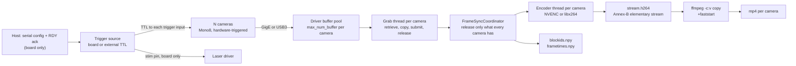
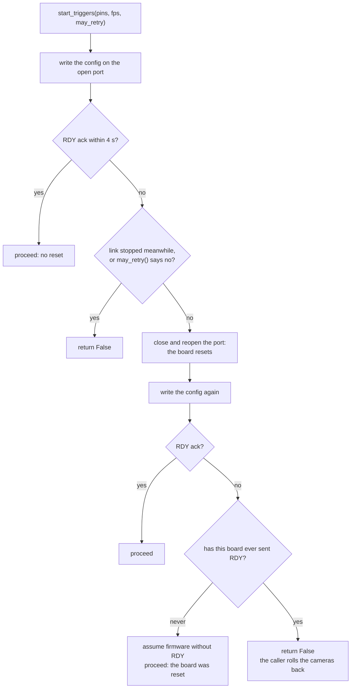
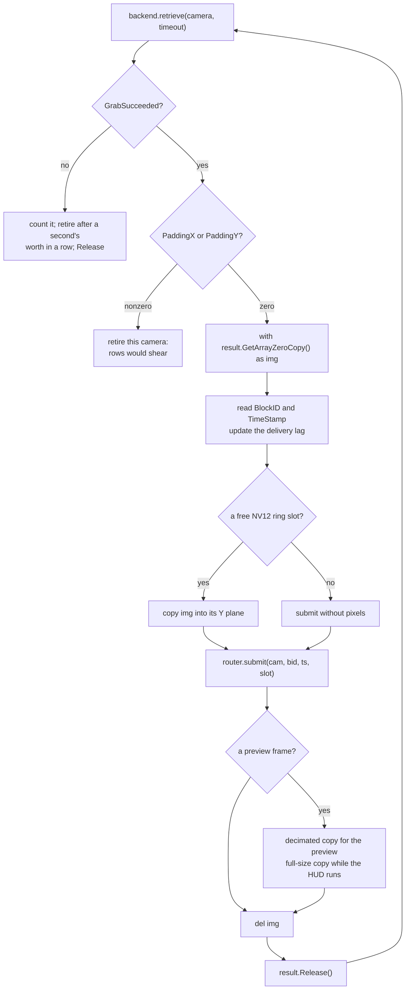
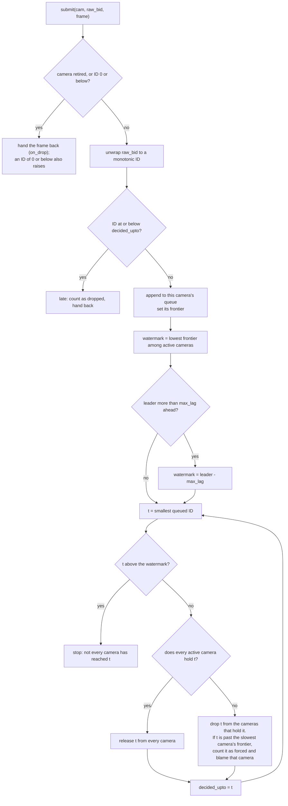
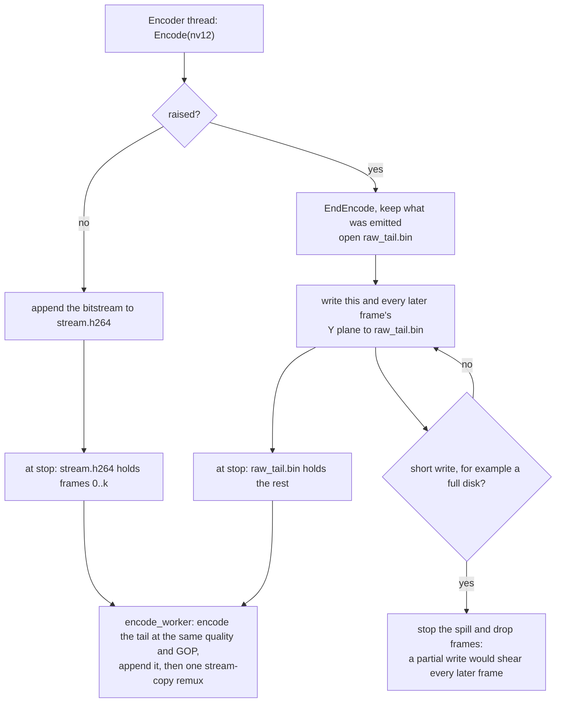
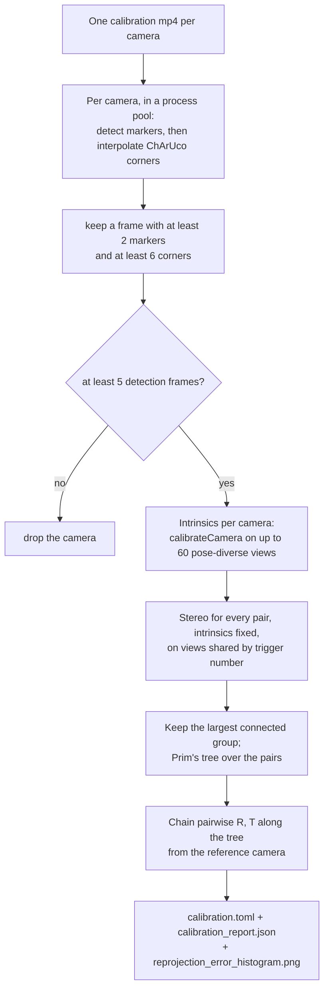

# How Panopticon works

This page describes the mechanisms: how a hardware trigger becomes a frame,
how the frames of N cameras stay aligned, and how they reach disk. Read it to
change the code, to port it to other hardware, or to find out why a recording
went wrong. [WORKFLOW.md](WORKFLOW.md) walks through a session, and
[CONFIGURATION.md](CONFIGURATION.md) documents every setting.

Figures marked "reference rig" come from the rig the project is developed on.
It has nine Basler a2A1920-165g5m GigE cameras at 1920x1200 Mono8 and 100 fps,
an Intel Core Ultra 9 285K (8 performance and 16 efficiency cores) and an
NVIDIA RTX 5080. Figures marked "six-camera rig" were measured on the same rig
before it grew to nine cameras. Each figure is an example of the arithmetic,
and the arithmetic is given so you can redo it for your cameras, frame size and
rate.

Contents:

1. [Shape of the system](#1-shape-of-the-system)
2. [Hardware triggering](#2-hardware-triggering)
3. [Exposure and the frame-rate ceiling](#3-exposure-and-the-frame-rate-ceiling)
4. [The network](#4-the-network)
5. [The capture loop](#5-the-capture-loop)
6. [Frame synchronisation](#6-frame-synchronisation)
7. [Encoding](#7-encoding)
8. [Calibration](#8-calibration)
9. [Data integrity](#9-data-integrity)
10. [Extending it](#10-extending-it)

---

## 1. Shape of the system

Every camera exposes on the same hardware trigger, and every frame reaches disk
with the number of the trigger it answered, its block ID. Frames of different
cameras are matched by that number.

A trigger source drives a TTL line into every camera's trigger input, so every
camera exposes on the same edge. By default the source is Panopticon's trigger
board, an Arduino Mega 2560 that also runs stimulation; a pulse generator or a
DAQ can take its place
([An external trigger source](#an-external-trigger-source)). Each camera
streams its frames to the host over GigE or USB3, and one grab thread per
camera retrieves them. A coordinator holds each frame until every camera has
delivered the same trigger, then releases the group to one encoder per camera.
At stop, each camera's H.264 stream is wrapped into an mp4 by stream copy.



The code follows that shape:

| File | What it does |
|---|---|
| `gui_app/backends/__init__.py` | The camera-backend contract, the backend registry and `load_backend()` |
| `gui_app/backends/basler.py` | Basler cameras through pypylon |
| `gui_app/backends/flir.py`, `_spinc.py` | FLIR cameras through the Spinnaker C library, loaded with ctypes |
| `gui_app/backends/sim.py`, `sim_board.py`, `fake_spinc.py` | The simulated rig ([SIMULATION.md](SIMULATION.md)) |
| `gui_app/camera_manager.py` | Vendor-neutral open, mode switches, start, readiness barrier and stop |
| `gui_app/grab_thread.py` | The per-camera capture loop, its NV12 ring and the encoder thread |
| `gui_app/frame_sync.py` | Cross-camera release decisions, block-ID unwrap, the block-ID rate check |
| `gui_app/sync_encode.py` | The kick-out router: coordinator, per-camera sinks, reconciliation at stop |
| `gui_app/encoders.py` | The encoder factory seam |
| `gui_app/nvenc.py`, `cuda_driver.py` | NVENC encoders, the pinned upload and the session probe |
| `gui_app/cpu_encode.py` | The libx264 encoder ([CPU_ENCODE.md](CPU_ENCODE.md)) |
| `gui_app/encode_worker.py`, `ffmpeg_cmd.py` | Remux and raw encode after stop; every ffmpeg command line |
| `gui_app/alignment.py` | Post-hoc block-ID intersection and re-encode |
| `gui_app/hardware_check.py` | The launch check, encoder selection and the capacity check at each start |
| `gui_app/session_config.py`, `rig_setup.py`, `settings.py` | The rig profile, the path that applies it to a manager, per-machine preferences |
| `gui_app/serial_controller.py`, `trigger_source.py` | The trigger-board link and RDY handshake; board or external source |
| `gui_app/stim_compiler.py`, `stim_trace.py` | Stimulation graph to Arduino sketch; the per-trigger stimulus model |
| `gui_app/board_detector.py`, `coverage_worker.py`, `charuco.py` | Live calibration coverage, and the board shared with the solve |
| `gui_app/logging_setup.py`, `recording_meta.py` | The stamped, asynchronous log; the files a recording folder describes itself with |
| `gui_app/cpu_affinity.py` | Thread placement on a hybrid CPU (Windows only) |
| `gui_app/ui_workers.py`, `calibration_worker.py`, `align_worker.py` | Blocking work off the Qt thread: any call, the solve, the alignment |
| `gui_app/mp/` | Multi-process capture, experimental ([Multi-process capture](#multi-process-capture-experimental)) |
| `gui_app/main_window.py`, `gui_app/widgets/` | The window's state machine and its widgets |
| `gui_app/probe_guard.py` | Refuses to run a probe while Panopticon runs |
| `0_encode.py`, `1_calibrate.py`, `2_align.py`, `3_stim_trace.py` | Encode, calibration solve, alignment and stimulus trace from the command line |
| `probe_network.py`, `probe_flir.py` | Network and FLIR diagnostics ([Probes](#probes)) |

---

## 2. Hardware triggering

Software cannot make several cameras expose together. A frame requested from
the host inherits the host's scheduling jitter, milliseconds on a desktop
operating system, which is far more than 3D reconstruction tolerates. The host
therefore stays out of the timing path: a hardware source emits a square wave,
every camera exposes on its edge, and the host only configures the source.

### One clock

`stim_compiler.compile_ino()` writes the sketch the trigger board runs. Its
`loop()` is the frame clock:

```c
if (FPS_OUT > 0) {
  camsLow();
  while (micros() - FRAME_START < FRAME_PERIOD / 2) { updateStim(); }
  camsHigh();
  while (micros() - FRAME_START < FRAME_PERIOD) { updateStim(); }
  FRAME_START += FRAME_PERIOD;
}
```

Keep these properties when you edit it:

- The period is whole microseconds, `FRAME_PERIOD = 1e6 / FPS_OUT`, and
  `FRAME_START` advances by adding the period instead of reading the clock
  again. The rounding error stays fixed and does not accumulate.
- The line is LOW for the first half of each period and HIGH for the second, a
  50% duty square wave. On a rising edge (the Basler setting and the FLIR
  default), a trigger fires half a period after `FRAME_START`.
- `camsHigh()` and `camsLow()` write every trigger pin between
  `noInterrupts()` and `interrupts()`, so an interrupt cannot stretch the skew
  between pins. The design follows campy by Kyle Severson (`trigger.ino` in
  <https://github.com/ksseverson57/campy>), which documents ±0.35 µs
  inter-frame precision and about 30 ns between pins.
- Nothing on the host is in the timing path. The host sends the pins and the
  rate, and the board runs on its own.

On the reference rig six pins, `[2, 4, 6, 8, 10, 12]`, drive nine cameras, so
some pins feed more than one camera input. A shared line works like one pin per
camera as long as the pin can source every input's current. The sketch drives
the pins the serial command lists, so a camera added to an existing pin needs
no profile change, and one on a new pin needs that pin in
[`trigger_pins`](CONFIGURATION.md#trigger_pins).

### Stimulation runs on the same board

The generated sketch runs a non-blocking stimulation state machine,
`updateStim()`, inside both busy-wait loops. `setup()` and the reconfigure
branch of `loop()` set `FRAME_START = micros()` and call `initStim()` a few
microseconds later, so stimulation time 0 is trigger time 0 on the same clock.
That makes `stim_trace.csv` exact: a frame's time is
`t = (unwrapped_blockid - 1) / fps`, and the stimulus model is evaluated at
that `t`.

These rules protect the timing and the laser:

- `updateStim()` does no floating-point arithmetic. It runs inside the trigger
  busy-wait, and an AVR float divide takes about 30 µs, enough to blunt the
  edge precision. The compiler resolves every period and pulse width to whole
  microseconds before it writes the sketch.
- A stimulation chain never goes on a trigger pin. Extra rising edges make
  that camera acquire extra frames, so its block IDs advance faster and block
  ID N no longer names the same instant on every camera
  ([Data integrity](#9-data-integrity)). `stim_compiler.forbidden_pin_uses()`
  blocks Apply, Test and Record, and `compile_ino()` raises, so such a sketch
  is never written. Pins 0 and 1 are refused too: they carry the serial link.
- The pins in [`stim_safe_pins`](CONFIGURATION.md#stim_safe_pins) are set to
  OUTPUT and driven LOW by `allStimLow()`, the first statement of `setup()`,
  before `Serial.begin()`. `setup()` then waits for the host's configuration,
  and a pin set any later floats for that whole wait. A powered laser driver
  reads a floating modulation input as on. Inside `allStimLow()`,
  `pinMode()` comes before `digitalWrite()`, because writing LOW to a pin
  still set as INPUT only turns off its pull-up and leaves it floating.
- Software cannot cover the board's reset. During the reset and the
  bootloader wait every pin is high-impedance, because the sketch is not
  running. Only a hardware interlock gates the laser then. A pull-down
  resistor is no substitute on the reference rig's laser driver: its internal
  pull-up is so stiff that a resistor strong enough to beat it would exceed
  the Arduino's 20 mA per-pin limit.

The operating rule that follows from the last two, switching the laser off
before anything resets the board, is in
[WORKFLOW.md](WORKFLOW.md#7-optional-stimulation).

### The serial protocol

The link to the board carries configuration, never timing: 115200 baud, 8N1,
and one command format for start and stop.

```
<n_pins>,<pin1>,...,<pinN>,<fps>\n
```

A negative `fps` stops the board: the reconfigure branch runs `camsLow()` and
`allStimLow()`, and the sketch reads the rate as 0 and sends no more triggers.
The trailing newline ends the sketch's last `parseFloat()` at once instead of
letting it wait out its one-second timeout.

The sketch answers `RDY <n_pins> <fps> <id>` from `announceReady()`. Both
configuration paths call it before they set `FRAME_START`, so the print cannot
shift the clock. `<id>` is eight hex characters that name the sketch build.
The host matches the whole line (`serial_controller._RDY_LINE`), so
`RDY 6 1000` does not confirm a request for 100 fps, and a boot message run
into the token counts as a garbled ack.

### The RDY handshake

Opening the serial port pulses DTR, which resets the board and returns the
sketch to `setup()` with an empty receive buffer. The reset is needed: with
DTR suppressed (`dtr=False`) the board ignores the configuration and sends no
triggers, and the session records no frames. The window keeps the reset away
from recordings instead. It holds one `TeensyController` open from the moment
a profile is open until quit, and each start reuses that open port. The board
therefore resets at launch, when a profile on another port is chosen, and when
firmware is flashed, and not at the start of a recording.

A start can therefore reach the sketch in `loop()` instead of a fresh
`setup()`, so every start is confirmed. `TeensyController.start_triggers()`
returns True or False:



The never-sent-RDY branch lets firmware without the handshake record, and the
has-sent-RDY branch stops a board that stopped answering from recording an
empty session. Merging the two branches either way breaks one of those cases.

The window passes a `may_retry` that refuses the reset once any camera has
counted a frame. The cameras are armed before the start, so a frame means the
board is already triggering and only its ack is missing. A reset would restart
the board's trigger count and stimulation state but not the cameras' block
IDs, and `stim_trace.csv` would then place every stimulus late by the first
attempt's triggers. The start is rolled back instead.

`ACK_TIMEOUT` is 4 s. The sketch's configuration path takes about 1.5 s (a
`delay(500)`, then a one-second `parseFloat()` timeout while it drains its
input), and a start after a forced reopen adds the reset and bootloader wait.

The stop is confirmed too. The reconfigure branch is what ends a paradigm, and
a looping stimulation chain never ends by itself, so an unconfirmed stop can
leave a laser driven while the window reads IDLE. `stop_triggers()` sends the
configuration with `fps = -1`, waits up to `STOP_ACK_TIMEOUT` (3 s) for
`RDY <n_pins> 0`, and returns False when it does not come; the caller then
shows a dialog. Firmware that has never sent RDY is exempt. The wait also
keeps the next start out of the stop's input drain, where it would be lost.
`pyserial` still reports `is_open` after the USB device is gone, so port state
is no evidence that the board is there.

Every exchange with the board holds the controller's lock, and a start does
not reset and retry once the owner has stopped or closed the link during it.
Without both, a quit that lands while a start waits for its ack could stand
the board down and then see the start's retry start it again.

### Which sketch the board carries

The identity in the board's RDY line decides whether the board needs flashing,
ahead of the per-machine record of the last upload. That record says what this
computer last wrote to the port, and a board flashed from the Arduino IDE,
swapped, or shared with another rig can carry a paradigm the record does not
know about. The window reads the identity by standing the board down, because a
stop is always safe to send: it drives the trigger and stimulation pins LOW. A
board that reports anything other than the profile's recording-only sketch is
flashed, at most once per launch. Firmware without an identity falls back to
the stored record, and the log says so.

With no profile chosen, the window opens no camera and no serial port and
flashes nothing until the operator picks one. The profile names the port and
the pins the board holds LOW at boot, so a profile picked on the operator's
behalf would be another rig's.

### An external trigger source

With [`trigger_source: external`](CONFIGURATION.md#trigger_source) a pulse
generator or DAQ drives the cameras, and Panopticon opens no serial port
(`trigger_source.ExternalTriggerSource`). The host cannot start or stop such
a source, so the operator starts it once every camera is armed, and the host
checks the order. After the readiness barrier
([Arming, and the readiness barrier](#arming-and-the-readiness-barrier)) it
watches the armed cameras for 0.5 s or five trigger periods, whichever is
longer. A frame on any camera in that window means the source was already
running, and the start is refused: each camera would count its block IDs from
the first pulse after its own arming. Stimulation needs the board, so the
editor is unavailable in this mode. The operator's steps are in
[FLIR.md](FLIR.md#use-your-own-trigger-source).

---

## 3. Exposure and the frame-rate ceiling

Exposure has an upper bound that depends on the trigger rate. A camera past it
records at half the rate while the log shows nothing wrong, and its block IDs
stop being trigger numbers.

### The rule

In trigger mode a Basler camera's frame-rate timer starts after exposure ends.
The camera is busy for the exposure plus one period of that timer, so its
shortest interval between frames is

```
minimum interval = exposure + 1 / AcquisitionFrameRate
```

`AcquisitionFrameRate` sets that floor under hardware triggering too. The
trigger period must exceed the floor for the camera to take every trigger,
which gives the ceiling on usable exposure:

```
exposure_max = 1/frame_rate - 1/AcquisitionFrameRate
```

`BaslerBackend.set_triggered()` writes the profile's
[`trigger_rate_limit`](CONFIGURATION.md#trigger_rate_limit) as
`AcquisitionFrameRate`. `BaslerBackend.exposure_ceiling_us()` returns the
formula above, and `CameraManager.apply_exposure_gain()` enforces 90% of it at
every acquisition start instead of trusting the profile. An exposure above
that is lowered and logged as `CLAMPED from ...` on the camera's `[camN]
exposure=` line. [CONFIGURATION.md](CONFIGURATION.md#exposure-ceiling) gives
the ceiling and the enforced value at the recording and calibration rates.

A recording passes `exposure_us=None`, which restores the exposure and gain
each camera held when it opened (the `.pfs` on Basler, the `camera:` block on
FLIR) instead of computing new ones. A long calibration exposure therefore
cannot reach a recording.

### Calibration exposure

Calibration runs the arithmetic the other way. At a 30 fps
`calibration_frame_rate` the period is 33.3 ms instead of 10 ms, so
[`calibration_exposure_us`](CONFIGURATION.md#calibration_exposure_us) can be
much longer than any recording exposure; the reference rig uses 5 ms. Motion
blur limits it. A board moved briskly under a long exposure smears, and its
ChArUco corners stop resolving in the poses you are trying to add.

### What happens over the ceiling

If the minimum interval exceeds the trigger period but stays under two
periods, the camera is busy when the next pulse arrives, ignores it, and
answers the next one. At a 100 fps trigger the camera then delivers about 50
fps.

A block ID counts the frames a camera acquired. An ignored trigger produces no
frame, so it consumes no block ID, and from then on this camera's block ID N is
trigger N+k for a k that keeps growing. No frame was lost anywhere, so the
block IDs stay gapless, no counter moves and every frame is whole. The camera's
frames get paired with other cameras' frames from other instants.
[The failure that leaves no gap](#the-failure-that-leaves-no-gap) covers the
check that catches it.

The symptoms, in the order people notice them:

- a live frame rate near half the trigger rate;
- a `frametimes.npy` spanning the right duration with half the rows;
- a block-ID span over the device-clock duration near 50 per second instead
  of 100.

That last ratio separates an acquisition failure from a delivery failure. A
frame lost in transmission still consumed its block ID, so a delivery loss
leaves the span intact and the row count short. A trigger the camera never
acquired shortens the span itself. The alignment path can recover only the
first kind, and every time base built on block IDs (`stim_trace.csv`
included) assumes one trigger per ID.

The preview cannot show any of this. It runs in free-run mode at 30 fps, with
33 ms of headroom, so an over-long exposure looks healthy there and halves the
rate only once the cameras are triggered. Check an exposure change on a
recording.

### Why the limiter stays on

`trigger_rate_limit: 0` makes the backend write
`AcquisitionFrameRateEnable = False`, which removes the floor and the ceiling
with it. It also removes the pacing. With the limiter on, each camera spreads
its readout and transmission over `1/limit`, 6.06 ms at 165. With it off,
every camera sends its frame onto the network the moment the shared trigger
fires, and marginal links drop packets. Measured on the reference rig,
delivery fell from 99.98% to 85-92% with the limiter off, while every camera
still acquired every trigger. For more light, raise the limiter instead, and
only when the network has margin.

On the reference rig the `.pfs` sets 3000 µs and 6.0 dB;
[HISTORY.md](HISTORY.md) records the measurement behind those values. When
frames are too dark, add illumination first, then exposure, then gain.
Illumination adds signal. Gain multiplies signal and noise alike and clips: on
a representative reference-rig frame, 3x gain saturates about 4% of pixels and
7x saturates 12.7%.

### FLIR cameras

A FLIR camera has no `AcquisitionFrameRate` limiter in this sense, so
`FlirBackend.exposure_ceiling_us()` measures the ceiling on the camera. It sets
the frame rate to the acquisition's rate at the shortest exposure, then reads
the longest `ExposureTime` the camera allows at that rate. Opening the cameras
refuses an exposure above 90% of that ceiling at `frame_rate`, and a
calibration exposure above it is clamped.
[FLIR.md](FLIR.md#the-exposure-ceiling) has the operator's side.

---

## 4. The network

This section covers GigE Vision cameras, which stream over UDP and may lose
packets. On the reference rig nine cameras send 1.84 Gbit/s each. A frame can
go missing on the network or in a host too slow to receive it. The two look the
same in a video file and have different fixes, and the camera's stream
counters tell them apart ([The counters that matter](#the-counters-that-matter)).

### GVSP and the block ID

A GigE Vision camera streams with the GigE Vision Streaming Protocol (GVSP). A
frame is one block, split across many packets, and every block carries a block
ID that the camera assigns when it acquires the frame. The driver reassembles
the packets into a buffer from a per-camera pool, and a complete buffer
becomes a grab result, the object the capture loop receives.

The pipeline relies on the block ID:

- It is the trigger number. Every camera receives the same edge and numbers
  from 1 when grabbing starts, so block ID N names the same trigger on every
  camera. That holds while each camera produces one frame per edge
  ([Data integrity](#9-data-integrity)).
- A frame lost in transmission still consumed its block ID, so the loss
  leaves a gap instead of shifting every later frame. That makes
  `max(last) - min(first) + 1` a real trigger count and the difference from
  the recorded frames a real loss count.

### Packet size and inter-packet delay

From the reference rig's `configs/mono8_1920x1200.pfs`:

| Feature | Value | What it does |
|---|---|---|
| `GevSCPSPacketSize` | 9000 | Payload per packet. Needs jumbo frames on the NIC and on every switch in the path |
| `GevSCPD` | 10000 | Delay between packets, in device clock ticks. Paces cameras that share a port |
| `GevSCFTD` | 0 | Delay before each frame. Nonzero staggers whole frames between cameras |

Packet size decides most of the host CPU cost. A 1920x1200 Mono8 frame is
2,304,000 bytes: about 260 packets at 9000 bytes and about 1600 at 1500. At 100
fps that is about 26,000 against 160,000 packets per second per camera, each
handled in interrupt context. A path that cannot carry the configured size
drops every oversized packet, and the camera delivers incomplete buffers or
nothing. Enable jumbo frames on the NIC and on every switch, and verify it with
`probe_network.py --sweep` ([Probes](#probes)).

Bandwidth per camera is `width x height x bytes_per_pixel x 8 x fps`, 1.84
Gbit/s at 1920x1200 and 100 fps. Three such cameras need a 10 GbE port with
margin for resends. At 30 fps, or at a smaller frame, the same camera fits on 1
GbE.

### Resends, driver choice and flow control

UDP loses packets, and whether a loss costs a frame depends on the receive
driver. `BaslerBackend.select_gige_driver()` applies the profile's
[`gige_driver`](CONFIGURATION.md#gige_driver):

- `socket` receives in user space. It costs more host CPU and asks for every
  lost packet again. This is the shipped setting, and the backend also raises
  `SocketBufferSize` to its maximum.
- `filter` is pylon's in-kernel driver. It costs far less CPU, but with default
  resend settings it discards a frame that lost a packet. On the six-camera rig
  at 100 fps it lost about 23% of frames as thousands of single-frame gaps per
  camera, with nothing in the log.
- `auto` leaves pylon's default. It does nothing on other transports.

A resend that succeeds loses no frame, but it completes that camera's buffer
late, and a camera that completes late every few frames drifts behind the
others. On the reference rig, switches with flow control disabled produced
about 16,800 resend requests per camera per 90 s. With flow control set to
symmetric they produced about 10, and the cameras behind them had been the
ones lagging. The failed-buffer count says what resends could not recover.
Failed buffers in the low tens beside thousands of resends mean a noisy link
that recovers nearly everything; failed buffers in the hundreds mean the
resends themselves fail. The switch settings are in
[INSTALLATION.md](INSTALLATION.md#step-5--put-the-cameras-on-the-network-gige).

### The buffer pool

The profile's [`max_num_buffer`](CONFIGURATION.md#max_num_buffer) sets the
driver buffers per camera, applied at open. The pool costs
`n_cameras x max_num_buffer x frame bytes`: 19.3 GiB at nine cameras and 1000
buffers. The reference rig uses 600 to fit its RAM (11.6 GiB, still 6 s of
slack at 100 fps). In kick-out mode the loader refuses a pool smaller than
`kick_max_lag`, because a lagging camera's backlog waits in its pool, and a
pool that runs dry first loses frames the coordinator would have waited for.
Frames leave the pool oldest first.

A deep pool absorbs network jitter, and it also hides a per-frame deficit. A
grab loop a fraction of a millisecond over budget loses nothing at first,
because the pool fills. Each frame it retrieves is staler than the last, and
when the pool runs dry frames are lost. The delivery lag and the trigger lag
([Instrumentation](#instrumentation)) show that while it happens. Pool size is
not better the bigger it is, so change it only after measuring on the rig.

### The counters that matter

When a session comes out short, the first question is whether the host fell
behind or the network lost frames. The camera's stream counters answer it.
Each grab thread reads them through `stream_stats()` before `StopGrabbing()`,
which resets them on some SDKs. It logs them, and the session metadata keeps
them under `before_stop`.

| Basler counter | Meaning |
|---|---|
| `Buffer_Underrun_Count` | The pool ran dry: the host could not keep up |
| `Failed_Buffer_Count` | A frame was given up on: resends exhausted, or incomplete |
| `Resend_Request_Count`, `Resend_Packet_Count` | Packets lost and asked for again |
| `Total_Buffer_Count`, `Total_Packet_Count` | Denominators. `Total_Packet_Count` 0 on every camera means no triggers arrived |

`Statistic_Failed_Packet_Count` is left out: on these cameras it reports more
failed packets than packets in total. Every backend also reports
`buffers_total`, `buffers_failed`, `buffers_underrun` and `resend_requests`
(`backends.CANONICAL_STREAM_STATS`), so sessions compare across vendors.

### Receive load on the host

The host finishes interrupt work for each received packet in deferred
procedure calls (DPCs), on the core the NIC's receive queue is bound to. On the
nine-camera reference rig, CPUs 0 and 1 carried 55-56% DPC time and one
efficiency core 66%, against under 3% on the rest. The reference profile keeps
capture threads off CPUs 0 and 1
([`capture_core_exclude`](CONFIGURATION.md#capture_core_exclude)). A healthy
port discards no packets at the NIC (`ReceivedDiscardedPackets` 0), and
resends recover the few a busy port drops. `configure_nic.ps1 -Check` reports
each camera port's receive settings; it must run from an elevated
PowerShell, because unelevated reads return values the adapter does not use.
On the reference rig four receive queues per port changed nothing measurable
against the vendor default of one, which the script's defaults restore.

---

## 5. The capture loop

The capture loop is the only Python code here with a hard deadline. Every camera
delivers a frame every trigger period, and the loop receiving them has that
period to finish its work. A loop a fraction of a millisecond over budget
breaks nothing at first and loses frames minutes later.

### One thread per camera, one period per frame

`GrabThread.run()` is a `QThread` per camera, and the budget per iteration is
the trigger period, 10 ms at 100 fps. If the mean iteration is longer, the
loop falls behind its camera for good, and the buffer pool absorbs the deficit
until it runs dry. Per frame, in kick-out mode:



Every consumer copies out of `img`. The view is a window onto the driver
buffer and must not outlive `Release()`. `del img` enforces that: Python does
not unbind a `with` target when the block ends, and pypylon's exit guard
cannot see the target itself. `Release()` runs in a `finally`, so the buffer
goes back on every exit from the block, an exception included.

### Why a copying accessor is unaffordable

pypylon's `GetArray()` (the `result.Array` property) allocates a new array and
copies the driver buffer into it with the GIL held. `np.frombuffer(GetBuffer())`
is no better. Measured on one camera of the six-camera rig:

| Access route | GIL-held time per frame |
|---|---|
| `result.Array` | 0.837 ms |
| `np.frombuffer(result.GetBuffer())` | 0.902 ms |
| `with result.GetArrayZeroCopy() as img:` | 0.157 ms |

GIL-held work serialises across every Python thread, so the sum is what
counts: threads times cost per frame, per trigger period. With a grab thread
and an encoder thread per camera, nine cameras are 18 threads plus the UI. At
0.84 ms per frame, the nine grab threads' copies alone take 7.5 ms of a 10 ms
period. At 0.16 ms they take 1.4 ms. A faster CPU does not close that gap,
because GIL-held work runs one thread at a time whatever the clock speed.

The tolerance was measured by driving one copy shaped like the grab loop's
against N competitor threads, each doing a fixed amount of GIL-held work every
10 ms. Cells are the copy's median wall time in milliseconds; 5 competitors
stand for a six-camera rig's grab threads, 11 for its grab and encoder
threads, and 17 for nine cameras.

| GIL-held work per competitor per frame | 0 competitors | 5 | 11 | 17 |
|---|---|---|---|---|
| 100 µs | 0.135 | 0.145 | 0.125 | 0.223 |
| 300 µs | 0.130 | 0.321 | 0.324 | 0.128 |
| 1000 µs | 0.130 | 1.031 | 10.19 | 17.14 |

The bottom row is the copying accessor's regime: at 11 competitors the copy
takes 10.19 ms, more than the 10 ms period. A change on the capture path must
keep GIL-held work at 300 µs or less per thread per frame, which the table
shows is safe even at 17 threads.

On the six-camera rig, the switch to the zero-copy view took the mean loop
`cycle` from 12.0 ms to 10.00 ms, the trigger period. It took
`Buffer_Underrun_Count` from 245-882 per camera to 0, and forced drops from as
much as 12.34% to 0.

Never time a GIL-releasing call with a plain wall-clock bracket. numpy releases
the GIL for a copy and must take it back before it returns, so the wait for
the GIL lands inside the bracket with the work. In the table above the worst
case moved wall time by a factor of 127 while the executed cycles moved by
1.6. Separate executing from waiting with `QueryThreadCycleTime`.

### The NV12 ring

The frame is copied out as soon as it is retrieved, because the driver buffer
has to go back promptly and the encoder takes the frame later. The copy goes
into a buffer in NVENC's input layout, [NV12](#nv12-from-mono8), and is one
memcpy into the buffer's top `height` rows. Allocating a buffer per frame
would put an allocation and a first-touch page fault on the loop, so each grab
thread allocates its ring once, when a recording starts:

```python
slot = np.full((height * 3 // 2, width), 128, np.uint8)   # one NV12 buffer
ring_slots(kick_max_lag, kick=True)    # kick_max_lag + 200 + 64 slots
ring_slots(None, kick=False)           # 200 + 4 slots, decoupled mode
```

`ENCODE_QUEUE_DEPTH` is 200 and `KICK_RING_SLACK` 64. A frame waits in the
coordinator for up to `kick_max_lag` triggers and then in the encoder queue.
At `kick_max_lag: 480` the ring is 744 slots, 2.39 GiB per camera at 1920x1200;
at 240 it is 504 slots and 1.62 GiB. The ring grows with `kick_max_lag`, and it
is what makes a nine-camera RAM budget tight. The capacity check at each start
sizes RAM with the same `ring_slots()` the grab thread uses.

`np.full(..., 128, ...)` fills the chroma plane once and touches every page, so
the loop never takes a first-touch page fault (about 0.4 ms). `np.empty` and
`np.zeros` would put that fault back on the loop. A `MemoryError` during the
allocation retires the camera instead of escaping `run()` and taking the
window with it.

In kick-out mode a slot is written only while it is free.
`SyncEncodeRouter.attach_ring()` turns the ring into a free list, and the grab
thread takes one slot per frame. The slot goes back when the coordinator or
the router drops the frame, or when the encoder has finished reading it. A
camera whose encoder falls behind finds no free slot, and its frame is
submitted without pixels. The coordinator still sees the trigger, and the
router drops the frame from this camera's video alone, without a block ID. A
ring that cycled in turn would put a later trigger's pixels under a block ID
already recorded, which no count, gap or rate check could detect.

In the decoupled mode (`realtime_kick: false`) a slot is taken only by a
frame the encoder queue accepted, so a dropped frame's slot is reused by the
next frame.

In either mode the ring is freed after every acquisition. The grab thread
drops its ring when its loop ends, and `stop_acquisition()` runs a full
garbage collection once every grab thread has exited. In kick-out mode each
sink also drops its references once its encoder thread has exited. The ring
is the largest allocation in the program, and the grab thread, the router and
the encoder threads refer to one another. Without these steps the ring stays
allocated until the collector's oldest generation runs, which an idle window
may never do, and the next acquisition then finds no RAM.

### Thread placement

On a hybrid CPU the loop's deadline depends on which core it runs on. Nine
cameras run about 19 busy threads against the reference rig's 8 performance
cores, so Windows puts most of them on efficiency cores, and it chooses
differently at every launch. A grab thread on an efficiency core runs the same
work a few percent slower, and the loop cannot make that up, because it
retrieves at the rate frames arrive. The result is one camera per session
drifting behind, a different one each time.

`gui_app/cpu_affinity.py` holds the placement, driven by the profile.
[`pin_capture_threads`](CONFIGURATION.md#pin_capture_threads) gives each grab
thread a performance core of its own while they last. The rest float over the
same pool and share its cores with the pinned threads. Every grab thread runs
at raised priority, and no two are pinned to one core. `capture_core_exclude`
removes cores from the pool, for the cores that carry the NIC's DPCs.
`encoder_pcores` and `pin_encoder_threads` place the encoder threads and ship
off, because both measured worse than leaving the encoders to Windows. The
performance cores are read from the operating system
(`GetSystemCpuSetInformation`), because on the reference CPU they interleave
with the efficiency cores: logical CPUs 0, 1, 10, 11, 12, 13, 22 and 23. The
reference profile excludes 0 and 1, which leaves a pool of 6 cores for 9 grab
threads: 6 are pinned and 3 float. Every call checks for Windows and does
nothing elsewhere, because a failure to pin costs performance and must never
stop a recording.

### Instrumentation

Every 1000 recorded frames each grab thread logs one line (the log's time and
thread prefix is left out here):

```
[grab0] frames=12000 timeouts=0 avg_wait=8.52ms avg_proc=0.81ms qsize=0 | deliv_lag=-0.031s copy=0.73 submit=0.02 disp=0.05 rel=0.11 cycle=10.00ms
```

Each figure is milliseconds per frame, averaged over those 1000 frames:

| Field | What it measures | Healthy |
|---|---|---|
| `avg_wait` | Time blocked in `retrieve()` | Large: it is the slack in the period |
| `avg_proc` | From `retrieve()` returning to the end of the submit | Well under the period |
| `copy`, `submit` | The two parts of `proc` | `copy` dominates |
| `disp`, `rel` | The preview copy, and `Release()`, both outside `proc` | Small |
| `cycle` | Start of one iteration to the start of the next | The trigger period |
| `deliv_lag` | Seconds this camera's frames are behind its own clock | Near 0 and not growing |
| `qsize` | Coordinator depth in kick-out mode, encoder queue otherwise | Near 0 |

`cycle` closes the budget, because `wait + proc` leaves out `Release()`, the
preview copy and the loop's own bookkeeping. A `cycle` above the trigger period
means the loop is losing to the clock even when `proc` looks fine. The
GIL-releasing calls are the other gauge. `rel` is mostly the wait to take the
GIL back after `Release()`, so a `rel` of 0.4-1 ms instead of 0.02-0.04 ms
means other threads hold the GIL
([The upload held the GIL](#the-upload-held-the-gil)).

`deliv_lag` is host time at retrieve minus the frame's device time, less the
smallest such offset over the first 200 frames, so host scheduling cannot skew
it. It does accumulate the drift between the host and camera oscillators, a
few hundred ppm. The drift-free signal in kick-out mode is the coordinator's
trigger lag, how many triggers each camera is behind the leader
(`CameraManager.frontier_lags`). The status bar shows the trigger lag in
kick-out mode and the delivery lag otherwise, and names a camera that has
delivered nothing for more than a second.

A healthy 20-minute run on the six-camera rig: `cycle` 10.00 ms on every
camera throughout, `avg_proc` 0.77-0.84 ms, `deliv_lag` -0.03 to -0.05 s,
`Buffer_Underrun_Count` 0, no forced drops, and 120,106 frames on every
camera.

### Arming, and the readiness barrier

`CameraManager.start_acquisition()` refuses before it touches anything when the
profile's frame size differs from the cameras'. It then builds the kick-out
router, puts every camera into trigger mode, applies exposure and gain, and
starts one recording grab thread per camera. Each thread allocates its ring and
calls `StartGrabbing()`, and only then sets its `ready` event; a thread that
fails sets it too, and retires. `wait_until_ready()` waits for every event, up
to 30 s. The trigger source starts only after that. Frames that arrive while a
thread is still allocating queue in the driver, and a loop that retrieves at
the arrival rate never recovers a backlog it starts with. In one measured
session a camera that started 124 frames behind stayed at `kick_max_lag` for
the whole session.

`StartGrabbing()` restarts the block-ID counter at 1, so every camera must be
armed before the first trigger. A camera armed after it counts from a later
trigger than the others: every one of its frames is paired with the wrong
trigger, with no gap and a clean rate check. These checks keep that from
happening:

- The window refuses the start when `not_ready()` names any camera after the
  barrier's bound.
- `mark_board_starting()` runs immediately before the board's start (or,
  with an external source, before the operator is asked). From then on a
  thread whose `StartGrabbing()` returns retires itself: "armed after the
  trigger board started".
- Every frame or failed grab a recording thread retrieves before that mark is
  counted (`frames_before_barrier()`). Any count refuses the start, because
  something other than this start is triggering the cameras: the board still
  running from an earlier start, another source on the line, or a camera not
  in trigger mode.

### Timeouts, stalls and giving up

Cameras and links fail mid-session, and the loop must choose between waiting,
re-arming and retiring the camera. The constants, each chosen against a
failure:

| Constant | Value | Purpose |
|---|---|---|
| retrieve timeout | 200 ms recording, 2000 ms preview | A timeout is normal once triggers stop |
| `PRE_TRIGGER_GRACE_S` | 90 s | Silence before the source starts is expected, up to this bound |
| `STALL_TIMEOUTS` | 25 consecutive timeouts (5 s) | The stall detector; resend bursts do not reach it |
| `MAX_REARMS` | 5 | Re-arms before a dead link is retired |
| `MAX_CONSEC_ERRORS` | 10 | A camera raising on every frame is retired |
| `FAILED_GRAB_RETIRE_S` | 1.0 | Failed grabs in a row that retire a camera, in seconds of the trigger rate (at least 10) |
| `SOURCE_SILENT_S` | 1.0 s | Silence on every camera that counts as the source being down |
| `SOURCE_DOWN_WAIT_WINDOWS` | 2 | Stall windows of a shared silence waited out before a re-arm |
| resync tolerance | 0.25 of a period | The resync refuses to guess an ordinal |

A GigE stream that stalls does not recover by itself. After 25 consecutive
timeouts the loop re-arms the stream (`StopGrabbing()`, then
`StartGrabbing()`). The restart resets the camera's block-ID counter, which
the unwrap would read as a 16-bit wrap and place the camera far ahead,
force-dropping every other camera's frames. `_resync_offset()` recovers the
true ordinal by counting trigger periods on the device clock, which keeps
running across the restart. Once the camera has 300 frames, the resync uses
the camera's own block-ID rate measured before the stall. The camera and board
oscillators differ by a few hundred ppm, and at the nominal rate a 40 s gap
would land a whole period off. A measured rate more than 1% off the profile's
is not used. The resync refuses when the gap does not land within 0.25 of a
period of a whole number of periods. The camera is then retired, because
frames under a guessed trigger number are worse than a lost camera.

These cases leave the ladder:

- A camera with no frame at all since the triggers started is retired at its
  first stall, without re-arming. With no frame history a restarted counter
  can never be re-based, so re-arms would only cost every camera forced drops.
- Every active camera going without frames at once (at least two cameras, for
  more than a second) points at what they share. Either the trigger source
  stopped, or the switch, port or USB controller they all use stalled. No
  camera is retired for it. A camera with frames behind it waits out two stall
  windows and re-arms at the third, which clears a shared transport stall. A
  camera with no frame keeps waiting. On the board path the window raises one
  alarm per silence that names the board and, on a profile with stimulation
  pins, the laser, because a board without power leaves its pins undriven.

Retiring is the way out in every other case. In kick-out mode the coordinator
waits for every camera, so a camera that stops publishing would force-drop
every trigger for all of them: one dead camera would empty every video.
Every early exit from `run()` retires the camera, including a `finally` that
covers exits with no exception, such as `IsGrabbing()` turning False. A
retirement goes into the session warnings and `RETIRED.json` beside the
camera's video. `2_align.py` and the window's own alignment leave such a
camera out, so it cannot cut the others to its length.

### Logging stays off the capture path

Every line printed in the process goes through `logging_setup.StampedStream`,
which adds the wall-clock time and the thread name and puts the line on a
bounded queue of 20,000 lines. One writer thread takes lines off the queue and
writes them to the log file. The console gets its copy through a second queue
and thread, so a console nobody reads never holds up the file. A full
queue drops the line and counts it, and the writer reports "N log lines
dropped" when it catches up. A print never waits for the disk or the console:
every grab and encoder thread prints, and a thread that waits while it holds a
camera buffer falls behind the trigger.

The profile's [`log_level`](CONFIGURATION.md#log_level) adds detail on cold
paths only: the camera settings written and read back at open and at each mode
change, the `[state]` transitions, and the per-camera stop summary. Nothing is
logged per frame at any level, and the level is never checked in the grab
loop or an encoder thread. The session header, the read-backs and the copy of
each acquisition's slice of the log into `session.log` run before the cameras
are armed or after capture has stopped.

The log is flushed at shutdown, from the excepthook (which, on the main
thread only, waits up to a second for the writer) and before `session.log` is
copied; `flush()` finishes only the calling thread's unfinished line. The writer writes the file before
it forwards a line anywhere else. Lines still on the queue at a native crash
are lost; faulthandler writes its traceback straight to the file.
`rig_setup.apply_profile_to_manager()` puts the profile's level in force, so
the window, the probes and the capture workers all log at it.

### Camera temperature

While acquiring, the window polls each camera's temperature every
[`thermal_poll_s`](CONFIGURATION.md#thermal_poll_s) seconds through the
backend's `thermals()`. Every threshold comes from the camera: the alert fires
at the shutdown temperature the camera reports minus
[`thermal_warn_margin_c`](CONFIGURATION.md#thermal_warn_margin_c), and always
in the camera's own over-temperature state. The camera's Critical status alone
raises nothing, because an installation can sit above that firmware level for
hours without losing a frame. A camera that reports no shutdown point is judged
by its own status. On the Basler a2A1920 the thresholds are read-only firmware
values; the hidden node that overwrites the reported temperature would defeat
the camera's own shutdown, and no backend writes it.

### Multi-process capture (experimental)

[`capture_processes`](CONFIGURATION.md#capture_processes) above 0 splits the
cameras across that many worker processes, each capturing and encoding its
own share (`gui_app/mp/`). The loader accepts it only with real-time encoding
and kick-out both on. The window refuses such a profile for now and opens no
camera; only the maintainers' local probe builds the multi-process manager,
while it is measured on the rig. The design, in brief:

- The parent holds no camera and no encoder. It resolves cam1..camN, deals
  the cameras to workers in contiguous groups, and runs one
  `FrameSyncCoordinator` that decides every trigger for every camera. Frames
  never cross a process boundary.
- Each worker runs the unchanged `GrabThread` and one `_CameraSink` per camera,
  the same code the in-process router uses, so `blockids.npy` is reconciled by
  one code path in both modes.
- Workers announce each grabbed trigger in a shared-memory ledger, and the
  parent publishes its decisions there. The publication orders that make
  every read consistent are in the `gui_app/mp/ledger.py` docstring. They rely
  on x86-64 store ordering and on aligned 8-byte accesses, so the package
  refuses other CPUs.
- A worker that exits or hangs mid-recording has its cameras retired, and the
  others keep recording. A worker that gives no results at stop leaves
  `blockids.partial` beside each stream, whose entry i is frame i of the
  stream; only the parent deletes it, once it holds that worker's results.

---

## 6. Frame synchronisation

### The problem

Cameras triggered together still lose frames independently, to a resend that
never completes or a buffer the driver gives up on. Each loss shifts every
later frame one position earlier in that camera's video. From the first loss
on, frame i of one camera's video is a different trigger from frame i of
another's.

The block ID makes the correspondence recoverable. Every recorded frame's block
ID goes into `blockids.npy`, so a position in a video maps back to a trigger
number by lookup. Real-time kick-out and the post-hoc intersection each turn
that into aligned videos, and they differ in when they pay for it. They keep
the same frames unless a camera falls more than `kick_max_lag` triggers
behind. Kick-out then force-drops, and keeps a subset of the intersection's
frames (see
[The equivalence of the two paths](#the-equivalence-of-the-two-paths)).

### Real-time kick-out (the default)

`FrameSyncCoordinator` in `gui_app/frame_sync.py` is integer logic with no Qt,
no SDK and no frame copies; frames pass through it as opaque tokens. Each
camera submits its frames in block-ID order. The coordinator keeps, per
camera, a queue of pending frames, a frontier (the highest ID seen) and its
unwrap state.



A released trigger is released by every active camera, once, in increasing
order per camera. Each encoder therefore sees a gapless, in-order stream, and
ordinary encoding produces equal-length videos aligned by trigger, with no
pass afterwards.

It works because a camera that missed trigger N shows it by delivering N+1,
with no timeout to wait out. When the cameras keep up, a decision lags the
newest frame by one or two triggers.

`max_lag` ([`kick_max_lag`](CONFIGURATION.md#kick_max_lag)) bounds how far
the leader may get ahead of the slowest camera before the laggard's missing
triggers are force-dropped, so one stalled camera cannot freeze the rig.
Forced drops are counted and blamed in `forced_by`, and the router logs a line
about every five seconds of submissions:

```
[sync] lag_behind_leader[c1:0 c2:3 c3:0] depth=4/480 released=5012 forced=0
```

Read that line when a session loses frames: the camera with the largest lag,
and any `forced_by[...]` entry, names the camera responsible. A `max_lag` costs
RAM ([The NV12 ring](#the-nv12-ring)), and a larger one is not better: on the
six-camera rig `kick_max_lag: 1000` starved capture and lost 24% of frames. A
cap below the lag the rig really shows force-drops triggers every camera
captured. [HISTORY.md](HISTORY.md) records the 240 and 480 measurements
behind the reference rig's 480.

`retire(cam, reason)` removes a camera from the set, hands back its queued
frames and records the reason, so it reaches the operator. The survivors stay
aligned, and the retired camera's video ends there. `flush()`, at stop, decides
every remaining trigger with no forcing, since no more frames are coming. Every
frame the coordinator does not release goes back through `on_drop`, so its
ring slot is freed.

At stop the router computes the kick-out counts
(`sync_encode.kick_counts()`), and the window writes them into
`session_metadata.json` (`kickout`: triggers decided, kept, kicked out and
forced, and the effective frame rate). Forced drops always produce a warning.
Ordinary kick-outs above 0.5% of the decided triggers produce one line,
"Effective frame rate X fps (target Y).", and the detail goes to the log.

### The release backlog

Retiring a camera releases at once every trigger the survivors held for it,
up to `max_lag` of them, into encoder queues 200 deep. A release that finds
its encoder queue full waits in a per-camera backlog instead of being dropped,
and later submits move it on as the encoder drains. The backlog needs no bound
of its own, because each waiting frame holds a ring slot, so the ring bounds
it. At stop the backlogs are pumped in turn under one shared deadline, so a
wedged encoder cannot use up every other camera's time. A frame still waiting
at the deadline is dropped from its camera's video, without a block ID, and
named in a warning.

### The 16-bit wrap

A 16-bit GVSP block ID counts 1 to 65535 and skips 0, so it wraps every 65535
triggers, about 11 minutes at 100 fps.
`BaslerBackend.enable_extended_block_ids()` asks for 64-bit IDs at open and
logs whether it got them. Software unwraps either way, with one rule for the
live and the post-hoc path (`frame_sync.unwrap_one` and `unwrap_blockids`): a
raw ID more than half a period below the previous one is a wrap. Every camera
is triggered together and starts at 1, so each camera wraps at the same
trigger, and unwrapping each stream on its own gives numbers that agree across
cameras. `unwrap_blockids` raises on an ID at or below 0 and on a sequence that
is not increasing after the unwrap, because only corrupt or reordered data
produces either. `frame_sync.BLOCKID_WRAP` defines the period once, for both
paths.

### Post-hoc block-ID intersection

With `realtime_kick: false`, and after a raw-mode encode, `gui_app/alignment.py`
runs after the encode. It intersects the cameras' unwrapped block IDs, finds
each camera's frame indices of the common set (`np.searchsorted`, checked),
and writes `aligned/alignment.npz` and `alignment.json`, an index that costs
nothing. With `--replace`, or in the window, it also re-encodes each video to
the common frames, replaces the original, and rewrites that camera's
`blockids.npy` and `frametimes.npy` to match; `stim_trace.csv` is then written
again. It decodes with `-fps_mode passthrough`, so every coded frame is read
once, in order.
`2_align.py` is the same pass from the command line.

A camera that ended early, started late or stopped mid-recording, each by
more than a second's worth of triggers, holds only part of the recording, and
the common set would be cut to its frames. The replace refuses while such a
camera takes part, unless the caller excludes it (`--exclude`, its files stay
as recorded) or asks for `--truncate-to-shortest`. The window leaves out a
retired camera (`RETIRED.json`) and a camera with no frames. `2_align.py`
leaves out a retired camera by default, and refuses to replace while a camera
with no frames takes part.

The intersection sees the whole recording, so the jitter that makes the live
coordinator force a drop does not affect it, and it keeps slightly more frames.
It costs a full re-encode of every video, where kick-out costs bounded RAM.

### The equivalence of the two paths

Switching `realtime_kick` changes what the rig costs, and the data should mean
the same either way. The maintainers' offline tests check the relationship over
randomised scenarios: independent drop rates of 0-20% per camera, runs of 50 to
1500 triggers, and submission orders shuffled across cameras while kept in
order per camera. They establish these properties:

1. Group integrity always holds: every released trigger is released by all N
   cameras, once each, in increasing order per camera.
2. With no forcing (`max_lag` longer than the run), the released set equals
   the intersection of the delivered sets: kick-out and the post-hoc pass keep
   the same frames.
3. With skew inside `max_lag`, the sets are still equal.
4. With forcing (skew beyond `max_lag`), the released set is a subset of the
   intersection. Forcing only discards triggers the intersection would have
   kept, and adds none.
5. Across the 16-bit wrap (70,000 triggers with wrapped IDs), the released set
   still equals the intersection.
6. Retirement resumes releases and keeps the survivors aligned, a retired
   camera's late frames never re-enter, and forced drops are blamed on the
   lagging camera.

Each property rests on the assumption [Data integrity](#9-data-integrity)
states, and the block-ID rate check guards it.

---

## 7. Encoding

The reference rig's nine cameras produce about 2 GB of pixels a second, so
compression is part of the capture path, and the grab loop cannot wait for an
encoder. The encoders run on threads of their own, on frames prepared with a
single copy.

### NV12 from Mono8

NVENC takes NV12: a full-resolution 8-bit Y plane followed by an interleaved
half-resolution UV plane. A Mono8 frame is the Y plane, and neutral chroma is a
constant 128. The conversion is therefore one memcpy into the top `height` rows
of a buffer whose lower `height/2` rows were filled with 128 once. The loader
refuses an odd frame size for the same reason.

`nvenc.probe_monochrome_support()` reads NVENC's `support_monochrome`
capability. On the reference GPU it returns 0: the encoder takes no monochrome
surface, so the constant chroma plane stays. It returns -1 when NVENC is
unavailable or the query fails, which the caller must read as unknown.

This is also why the pixel format is read back from each camera at open. A
Mono12 `.pfs` makes every frame 16-bit, and `buf[:height, :] = img` then keeps
only the low 8 bits and reports nothing: a full-length, aligned recording whose
images are noise. `CameraManager.open_all()` refuses anything but Mono8, and a
frame size that differs from the profile's or from camera 1's.

### Choosing the encoder

[CPU_ENCODE.md](CPU_ENCODE.md#choosing-the-encoder) says when the profile's
[`encoder`](CONFIGURATION.md#encoder) is resolved and gives the rule for each
value, and it covers the libx264 path. Record and Calibrate stay disabled until
the launch check reports, because it installs the encoder and the NVENC upload
setting, and its session probe holds every session the driver grants while it
counts.

### NVENC sessions

A session is one live NVENC encode context, and the driver caps how many
exist at once. The cap is undocumented and has moved across driver versions (2,
3, 5, 8, then 12 on the reference rig's driver), so it is probed, never
hardcoded. `nvenc.probe_max_sessions_isolated()` creates encoders in a child
process until the driver refuses or the count asked for is reached, and the
child's exit frees them all. The encoder selection and the capacity check ask
for `n_cameras + 2`. When the probe grants fewer than `n_cameras`, no start
proceeds on NVENC, because a camera without a session would fall back to
`raw.bin`, which writes every frame whole. The cap is often what limits how
many cameras one GPU can encode, so more cameras need a GPU whose driver grants
more sessions. The remux after a real-time recording is a stream copy and uses
no session. The raw-mode encode, the tail merge and the alignment re-encode run
ffmpeg's `h264_nvenc` (libx264 where that failed the launch check), up to
`encode_parallel` jobs at once.

The count is cached, and a cached value below what a start needs is probed
again, because a shortfall is usually another process holding sessions for a
moment. A recording in which an encoder could not be created or failed
forgets the cached count.

When releasing a session:

- `EndEncode()` does not free it. It ends the bitstream; the encoder object's
  destructor frees the session, so the last reference must go too.
  `_EncoderThread.release_encoder()` calls `EndEncode()`, then `Close()` where
  the encoder has one, then drops the reference. A leaked session can push a
  camera onto `raw.bin`.
- NVENCSTATUS 21 is the session limit, not a configuration error.
  `create_h264_encoder()` steps down a ladder of keyword sets when the driver
  rejects an unsupported keyword, but treats the codes in `_NVENC_FATAL` (1, 2,
  4, 5, 10 and 21) as fatal after one garbage-collection retry. Stepping down
  on a session-limit error would let a later rung succeed with settings nobody
  chose if a slot freed meanwhile. Every rung carries the GOP keys, and a
  reduced rung adds a note to the recording's warnings.

The GOP keys are lowercase `gop` and `idrperiod`, and the only proof that they
took effect is the bitstream. PyNvVideoCodec accepts an unknown keyword
without complaint: the ladder's earlier `gopLength` and `idrPeriod` produced
output identical to passing no GOP at all, and every real-time recording held
one IDR for its whole length. `nvenc.gop_is_honoured()` encodes two GOPs and
counts IDRs, and the launch check runs it on the upload path the profile
configures.

The first `Encode()` call makes PyNvVideoCodec import more of itself, and
several encoder threads meeting that at once can wedge the whole process in
the import machinery. `nvenc._warm()` runs one 256x256 encode under the load
lock (NVENC rejects 128x128) and releases that session, so the encoder threads
meet only the imported fast path.

### The upload held the GIL

On the reference rig one camera would drift behind the others by 10-13 frames
a second for tens of seconds, a different camera from session to session, with
no frame lost. A live capture on 2026-09-22 found why, with py-spy dumps and a
per-thread scheduler sampler during the drift, on the host upload path:

- In 20 of 20 dumps the lagging grab thread was waiting to take the GIL back
  after an ordinary pypylon call (`RetrieveResult`, `IsGrabbing`, `Release`).
  It was waiting 88% of the time, ready 5% and running 6.6%: the GIL held it
  back while CPU time was there.
- The GIL was held about 77% of wall time during the drift, and 87-90% of the
  GIL-held samples were encoder threads inside `Encode()`. In 19 of 20 dumps
  the GIL owner was an encoder, rotating across all nine.
- 23 of the 24 GIL-owning encoder stacks were inside `cuMemcpy2DAsync_v2`,
  called from PyNvVideoCodec: the host-to-device copy of the 3.46 MB NV12
  frame, which the library makes without releasing the GIL. From pageable host
  memory CUDA copies the frame into a staging buffer of its own before the call
  returns, so the whole CPU copy happens with the GIL held.

A GPU-only bench put the GIL-held part of one `Encode()` at 0.51-0.58 ms for a
buffer in cache and 0.76-0.92 ms for a ring of 200 buffers out of cache
(medians). At nine streams that is 45% to 80% of the GIL from the encoders
alone. The rig data partly support a reading of why a lag lasts once it
starts. While one camera lags, kick-out holds the other cameras' frames
longer, so they reach `Encode()` out of cache, and each upload then holds the
GIL longer.

### The pinned upload

[`nvenc_upload: pinned`](CONFIGURATION.md#nvenc_upload), the default, takes
that copy out from under the GIL. `nvenc.PinnedUploadEncoder` gives each
encoder 4 page-locked staging buffers (`PINNED_STAGING_BUFFERS`, 13.2 MiB per
encoder at 1920x1200), used in turn:

1. `Encode(nv12)` copies the frame's Y plane into the next staging buffer with
   `np.copyto`, which releases the GIL. The UV plane was written to 128 once,
   when the buffer was allocated.
2. It hands that buffer to PyNvVideoCodec together with the encoder's own CUDA
   stream. From page-locked memory the upload is a DMA queued on that stream,
   so `Encode()` holds the GIL only for the library's own bookkeeping.
3. It records a CUDA event on the stream behind the upload. Before a buffer is
   written again, its event must have completed; the encoder thread checks it
   and, only when the upload is still running, waits on it with the GIL
   released.

The events are what keep a buffer from being rewritten under an upload still
reading it: `Encode()` can return before its DMA has finished. Waiting on the
stream from the host would be wrong. The stream also carries NVENC's own work,
so a stream synchronize would drain the encoder's pipeline every frame, and
under the context's default scheduling the wait spins a core. A per-buffer
event waits only for the upload that last read that buffer, and the events
are created with
blocking sync, so a wait parks the thread instead of spinning.

The events cover the upload only if PyNvVideoCodec queues its copy on the
stream it is given, which its documentation does not state.
`nvenc.pinned_upload_matches_host()` proves it at every launch, at the
recording's frame size. It stalls the stream, hands `Encode()` one picture,
and rewrites the staging buffer with another while the stall holds. Then it
compares the result with the host path's bitstream. A copy queued on the
stream reads the rewrite, and a copy made anywhere else does not.
`hardware_check.configure_nvenc_upload()` applies the pinned setting only after
that check passes; otherwise, or when NVENC or the CUDA driver is missing,
every encoder uses the host upload and the report says why. A pinned encoder
whose setup fails later (page-locking, its context, or out of GPU memory) falls
back to the host upload on its own and adds a line to `WARNINGS.txt`. The
video is identical either way; only the GIL time differs.

Every CUDA call is bracketed by a push and a pop of the encoder's context.
An encoder is created on one thread, fed on another and closed on a third,
and a context left current on any of them would outlive the encoder.
[`nvenc_context`](CONFIGURATION.md#nvenc_context) `shared` runs every encoder
in the device's primary context, retained once per process. `own` gives each
encoder a context of its own. It needs free GPU memory for one context per
camera, measured at launch, or falls back to `shared`. `cuda_driver.py` calls
the CUDA driver through ctypes (never `PyDLL`), because ctypes releases the GIL
for the length of each call.

GPU bench on 2026-09-22 (RTX 5080, driver 610.47, PyNvVideoCodec 2.1.0, real
reference-rig frames, 9 streams at 100 fps). Each cell gives two repetitions:

| Upload | GIL held per Encode, solo median (ms) | GIL held per Encode, mean at 9 x 100 fps (ms) | Encoders' net GIL occupancy at 9 x 100 fps | Grab-proxy GIL re-acquire wait, mean (µs) | Process CPU per frame (ms) |
|---|---|---|---|---|---|
| host | 0.767 / 0.721 | 0.544 / 0.552 | 42.5 / 42.8% | 82.0 / 60.7 | 0.85 / 0.91 |
| pinned, shared context | 0.079 / 0.088 | 0.211 / 0.221 | 12.5 / 13.1% | 13.2 / 4.8 | 1.94 / 2.09 |
| pinned, own context | 0.086 / 0.082 | 0.218 / 0.234 | 13.1 / 14.2% | 6.8 / 6.1 | 2.05 / 1.94 |

A null encoder at 9 streams measured 0.072 / 0.076 ms per call, and the net
occupancy is the 9-stream mean minus that floor, times 900 calls a second. The
grab proxy is a high-priority thread that times how long it waits to take the
GIL back after a GIL-releasing call, as a grab thread does after each camera
SDK call. The pinned path costs about 1.1 ms more CPU per frame per camera,
outside the GIL, and its bitstream is byte-identical to the host path's.

On the reference rig on 2026-09-23 the pinned upload removed the drift: the
grab threads' `rel` fell from 0.44-1.12 ms to 0.02-0.04 ms, and no pinned run
showed a single camera drifting. The shared and own contexts were
indistinguishable in lag, and own used 1.5-2.2 GiB more GPU memory, so the
default is shared. One of six pinned runs met the project's bar of no camera
more than 5 frames behind after the first 2 s. The others failed on short
lags, grouped by network segment, that coincided with bursts of incomplete
buffers or of DPC load, which no upload mode addresses.

### The encoder thread

Each camera has one `_EncoderThread`. The grab side copies the gray frame into
a ring slot and hands the slot over; the encoder thread calls `Encode()` and
`os.write()`, then hands the slot back. `os.write()` releases the GIL, and on
the pinned path so does the frame copy, so the encoder threads take little GIL
time per frame.

Encoding must never run in the grab loop. On the six-camera rig an inline
encode starved packet reassembly and lost about 28% of frames as incomplete
buffers.

In kick-out mode the router puts released frames on each encoder's queue
(`ENCODE_QUEUE_DEPTH`, 200) without waiting
([The release backlog](#the-release-backlog)). In the decoupled mode
(`realtime_kick: false`) each grab thread owns its encoder, waits up to
`PUT_TIMEOUT_S` (2 s) on a full queue and then drops the frame. A queue full
that long means the encoder is wedged, and a longer wait would only empty the
driver pool too. A dropped frame gets no block ID, so it is a gap that post-hoc
alignment accounts for, and the stop names it in a warning.

### The stream, and the remux

Each encoder writes an Annex-B H.264 elementary stream to `stream.h264`. At
stop `EncodeWorker` wraps it into an mp4 by stream copy:

```
ffmpeg -y -nostdin -hide_banner -loglevel warning -fflags +genpts -r <fps> -i stream.h264 -c:v copy -movflags +faststart <mp4>
```

There is no re-encode and no GPU, and it takes seconds. The timestamps are
generated at a constant `fps`, so frame indices survive into the mp4
unchanged; the real instant of frame i comes from `blockids.npy`. A stream
copy keeps the GOP the encoder wrote, so the launch check proves NVENC's GOP
from the bitstream ([NVENC sessions](#nvenc-sessions)).

Every path that writes an mp4 needs these options for LUC3D, the browser-based
3D labelling tool this pipeline feeds, written by Eric Leonardis and hosted by
the Talmo Lab (<https://talmolab.github.io/luc3d/>):

- `-g <fps>`, one IDR a second. Without an explicit GOP one recording of 898 s
  and 415 MB held a single IDR, so showing frame N meant decoding all N frames,
  and `ffprobe` could not walk the file. LUC3D also assumes one keyframe a
  second (`kfInterval = Math.round(fps)`). At a constant quantiser the extra
  IDRs cost about 11% in size.
- `-movflags +faststart`, the moov atom at the front. LUC3D reads the file
  from byte 0 in 1 MB pieces until moov parses, so moov at the end means
  reading the whole file, per camera, before frame 1 appears.

`gui_app/ffmpeg_cmd.py` builds every such command line, so a writer that uses
it cannot drop either option. The mp4 writers are `encode_worker` (remux and
encode) and `alignment.extract_aligned()`; the tail merge writes an Annex-B
stream, and the remux adds the container. `-preset superfast` changes neither
the GOP nor the atom order and makes files about 64% larger.

### Reconciliation: what blockids.npy may claim

The router records a block ID when the encoder queue accepts the frame, which
is not the same as the frame being encoded. A dead encoder thread accepts a
queue's worth of frames and encodes none, so `blockids.npy` would claim frames
`stream.h264` does not hold, and frame i of the mp4 would map to the wrong
trigger. Every tool downstream takes the block IDs as given.

At stop each `_CameraSink` reconciles the list against what was persisted: the
pictures the encoder emitted (its `frames_out` where it has one) plus the
frames spilled raw, both in arrival order. The frames the encoder accepted but
never emitted sit between `stream.h264` and the spilled tail, so they are
spliced out at that junction instead of cut from the end. Cutting from the
end would leave block IDs whose count matches the mp4 while every later frame
carried a trigger number too small. The repair goes into the camera's
`WARNINGS.txt`. An encoder thread that outlives its join still has moving
counters, so nothing is cut. The mapping is declared unverified, and the
thread's file descriptor and session are left alone instead of being pulled
from under a live writer.

### When an encoder fails

The real-time path degrades in stages:



The splice works because both segments start with their own SPS, PPS and IDR.
`encoded.json` records where the stream ends and the tail begins, so a merge
that fails can cut the metadata to the frames the mp4 holds instead of
over-claiming. `raw_tail.bin` is read back as whole `width x height` frames,
so the spill stops at the first short write.

At start, kick-out mode needs an encoder for every camera. When the router
cannot create them all, it releases the sessions it did get, and the start is
refused ("Real-time kick-out was requested but its encoders could not be
created"). One encoder per grab thread instead would meet the same session cap
and end in `raw.bin`. In the decoupled mode a grab thread
whose encoder cannot be created records that camera to `raw.bin`, which is
encoded after the session, and says so in a warning with the disk cost.

### Raw capture

`realtime_encode: false` writes whole frames to `raw.bin` during capture and
encodes them after the session with the `h264_nvenc` ffmpeg pool, or libx264
where `h264_nvenc` failed the launch check. There is no GPU work during
capture; the disk takes `n_cameras x fps x width x height` bytes a second
instead, 2.07 GB/s for nine cameras at 1920x1200 and 100 fps. Each camera
keeps every frame it recorded, and no camera is cut to another's length. When
a `raw.bin` and its camera's block IDs disagree, both are cut to the frames
they share, because a frame without a block ID cannot be placed in time, and
a warning names the camera.

### What each mode does at stop

| Mode | Profile | Block-ID rate check | Alignment afterwards |
|---|---|---|---|
| Kick-out | `realtime_encode: true`, `realtime_kick: true` | In the router's stop | None: the videos already hold the same triggers. Unequal videos are flagged with the command that aligns them |
| Post-hoc | `realtime_encode: true`, `realtime_kick: false` | At stop, from the saved files | Automatic, leaving out retired and empty cameras |
| Raw | `realtime_encode: false` | At stop, from the saved files | Automatic after the encode, as above |

Every problem goes into the acquisition's `WARNINGS.txt` and the dialog at the
end of the session.

---

## 8. Calibration

Turning matching 2D detections into a 3D point needs each camera's optics
(focal lengths, principal point, lens distortion) and where each camera sits
relative to the others. Calibration measures both by showing every camera a
board of known geometry and solving for the parameters that explain what they
saw.

A calibration is an acquisition of its own. It runs at
`calibration_frame_rate` with its own exposure and gain, writes to
`<session>/calibration/cam*/`, and is triggered, encoded and aligned by the
same path as a recording.

### Live coverage

`board_detector.BoardDetector` runs on full-resolution frames from
`coverage_worker.CoverageWorker`, off the UI thread. `GrabThread.set_keep_full`
turns on the full-size copy; obliquely mounted cameras need full resolution to
resolve the board, as the solve does.

The detection rate is best effort. The worker waits at least 33 ms between
ticks, and detection runs over the cameras one after another at 6-250 ms each,
depending on how much texture the scene gives the marker detector. With the
reference rig's nine cameras the worker runs at 10-20 ticks a second, and near
1 when several cameras see clutter. The thresholds below count ticks, so their
wall-clock worth varies with the camera count and the scene. A slower tick
means more frames behind each count, which errs on the safe side. The rate is
logged as `[hud] coverage ticks/s:` every 30 seconds.

Per tick and per camera the HUD counts ArUco markers. Counting interpolated
ChArUco corners would be stricter than the solve's eligibility and would
starve oblique cameras.


| Threshold | Value | Effect |
|---|---|---|
| `glow_threshold` | 4 markers | The camera's node pulses in the graph |
| `edge_threshold` | 5 markers | The camera saw the board this tick |
| `optimal_shared` | 200 | Where an edge reads as full in the graph |
| `min_edge` | [`calibration_min_edge`](CONFIGURATION.md#calibration_min_edge) | Co-detections that connect a pair |
| `min_per_cam_shared` | [`calibration_min_per_cam_shared`](CONFIGURATION.md#calibration_min_per_cam_shared) | Co-detection ticks each camera needs |
| `MIN_GRID_CELLS` | [`calibration_min_grid_cells`](CONFIGURATION.md#calibration_min_grid_cells), of 4 | Spatial spread over the 2x2 grid |

A tick in which two or more cameras pass `edge_threshold` adds one to each
such camera's count, one to each such pair's co-detections, and a hint to
`codet_frames`. READY needs all of these:

- Every camera has `min_per_cam_shared` co-detection ticks.
- The pairs with at least `min_edge` co-detections form one connected graph.
  The graph needs one component, not every pair, because the board is
  one-sided and opposed cameras can never see it together.
- Every camera has seen the board in at least `MIN_GRID_CELLS` of the four
  cells of its field of view, by the markers' centroid. A board waved in one
  spot would otherwise give degenerate intrinsics.

READY latches, and counting goes on after it, because every co-detection is
more data for the solve. [WORKFLOW.md](WORKFLOW.md) shows the graph at each
stage.

At stop the hints go to `calibration/codet_frames.json` (format 3): per tick,
the block ID of each co-detecting camera's frame. The solve maps each block ID
to a video frame through that camera's own `blockids.npy`, so a dropped frame
or an alignment that changes one camera's video cannot shift that camera's
hints against the others. The file is stamped with the videos it was measured
against when the window returns to IDLE, because an alignment replaces the
videos after the encode.

### The board

`configs/boards/*.yaml` holds `board_x`, `board_y`, `square_length`,
`marker_length`, `marker_bits`, `dict_size` and `board_legacy`
([CONFIGURATION.md](CONFIGURATION.md) has the reference). The live detector and
the solve build the board the same way (`gui_app/charuco.py`), so a detection
in the HUD means the same as one in the solve.

`square_length` sets the world scale of the whole solve. Every 3D coordinate
downstream is in its units, so a value that does not match the printed board
scales the reconstruction by the same factor. Measure the printed board.

`board_legacy` chooses the corner layout. A board printed in the layout before
OpenCV 4.6, read by a 4.7 or later `CharucoDetector` built without
`setLegacyPattern(True)`, has every marker found and zero ChArUco corners
returned, so the calibration comes out empty. `charuco.apply_legacy_pattern()`
raises instead of skipping when `setLegacyPattern` is missing, and
`pyproject.toml` requires `opencv-contrib-python>=4.7`, the first version with
it. The requirement is a project dependency, so `uv sync` installs everything
once and a later solve needs no network; an inline header in `1_calibrate.py`
would make `uv run` resolve a second environment at the first solve. OpenCV
also turned `chessboardCorners` into `getChessboardCorners()` across that
version boundary, and both spellings are handled.

### The solve

`1_calibrate.py <session_dir> --board-config <board.yaml>`, which the window's
Solve button runs with the interpreter the window runs in (`sys.executable`),
so it uses the project environment. The command-line options and how to read
the result are in [WORKFLOW.md](WORKFLOW.md).



Stage by stage:

- Detection. One process per camera, two OpenCV threads each. With
  `codet_frames.json` present only the hinted frames are decoded. Without it,
  every `--skip`th frame is examined while the board is absent, and a hit
  starts a burst of consecutive frames, so a visible board is sampled densely.
- Pairing. A frame's key is its trigger number (`blockids.npy[i]`, unwrapped),
  and two cameras share a view on every trigger both detected the board in.
  Frame i of two videos is the same trigger only after alignment, and pairing
  by trigger number holds before it too. When any camera has no `blockids.npy`
  matching its video, every camera pairs by frame index instead, which is
  right only for aligned videos, and the report records the rule used
  (`pairing`).
- Intrinsics. `cv2.calibrateCamera` with `CALIB_FIX_ASPECT_RATIO`,
  `CALIB_FIX_K3` and `CALIB_ZERO_TANGENT_DIST`, on at least 20 usable views. A
  view whose corners fit no homography (a single row or column of the board)
  is skipped, because `calibrateCamera` asserts on it and would end the whole
  solve. Above 60 views, `solvePnP` against a rough pinhole guess drops the
  worst 10% by reprojection error, and farthest-point sampling in normalised
  pose space picks views that span the board's orientations and positions.
- Extrinsics. `cv2.stereoCalibrate` with `CALIB_FIX_INTRINSIC` for every pair
  with at least 5 shared views of 6 or more common corners, on up to 30
  pose-diverse views. The solve keeps the largest connected group of cameras
  and drops the rest. It then builds Prim's tree with the weight
  `rms / sqrt(min(n, 30))`, plus a large penalty for a pair under 10 shared
  views, so a pair seen on few frames joins only when nothing better reaches
  that camera. The pairwise `R, T` are chained along the tree from the
  reference camera (`--ref-camera`, `cam1` by default), which becomes the
  identity.
- Quality. Each pair's stereo RMS is graded good below 1.5 px, worth checking
  from 1.5 to 3 px, and poor from 3 px, which is warned about; the bar chart
  in `reprojection_error_histogram.png` uses the same colours. A pair with no
  bar never shared enough views, which is usually worse than a tall bar. The
  figures are each pair's own stereo residual; nothing recomputes the error
  against the chained poses.
- Output. `calibration.toml` in aniposelib's layout, one section per camera
  with `name`, `size`, `matrix`, `distortions`, `rotation` (a Rodrigues vector)
  and `translation`, and a `[metadata]` block holding every quality figure. The
  section keys are zero-padded from eleven cameras on (`cam_00`), because
  aniposelib sorts them as strings; match cameras by each section's `name`.
  `calibration_report.json` holds the same figures for the window. It lists the
  cameras solved, and those dropped with the reason (`partial` is true when any
  were). It holds the tree, each pair's RMS, frames, `grade` and
  `codetections`, the bands (`rms_bands_px`) and the median pair RMS. It
  records the pairing rule and the serial each camera name had
  (`camera_serials`). A solve that drops cameras still exits 0. The window
  copies the toml beside the recording, and LUC3D reads it.

There is no global bundle adjustment. The extrinsics are pairwise stereo
results chained along a tree, so error accumulates with tree depth. The tree
therefore weighs each pair's RMS by its views, and the pairwise chart is the
quality signal to read. A bundle adjustment over the same correspondences
is where a better global solution would come from.

### Camera order

Camera names are positions: cam{i+1} is entry i of the profile's
`camera_serials`, or, without that list, the i-th camera in the backend's
serial-sorted enumeration. The names are baked into the extrinsics. Without a
serial list, a camera that fails to enumerate renames every camera after it,
and every extrinsic then attaches to the wrong physical camera while the
triangulation still produces plausible numbers. `n_cameras` makes
`open_all()` refuse any other number of available cameras, and
`camera_serials` names a missing camera instead. Every acquisition's
`session_metadata.json` records which serial each name had, and the solve
warns when another acquisition in the session had a different serial under a
name it solved.

---

## 9. Data integrity

A recording claims that frame i of every camera's video shows the same
instant. A recording where the claim is false can still have equal frame
counts on every camera.

### What guarantees frame i is the same instant everywhere

The assumption everything rests on:

> A block ID is a trigger number. Block ID N on any camera names the Nth
> trigger the source fired, so two frames with the same block ID were exposed
> at the same instant.

It holds only while each camera produces one frame per trigger, because a
block ID counts the frames a camera acquired. That count matches the pulses
only when the camera answers every pulse.

These links carry an instant to a frame index in a file:

1. One clock, one edge. Every camera is triggered by the same source, with no
   host time in the path. On Basler cameras exposure comes from the same
   `.pfs` for every camera, and a recording restores those values.
2. A shared number. The block ID is assigned per acquired frame and is the
   same for a given trigger on every camera, so a frame lost in transmission
   leaves a gap instead of shifting what follows.
3. Group release. The coordinator releases a trigger only when every active
   camera holds it, in increasing order per camera, so position i in each
   `stream.h264` is the same trigger.
4. A checkable record. `blockids.npy` holds the trigger number of every
   persisted frame, reconciled against what the encoder wrote.
5. A lossless container step. The remux is a stream copy at a constant frame
   rate, so frame indices survive into the mp4.

### Every place it can be lost

| Where | What breaks | Guard |
|---|---|---|
| Camera naming | A missing camera renames the cameras after it | `n_cameras` and `camera_serials`; `open_all()` refuses a partial set |
| Pixel format | A wider format keeps only its low 8 bits | Format and size read back at open; anything but Mono8 refused |
| Row padding | A padded buffer read as (H, W) shears every frame | `PaddingX` and `PaddingY` checked every frame; nonzero retires |
| A camera that never arms | In kick-out mode it force-drops every trigger for every camera | Readiness barrier; every early exit retires the camera |
| A camera armed late | Its block IDs count from a later trigger | The start is refused; a late arm retires itself |
| Triggers before the start | Block IDs start on different pulses | `frames_before_barrier()` refuses the start |
| Stall and re-arm | `StartGrabbing()` restarts the counter | Resync from the device clock; refuses outside 0.25 of a period |
| 16-bit wrap | IDs cycle at 65535 | 64-bit IDs asked for; one unwrap rule, live and post-hoc |
| A slow encoder | A cycled ring would overwrite a queued frame's pixels | Free-list ring; a frame without a slot leaves that camera's video only |
| Dead encoder | The queue accepts frames nobody encodes | Reconciliation against persisted frames; `WARNINGS.txt` |
| Encoder outliving its join | Counters still moving | Declared unverified; its files left alone |
| Unmerged raw tail | The mp4 is shorter than `frametimes.npy` | `encoded.json` split point; the tail is kept |
| Retirement | That camera's video ends early | Warning and `RETIRED.json`; alignment leaves it out |
| Stimulation on a trigger pin | One camera's IDs advance faster | `forbidden_pin_uses()` blocks Apply, Test and Record |
| Exposure over the ceiling | The camera ignores triggers; its IDs stay gapless | Ceiling clamp; block-ID rate check |
| Frame-index arithmetic downstream | Frame i is not trigger i after a drop | Every tool uses `blockids.npy`; `stim_trace` uses the block ID |

### The failure that leaves no gap

Every other row of that table leaves its evidence in `blockids.npy` as a gap:
a block ID was consumed and no frame survived to carry it, and the
intersection sees the hole. A camera whose exposure exceeds the ceiling
ignores the trigger instead ([Exposure](#what-happens-over-the-ceiling)) and
consumes no block ID. For that camera:

- its block IDs stay gapless, so the release rule, which compares block IDs
  and nothing else, sees a clean, in-order stream;
- its frame count matches the other cameras', because only common IDs are
  kept;
- no packet, buffer, underrun or forced-drop counter moves, because nothing
  was lost on the link, in the pool or in the coordinator.

The block-ID rate check below detects it on every camera. On FLIR cameras the
trigger witness also counts the ignored triggers
([The FLIR backend](#the-flir-backend)).

### Checking the axiom against an independent clock

The device timestamp on each grab result comes from a free-running oscillator
in the camera, independent of the block-ID counter and of whether a trigger
was answered. That gives a test: over any span, a camera's block IDs must
advance at the trigger rate. If the source fires 100 pulses a second and a
camera's IDs advance by 50 per second of its own clock, it acquired one frame
per two pulses, whatever the frame counts say.

`frame_sync.check_block_id_rate()` divides the block-ID span by the
device-clock duration and compares the result with the profile's frame rate;
`block_rate_warnings()` runs it over every camera of a recording. Only time
differences are used, so the clock's origin does not matter. With too little
data it abstains: under `BLOCK_RATE_MIN_FRAMES` (300) or
`BLOCK_RATE_MIN_SECONDS` (2.0), span over duration cannot tell a skipped
trigger from end effects.

The tolerance, `BLOCK_RATE_TOL = 0.003`, comes from 74 camera-sessions of real
recordings at 30 and 100 fps. They include sessions that lost 24% and 43% of
their frames, and in every one the rate sat between +220 and +250 ppm of the
configured rate. That is the fixed difference between the board's resonator and
the cameras' oscillators, in a band 30 ppm wide. 0.3% is about 12 times the
worst real sample, and still catches a camera that skips one trigger in a
hundred (10,000 ppm) with a factor of three to spare. A 2:1 halving shows in
the live frame rate; a camera missing 1% of its triggers looks normal.

The check runs off the capture path, on timestamps already collected. It runs
in the router's stop in kick-out mode, and at stop from the saved files in the
other modes. It runs again in `alignment.align_recording()`, which lets
`2_align.py` re-examine a recording on disk. Inside the alignment it runs
before the "already aligned" early return, because gapless block IDs make the
intersection total and the pass would otherwise find nothing to report.

Each warning names the camera and the probable cause. For a camera running
slow, that is an exposure over the ceiling. A backend that declares
`BLOCK_RATE_HINTS` supplies the advice (on FLIR, the camera block and the
trigger overlap). Without them the check gives its default advice, which is
Basler's: the `.pfs` and the limiter. Block IDs running faster than the
trigger get a different message, because a camera cannot acquire more frames
than it was triggered for. That pattern means the reference rate or the clock
unit is wrong, or a re-arm resynced to the wrong number.

If every camera is off by the same amount, the cameras are not the problem.
Cameras do not fail identically, so a uniform offset means the reference is
wrong: a profile frame rate that does not match the source, or cameras whose
timestamps are not in nanoseconds. The Basler backend logs each camera's
`GevTimestampTickFrequency` at open and warns when it is not 1 GHz, and the
FLIR backend measures its clock's unit at open. `block_rate_warnings()` says
so in one message instead of blaming exposure once per camera, and adds that
the videos are probably still aligned with each other.

The warning goes into the recording's `WARNINGS.txt` and the dialog at the end
of the session. It starts no repair, and none is possible: the alignment pass
removes frames one camera has and another lacks, and a camera that ignored
triggers lacks none. Its frames are all there under the wrong trigger numbers,
and trimming cannot give a frame its right number. When the warning names one
camera, that recording cannot be repaired and must not be used for 3D
reconstruction; correct the exposure and record again.
`uv run python 2_align.py <recording_dir>` derives the warning again from a
recording on disk.

### What is on disk

A session folder describes itself: the geometry, the timing, what the stimulus
was programmed to do and every warning sit beside the videos.

```
<output_dir>/<date>/<mouse1>_<mouse2>/
  session_metadata.json          first acquisition's copy, never overwritten
  snapshots/<date>_<HHMMSS>/cam*.png
  calibration/
    session_metadata.json        this acquisition's host, GPU, cameras, settings
    session.log                  the log from this acquisition's start to its end
    WARNINGS.txt                 written only when something needs saying
    codet_frames.json            co-detection hints, by block ID
    calibration.toml, calibration_report.json
    reprojection_error_histogram.png
    cam1/ ... camN/
      <date>-<session>-camN-calibration.mp4
      frametimes.npy             2 x N: frame numbers, device seconds from frame 1
      blockids.npy               int64 trigger number per frame
  recording/
    session_metadata.json, session.log, WARNINGS.txt
    calibration.toml             copied from the solve
    stim_paradigm.json           graph, resolved chains, firmware SHA-256
    stim_paradigm.ino            the firmware that ran
    stim_trace.csv               one row per trigger, a frame column per camera
    aligned/alignment.npz, alignment.json
    cam1/ ... camN/
      <date>-<session>-camN-recording.mp4
      frametimes.npy, blockids.npy
      WARNINGS.txt               this camera's reconciliation notes
      RETIRED.json               only for a camera retired mid-recording
```

Removed once each camera's mp4 is verified: `stream.h264`, `raw.bin`,
`raw_tail.bin`, `tail.h264`, `encode_error.log` and `tail_error.log`. A capture
file left with no mp4 beside it means that camera's encode did not finish;
`uv run python 0_encode.py <acquisition_dir>` runs it. A `stream.h264` and
`raw_tail.bin` kept beside an mp4 mean the tail merge failed: the mp4 holds the
frames encoded before the encoder died, and the camera's `WARNINGS.txt` says
how many. A new start into the same folder sweeps stale
copies, `WARNINGS.txt` included, because a stale warning beside a clean
recording would be believed later.

`session_metadata.json` records the GPU driver version and the NVENC session
count, because both change under a working rig, and a driver update that
lowers the cap below the camera count pushes cameras onto `raw.bin`. It also
records the encoder and upload the recording used, the kick-out counts,
the log level and lines lost, and each camera's serial and stream counters.

---

## 10. Extending it

Most of the design is independent of the reference rig, and other cameras or
another operating system take little code. A port must keep the hardware
properties the pipeline relies on, which the backend contract below lists.

### The camera backend contract

`gui_app/backends/` is the vendor boundary: nothing else in `gui_app/` imports a
camera SDK. Supporting another make of camera means adding one module to that
package. `gui_app/backends/__init__.py` states the contract, and
`gui_app/backends/sim.py` implements all of it with no SDK, as a worked
example. To add a backend:

1. Implement `CameraBackend`, all of it, and return handles that satisfy
   `CameraHandleProtocol` from `open()` and results that satisfy
   `GrabResultProtocol` from `retrieve()`.
2. Add the members of `OptionalBackendMembers` that apply to your cameras;
   every caller looks each one up with `getattr`.
3. Add the name to `KNOWN_BACKENDS` and a branch to `load_backend()`. Import no
   SDK when the module loads: load it in the backend's constructor, and raise
   an `ImportError` subclass that says what to install when it is missing.
   The profile loader accepts only names in `KNOWN_BACKENDS`.

The cold path (enumerate, open, describe, mode switches, teardown,
statistics) goes through backend methods, because it runs a few times per
session. The hot path does not: `retrieve()` returns a native result object
with the attributes the contract names, and the grab loop calls
`StartGrabbing`, `StopGrabbing` and `IsGrabbing` on the native handle. The hot
path has invariants a wrapper tends to break: the frame view must not outlive
`Release()`, and it must not be copied on the way through. The call overhead
a wrapper would add is small by comparison, about 60 ns a call.

The cold-path members:

| Member | Requirement |
|---|---|
| `name` | The registry name the backend was loaded by |
| `TimeoutException` | Raised by `retrieve()` on a timeout and nothing else |
| `GRAB_STRATEGY` | Passed to `StartGrabbing`; must deliver oldest first |
| `enumerate_devices()` | Every camera, in a stable order sorted by serial; `GetSerialNumber()` returns a string |
| `open(device, pfs_path, max_num_buffer, camera_spec=None)` | Open and configure one camera; raise on any problem |
| `describe(cam)` | `width`, `height`, `pixel_format`, `serial`, read from the camera |
| `set_freerun(cam, fps)` | Preview at `fps` with no trigger source |
| `set_triggered(cam, rate_limit, announce=False)` | One frame per hardware trigger, nothing while triggers stop |
| `get_exposure_gain(cam)`, `set_exposure_gain(...)` | Read the baseline at open; apply and return what was set |
| `enable_extended_block_ids(i, cam)` | Ask for 64-bit IDs; return whether it took |
| `select_gige_driver(i, cam, which)` | Apply `gige_driver`, or ignore it |
| `start_grabbing`, `stop_grabbing`, `is_grabbing` | Cold-path spellings of the handle's calls |
| `retrieve(cam, timeout_ms)` | Block for the next frame; raise `TimeoutException` |
| `close(cam)` | Release the device |
| `stream_stats(cam)` | Counters that separate host starvation from network loss; never raises |

Details the contract spells out, and the pipeline depends on:

- `open()` may also take `frame_size` and `frame_rate` by keyword. The camera
  manager passes each only when the backend's signature names it. A backend
  that takes them programs the ROI from the profile and raises its
  `RefusalException` at open for a rate its camera cannot record. A backend
  that does not (Basler, whose ROI is in the `.pfs`) is called without them.
- `describe()` may add `model`, `firmware`, `interface` and `link_speed`. They
  go into every session header, and `model` also into `session_metadata.json`.
- `stream_stats()` reports the `CANONICAL_STREAM_STATS` keys under their
  shared names where the camera has the counter, and sets only `error` when it
  cannot read them.
- The optional members are `TRANSPORT_NODES`, `RefusalException`,
  `CEILING_BASIS`, `BLOCK_RATE_HINTS`, `set_bandwidth_reserve`,
  `set_transmission_delay`, `thermals`, `gain_unit`, `exposure_ceiling_us`,
  `set_packet_size`, `device_address`, `acquisition_warnings` and
  `sdk_report` (`backends.OPTIONAL_MEMBERS`). `RefusalException` from
  `exposure_ceiling_us` refuses a start before any exposure is written.
  `sdk_report` is callable on the class and gives the launch report's "Camera
  SDK" line.
- Two registry functions answer for a backend the caller has not built.
  `backends.backend_options(name, camera_spec)` gives the constructor keywords
  a backend takes from the profile's `camera:` block: FLIR's `sdk_dir`, which
  must reach the first construction because the SDK loads once.
  `backends.block_rate_hints(name)` reads a backend's `BLOCK_RATE_HINTS` from
  its class, for the rate check that runs on a recording after the session.

The pipeline depends on these guarantees:

1. A per-frame trigger number that starts at 1 for the first frame after each
   `StartGrabbing` and adds one per acquired frame. The backend normalises its
   SDK's counter to this numbering: a 0-based counter passed through would
   cost every camera its first frame and label every later frame with the
   trigger before it. A 16-bit counter may cycle 1 to 65535; any other period
   is unwrapped in the backend. A frame lost in transmission must still
   consume its number. A camera that can skip a trigger without leaving a gap
   is caught only by the block-ID rate check.
2. `TimeStamp` from a free-running device clock, in nanoseconds, that keeps
   running across a stream restart. The stall resync, the delivery lag and
   the rate check all depend on it. A backend whose camera counts in other
   units converts, or refuses at open.
3. A buffer pool deep enough to absorb jitter, `max_num_buffer` deep, and a
   counter that shows when it ran dry.
4. Zero-copy access to the pixels: a C-contiguous (H, W) uint8 view valid
   until `Release()`. If your SDK offers only a copying accessor, measure it
   against the 300 µs rule before assuming it is affordable, and say so in the
   backend's own error message instead of substituting a copy.
5. `retrieve()` times out once the triggers stop. The grab loop leaves only on
   a timeout after the stop, so a backend that keeps producing frames in
   trigger mode cannot be stopped.
6. A camera takes a trigger that arrives while the previous frame is still
   being read out. A trigger it disregards consumes no block ID.

Bring up a new backend in this order:

1. Run the capture path on the simulated rig, which needs no SDK.
2. Confirm each GigE camera's network path with `probe_network.py`.
3. Run the real cameras through the window, and check that the grab threads'
   `cycle=` equals your frame period.

### The FLIR backend

`gui_app/backends/flir.py` implements the contract for any Spinnaker camera,
GigE or USB3, from what each camera reports about itself: node ranges,
increments, trigger lines and pixel formats, with no table of models. The
operator's guide is [FLIR.md](FLIR.md); what follows is how the backend meets
the contract. None of it has run on FLIR hardware yet.

- The SDK binding. `_spinc.SpinC` wraps Spinnaker's C library
  (`SpinnakerC_v140.dll`) through ctypes. `ctypes.CDLL` releases the GIL around
  every foreign call, so a grab thread blocked in `spinCameraGetNextImageEx`
  does not stall the others, and `spinImageGetData` gives the driver buffer's
  address for a zero-copy view. Every function's argument and return types are
  declared before its first call, because without them ctypes truncates the
  64-bit handles. Importing the module loads nothing; the library loads once
  per process, inside a scoped `os.add_dll_directory`, and `PATH` is never
  changed, because the SDK's folder also holds Qt DLLs that would shadow
  PyQt5's. `camera.flir.sdk_dir` and `PANOPTICON_SPINNAKER_DIR` say where to
  look first.
- Settings. A FLIR camera has no settings file. `open()` first loads the user
  set the profile names (`camera.flir.user_set`, the factory `Default` unless
  told otherwise). It then applies the profile's `camera:` block in dependency
  order. The auto modes go off first, then come the pixel format and the region
  of interest (offsets zeroed before the size). The transport, the buffers, the
  trigger line, exposure and gain, and the counters follow. Each value is
  checked against the camera's own range, and a refusal names the camera, its
  serial and model, and the node. At `verbose` every write is logged with the
  value read back.
- The self-test. At open the backend runs three short free-run acquisitions
  and records each one's first frame ID. All 1 means the ID restarts 1-based
  and passes through. All 0 means it restarts 0-based and gets 1 added. Any
  other result means it does not restart, and the backend uses the camera's
  own count of trigger edges (the `CounterValue` chunk) as the block ID. The
  same frames prove that the device clock runs, is in nanoseconds (or a tick
  unit it converts) and keeps running across a restart. A camera whose clock
  fails those checks is refused, and so is one whose frame ID does not
  restart and that offers no edge counter.
- The 16-bit frame ID. A GigE camera without extended IDs wraps after 65535 or
  65536 frames. The backend unwraps it from the device clock, which counts the
  trigger periods across the wrap, so a trigger ignored at a wrap still shows
  as a gap.
- Rate and exposure. `open()` receives `frame_rate` and refuses a camera
  whose link cannot carry the frames at that rate, whose
  `AcquisitionFrameRate` cannot reach it, or whose exposure is above 90% of
  the ceiling it reports ([FLIR cameras](#flir-cameras)). These raise
  `FlirRateError`, the backend's `RefusalException`: at open the cameras do
  not open, and at an acquisition's start (at the calibration rate, for
  example) the start is refused before any exposure is written. The `[camN]
  exposure=` line names the bound as "the ExposureTime limit this camera
  reports" (`CEILING_BASIS`).
- Triggering. `set_triggered()` sets the trigger source, activation and
  overlap from `camera.trigger` (overlap `ReadOut` by default, so a trigger
  during readout is not disregarded) and never uses a software trigger or a
  timestamp reset. `trigger_rate_limit` does not apply and the profile loader
  refuses it on a FLIR profile; pacing is
  `camera.flir.link_throughput_limit`.
- The trigger witness. Where the camera has counters, Counter0 counts edges on
  the trigger line and Counter1 the exposures started. After a recording,
  edges minus exposures is the number of triggers the camera ignored, and
  `acquisition_warnings()` writes it to `WARNINGS.txt`. An edge that lands
  between the two counter reads at a stop or a re-arm makes the count a
  range. The witness never reports a clean camera from counts it cannot
  prove. A counter narrower than 2^31 is trusted only while the recording
  stays under half its period; past that, the warning says the witness is
  limited and gives no count. Counters that do not count, or reads that
  disagree, give a sentence saying the recording has no witness. Silence is
  not proof in a few cases the `flir.py` docstring lists, among them a trigger
  ignored inside the arming call and counters that count the wrong events but
  agree. The block-ID rate check still runs for every camera.
- The simulated rig. `fake_spinc.FakeSpinC` implements every `SpinC` method
  over simulated cameras paced by the same virtual trigger clock as the sim
  backend, with a virtual device clock, and `load_backend("flir_sim")` puts
  `FlirBackend` over it. Some behaviours stay unknown until a real camera
  shows them: the frame-ID base, the timestamp unit, counter widths, and
  whether the exposure maximum follows the frame rate. Each is one default
  there, with the alternatives as fault knobs. `probe_flir.py --fake` and the
  `flir_sim` template run on it ([SIMULATION.md](SIMULATION.md)).

### What is Windows-specific

The reference rig runs Windows. The platform dependencies are shallow, and
most already do nothing on other systems:

| Item | Where | On Linux |
|---|---|---|
| `os.O_BINARY` | Every raw and H.264 `os.open()` | Already `getattr(os, "O_BINARY", 0)`, a no-op |
| Hidden console windows | `ffmpeg_cmd.quiet_popen_kwargs()` | Already platform-checked |
| `os.add_dll_directory` | The CUDA runtime in `nvenc.py`; Spinnaker in `_spinc.py` | `LD_LIBRARY_PATH` or a system install |
| `nvcuda.dll` | `cuda_driver.py` | `libcuda.so.1`, already chosen by platform |
| `WindowsFilterDriver` | `gige_driver: filter` | The socket driver is portable |
| Serial port names | Profiles name `COM3` | A device path works; the string is passed through |
| `configure_nic.ps1` | Receive-queue settings | `ethtool -L` and `-X`, and IRQ affinity |
| `make_shortcut.ps1` | The desktop shortcut | Cosmetic |
| `QueryThreadCycleTime` | Separating executing from waiting when profiling | `clock_gettime(CLOCK_THREAD_CPUTIME_ID)` |
| `gui_app/cpu_affinity.py` | Core classes, pinning, priority | `os.sched_setaffinity` and `os.nice`; core classes from sysfs |
| USB3 buffers | Driver memory | `usbfs_memory_mb` must cover the pool; the launch check warns |

pypylon, PyQt5, numpy, OpenCV, PyNvVideoCodec and the Arduino toolchain run on
both. Nothing in `frame_sync.py`, `alignment.py`, `stim_compiler.py` or
`stim_trace.py` depends on the operating system. The FLIR backend is Windows
only for now.

### Constants

Compiled in, and listed so log lines make sense. Settings a rig changes are
profile fields ([CONFIGURATION.md](CONFIGURATION.md)).

| Constant | Value | File | Meaning |
|---|---|---|---|
| `ENCODE_QUEUE_DEPTH` | 200 | `grab_thread.py` | Frames that may queue at one encoder |
| `KICK_RING_SLACK` | 64 | `grab_thread.py` | Ring slots beyond `kick_max_lag + 200` in kick-out mode |
| `PUT_TIMEOUT_S` | 2.0 | `grab_thread.py` | Decoupled mode's wait on a full encoder queue before a drop |
| `STATS_EVERY` | 1000 | `grab_thread.py` | Frames between timing lines |
| `BLOCKID_WRAP` | 65535 | `frame_sync.py` | Period of a 16-bit block ID |
| `BLOCK_RATE_TOL` | 0.003 | `frame_sync.py` | Tolerance of the block-ID rate check |
| `BLOCK_RATE_MIN_FRAMES`, `_SECONDS` | 300, 2.0 | `frame_sync.py` | Below these the rate check abstains |
| `KICKOUT_WARN_FRACTION` | 0.005 | `sync_encode.py` | Kick-outs above this share report the effective frame rate |
| `PINNED_STAGING_BUFFERS` | 4 | `nvenc.py` | Page-locked buffers per pinned encoder |
| `ACK_TIMEOUT`, `STOP_ACK_TIMEOUT` | 4.0 s, 3.0 s | `serial_controller.py` | Waits for the board's RDY line |
| `READY_TIMEOUT_S` | 30 s | `main_window.py` | Bound of the readiness barrier |
| `QUEUE_LINES` | 20,000 | `logging_setup.py` | Log lines queued before a line is dropped |
| `H264_BYTES_PER_FRAME` | 4600 | `hardware_check.py` | Disk estimate per H.264 frame, measured on NVENC recordings |
| `MAX_NUM_BUFFER` | 1000 | `camera_manager.py` | Pool depth only for a caller that passes none |
| `glow_threshold`, `edge_threshold` | 4, 5 | `board_detector.py` | Markers that light a node, and that count for an edge |
| `optimal_shared` | 200 | `board_detector.py` | Where a coverage edge reads as full |
| `RESERVED_SERIAL_PINS` | 0, 1 | `stim_compiler.py` | The board's serial pins, refused for triggers and stimulation |
| `FQBN` | `arduino:avr:mega` | `stim_compiler.py` | The arduino-cli board target |

### Probes

Every probe stage that opens a camera refuses to run while Panopticon runs
(`gui_app/probe_guard.py`). The discovery in `probe_network.py` only sends a
query, and runs at any time.

| Command | What it answers | Needs |
|---|---|---|
| `uv run probe_network.py` | Which network segment each GigE camera is on, by GVCP discovery, including a camera the SDK hides for being on another subnet | GigE cameras; sends only a query |
| `uv run probe_network.py --sweep` | Whether each camera's path carries every packet size up to 9000 bytes, by a real grab at each size | Opens the cameras through the profile's backend |
| `uv run probe_flir.py --list` (and its other stages) | What each FLIR camera reports, which line its trigger is on, and the behaviours the FLIR backend cannot know in advance | FLIR cameras; `--fake` needs none ([FLIR.md](FLIR.md#5-run-the-probe)) |

Ping cannot test jumbo frames on these paths, because the cameras answer only
small ICMP echoes. The sweep grabs real frames instead. How the
maintainers' tests are kept, and how to have a change tested, is in
[CONTRIBUTING.md](../CONTRIBUTING.md).
