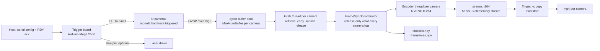
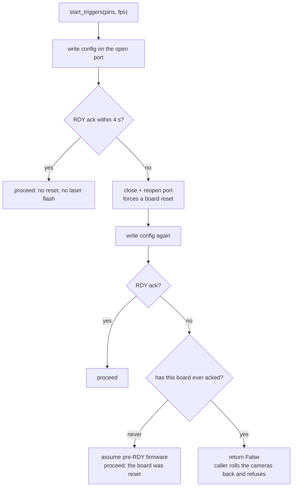
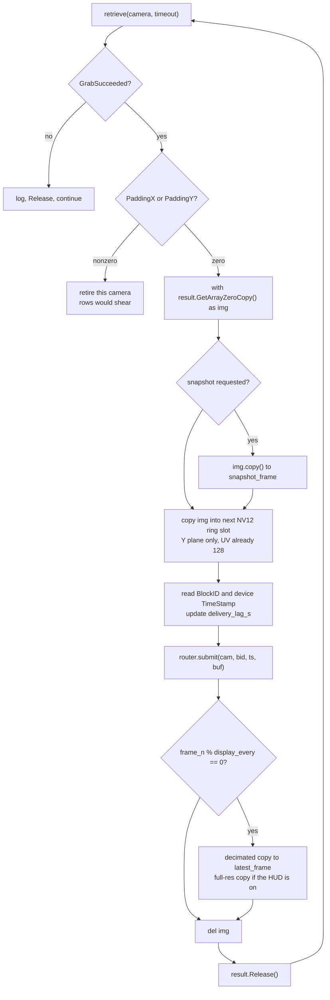
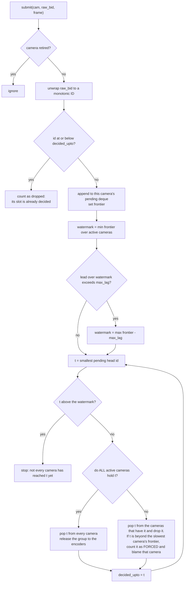
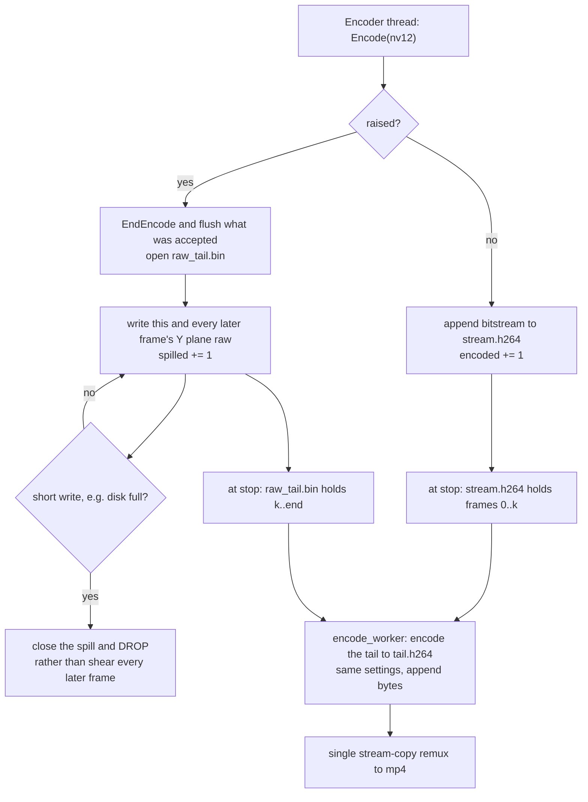
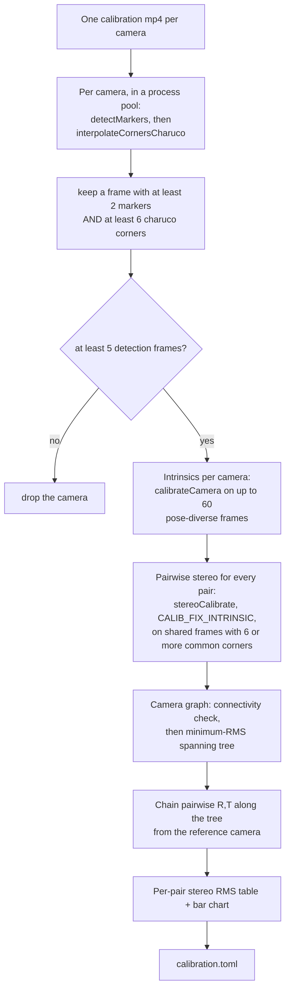

# The nitty gritty

How Panopticon gets from photons to files, in enough detail to fix it, port it,
or run it on hardware that is not the reference rig. To run a session,
[WORKFLOW.md](WORKFLOW.md) walks through one.

Numbers from the reference rig (6x Basler a2A1920-165g5m GigE, 1920x1200 mono8,
100 fps) are examples of the arithmetic, not requirements. Each derives from
resolution, frame rate and camera count, and the derivation is given so you can
redo it for your rig.

A setting lives in one of four places, and they are not interchangeable:

- the **camera settings file**, `configs/mono8_1920x1200.pfs`, a Basler pylon
  GenApi persistence file: a dump of the camera's own registers, produced in
  pylon Viewer and applied to every camera at open. Exposure, gain, region of
  interest, pixel format and the GigE packet parameters live here, and the
  application never writes exposure or gain into it;
- the **rig profile**, `profiles/3dpose.yaml`, Panopticon's own settings: how
  many cameras, what frame rate, which serial port, which pins. This is the file
  a new site edits;
- the **board config**, `configs/boards/charuco_8x8_15mm.yaml`, describing the
  printed calibration board;
- **code constants**, compiled in and changed only by editing the source.

Wherever a parameter appears below, its home is named. "Profile field
`kick_max_lag`" and "the `.pfs`'s `ExposureTime`" are different kinds of claim,
and confusing them is the commonest way to hunt in the wrong file.

---

## 1. Shape of the system

Several cameras must expose at the same instant, and their frames must reach disk
still saying which instant each belongs to. The answer is one hardware clock in
front of the cameras and one integer travelling with every frame behind them.

One microcontroller generates the frame clock. It drives a TTL line into every
camera's `Line1` input, so all cameras expose on the same edge. Each camera
streams frames over its own transport to the host, where one thread per camera
retrieves them. A shared coordinator holds each frame until every camera has
delivered the same trigger, then releases the whole group to per-camera NVENC
encoders. On stop, the H.264 elementary streams are remuxed to mp4 by stream
copy.



The code follows that shape, so the module map doubles as a map of the diagram:

| File | Responsibility |
|---|---|
| `gui_app/backends/__init__.py` | The camera-backend contract, and the grab-result duck type |
| `gui_app/backends/basler.py` | The only module that knows what a Basler camera is |
| `gui_app/camera_manager.py` | Vendor-neutral orchestration: open, describe, mode switches, start/stop |
| `gui_app/grab_thread.py` | The per-camera hot loop, the NV12 ring, and the encoder drain thread |
| `gui_app/frame_sync.py` | Cross-camera release logic. Pure integers, no Qt, no SDK |
| `gui_app/sync_encode.py` | Router: owns the coordinator, the encoders, and the recorded metadata |
| `gui_app/nvenc.py` | PyNvVideoCodec loader, encoder factory, session probe |
| `gui_app/encode_worker.py` | Post-stop remux and the raw-mode encode pool |
| `gui_app/alignment.py` | Block-ID unwrap, intersection, post-hoc re-encode |
| `gui_app/serial_controller.py` | Trigger-board link and the RDY handshake |
| `gui_app/stim_compiler.py` | Stim graph to Arduino sketch, including the trigger loop |
| `gui_app/stim_trace.py` | Per-frame model of what the paradigm delivered |
| `gui_app/board_detector.py`, `coverage_worker.py` | Live ChArUco coverage during calibration |
| `1_calibrate.py` | The calibration solve — a standalone script, run through `uv run` in the project environment |
| `2_align.py`, `3_stim_trace.py` | Standalone equivalents of the in-app passes; these two are PEP 723 scripts, carrying their dependencies in an inline header |

---

## 2. Hardware triggering

Software cannot make several cameras expose simultaneously. Ask each camera for a
frame from the host and you inherit the host's scheduling jitter, milliseconds on
a general-purpose OS, an order of magnitude worse than 3D reconstruction needs.
So the host leaves the timing path. One microcontroller emits a square wave,
every camera exposes on its rising edge, and the host only says which pins to
drive and how fast.

### One clock

`stim_compiler.compile_ino()` emits the sketch the board runs. Its `loop()` is
the frame clock:

```c
if (FPS_OUT > 0) {
  camsLow();
  while (micros() - FRAME_START < FRAME_PERIOD / 2) { updateStim(); }
  camsHigh();
  while (micros() - FRAME_START < FRAME_PERIOD) { updateStim(); }
  FRAME_START += FRAME_PERIOD;
}
```

Four properties make that loop trustworthy, and each is easy to break by
"tidying" the code.

The period is integer microseconds, `FRAME_PERIOD = 1e6 / FPS_OUT`, and
`FRAME_START` advances by *adding* the period rather than re-reading the clock,
so the rounding error stays fixed instead of drifting over a session.

Within each period the line is LOW for the first half and HIGH for the second: a
50% duty square wave at the frame rate. The cameras are set to `RisingEdge`, so
the trigger instant is half a period after `FRAME_START`.

`camsHigh()` and `camsLow()` write every trigger pin inside a
`noInterrupts()`/`interrupts()` pair, so skew between pins is bounded by the
write loop and cannot be stretched by an interrupt landing mid-loop. The design
comes from campy, by Kyle Severson (`trigger.ino` in the upstream repository,
<https://github.com/ksseverson57/campy>), which documents ±0.35 µs inter-frame
interval precision and roughly 30 ns synchronicity between pins.

And nothing on the host is in the timing path. The host names the pins and the
rate; after that the board is on its own.

On the reference rig the pins are `[2, 4, 6, 8, 10, 12]` (profile field
`trigger_pins`), one per camera, each wired to that camera's `Line1`, all written
inside the same `noInterrupts()` block. One fanned-out line is electrically
equivalent provided the output can source every input. The sketch drives whatever
pin count the serial command carries, so adding a camera means adding a pin to
the profile.

### Why the same board owns stimulation

The generated sketch runs a non-blocking stim state machine, `updateStim()`,
called from inside both trigger busy-wait loops. `setup()` (and the `loop()`
reconfigure branch) sets `FRAME_START = micros()` and calls `initStim()` a few
microseconds later, so **stim t=0 is trigger t=0 on the same clock**, with no
host timestamp anywhere. That makes `stim_trace.csv` exact: a recorded frame's
time is `t = (unwrapped_blockid - 1) / fps`, and the stim model is evaluated at
the same `t`.

Four constraints follow. Three protect the timing; the fourth is laser safety.

First, **`updateStim()` must not do floating-point maths.** It runs inside the
trigger busy-wait, and an AVR float divide takes around 30 µs, enough to blunt
the ±0.35 µs edge precision. The compiler resolves every period and pulse width
to integer microseconds before emitting the sketch, and `test_stim_compiler.py`
asserts no floats reach that function.

Second, **a stim chain must never be placed on a trigger pin.** Extra rising
edges make that camera acquire more frames than the others, so its block IDs
advance faster and block ID N stops denoting the same instant on every camera.
That is the one assumption the whole alignment path rests on (§9).
`stim_compiler.forbidden_pin_uses()` blocks Apply, Test and Record when a chain
lands on a trigger pin.

Third, pins listed in the profile's `stim_safe_pins` are set `OUTPUT` and driven
LOW by `allStimLow()` as the **first statement in `setup()`**, before
`Serial.begin()`. `setup()` blocks on the serial
handshake, so anything after it leaves the pin floating for as long as the GUI
takes to connect, and **a powered laser driver reads a floating modulation input
as ON.** Within `allStimLow()`, `pinMode()` precedes `digitalWrite()` for the same
reason: writing LOW to a pin still configured as `INPUT` only disables the pullup
and leaves the pin floating.

Fourth, **the MCU reset window is not coverable in software.** During reset and
the bootloader wait every GPIO is high-Z, because the sketch is not executing
yet. A laser interlock is the only hard gate. A pulldown across the modulation
input does not necessarily work: against a stiff internal pullup it would need a
resistor low enough to exceed the MCU's per-pin current limit when the pin is
driven high, so there is no safe value.

### Serial protocol

The host-to-board link carries configuration, never timing, so the protocol is
tiny: 115200 baud, 8N1, one command format for both start and stop.

```
<n_pins>,<pin1>,...,<pinN>,<fps>\n
```

`fps < 0` means stop: the sketch's reconfigure branch runs `camsLow()`,
`allStimLow()`, sets `FPS_OUT = 0` and stops emitting triggers. The trailing
newline terminates the sketch's final `parseFloat()` immediately instead of
letting it burn its one-second timeout.

The sketch replies `RDY <n_cams> <fps>` from `announceReady()`, called from both
config paths (`setup()` and the `loop()` reconfigure branch) and printed before
`FRAME_START` is set, so the print latency cannot skew the clock.

### The RDY handshake

Opening the port pulses DTR, which resets the board. That reset is load-bearing:
it returns the sketch to `setup()` with a cleared serial RX buffer. Suppressing
it (`dtr=False`) makes the board ignore the config and emit zero triggers,
producing a full-length recording containing no frames. So the reset is
relocated, not defeated: `main_window` opens one `TeensyController` at launch and
holds it until quit, so the board resets at GUI launch and on firmware upload,
never at the start of a recording.

A start command can now land in `loop()` instead of a freshly reset `setup()`, so
every start is confirmed. `TeensyController.start_triggers()` returns a bool and
takes four paths:



The never-acked / has-acked distinction is the safety property. Collapse it one
way and legacy firmware cannot record; the other way lets a silent zero-trigger
session through. `test_serial_handshake.py` pins all four branches and stubs
pyserial, so it needs no board.

`ACK_TIMEOUT` is 4 s because the sketch's `readFPS()` can burn a one-second
`parseFloat()` timeout followed by `delay(500)`; a legitimate ack takes about
1.5 s. `stop_triggers()` returns whether the board accepted the command, and the
caller surfaces a failure loudly: a looping stim chain never ends on its own, so
an unacknowledged stop can leave a laser driven with the UI showing IDLE.
`pyserial`'s `is_open` stays True after the USB device disappears, so port state
is not evidence that the board is there.

---

## 3. Exposure and the frame-rate ceiling

Exposure has a hard upper bound that depends on the trigger rate. Crossing it
produces no error; it silently halves the frame rate.

### The rule

In trigger mode the camera's internal frame-rate timer starts **after exposure
ends**, not when exposure begins. The camera is unavailable for the exposure
*plus* one period of that internal timer, so its minimum interval between
acquisitions is

```
minimum interval = exposure + 1 / AcquisitionFrameRate
```

`AcquisitionFrameRate` looks irrelevant under external triggering, since the
timing comes from `Line1`, and yet it still enforces that floor. The trigger
period must exceed the floor for the camera to answer every trigger. Rearranging
gives the ceiling on usable exposure:

```
exposure_max = 1/trigger_fps - 1/AcquisitionFrameRate
```

Two pieces of code set those terms. `BaslerBackend.set_triggered()` applies the
profile's `trigger_rate_limit` as `AcquisitionFrameRate`, 165 in effect on both
shipped profiles and a 6.06 ms floor contribution. Only `3dpose` sets the field;
165 is also `RigProfile`'s default. `CameraManager.apply_exposure_gain()` then
derives the ceiling from the trigger rate in use and **enforces** it with a 10%
safety margin rather than trusting the profile to be self-consistent:

```python
ceiling_us = (1e6 / fps - 1e6 / limit) * 0.9
```

Worked through for the rates the rig uses:

| Trigger rate | Period | Limiter | Floor from limiter | Headroom | Enforced ceiling |
|---|---|---|---|---|---|
| 100 fps | 10.00 ms | 165 | 6.06 ms | 3.94 ms | 3.55 ms |
| 60 fps | 16.67 ms | 165 | 6.06 ms | 10.61 ms | 9.55 ms |
| 30 fps | 33.33 ms | 165 | 6.06 ms | 27.27 ms | 24.55 ms |
| 100 fps | 10.00 ms | 500 | 2.00 ms | 8.00 ms | 7.20 ms |

The last row is illustrative: the limiter cannot be set above the camera's own
maximum frame rate, and the camera clamps it silently if asked.

A too-large exposure is clamped and logged; it is never silently accepted.

Calibration runs the arithmetic in reverse. At the 30 fps
`calibration_frame_rate` the period is 33.3 ms instead of 10 ms, so the light
budget is roughly seven times a 100 fps recording's, and
`calibration_exposure_us` (15000, i.e.
15 ms, on the reference rig) can be far longer than any recording exposure.
Recording passes `exposure_us=None`, which **restores** the values read from the
`.pfs` at open rather than recomputing anything, so a generous calibration
exposure cannot leak into a 100 fps session.

What limits calibration exposure is **motion blur**, not the ceiling. At 15 ms a
briskly waved board smears and ChArUco corners stop resolving, costing you
detections in exactly the poses you were trying to add. Move the board slowly and
pause at each pose.

### The failure mode when it is exceeded

Nothing errors. That is the whole problem.

If the minimum interval exceeds the trigger period but stays under two periods,
the camera is busy when the next pulse arrives, so it **ignores** that pulse and
answers the one after. You get half the requested rate: at a 100 fps trigger the
camera delivers ~50 fps.

The frames it does deliver are fine: complete, uncorrupted, sharp. Their
numbering is not. A block ID counts frames the camera acquired, not triggers the
board fired. An ignored trigger produces no frame, so it consumes no block ID,
and from there on this camera's block ID N is trigger N+k for a k that keeps
growing. Nothing was dropped, so the block IDs stay gapless and nothing
downstream notices. The camera's frames get paired with other cameras' frames
from a different instant, and the videos drift apart in time while looking
flawless. §9 covers the check for this.

Symptoms, in the order somebody notices them: a live frame rate reading ~50 fps
at a 100 fps trigger rate; a `frametimes.npy` spanning the right wall-clock
duration with only half the rows; block-ID span divided by duration reading ~50
rather than ~100 per second.

That last ratio separates an **acquisition** failure from a **delivery** failure.
A frame lost in transmission still consumed its block ID, so delivery loss leaves
the block-ID span intact and the row count short. A trigger the camera never
acquired shortens the span itself. Only the first kind is recoverable by the
alignment path, and every time base derived from block IDs, `stim_trace.csv`
included, assumes one trigger per ID, so the second kind corrupts the timing
rather than thinning it.

The preview cannot show any of this. It is free-run at 30 fps, with 33 ms of
headroom, so an over-long exposure looks healthy there and only halves the rate
once the cameras are triggered. **Verify exposure changes against a real
recording, never against the preview.**

### Why the limiter is not disabled

Setting `trigger_rate_limit: 0` calls `AcquisitionFrameRateEnable = False`, which
removes the floor and the exposure ceiling with it. It also removes the pacing.
With the limiter on, each camera spreads readout and transmission across
`1/limit`, 6.06 ms at 165. With it off, every camera dumps its frame onto its
link immediately after the shared trigger, all at the same moment, and marginal
links drop packets.

Tried on the reference rig on 2026-08-11, reverted the same day. It cost **8–15%
of frames in transmission**: the cameras still acquired every trigger and
numbered them contiguously, but delivery fell from 99.98% to 85–92%. Keep the
limiter above the trigger rate. If you need more light, *raise* the limiter
rather than disabling it. That buys exposure headroom at the cost of some pacing,
and is worth trying only when the network has margin to give.

Exposure and gain live in the `.pfs` and nowhere else; no code path sets them
except the calibration override and the ceiling clamp. On the reference rig they
are 3000 µs and 6.0 dB, raised on 2026-08-11 from 2000 µs and 0 dB, about 3x the
light in total.
The old values put 65% of pixels in levels 0–15, with **21.5% clipped at exactly
0**: destroyed at the ADC, unrecoverable by brightening the video afterwards. At
3000 µs the exposure sits about 0.94 ms below the 3.94 ms ceiling that 100 fps
and a 165 limiter imply; 3500 µs would leave only 0.44 ms.

When frames are too dark, prefer **more illumination first, then exposure, then
gain.** Illumination buys real photons and real signal-to-noise; the other two do
not. Gain multiplies signal and noise alike, and it clips: on a representative
frame from the reference rig 3.0x leaves about 4% of pixels saturated, 7x clips
12.7%.

---

## 4. GigE transport

Six cameras at 1.84 Gbit/s each is a lot of incoming data, and it arrives over
UDP, so the network is permitted to lose it. Two things matter: getting the
pixels from camera to host without dropping them, and telling "the network lost a
frame" from "the host was too slow to receive one". Those two look identical in a
video file and have completely different fixes.

### GVSP

Each camera streams over UDP using the GigE Vision Streaming Protocol. A frame is
one *block*, fragmented across many packets. Every block carries a **block ID**,
assigned by the camera when it acquires the frame. The host driver reassembles
the packets into a buffer from a per-camera pool, and a complete buffer becomes a
*grab result*, the object the capture loop receives.

The pipeline leans on the block ID for two reasons.

It is the trigger ordinal. All cameras receive the same trigger edge and start
numbering at 1 when grabbing starts, so block ID N names the same trigger, and
the same instant, on every camera. That holds while each camera produces exactly
one frame per trigger edge; §9 states the assumption properly.

And a frame lost *in transmission* still consumed its block ID, so transmission
loss leaves a **gap** rather than shifting everything after it. That makes
`alignment.py`'s `trigger_span = max(last) - min(first) + 1` a meaningful
denominator and per-camera `dropped = trigger_span - recorded` a real count.

### Packet size, jumbo frames, inter-packet delay

From `configs/mono8_1920x1200.pfs`:

| Feature | Value | What it does |
|---|---|---|
| `GevSCPSPacketSize` | 9000 | Stream packet payload size. Requires jumbo frames enabled end to end (NIC MTU 9014, and every switch in the path). |
| `GevSCPD` | 10000 | Inter-packet delay, in device timestamp ticks. Paces packets so several cameras sharing a port do not collide. |
| `GevSCFTD` | 0 | Frame transmission delay. Nonzero staggers whole frames between cameras. |

Packet size is the dominant lever on host CPU. A 1920x1200 mono8 frame is
2,304,000 bytes: ~260 packets at 9000 bytes, ~1600 at 1500. At 100 fps that is
~26,000 versus ~160,000 packets per second per camera, each processed in
interrupt context. Three cameras per port at 9000 bytes gives the ~78,000
packets/s in the host-CPU numbers below.

A path that cannot carry the configured packet size drops the oversized frames,
and the camera delivers incomplete buffers or nothing at all. Enable jumbo frames
on the NIC (MTU 9014) **and** on every switch in the path, and verify rather than
assume.

Inter-packet delay trades latency for collision avoidance. Zero on a shared port
causes collisions and resends. Re-tune it for a different cameras-per-port ratio,
link speed, or frame size.

Bandwidth arithmetic, which determines all of the above:

```
per camera bits/s = width * height * bytes_per_pixel * 8 * fps
1920 * 1200 * 1 * 8 * 100 = 1.84 Gbit/s
```

Three of those per port needs a 10 GbE port with margin for resends; at 30 fps
or lower resolution the same camera fits comfortably on 1 GbE. Cat6a or better
for 10 GbE runs.

### Resends and driver choice

UDP loses packets. Whether that costs you a frame depends on the receive path,
because the two drivers disagree about asking for a lost packet again.
`BaslerBackend.select_gige_driver()` picks from the profile's `gige_driver`:

- **`socket`** — user-space receive. Higher host CPU, and its packet resend
  behaviour reliably recovers lost packets. This is the shipped setting. It also
  maxes `SocketBufferSize` to the node's advertised maximum, giving the receive
  thread more slack when the encoders contend for CPU.
- **`filter`** — the in-kernel pylon GigE Vision driver. Far less CPU, but with
  default resend settings it discards a frame containing a lost packet instead of
  asking for it again: measured on 2026-06-12 at ~23% frame loss under a
  6x100 fps load, appearing as thousands of single-frame gaps per camera, with
  nothing in the logs to say so.
- **`auto`** — leave the vendor default. No-op for non-GigE transports.

A high resend count is not a fault. It is the recovery mechanism working. What
costs you frames is how many resends fail, which `Failed_Buffer_Count` reports.

The reference rig's cameras split into two groups by physical path, though the
driver and socket settings are identical on all six. Over a 20-minute six-camera
run on 2026-09-03, the quiet path issued **3** resend requests per camera and the
noisy path around **9,700**, a factor of three thousand apart. The run still
came out with 120,106 frames on every camera, having lost 60 frames across all
six out of 720,636 submissions. `Failed_Buffer_Count` was 2 per camera on the
quiet group and 13–14 on the noisy one. A 60 s run on the same rig and
configuration captured 100.00% of triggers.

So read magnitude, not zero versus non-zero. Thousands of resend requests
alongside failed buffers in the low tens is a noisy link recovering nearly
everything it loses; chasing it is not worth the rig time. Failed buffers in the
**hundreds** mean the resends themselves are not completing.

### The buffer pool

The profile's `max_num_buffer` sets the driver-side buffers per camera, applied
at open (`camera_manager.MAX_NUM_BUFFER = 1000` is only the default for callers
that do not pass one). At 1920x1200 mono8 each buffer is 2.3 MB, so the pool is
`n_cameras x max_num_buffer x 2.3 MB` — 19.3 GiB at nine cameras and 1000
buffers, which is why the reference rig runs 250 instead: 4.8 GiB, and still
2.5 s of slack at 100 fps. This is the pool half of the RAM budget in
[INSTALLATION.md](INSTALLATION.md). `GrabStrategy_OneByOne` delivers oldest-first.

Deep slack absorbs network jitter, and it hides a per-frame deficit. A grab loop
a fraction of a millisecond over budget loses nothing at first, because the pool
fills instead; every retrieved frame gets staler, and by the time the pool is
exhausted the session is spoiled. Hence
`delivery_lag_s`, published live (§5) and shown by the GUI during recording. Pool
size is not monotonic in quality, and an oversized ring elsewhere has starved
capture outright, so change it only with a rig A/B.

### The counters that matter

When a session comes out short, the first question is whether the host failed to
keep up or the network lost frames. The camera's own stream counters answer it.
`BaslerBackend.stream_stats()` reads them at stop, before `StopGrabbing()`,
because stopping the stream resets them:

| Counter | Meaning |
|---|---|
| `Buffer_Underrun_Count` | The pool ran dry. **The host could not keep up.** |
| `Failed_Buffer_Count` | A frame was given up on: resends exhausted or incomplete. |
| `Resend_Request_Count`, `Resend_Packet_Count` | Packets lost and asked for again. A high count is healthy as long as `Failed_Buffer_Count` stays in the low tens or below. |
| `Total_Buffer_Count`, `Total_Packet_Count` | Denominators. `Total_Packet_Count = 0` on every camera means the board sent no triggers. |

`Statistic_Failed_Packet_Count` is deliberately excluded: on this hardware it
reports values larger than the total packet count and cannot be trusted.

Host-side, the receive load lands in deferred procedure calls (DPCs), the
kernel's mechanism for finishing interrupt work, on whichever core the NIC's
receive queue is bound to. On the reference rig each port's ~78,000 packets/s
funnel through a single core at ~46% DPC time against a 24-core average of ~4%.
One port discards a fraction of a percent of packets at the NIC; the other
discards exactly zero. Resends recover those, so they are not in the frame-loss
path today, but watch `ReceivedDiscardedPackets` per port when adding cameras: a
healthy port reads exactly 0. `configure_nic.ps1` sets receive-side-scaling (RSS)
queues, four per port, spreading one port's receive work over several cores, and
verifies the result because some drivers apply RSS only to TCP.

---

## 5. The capture loop

The capture loop is the one piece of Python here with a hard real-time
obligation. Every camera delivers a frame every trigger period, forever, and the
loop receiving them gets exactly that period to finish its work. Miss the budget
by a fraction of a millisecond and nothing breaks immediately.

### One thread per camera, one trigger period per frame

`GrabThread.run()` is a `QThread` per camera. The budget per iteration is the
trigger period: 10 ms at 100 fps. If the mean iteration exceeds it, the loop
falls behind the camera permanently, absorbed by the buffer pool until it is not.

Per frame, in kick-out mode:



Every consumer copies out of `img`. The view is a window onto the driver buffer
and must not outlive `Release()`. `del img` enforces that: Python does not unbind
a `with` target at block exit, and pypylon's own exit guard structurally cannot
see the with-target.

### Why a copying accessor is unaffordable

pypylon's `GetArray()` (the `result.Array` property) allocates a fresh 2.3 MB
array and memcpys the driver buffer into it **with the GIL held**, because
`GetArray` sits on pypylon's explicit no-thread list. `np.frombuffer(GetBuffer())`
is no way around it; measured, it is the same or worse:

| Access route | GIL-held cost per frame |
|---|---|
| `result.Array` | 0.837 ms |
| `np.frombuffer(result.GetBuffer())` | 0.902 ms |
| `with result.GetArrayZeroCopy() as img:` | **0.157 ms** |

GIL-held work serialises across every Python thread, so what matters is the sum:
`n_threads x cost_per_frame` per trigger period. One grab thread and one encoder
thread per camera makes nine cameras 18 threads plus the UI thread. At 0.84 ms
per frame per camera, the nine grab threads' copies alone ask for 7.5 ms of a
10 ms window, before the encoders, display or UI get a turn. At 0.16 ms they ask
for 1.4 ms. One fits, one does not, and a faster CPU does not close the gap,
because the constraint is serialisation, not throughput.

The tolerance was measured by driving one production-shaped copy against N
competitor threads, each burning a fixed amount of GIL-held work every 10 ms.
Cells are the per-copy wall-clock median in milliseconds. Columns are rig sizes:
5 competitors is a 6-camera rig's grab threads, 11 is 6 grab plus 6 encoder
threads, 17 is the nine-camera target.

| GIL-held µs per competitor per frame | 0 competitors | 5 | 11 | 17 |
|---|---|---|---|---|
| 100 µs | 0.135 | 0.145 | 0.125 | 0.223 |
| 300 µs | 0.130 | 0.321 | 0.324 | 0.128 |
| 1000 µs | 0.130 | 1.031 | **10.19** | **17.14** |

The bottom row is the copying accessor's regime. It does not degrade gracefully;
it collapses. Hence the criterion:

**Acceptance criterion for any hot-path change: ≤300 µs of GIL-held work per
thread per frame is safe even at 17 threads; ~1000 µs blows a 10 ms budget at
11.** Reproduce the boundary with `probe_gil_wait.py`, and A/B a specific access
route on a live camera with `probe_zerocopy.py`.

Moving the six-camera reference rig onto the zero-copy view on 2026-09-03 took
mean loop `cycle` from 12.0 ms to exactly 10.00 ms, the trigger period. It took
`Buffer_Underrun_Count` from 245–882 per camera to 0, and forced drops from as
much as 12.34% to 0. A 60 s run after the change captured 100.00% of triggers.

One warning for anyone repeating these measurements, because getting it wrong has
misled this project twice. **Never bracket a GIL-releasing call with a plain
wall-clock timer.** numpy releases the GIL for a memcpy and must re-acquire it
before returning, so the re-acquisition *wait* lands inside the bracket with the
work. Contention then inflates the bracket while leaving the work unchanged: in
the table above the worst case moved wall-clock time by a factor of 127 while
executed cycles moved by 1.6. Separate executing from waiting with
`QueryThreadCycleTime`.

### The NV12 ring

The frame must be copied out the moment it is retrieved, since the driver buffer
has to be released promptly and the encoder will not consume it for a while. The
destination is an **NV12** buffer, the layout NVENC consumes: a full-resolution
8-bit luma plane followed by a half-resolution interleaved chroma plane, which
reduces the conversion from mono8 to a single memcpy (§7). Allocating one per
frame would put an allocation and a first-touch page fault on the hot path, so
each grab thread preallocates its own ring once, at start:

```python
np.full((height * 3 // 2, width), 128, np.uint8)
ring_n = router.max_lag + ENCODE_QUEUE_DEPTH + 64      # kick-out mode
ring_n = ENCODE_QUEUE_DEPTH + 4                        # decoupled mode
```

`ENCODE_QUEUE_DEPTH` is 200. The ring must outlast a frame's whole journey, held
by the coordinator for up to `max_lag` then queued at the encoder, before its
slot is reused. At `kick_max_lag: 480` that is 744 buffers, 2.39 GiB per camera;
at 240, 504 buffers and 1.62 GiB. The ring scales linearly with `kick_max_lag`
and is what makes a nine-camera RAM budget tight.

The `np.full(..., 128, ...)` is load-bearing twice: it sets the constant chroma
plane once and for all, and pre-faults every page. `np.empty`/`np.zeros` would put
a first-touch page fault (~0.4 ms) back on the hot path.

`MemoryError` at allocation is caught and retires the camera rather than escaping
`run()` and taking the GUI with it.

### Instrumentation

A loop slightly over budget produces no error for minutes, so measure it as it
runs. Every 1000 recorded frames, each grab thread prints one line:

```
[grab0] frames=12000 timeouts=0 avg_wait=8.52ms avg_proc=0.81ms qsize=0 |
        deliv_lag=-0.031s copy=0.73 submit=0.02 disp=0.05 rel=0.11 cycle=10.00ms
```

The counters accumulate **seconds over 1000 frames**, so each figure reads
directly as milliseconds per frame:

| Field | Definition | Healthy |
|---|---|---|
| `avg_wait` | Time blocked in `retrieve()` | Large. It is the slack in the period |
| `avg_proc` | From `retrieve()` returning to the end of the submit/write branch. The display branch, the fps bookkeeping and `Release()` all sit outside it | Well under the period |
| `cycle` | Start of one iteration to the start of the next | **Exactly the trigger period** |
| `copy`, `submit` | Components of `proc` | `copy` dominates |
| `disp`, `rel` | Measured separately, outside `proc`: the display branch, and `Release()` | Small |
| `deliv_lag` | `(host time at retrieve − device timestamp)` minus its value at the first frame | ~0, not growing |
| `qsize` | Encoder queue depth, or coordinator pending depth in kick mode | ~0 |

`cycle` closes the budget. `wait + proc` does not cover the whole iteration: the
display branch, `Release()`, the frame-rate bookkeeping and the loop edge sit
outside both. A `cycle` above the trigger period means the loop is losing to the
clock even if `proc` looks fine.

`deliv_lag` is measured against the camera's own clock, so host scheduling cannot
skew it. `CameraManager.delivery_lags` publishes it live and the GUI status bar
reports it during recording: under 0.25 s is healthy, under 1 s is "falling
behind", above that is "frames will be lost when the pool fills".

A healthy 20-minute six-camera run on the reference rig: `cycle` 10.00 ms on
every camera throughout, `avg_proc` 0.77–0.84 ms, slack 8.47–8.86 ms, `deliv_lag`
−0.03 to −0.05 s, `Buffer_Underrun_Count` 0 on all six, forced drops 0, and
120,106 frames, identical on every camera.

`probe_lag.py` drives the same real code path headlessly (CameraManager,
GrabThread, SyncEncodeRouter, FrameSyncCoordinator, TeensyController) and writes
a per-camera lag trace: the fastest way to check a change without the GUI.

### Timeouts, stalls and giving up

Cameras and links fail mid-session, and the loop must choose between waiting,
retrying and giving up. Each constant was chosen against a specific failure:

| Constant | Value | Purpose |
|---|---|---|
| retrieve timeout | 200 ms recording, 2000 ms preview | A timeout is normal when triggers stop |
| `STALL_TIMEOUTS` | 25 consecutive timeouts (~5 s) | Stall detector. Long enough that a burst of resends cannot trip it |
| `MAX_REARMS` | 5 | Stop thrashing a genuinely dead link |
| `MAX_CONSEC_ERRORS` | 10 | A camera raising on every frame is not recoverable by retrying |
| resync tolerance | 0.25 of a trigger period | Refuse to guess an ordinal |

A stalled GigE stream never self-recovers; the loop would time out for the rest
of the session. After 25 consecutive timeouts the thread re-arms the stream
(`StopGrabbing()` then `StartGrabbing()`). **`StartGrabbing()` restarts the
camera's block-ID counter**, which the coordinator's wrap detection would read as
a wrap and place the camera far ahead, force-dropping every other camera's
frames. `_resync_offset()` recovers the true ordinal by counting elapsed trigger
periods on the device timestamp, a free-running hardware clock that survives the
restart, and returns `None` unless the gap lands within 0.25 of a period
boundary. Publishing frames under a guessed ordinal is worse than losing the
camera, so failure to realign retires it.

Retirement is the escape hatch throughout. In kick-out mode the coordinator waits
for every camera, so a camera that never publishes force-drops every trigger for
**all** of them: one dead camera otherwise yields empty videos from all nine.
Every early exit from `run()` calls `router.retire()`, including a `finally`
catch-all for the paths with no exception at all, notably `IsGrabbing()` going
False underneath the loop. `test_grab_failure.py` pins each path and needs
neither cameras nor NVENC.

---

## 6. Frame synchronisation

### The problem

Triggering the cameras together is necessary but not sufficient. Cameras lose
frames independently, to a resend that never completes or a buffer the driver
gives up on, and every loss shifts each later frame one position earlier in that
camera's video. From the first loss onwards, frame *i* of one camera's video is
**not** the same trigger as frame *i* of another's, and stacking the videos side
by side compares different instants.

The block ID makes the correspondence recoverable. Every recorded frame's block
ID goes into `blockids.npy`, so a position in a video maps back to a trigger
ordinal by lookup, never by assumption.

Two mechanisms turn that into aligned videos. They give the same answer, in a
sense the last subsection makes precise, and differ in when they pay for it.

### Real-time kick-out (the default)

`FrameSyncCoordinator` (in `gui_app/frame_sync.py`) is pure integer logic: no Qt,
no SDK, no frame copies of its own, with frames as opaque pass-through tokens.
Each camera submits its successfully grabbed frames in block-ID order. State per
camera: a pending deque, a frontier (highest ID seen), and a wrap offset.



A released trigger is released **by every active camera, once, and in increasing
order per camera**. Each encoder therefore sees a gapless, in-order stream, and
ordinary GOP encoding produces equal-length, trigger-aligned videos with no
post-hoc pass. Nothing was ever misaligned, so there is nothing to fix up.

It works because a camera that missed trigger N reveals the miss by delivering
N+1, with no timeout to wait for. When the cameras keep up, confirmation lags
reality by one or two frames.

`max_lag` (profile field `kick_max_lag`) is the safety valve, bounding how far
the fastest camera may get ahead of the slowest before the laggard's missing
triggers are force-dropped, so one stalled camera cannot freeze the rig. Forced
drops are counted and attributed in `forced_by[]`, and the router logs
`lag_behind_leader[...] forced=... forced_by[...]` about every five seconds. Read
that line when a session is losing frames: it names the camera responsible.

`max_lag` trades against RAM, and it has been measured. A clean A/B on 2026-08-11
over 100,968 frames and 17 minutes, identical camera settings and only the cap
differing, gave **87.68 fps released and 12.34% loss at 240, against 99.14 fps
and 0.88% loss at 480**, which is why the reference profile ships 480. The cost
is linear: `max_lag + queue + 64` NV12 buffers per camera, about 2.39 GiB each at
480. Bigger is not automatically better, and 1000 **starved capture outright**,
at 24% loss on 2026-06-17. Since the grab-loop fix of 2026-09-03 the observed
cross-camera lag is median 0, p95 1, max 2 frames, so the current headroom buys
nothing in practice and 240 would very likely do. Lowering it is deferred pending
a rig A/B rather than being wrong.

Two smaller pieces complete the coordinator. `retire(cam, reason)` drops a camera
from the alignment set, clears its pending deque, and records the reason so it
reaches the operator instead of only stdout; survivors stay aligned and the
retired camera's video ends there. `flush()`, at stop, decides every remaining
trigger with no `max_lag` forcing, since no more frames are coming.

### The 16-bit wrap

GVSP 16-bit block IDs cycle through 1..65535 (0 is reserved), so they wrap every
65535 triggers, about 11 minutes at 100 fps. `BaslerBackend.enable_extended_block_ids()`
asks for 64-bit IDs at open (`GevGVSPExtendedIDMode` plus the stream grabber's
`UseExtendedIdIfAvailable`) and logs whether it got them. An optimisation, not a
requirement: both alignment paths unwrap in software.

- live, incrementally, in `FrameSyncCoordinator._unwrap()`: a raw ID below
  `last_raw - 32767` is a wrap, adding 65535 to that camera's offset;
- post-hoc, vectorised, in `alignment._unwrap_blockids()`: a diff below
  `-(period // 2)` is a wrap, and the result must be strictly increasing or the
  function raises, because a small decrease means corrupt or reordered data
  rather than a wrap.

All cameras are triggered together and start at 1, so unwrapping each stream
independently keeps ordinals consistent across cameras.

### Post-hoc block-ID intersection (the alternative)

With `realtime_kick: false`, `gui_app/alignment.py` runs after encoding: it
intersects the per-camera unwrapped block-ID arrays, computes each camera's frame
indices into that common set (`np.searchsorted`, verified), and writes
`aligned/alignment.npz` plus `alignment.json`, a lossless index that costs
nothing. With `--replace` (or the in-app path) it also re-encodes each video down
to the common frames and atomically replaces the original, rewriting that
camera's `blockids.npy` and `frametimes.npy` to match. `2_align.py` is the
standalone CLI for existing recordings.

The trade: the intersection sees the whole recording, so it keeps slightly more
frames, being immune to the jitter that makes the live coordinator force a drop.
It costs a full re-encode of every video. The kick-out path costs bounded RAM
instead.

`align_recording()` also runs the block-ID rate check of §9 on its way through,
before deciding whether anything needs aligning. §9 explains why.

### The equivalence, stated precisely

Switching `realtime_kick` should change what the rig *costs*, not what the data
*means*, so the relationship is a tested property rather than an assertion.

`test_frame_sync.py` checks it over randomised scenarios: independent per-camera
drop rates from 0 to 20%, runs of 50 to 1500 triggers, and randomised submission
interleavings that preserve per-camera order. It establishes six claims, in
increasing order of how much the world is allowed to misbehave.

The first holds unconditionally:

1. **Group integrity, always.** Every released trigger is released by all N
   cameras, exactly once each, and in increasing order per camera.

The next three are the equivalence, and they degrade in one direction only:

2. **With no forcing** (`max_lag` larger than the run), the released set is
   **exactly** the intersection of the delivered sets. The coordinator and the
   post-hoc pass keep precisely the same frames.
3. **With bounded skew inside `max_lag`**, still exactly equal.
4. **With forcing** (skew beyond `max_lag`), the released set is a **subset** of
   the intersection. Forcing can only discard triggers the intersection would
   have kept; it can never invent one. So a kick-out recording is never *wrong*,
   only occasionally shorter.

The last two say it survives the events most likely to break it:

5. **Across the 16-bit wrap** (70,000 triggers with wrapped raw IDs), the
   released set is still exactly the intersection.
6. **Retirement** resumes releases and keeps survivors aligned; a retired
   camera's late frames never re-enter the stream; and forced drops are
   attributed to the lagging camera.

The same file also holds the block-ID rate check of §9, which guards the
assumption all six properties stand on. `test_sync_router.py` is the router smoke
test, and unlike `test_frame_sync.py` it needs NVENC.

---

## 7. Encoding

Six cameras at 100 fps produce 1.38 GB of pixels a second, so compression is part
of the capture path, and the grab loop cannot wait for an encoder. The GPU does
the compression on its own threads, in a format chosen so preparing a frame costs
a single memcpy.

### NV12 from mono8

NVENC takes NV12: a full-resolution 8-bit Y plane followed by an interleaved
half-resolution UV plane. A mono8 frame **is** the Y plane, and neutral chroma is
a constant 128, so the conversion is one memcpy into the top `height` rows of a
buffer whose lower `height/2` rows were filled with 128 at allocation. No colour
conversion, no per-frame chroma write.

This is also why pixel format is verified against the camera rather than the
profile at open. A Mono12 `.pfs` makes every frame `uint16`, and
`buf[:height, :] = img` then truncates **mod 256 with no error at all**: a
full-length, perfectly aligned, visually shredded recording.
`CameraManager.open_all()` refuses anything but Mono8, and refuses a resolution
that differs from camera 1.

### Sessions

A *session* is one live NVENC encode context. The driver caps how many exist at
once, in no documented way, and the cap has moved across driver generations (2,
then 3, 5, 8, and 12 on the reference rig's current driver), so it is **probed,
never hardcoded**. `nvenc.probe_max_sessions()` creates encoders until the driver
refuses, then releases them. Budget one session per camera, plus
`encode_parallel` for the remux/encode pool, plus one warm-up session.

Two details matter when releasing one.

**`EndEncode()` does not free a session.** It ends the bitstream; the encoder
object's destructor frees the session, so drop the Python reference too.
`_EncoderThread.release_encoder()` calls `EndEncode()` then `del`, and its
callers `gc.collect()`. Getting this wrong leaks a slot, and a leaked slot can
push one camera onto the raw fallback, about 129 GiB per 10 minutes at 1920x1200
and 100 fps for that camera alone.

**NVENCSTATUS 21 is the session limit, not a configuration error.**
`nvenc.create_h264_encoder()` descends a kwarg-fallback ladder when the driver
rejects a genuinely unsupported keyword, but treats the codes in `_NVENC_FATAL`
(1, 2, 4, 5, 10, 21) as fatal after a single GC retry. Descending the ladder on a
session-limit error is actively harmful: if a slot frees part-way down, a later
rung succeeds with a reduced configuration and the recording quietly gets encoder
settings nobody chose. Every rung carries `gopLength`/`idrPeriod` regardless, and
the code says loudly when a reduced configuration was used.

`hardware_check.nvenc_session_capacity()` caches the probe but records whether
the answer was a refusal (the real ceiling) or the probe's own limit (a lower
bound), and re-probes when a larger request comes in. `check_capacity()` blocks a
recording that would grant fewer sessions than cameras, because the alternative
is a camera silently writing raw.

PyNvVideoCodec pulls in more machinery on the first `Encode()` call, and six
encoder threads hitting that simultaneously can wedge the whole process inside
the import machinery. `nvenc._warm()` does one throwaway 256x256 encode inside
the load lock so the encoder threads only meet the imported fast path, then
releases that session. (NVENC rejects 128x128, hence 256x256.)

### The encoder thread

One `_EncoderThread` per camera. The grab side copies grey into the ring
(GIL-held) and hands over a buffer. The encoder thread only calls `Encode()` and
`os.write()`, both of which release the GIL, so the encoder side costs about zero
GIL time per frame and all cameras' encoders run genuinely concurrently.

Encoding must not run inline in the grab loop. Inline encode starves GigE packet
reassembly, surfacing as incomplete buffers: ~28% frame loss under a six-camera
100 fps load. Nothing goes back onto the grab loop's critical path.

Queue depth is `ENCODE_QUEUE_DEPTH = 200` frames. In the decoupled (non-kick)
path the grab thread blocks up to `PUT_TIMEOUT_S = 2.0` s on a full queue and
then drops: back-pressure that long means the encoder is wedged, and blocking
longer would exhaust the driver pool anyway. In kick-out mode the router uses
`put_nowait` and counts `dropped_full`, which should always be 0.

### The stream, and the remux

Each encoder writes an **Annex-B H.264 elementary stream** to `stream.h264`
(start codes and NAL units, no container). At stop, `EncodeWorker` remuxes by
stream copy:

```
ffmpeg -y -fflags +genpts -r <fps> -i stream.h264 -c:v copy -movflags +faststart out.mp4
```

No re-encode, no GPU, finishes in seconds. Timestamps are generated at a constant
`fps`, so the mp4 is constant frame rate and frame index is preserved exactly.
The real instant of frame *i* comes from `blockids.npy`, not the container.

Two flags are non-negotiable on **every** path that writes an mp4, both for the
same downstream reader: recordings are consumed in **LUC3D**, the browser-based
3D labelling tool this pipeline feeds, written by Eric Leonardis at the Salk
Institute and hosted by the Talmo Lab (<https://talmolab.github.io/luc3d/>). Both
are easy to forget when adding an encode path, and neither failure is loud.

- **`-g <fps>`** — one IDR per second. Without an explicit GOP, NVENC's default
  depends on the ffmpeg build and driver; one observed build emitted a single IDR
  for an entire 898 s / 415 MB recording, so showing frame N cost a decode of all
  N frames and `ffprobe` could not walk the file. One IDR per second also matches
  LUC3D's own assumption (`kfInterval = Math.round(fps)`). Under
  constant-quantiser rate control the extra IDRs cost about 11% in file size.
- **`-movflags +faststart`** — moov atom at the front. LUC3D appends the file in
  1 MB pieces from byte 0 and stops when moov parses, so moov-at-end forces a
  read of the entire file, per camera, before frame 1 appears.

The mp4 writers are `encode_worker._cmd()` (both branches) and
`alignment.extract_aligned()`. That last one **replaces** the session
recording, so it needs both flags too. `_append_raw_tail()` and the in-capture
encoders emit Annex-B `.h264` and are exempt; the remux supplies the container.

Do not reach for `-preset superfast` to make files load faster: it changes
neither the GOP nor the atom order, and inflates files ~64%.

### Reconciliation: what `blockids.npy` is allowed to claim

The router records a block ID when `queue.put_nowait()` succeeds, which means the
**queue** accepted the frame, not that it was encoded. A dead encoder thread
silently accepts a queue's worth of frames and encodes none, so `blockids.npy`
would claim frames `stream.h264` does not contain, mapping frame *i* of the mp4
to the wrong trigger. Every downstream consumer takes block-ID identity as given.

`SyncEncodeRouter.stop()` reconciles against `encoded + spilled` (the true
persisted count, in arrival order because the queue is FIFO), truncates
`block_ids` and `timestamps` to it, and writes `WARNINGS.txt` beside the affected
camera's video. If an encoder thread outlives its join its counters are still
moving, so nothing is truncated: the mapping is declared **unverified**, and its
fd and NVENC session are deliberately leaked rather than pulled from under a live
writer. Retirements fold into the same warning list, because a retired camera's
video ends early.

Either of those leaves the videos genuinely unequal, so the post-hoc alignment
pass runs afterwards even in kick-out mode and trims every camera back to the
triggers they all kept. That is all the pass can do. A warning about anything
other than unequal lengths gets no repair from it, the block-ID rate warning of
§9 being exactly that case, where frames are misdated rather than missing.

### The raw fallback, and spill-and-merge

`realtime_encode: false` writes full frames to `raw.bin` during capture and
encodes afterwards with the `h264_nvenc` ffmpeg pool (`encode_parallel`
concurrent jobs). No GPU work during capture; full frame rate to disk instead, at
`n_cams x fps x width x height` bytes per second, 1.38 GB/s at six 1920x1200
cameras at 100 fps. In this mode `raw.bin`, `frametimes.npy` and `blockids.npy`
are truncated to the minimum frame count across cameras, then alignment runs.

The real-time path degrades in stages instead of failing:



The splice works because both segments carry their own SPS/PPS and start with an
IDR. `raw_tail.bin` is read back as fixed-size `width x height` frames, which is
why a short write must stop the spill: a partial write would shear every
subsequent frame while the counter kept calling them good. If the merge fails,
the tail stays on disk and the mismatch between the mp4 and `frametimes.npy` is
reported loudly.

The same staging applies one level up. If NVENC initialisation fails for any
camera, the router reports itself unavailable, releases any sessions it did get,
and capture falls back to the decoupled per-camera encoder path; if that fails
too, the grab thread writes `raw.bin`. Data is never stranded, but the disk cost
changes by orders of magnitude. That is why the preflight *blocks* on
insufficient NVENC sessions rather than warning: a session that silently degrades
to raw can fill a disk long before anybody looks at the log.

---

## 8. Calibration

Turning matching 2D detections into a point in space needs each camera's internal
optics (focal lengths, principal point, lens distortion) and where every camera
sits relative to the others. Calibration measures both by showing all the cameras
a board of known geometry and solving for the parameters that explain what they
saw.

Calibration is a separate acquisition. It runs at
`calibration_frame_rate` (30) with a 1:1 preview and its own exposure/gain, and
writes to `<session>/calibration/cam*/` instead of `<session>/recording/`. Frames
are triggered, encoded and aligned by the same path as a recording.

### Live coverage

`board_detector.BoardDetector` runs on full-resolution frames at ~30 Hz from
`coverage_worker.CoverageWorker`, off the UI thread (`GrabThread.set_keep_full`
enables the full-res copy; six ChArUco detections per UI tick would stutter the
preview). Full resolution matters for obliquely mounted cameras, the same
requirement the solve has.

Per detection tick, per camera, it counts **ArUco markers**, not interpolated
ChArUco corners:

| Threshold | Value | Effect |
|---|---|---|
| `glow_threshold` | 4 markers | Camera node pulses in the HUD |
| `edge_threshold` | 5 markers | Counts as "this camera saw the board this tick" |
| `optimal_shared` | 200 | Edge-thickness scale in the HUD |
| `min_edge` | 80 co-detection ticks | A pair counts as connected |
| `min_per_cam_shared` | 250 co-detection ticks | Per-camera floor |
| `MIN_GRID_CELLS` | 3 of 4 | Spatial spread, see below |

A tick with two or more cameras above `edge_threshold` increments each
participating camera's `per_cam_covis`, increments every participating pair's
`shared[a][b]`, and appends the participating cameras' current frame indices to
`codet_frames`. READY requires all three: every camera at or above
`min_per_cam_shared`; the co-visibility graph (edges at or above `min_edge`) a
single connected component, by union-find; and every camera covering at least 3
of the 4 cells of a 2x2 grid over its field of view, keyed on the detected
markers' centroid. The grid criterion prevents degenerate intrinsics from waving
the board in one spot.


*All three conditions met. This and the other coverage-graph figures in these
docs are rendered illustrations of specific states, not captures of one session.*

Counts are at the display sample rate, not per recorded frame, so the thresholds
are relative coverage signals to tune on the rig rather than absolute frame
totals. At stop, `codet_frames.json` records which frame indices had
co-detections per camera, letting the solve decode only those frames instead of
scanning every frame of every video.

The HUD's marker count is a proxy, not the test the solve applies (below), and
deliberately looser: counting interpolated corners is far stricter than
calibration eligibility and starves obliquely mounted cameras.

### The board

`configs/boards/*.yaml`:

```yaml
board_x: 8            # squares
board_y: 8
square_length: 15.0   # mm
marker_length: 10.0   # mm
marker_bits: 4        # dictionary DICT_4X4_1000
dict_size: 1000
board_legacy: true
max_frames: 500       # present in the file; not read by the current solve
```

Everything except `max_frames` is read by both the live detector and the solve,
and the two build the board identically, so a detection in the HUD means the same
thing as a detection in the solve.

`square_length` **sets the world scale of the whole solve**. Every 3D coordinate
produced downstream is in those units, so a value that does not match the
physical board scales the entire reconstruction by the same factor. Measure the
printed board and correct the number rather than trusting the design file.

`board_legacy` chooses which corner layout the detector uses. A board printed to
the pre-OpenCV-4.6 ChArUco layout, detected by a ≥4.7 `CharucoDetector` built
without `setLegacyPattern(True)`, detects every marker fine, maps them onto the
new layout, and returns **zero** ChArUco corners: no error, no warning, an empty
calibration. Two things guard against it. `_apply_legacy_pattern()` **raises**
rather than skipping when `setLegacyPattern` is unavailable, and `pyproject.toml`
pins `opencv-contrib-python>=4.7`, the first version to have the method.

Where that pin lives matters as much as the pin. It sits in the project's
dependency list rather than an inline PEP 723 header inside `1_calibrate.py`. An
inline header would send `uv run` off to resolve a second environment the first
time anybody solved, so a rig could install perfectly and then fail at its first
calibration for want of a network connection. Kept where it is, `uv sync` is a
one-shot install and every later solve runs offline. OpenCV also moved
`CharucoBoard.chessboardCorners` (attribute) to `getChessboardCorners()` (method)
across the same version boundary; both spellings are handled.

### The solve

`1_calibrate.py <session_dir> --board-config <board.yaml>`, run by the GUI's
**Solve** button through `uv run`. It shares the project environment
deliberately, so a rig that has run `uv sync` can solve offline.

Three further options change the result, and none is reachable from the GUI,
which passes the session directory and `--board-config` and nothing else. Using
them means a terminal.

`--ref-camera` (default `cam1`) chooses the camera whose pose becomes the
identity, so every extrinsic is expressed relative to it. `--excluded-views`
drops named cameras from the solve entirely: reach for it when the quality chart
convicts one camera. `--skip` (default 3) processes every Nth frame, so lower
means more detections and a slower solve. It is a quality knob, not only a speed
one: `--skip 10` produces a visibly degraded calibration, while 3 is the tested
value.

`--skip` governs the full-video path alone. When `codet_frames.json` is present
the solve decodes just the frames the live coverage HUD listed and ignores it.
Every calibration recorded in the GUI writes that file, so the normal case is the
co-detection path and an in-app solve always runs the default configuration:
`--skip 3` (unused), reference `cam1`, nothing excluded.



Stage by stage:

- **Detection.** One process per camera (`ProcessPoolExecutor`), `cv2.setNumThreads(2)`
  inside each. `detectMarkers` first; fewer than 2 markers rejects the frame.
  `interpolateCornersCharuco` then produces ChArUco (chessboard) corners with
  stable IDs; fewer than 6 corners rejects the frame. With
  `codet_frames.json` present only the listed frame numbers are decoded
  (sequential `grab()`-skip); otherwise every `--skip`th frame is processed, with
  a short burst of consecutive frames after each successful detection.
- **Correspondences.** Object points are the board's chessboard corner
  coordinates, keyed by corner ID, so a detected corner ID maps directly to a 3D
  point. Correspondence across cameras is exact.
- **Frame selection.** Above the cap (60 frames for intrinsics, 30 per stereo
  pair), `_pose_diverse_sample()` runs `solvePnP` per frame against a rough
  pinhole guess, drops the worst 10% by reprojection error, and farthest-point
  samples in normalised `[rvec, tvec]` space, so the subset spans board
  orientations and positions rather than clustering on the poses held longest.
- **Intrinsics.** `cv2.calibrateCamera` per camera with
  `CALIB_FIX_ASPECT_RATIO | CALIB_FIX_K3 | CALIB_ZERO_TANGENT_DIST`, needing at
  least 20 usable frames. Output is K and a 5-element distortion vector; RMS is
  printed per camera.
- **Extrinsics.** `cv2.stereoCalibrate` with `CALIB_FIX_INTRINSIC` for every
  camera pair with at least 3 frames holding at least 6 common corners. Pairs are
  the edges of a graph; connectivity is checked (isolated cameras are dropped and
  the graph rebuilt), then Prim's algorithm builds the **minimum-RMS spanning
  tree**, and pairwise `R, T` are chained along it outward from the reference
  camera (`--ref-camera`, default `cam1`, which becomes identity).
- **Quality.** Per-pair stereo RMS is printed and drawn to
  `reprojection_error_histogram.png` which, despite the filename, is a bar chart
  with one bar per camera *pair* (green under 10 px, amber under 20, red above).
  A pair with no bar never co-observed enough board views, usually more serious
  than a tall bar. Warnings are raised for any pair above 20 px and any camera
  with fewer than 30 detection frames. Table and chart both show the residual
  `cv2.stereoCalibrate` returned for each pair; nothing recomputes error against
  the chained global poses. The script carries a `compute_reprojection_errors()`
  helper that would do exactly that, per camera, over every detected frame, but
  nothing in the pipeline calls it.
- **Output.** `calibration.toml` in aniposelib layout: one `[cam_N]` table per
  camera with `name`, `size`, `matrix`, `distortions`, `rotation` (Rodrigues
  vector) and `translation`, plus an empty `[metadata]`. The GUI copies it beside
  the recording so a session directory is self-contained, and LUC3D reads it
  directly.

There is **no global bundle adjustment**. Extrinsics are pairwise stereo results
chained along a spanning tree; nothing re-optimises all cameras and board poses
jointly. Error accumulates along tree depth, which is why the tree is chosen by
minimum pairwise RMS and why the per-pair RMS table is the quality signal to
read. A downstream bundle adjustment over the same correspondences is where one
would go.

Camera order is load-bearing. `enumerate_devices()` sorts by serial number and
position in that list becomes `cam1..camN`, baked into the extrinsics. A camera
that fails to **enumerate** (dead port, unpowered, still booting) renames every
camera after it, so every extrinsic attaches to the wrong physical camera while
triangulation still runs and produces a plausibly wrong answer. The profile's
`n_cameras` makes `open_all()` refuse to start unless exactly that many cameras
enumerate. Set it.

---

## 9. Data integrity

A recording from this rig claims that frame *i* of every camera's video shows the
same instant in time. A recording where that claim is false looks exactly like one
where it is true: the videos play, the frame counts match, the file sizes are
normal.

### What guarantees frame *i* is the same instant everywhere

The assumption everything rests on:

> **A block ID is a trigger ordinal.** Block ID N on any camera names the Nth
> trigger the board fired, so two frames carrying the same block ID were exposed
> at the same instant.

This is an axiom, not a theorem, and it carries an invisible precondition: **it
is true only while a camera produces exactly one frame per trigger.** A block ID
counts frames the camera *acquired*, not pulses the board *fired*, and the two
coincide only when the camera answers every pulse.

Given the axiom, five links carry a physical instant to a frame index in a file.
The first two establish it; the last three carry it without loss:

1. **One clock, one edge.** All cameras are hardware-triggered from the same pin
   writes inside `noInterrupts()`, with no host timestamp in the path. Exposure
   length comes from the same `.pfs` for every camera, and recording restores
   those values rather than recomputing them.
2. **A shared ordinal.** The GVSP block ID is assigned per acquired frame and is
   the same number on every camera for a given trigger, so a frame lost in
   transmission leaves a gap rather than shifting everything after it.
3. **Group release.** The coordinator releases a trigger only when every active
   camera holds it, in increasing order per camera. Position *i* in each
   `stream.h264` is the same trigger, by construction.
4. **A checkable record.** `blockids.npy` holds the trigger ordinal of every
   persisted frame, reconciled against what the encoder actually wrote, so the
   claim is verifiable rather than merely asserted.
5. **A lossless container step.** The remux is a stream copy at constant frame
   rate, so frame indices survive into the mp4 unchanged.

### Every place it can be lost

Each row is a way the guarantee can break, with its guard, running roughly
earliest stage to latest. One row, exposure over the ceiling, is unlike the rest
and gets its own discussion after the table.

| Where | Mechanism | Guard |
|---|---|---|
| Camera naming | A camera that fails to enumerate renames all later cameras; extrinsics attach to the wrong physical camera | `n_cameras` in the profile; `open_all()` refuses a partial set |
| Pixel format | A Mono12 `.pfs` makes frames `uint16`; the NV12 copy truncates mod 256 with no error | Format and geometry read back from the camera at open; anything but Mono8 refuses |
| Row padding | A padded row buffer reshaped to (H, W) shears every frame | `PaddingX`/`PaddingY` checked before the zero-copy view; nonzero retires the camera |
| A camera that never arms | In kick mode it holds the frontier and force-drops every trigger for every camera | Every early exit in `run()` calls `router.retire()`, including a `finally` catch-all |
| Stream stall and re-arm | `StartGrabbing()` restarts the block-ID counter; the wrap detector would place the camera far ahead | `_resync_offset()` re-derives the ordinal from the device clock, and refuses outside 0.25 of a period |
| 16-bit wrap | IDs cycle at 65535 (~11 min at 100 fps) | 64-bit IDs requested at open; software unwrap live and post-hoc; post-hoc raises if not monotonic |
| Dead encoder | The queue accepts frames nobody encodes, so `blockids.npy` over-claims | `stop()` reconciles against `encoded + spilled`, truncates, writes `WARNINGS.txt` |
| Encoder outliving its join | Counters still moving, so any repair is based on a snapshot | Declared unverified; fd and session leaked rather than pulled from a live writer |
| Unmerged raw tail | mp4 shorter than `frametimes.npy` claims | Merge failure warns loudly and keeps the tail on disk |
| Retirement mid-recording | That camera's video ends early, so lengths differ | Recorded as a warning; because the videos really are unequal, the alignment pass then trims them all to the triggers every camera kept |
| Wedged encoder queue | Dropping a released frame desyncs that camera | `dropped_full` counted and logged; should be 0 |
| Stim on a trigger pin | Extra rising edges make one camera's ordinals advance faster | `forbidden_pin_uses()` blocks Apply, Test and Record |
| Exposure over the ceiling | The camera **ignores** triggers rather than dropping frames, so its block IDs stay gapless and stop being trigger ordinals | Ceiling derived from the trigger rate and clamped in `apply_exposure_gain()`; block-ID rate check at stop and in `align_recording()` |
| Downstream frame-index arithmetic | Frame *i* is not trigger *i* after any drop | Every consumer uses `blockids.npy`; `stim_trace` uses `t = (unwrapped_blockid - 1) / fps` |

### The one failure that leaves no gap

Every other row in that table leaves its evidence in `blockids.npy` as a **gap**:
a block ID was consumed and no frame survived to carry it, so the delivered
sequence has a hole and the post-hoc intersection sees it. A camera whose
exposure exceeds the ceiling ignores the trigger instead (§3), consuming no block
ID, and every piece of evidence goes the wrong way at once:

- its block IDs stay **gapless**, so the release rule, which compares block IDs
  and nothing else, sees a clean, in-order stream;
- its frame count still **matches** the other cameras', because only common IDs
  are kept, so an equal-length recording proves nothing;
- **no** packet, buffer, underrun or forced-drop counter moves, because nothing
  was lost anywhere: not on the link, not in the driver pool, not in the
  coordinator.

Every counter reports a clean session, so this one needs a check of its own.

### Checking the axiom against an independent clock

The device timestamp on each grab result comes from a free-running hardware
oscillator inside the camera, independent of the block-ID counter and unaffected
by whether a trigger was answered. That gives a test: **over any span, a camera's
block IDs must advance at the trigger rate.** If the board fires 100 pulses a
second and a camera's IDs advance by 50 per second of its own clock, it acquired
one frame per two pulses, whatever the frame counts say.

`frame_sync.check_block_id_rate()` divides the block-ID span by the device-clock
duration and compares against the configured frame rate; `block_rate_warnings()`
runs it over every camera in a session. The timestamps are device seconds and
only differences are used, so a shifted origin is fine. With too little data the
check abstains rather than guessing: below `BLOCK_RATE_MIN_FRAMES` (300) or
`BLOCK_RATE_MIN_SECONDS` (2.0), span-over-duration cannot separate a skipped
trigger from end effects, and crying wolf on a two-second test clip would teach
people to ignore the warning.

The tolerance, `BLOCK_RATE_TOL = 0.003`, is measured rather than picked. Across
**74 camera-sessions** of real recordings (2026-06-12 to 2026-09-03, at 30 and
100 fps, including the sessions that lost 24% and 43% of their frames) the
measured rate lands between **+220 and +250 ppm** of the configured value, every
time. That offset is physics: the fixed disagreement between the trigger board's
resonator and the cameras' oscillators, stable enough that the whole observed
band is 30 ppm wide. A 0.3% threshold sits about **12x above the worst real
sample** while still catching a camera that skips one trigger in a hundred
(10,000 ppm) with a factor of three to spare. A gross 2:1 halving announces
itself in the live frame rate; a camera missing 1% of its triggers looks
completely normal.

The check runs in two places, neither on the hot path; the timestamps were
already collected, so nothing was added to the capture loop.
`SyncEncodeRouter.stop()` runs it at the end of every recording, and
`alignment.align_recording()` runs it again, which lets `2_align.py` re-examine a
recording already on disk. Inside `align_recording()` it runs **before** the
"already aligned" early return, because "already aligned" is what this failure
reports: gapless block IDs make the intersection total, so the pass would find
nothing to trim and congratulate the recording on its way out.

Warnings are per camera and name the probable cause. For a camera running slow
that is exposure over the ceiling: `ExposureTime + 1/trigger_rate_limit` must
stay under `1/fps` (§3), so check the `.pfs` first. Block IDs running *faster*
than the trigger rate get a different message, because block IDs cannot outrun
the trigger; that pattern means the reference is wrong.

One reading taken across cameras decides where to look first. **If every camera
is off by the same amount, the cameras are not the problem.** Cameras do not fail
identically, so a uniform offset means the *reference* is wrong: a profile frame
rate that does not match what the board is driving, or a camera model that does
not report its device timestamp in nanoseconds (the capture loop assumes
nanoseconds; check `GevTimestampTickFrequency`, 1e9 on the Basler ace models this
was built against). `block_rate_warnings()` says so explicitly rather than blaming
exposure once per camera, and adds that the videos are probably still aligned with
each other even though the absolute time base is in question.

The warning travels the same route as the other integrity warnings: out of the
router, into the recording's `WARNINGS.txt`, and into a dialog at the end of the
session.

It sets no repair in motion. The alignment pass removes frames one camera has and
another lacks; a camera that ignored triggers has none, so the pass finds the
recording already aligned and returns without rewriting a video. That is right:
these frames are misdated rather than missing, and trimming cannot re-date a
frame. Nor can anything else. `uv run 2_align.py <recording_dir>` re-derives the
warning from a recording on disk, useful for confirming the diagnosis weeks
later. So when the warning names one camera, meaning a camera really skipping
triggers rather than the uniform offset above, **that recording cannot be
repaired and must not be used for 3D reconstruction.** Correct the exposure
against the ceiling in §3 and record again.

`test_frame_sync.py` covers the check alongside the coordinator's equivalence
properties: a clean camera, oscillator-level drift that must *not* trip it, a 2:1
halving, the 1-in-100 partial skip, abstention on a clip too short to judge, and
block IDs apparently outrunning the trigger.

### What is on disk

A session directory is self-describing: geometry, timing, what the stimulus did,
and any doubts the software has about its own output all sit beside the videos.

```
<output_dir>/<date>/<mouse1>_<mouse2>/
  session_metadata.json           host, OS, GPU, driver, NVENC sessions, session fields
  snapshots/<date>_<HHMMSS>/cam*.png
  calibration/
    codet_frames.json             co-detection frame indices per camera
    calibration.toml              the solve output
    reprojection_error_histogram.png
    cam1/ ... camN/
      <date>-<session>-camN-calibration.mp4
      frametimes.npy              2 x N: frame numbers, seconds from the first frame
      blockids.npy                int64 trigger ordinal per frame
  recording/
    calibration.toml              copied from the solve
    WARNINGS.txt                  written only when something needs saying
    stim_paradigm.json            graph, resolved chains, firmware SHA-256
    stim_paradigm.ino             the exact firmware that ran
    stim_trace.csv                one row per recorded frame
    aligned/alignment.npz, alignment.json
    cam1/ ... camN/
      <date>-<session>-camN-recording.mp4
      frametimes.npy, blockids.npy
      WARNINGS.txt                per-camera reconciliation notes
```

Transient, and removed on success: `stream.h264`, `raw.bin`, `raw_tail.bin`,
`tail.h264`, `encode_error.log`. Any of them left behind means that camera's
encode did not complete and the source was deliberately kept. Stale copies are
swept at the start of a new recording into the same directory, including
`WARNINGS.txt`, because a stale warning beside a clean recording is exactly what
somebody would believe months later.

`session_metadata.json` records the GPU driver version and the NVENC session
count on purpose. Both move underneath a working rig, and a driver update that
lowers the session cap below the camera count pushes cameras onto the raw
fallback.

---

## 10. Extending it

Almost none of the design is specific to the reference rig. The two changes
people want are different cameras and a different operating system, and neither
is much code. The hard part is noticing which of the reference hardware's
properties the pipeline was quietly relying on.

### The camera backend interface

`gui_app/backends/` is the vendor boundary, and a real one: nothing else in
`gui_app/` imports pypylon. Supporting a different make of camera means adding
one module to that package rather than touching the capture path. Implement
`CameraBackend`, return grab results that satisfy `GrabResultProtocol`, and
register the class in `load_backend()`.

The **cold path** (enumerate, open, describe, mode switches, teardown,
statistics) goes through backend methods, because it runs a handful of times per
session and an extra layer costs nothing. The **hot path** is not wrapped in
per-field accessors: `retrieve()` returns a *native* result object and the module
documents the attributes it must expose. Not for call overhead, since a Python
call is ~60 ns and seven per frame across nine cameras is ~40 µs per second, but
because the hot path has invariants a wrapper tends to break quietly. The frame
view must not outlive `Release()`, and it must not be copied on the way through.

Cold path, per `CameraBackend`:

| Member | Requirement |
|---|---|
| `name` | Human-readable identifier |
| `TimeoutException` | The exception `retrieve()` raises on timeout. Must be distinguishable from a real error: a timeout is normal when triggers stop |
| `enumerate_devices()` | All attached cameras in a **stable** order (sort by serial). Position defines `cam1..camN`, which is baked into the extrinsics |
| `open(device, pfs_path, max_num_buffer)` | Open, apply the settings file, set the buffer pool depth. Raise on any problem — the caller refuses a partial set rather than shifting names |
| `describe(cam)` | `{width, height, pixel_format, serial}` read back **from the camera**, never from config |
| `set_freerun(cam, fps)` / `set_triggered(cam, rate_limit)` | Preview and hardware-trigger modes. Document your equivalent of the `exposure + 1/rate` floor |
| `start_grabbing` / `stop_grabbing` / `is_grabbing` | Stream control. Note whether restarting resets the frame ordinal |
| `retrieve(cam, timeout_ms)` | Block for the next frame; return a `GrabResultProtocol`; raise `TimeoutException` |
| `close(cam)` | Release the device |
| `stream_stats(cam)` | Whatever distinguishes **host starvation** from **network loss** |

The `CameraBackend` Protocol is not quite the whole surface: a backend that
implements only the table above starts and then fails at the first acquisition.
`camera_manager` also calls `get_exposure_gain(cam)`,
`set_exposure_gain(cam, exposure_us, gain_db)`, `enable_extended_block_ids(i,
cam)` and `select_gige_driver(i, cam, which)`; `grab_thread` reads the module
attribute `GRAB_STRATEGY` and drives `StartGrabbing`/`StopGrabbing`/`IsGrabbing`
on the *native* camera object rather than through the backend's equivalents.
Supply all of those as well.

Hot path, per `GrabResultProtocol`: `GrabSucceeded()`, `ErrorCode`,
`ErrorDescription`, `BlockID`, `TimeStamp`, `PaddingX`, `PaddingY`,
`GetArrayZeroCopy()`, `Release()`. Attribute access happens 100 times a second
per camera, so implementations must not allocate, copy or lock.

The hard part is rarely the API. It is three guarantees:

1. **A per-frame monotonic trigger ordinal that survives a stream restart.**
   Without it, cross-camera alignment has nothing to align on and every
   downstream stage mis-associates silently. It must be an ordinal of *triggers*,
   not merely of delivered frames, in the sense §9 spells out; if your camera can
   answer some triggers and not others without leaving a gap, the §9 rate check
   is what tells you. An SDK with no such counter needs a different alignment
   strategy; do not substitute another field.
2. **A buffer pool deep enough to absorb jitter, and a way to observe when it is
   exhausted.** Without the observability, a host marginally too slow looks
   healthy until the session is spoiled.
3. **Zero-copy access to the pixel data.** If your SDK only offers a copying
   accessor, measure it against the ≤300 µs per thread per frame criterion before
   assuming it is affordable, and say so loudly in the backend rather than
   silently substituting a copy.

Easy to miss: `TimeStamp` must be a **free-running device clock**, not a host
clock. Three things depend on it: re-deriving the ordinal after a stream restart,
keeping `delivery_lag_s` immune to host scheduling, and giving the block-ID rate
check its independent witness (§9). The capture loop assumes nanoseconds, so
check the equivalent of `GevTimestampTickFrequency` on new hardware.

Bring-up order for a new backend: `test_grab_failure.py` (no hardware, stubs the
camera and router, pins every retirement path), then `probe_lag.py` against real
cameras. Check that `cycle` equals your frame period exactly.

### What is Windows-specific

Less than people expect. The reference rig runs Windows, but the platform
dependencies are shallow and most already no-op elsewhere. The full list, with
what each becomes on Linux:

| Item | Detail | Porting |
|---|---|---|
| `os.O_BINARY` | Used on every raw/H.264 `os.open()` | Already `getattr(os, "O_BINARY", 0)`, which is the correct no-op on POSIX |
| `subprocess.STARTUPINFO` | Hides ffmpeg console windows in `encode_worker.py` and `alignment.py` | Already guarded by `sys.platform` / `os.name` |
| `os.add_dll_directory` | `nvenc.py` adds the pip-provided CUDA runtime directory before importing PyNvVideoCodec | Linux uses `LD_LIBRARY_PATH` or a system CUDA runtime |
| `WindowsFilterDriver` | One of the two `gige_driver` values | Socket driver is portable; the filter driver is not |
| Serial port names | Profiles carry `COM3` | A device path works as well; the code passes the string through |
| `configure_nic.ps1` | RSS receive queues via `Set-NetAdapterRss` | Linux equivalents are `ethtool -L`/`-X` and IRQ affinity |
| `make_shortcut.ps1` | Desktop shortcut creation | Cosmetic |
| `QueryThreadCycleTime` | Used by `probe_gil_wait.py` to separate executing from waiting | Linux equivalent is per-thread CPU clock via `clock_gettime(CLOCK_THREAD_CPUTIME_ID)` |
| `arduino-cli` upload | Invoked for firmware upload | Cross-platform, but the port name and reset behaviour differ |

pypylon, PyQt5, numpy, OpenCV, PyNvVideoCodec and the trigger firmware toolchain
are all cross-platform. Nothing in `frame_sync.py`, `alignment.py`,
`stim_compiler.py` or `stim_trace.py` is OS-dependent.

### Profile fields that change behaviour

`profiles/*.yaml` is the only place a rig differs; `gui_app/` is shared across
rigs, so nothing rig-specific belongs in code (notably not stim pin numbers).

| Field | Effect |
|---|---|
| `frame_width`, `frame_height`, `frame_rate` | Must match the `.pfs`; drive every capacity calculation |
| `calibration_frame_rate` | Trigger rate for the calibration acquisition, and its exposure budget |
| `quality` | NVENC constant quantiser (`-qp`) |
| `encode_parallel` | Concurrent remux/encode jobs, and part of the NVENC session budget |
| `realtime_encode` | GPU encode during capture, or the raw fallback |
| `realtime_kick` | Real-time cross-camera kick-out, or post-hoc alignment |
| `kick_max_lag` | Coordinator depth in frames. Ring RAM scales linearly with it |
| `max_num_buffer` | Driver-side buffers per camera. Pool RAM scales linearly with it, and it is usually the larger of the two |
| `n_cameras` | Refuse to start unless exactly this many cameras enumerate |
| `gige_driver` | `socket`, `filter` or `auto` |
| `trigger_rate_limit` | `AcquisitionFrameRate` in trigger mode; sets the exposure ceiling and paces readout |
| `pfs_path` | Camera settings file: exposure, gain, ROI, pixel format, packet size, `GevSCPD` |
| `board_config` | ChArUco geometry and `board_legacy` |
| `serial_port`, `trigger_pins` | Trigger board location and pin map |
| `stim_safe_pins` | Pins driven LOW before the serial handshake |
| `calibration_exposure_us`, `calibration_gain_db` | Calibration-only overrides; `0` / `-1` mean "leave the `.pfs` value alone" |

### Preflight arithmetic

`hardware_check.check_capacity()` runs at every acquisition start and refuses or
warns. Redo this arithmetic for a different rig:

```
frame_bytes  = width * height                      # mono8
nv12_bytes   = width * (height * 3 // 2)
ring_n       = kick_max_lag + 200 + 64             # kick mode
pool_bytes   = n_cams * MAX_NUM_BUFFER * frame_bytes
ring_bytes   = n_cams * ring_n * nv12_bytes        # real-time only
disk_per_s   = n_cams * fps * (4600 if realtime else frame_bytes)
```

Blocking conditions: no cameras open; RAM demand above available; NVENC granting
fewer sessions than cameras. Warnings: RAM above 75% of available, disk short of
an assumed worst-case duration, or raw capture above 1.5 GiB/s. Disk is a warning
and never a blocker, because the assumed duration is the most speculative number
here.

### Tests and probes

Plain scripts, no pytest. Run them directly.

| Command | Covers | Needs |
|---|---|---|
| `uv run python test_frame_sync.py` | Coordinator equals post-hoc intersection; group integrity; wrap; retirement; drop attribution; the block-ID rate check | Nothing |
| `uv run python test_grab_failure.py` | Every path out of `GrabThread.run()` retires the camera | Qt only, offscreen |
| `uv run python test_serial_handshake.py` | The four handshake outcomes | Nothing; pyserial is stubbed |
| `uv run python test_stim_compiler.py` | Graph to sketch: start resolution, cycle-safe chains, integer µs, safe-pin boot order, pin conflicts, sketch structure, the RDY ack, the per-frame trace | numpy for the later cases |
| `uv run python test_board_coverage.py` | Calibration coverage: partner-weighted co-visibility, connected components, the three READY conditions, `bridge_hint`, plus a regression from a real session that split into three groups | numpy |
| `uv run python test_sync_router.py` | Router smoke test | NVENC |
| `uv run probe_lag.py --seconds 120` | The real capture path headlessly, with a per-camera lag trace | Cameras |
| `uv run python probe_zerocopy.py` | A/B of frame-access routes on a live camera | A camera |
| `uv run python probe_gil_wait.py` | GIL-held work versus thread count, executing separated from waiting | Nothing |
| `uv run probe_network.py [--sweep]` | Which switch each camera is on (GVCP discovery, so it sees cameras pylon hides for being out-of-subnet), and whether each path carries 9000-byte packets | Cameras; `--sweep` opens them |

Run `test_serial_handshake.py` after touching `serial_controller.py`; it is the
guard against silently recording zero frames. Run `test_stim_compiler.py` after
touching `stim_compiler.py` or `stim_trace.py`.

### Quick reference: the invariants worth reading twice

- **Block ID == trigger ordinal is an axiom, and it holds only while a camera
  produces exactly one frame per trigger.** A camera over the exposure ceiling
  falsifies it without leaving a gap anywhere, which is why the block-ID rate
  check against the device clock exists (§9).
- Never write `result.Array` (or any copying accessor) in the grab loop.
- The frame view must not escape its `with` block or outlive `Release()`.
- The NV12 ring must be allocated with `np.full(..., 128, ...)`.
- A camera that cannot start, cannot resync, or cannot be trusted **must** be
  retired.
- Probe the NVENC session cap; never hardcode it. Release sessions by dropping
  the encoder reference, not by `EndEncode()` alone.
- Every mp4 writer needs `-g <fps>` and `-movflags +faststart`.
- `blockids.npy` may only claim frames that were actually persisted.
- Downstream, time comes from `(unwrapped_blockid - 1) / fps`, never from the
  frame index.
- No floating-point maths in `updateStim()`, and no stim chain on a trigger pin.
- `allStimLow()` stays the first statement in `setup()`.
