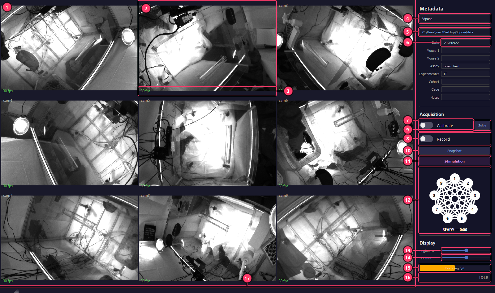

# The interface

Panopticon has two windows. The main window is where you preview the cameras,
calibrate and record. The stimulation editor opens from it and builds the
optogenetic [paradigms](GLOSSARY.md#paradigm) the
[trigger board](GLOSSARY.md#trigger-board) runs. This page describes each
control. [WORKFLOW.md](WORKFLOW.md) walks through a session in order, and
[GLOSSARY.md](GLOSSARY.md) defines the terms both pages use.

---

## The main window

The figure shows every control at once. In use, the coverage display (12)
appears only during a calibration and the progress bar (15) only while videos
are finalised.

The camera grid fills the left of the window, and a sidebar 260 px wide fills
the right. The sidebar holds the Metadata, Acquisition and Display groups,
with the state label at its foot. The status bar runs along the bottom of the
window. There is no settings window: everything else lives in the rig profile
([CONFIGURATION.md](CONFIGURATION.md)). The window opens at about 80% of the
screen height, shaped to fit the camera grid.

### Preview

#### 1. Camera grid

Live video from every open camera. The grid has as many rows as the square
root of the camera count, rounded down, and as many columns as it then needs.
That puts 4 cameras in 2 × 2, 6 in two rows of three, 9 in 3 × 3. The preview
shows each frame downsampled 3× per axis, so 1920 × 1200 becomes 640 × 400. It
repaints every 33 × N / 6 ms for N cameras, at least 33 ms and at most 100 ms
apart, which keeps display work away from capture.

| State | Cameras | Frames the preview gets |
|---|---|---|
| Idle | free-running at 30 fps | every frame |
| Calibrating | triggered at `calibration_frame_rate` | every frame |
| Recording | triggered at `frame_rate` | every 10th frame |

The preview freezes on its last frame during a blocking operation, which the
state label (16) names. A profile switch or the end of an acquisition takes a
second or two, a firmware flash about 30 s.

#### 2. Camera pane

Each pane carries its camera's name, `cam1` to `camN`, in its top-left corner.
Every file name and the calibration use that name.
[WORKFLOW.md](WORKFLOW.md#camera-names) explains how names are assigned and
why a missing camera matters. Double-click a pane to fill the grid with that
camera, and double-click it again to go back.

#### 3. Frame rate

The camera's delivered frame rate over its last ten frames, refreshed every
tenth repaint (1). That is about three times a second up to six cameras, and
twice a second on the nine-camera reference rig. It should read about 30 at
idle, the calibration rate while calibrating and the trigger rate while
recording. One pane reading low while the others are right is usually the
first sign of trouble with that camera's link or trigger.

### Metadata

#### 4. Profile

Chooses the rig profile, one YAML file in `profiles/`.
[WORKFLOW.md](WORKFLOW.md#2-choose-a-profile) says what a switch does to the
cameras and the trigger board. On a computer with no remembered profile the
dropdown shows `Choose a profile`.

The dropdown is disabled from the start of an acquisition until its videos
are finalised, during a solve, and during a blocking operation (16). A switch
during an editor upload, a stimulation Test or the hardware check is refused
with a dialog that says what to wait for.

#### 5. Output directory

The folder that sessions are written under. The button shows the path
shortened in the middle, with the full path as its tooltip. Choosing a profile
resets it to the profile's `output_dir`.

#### 6. Session fields

Date, Mouse 1, Mouse 2, Assay, Experimenter, Cohort, Cage and Notes. Date and
the two mice build the folder and file names, and all eight go into
`session_metadata.json`. Assay, Experimenter, Cohort, Cage and Notes start with
the profile's `metadata_defaults`.
[WORKFLOW.md](WORKFLOW.md#4-fill-in-the-metadata) gives the defaults and the
checks.

### Acquisition

Calibrate and Record are toggles, and while one is on the other is disabled.
Solve, Snapshot and Stimulation are buttons. A typical session goes Calibrate,
Solve, Record.

#### 7. Calibrate

Starts and stops a calibration. The cameras are triggered at
`calibration_frame_rate` with the calibration exposure and gain, and the board
always runs the [recording-only sketch](GLOSSARY.md#recording-only-sketch).
The coverage display (12) appears. See [WORKFLOW.md](WORKFLOW.md#5-calibrate).

#### 8. Record

Starts and stops a recording at `frame_rate`. Checks run first, and any of
them can refuse the start. [WORKFLOW.md](WORKFLOW.md#8-record) lists them,
including the prompt before data already in the target folder is deleted. A
recording also stops by itself when a stimulation block marked Ending
finishes.

#### 9. Solve

Runs the calibration solve on the calibration folder the session fields name,
then copies `calibration.toml` into `recording/`. It takes a few minutes,
during which the state label reads `CALIBRATING...` in purple. See
[WORKFLOW.md](WORKFLOW.md#6-solve).

#### 10. Snapshot

Saves one full-resolution PNG per camera into the session folder
([WORKFLOW.md](WORKFLOW.md#4-fill-in-the-metadata)), and the status bar
confirms `Snapshot: saved k/N cameras → <folder>`. Snapshots come from the
full frame, so the brightness and contrast sliders do not affect them. Use
them to judge focus, which the downsampled preview hides.

#### 11. Stimulation

Opens the stimulation editor ([below](#the-stimulation-editor)). The editor is
not modal, so it can stay open beside the main window. The button stays live
while other controls are busy. It does not open the editor before a profile
is chosen, or on a profile with `trigger_source: external`, which has no
trigger board to run a paradigm on.

#### 12. Coverage display

Appears in this slot during a calibration
([below](#the-calibration-coverage-hud)). It stays hidden when OpenCV is
missing or the profile's `board_config` file does not exist. The calibration
still records.

### Display

#### 13 and 14. Brightness and contrast

Both sliders range from -100 to +100 and change only the preview. The
recording, the snapshots and the board detection use the camera frames as
they arrive. [WORKFLOW.md](WORKFLOW.md#work-towards-ready) says what to do
when the board is too dark to detect.

#### 15. Progress

Shown while the videos are finalised (`Encoding k/N`) or aligned
(`Aligning k/N`), where N is the number of cameras. With real-time encoding,
finalising copies each stream into an mp4 and takes seconds.

#### 16. State

The label at the foot of the sidebar names what Panopticon is doing:

| Text | Meaning |
|---|---|
| `IDLE` (grey) | Nothing running. The cameras are in free-run preview |
| `CALIBRATING` (blue) | A calibration is running |
| `RECORDING` (red) | A recording is running |
| `ENCODING`, `ALIGNING` (amber) | Finalising the videos after a stop |
| `CALIBRATING...` (purple) | A solve is running. No camera captures |
| `WAITING FOR TRIGGER`, `STOP YOUR TRIGGER SOURCE` (amber) | Your own trigger source: start it, or stop it, now |
| `NO TRIGGER` (red) | Your own trigger source sent no pulse, and nothing was recorded |
| `Choose a profile`, `No profile` (amber) | No profile is open |

These texts, in amber, mark blocking operations. During one, every control
that could start something is disabled and the cursor shows a wait:

| Text | Operation |
|---|---|
| `Switching cameras…` | Closing the cameras and opening the new profile's |
| `Clearing stim firmware…` | The launch flash to the recording-only sketch, about 30 s |
| `Flashing recording-only firmware…` | Before a calibration, when a paradigm was on the board, about 30 s |
| `Flashing recording + stimulation firmware…` | Before a recording, putting the Applied paradigm back, about 30 s |
| `Checking capacity…` | The capacity checks at Calibrate or Record |
| `Starting...` | Arming the cameras and starting the trigger board |
| `Finishing…` | Stopping the cameras and saving the capture |
| `Updating the stimulus trace...` | Rewriting `stim_trace.csv` after an alignment |
| `Cancelling…` | Ending a start on your own trigger source that recorded nothing |

The two flash states come right after you press Calibrate or Record. Wait for
them: the acquisition starts when the flash ends, or a dialog says why it did
not. Do not end Panopticon during a flash
([why](WORKFLOW.md#when-the-board-resets)), and read the
[laser warning](WORKFLOW.md#7-optional-stimulation) before one.

#### 17. Status bar

Carries the hardware check's progress, snapshot results, the solve's progress
and the encode summary after a stop. During a recording it reports capture
health each time the frame-rate labels (3) refresh.
[WORKFLOW.md](WORKFLOW.md#while-it-records) lists the messages. Problems found
after a stop also go into `WARNINGS.txt`, because a dialog is easily
dismissed.

---

## The calibration coverage HUD

The coverage display shows, while you hold the board, whether the calibration
has enough views. Each camera is a numbered node on a ring, with an edge
between every pair. A node shows what one camera sees. An edge shows what two
cameras have seen at the same moment, which is what the stereo solve needs.
[WORKFLOW.md](WORKFLOW.md#work-towards-ready) shows the display at four stages
and says what to do at each.

The display counts detection ticks. A tick is one pass of the board detector
over the latest full-resolution frame of every camera, so a tick is a moment,
and several recorded frames can pass between two ticks. The pass visits the
cameras one at a time, and a cluttered scene slows it. The nine-camera
reference rig typically manages 10 to 20 ticks a second, fewer in a busy
arena. The log line
`[hud] coverage ticks/s:` gives the rate.

- A node glows cyan when its camera sees at least 4 board markers in the
  current tick. The glow fades over about 0.4 s.
- An edge thickens and whitens as the pair collects ticks in which both
  cameras saw at least 5 markers. It saturates at 200 such ticks.
- The 2 × 2 badge on each node shows which quadrants of that camera's view the
  board has visited, judged by the centre of its markers.
- The caption reads `<elapsed>  paired <worst>/<target>  grid <worst>/<cells>  groups <n>/1`.
  The two figures are the worst camera's, so they move only when that camera
  improves.
- While `groups` reads more than `1/1`, an orange line above the caption lists
  the groups, for example `{1,2,3} {4,5}`.

READY appears once all of these hold at the same time:

1. Every camera has at least `calibration_min_per_cam_shared`
   [co-detection](GLOSSARY.md#co-detection) ticks, in which it and at least
   one other camera saw the board. That is 120 on the reference rig.
2. Every camera has seen the board in at least `calibration_min_grid_cells` of
   its four quadrants, 3 on the reference rig.
3. The pairs with at least `calibration_min_edge` shared ticks
   (20 on the reference rig) join every camera into one group, directly or
   through a chain of pairs.

The third condition asks for one connected group, because cameras that face
each other never see the front of the board at the same moment. They join
through their neighbours. The solve keeps only its largest connected group, so
`groups 1/1` is what lets every camera take part in the result. The quadrant
condition stops the board being waved in one spot, which gives lens models that
fit the centre of the image and fail towards its edges. All three thresholds
are profile fields
([CONFIGURATION.md](CONFIGURATION.md#calibration_min_per_cam_shared)).

At READY the graph turns solid white and the caption reads `READY — m:ss`, with
the timer stopped. Detection goes on, and each further sighting still goes
into the solve's list of frames.

When a calibration stops, these sightings reach the solve through
`codet_frames.json` ([WORKFLOW.md](WORKFLOW.md#6-solve)).

---

## The stimulation editor

The editor builds an optogenetic stimulation paradigm before a recording. A
paradigm is a graph of blocks. Each block drives one output pin with one
square wave for a set time, and arrows chain blocks into sequences that start
with the recording's first trigger. The graph is compiled into the trigger
board's sketch, so nothing reaches the board until Apply uploads it.
[WORKFLOW.md](WORKFLOW.md#7-optional-stimulation) covers building, testing and
checking a paradigm, and gives the laser warning.

#### 1. Canvas

- Drag from a port, one of the circles on a block's edges, to another block's
  port to draw an arrow. A block takes any number of incoming arrows and at
  most one outgoing arrow. Dragging from a block that already has an outgoing
  arrow moves the block.
- Click a block to select it and load its values into the fields. Drag on
  empty space to select several blocks, and shift-drag to add to the
  selection.
- Delete removes the selection. Ctrl+C and Ctrl+V copy and paste blocks.
  Middle-drag pans, the wheel zooms, and Home fits the graph in view.
- Escape clears the selection and leaves the editor open, so a running Test
  keeps its Stop button in view.
- There is no undo. Save the graph before a large edit.
- Each block shows its pin, frequency, pulse width, duration and mode
  (`10% duty`, `constant ON` or `pin LOW`), and is tinted by its pin.
- A red dot at a block's top right marks the start of its chain, with a white
  ring when Starting was ticked by hand. A hollow amber dashed ring marks a
  block in a loop with no start. A black dot marks the Ending block. Blocks
  that do not start a chain are drawn faded.

#### 2. Waveform preview

One second of the wave the Freq and PW fields describe
([below](#the-waveform-preview)).

#### 3. Pin

The output pin. It has no default, and an empty Pin is refused with
`Enter a pin number.` Apply, Test, Calibrate and Record refuse a camera
trigger pin (the profile's `trigger_pins`), pins 0 and 1, which carry the
board's serial link, and a pin the board does not have.
[WORKFLOW.md](WORKFLOW.md#pins) explains why. Two chains may not drive one
pin. One chain may use a pin in several blocks, because its blocks run one
after another.

#### 4. Freq (Hz)

Pulses per second. 0 holds the pin LOW for the block's duration, which is how
a pause is written.

#### 5. PW (ms)

How long the pin stays HIGH in each cycle. Frequency and pulse width are
separate fields, so check the duty cycle in the preview.

#### 6. Dur (s)

How long the block runs before its chain moves on. It must be above 0 and can
be a fraction.

Enter in any of these four fields applies the values to the selected block.
With nothing selected, Enter creates a block, as Create Block does. A new
block takes 0 Hz, 0 ms and 1 s for the fields left blank.

#### 7. Starting

Marks the selected block as the start of its group. A block with no incoming
arrow already starts a chain. A loop has no such block, so it needs this or
it never runs. Each connected group has one start, so ticking one clears the
others. Available when exactly one block is selected.

#### 8. Ending

Marks the block whose first completion stops the recording. There is at most
one per canvas, and it is available when exactly one block is selected. A
looping chain keeps running until the recording stops, so bound a loop with a
parallel chain that holds the Ending block. Panopticon times the stop from the
canvas when Record starts, and does not ask the board.

#### 9. Status line

What the graph will do, such as `Recording will stop 15 s after start.` In
red, what blocks it: a loop with no start, a pin driven by two chains, an
Ending block that no chain reaches, or numbers that cannot be read. It also
shows upload progress, test countdowns, and whether the last upload or test
stop succeeded.

#### 10. Test

Runs the paradigm on the board with no camera pins. The stimulation outputs
fire, and no camera is triggered or recorded. The button reads Stop Test while
a test runs, and the status line counts down (`Testing — 12 s remaining.`). A
looping test reads `Testing — looping, press Stop Test to end.`, and only Stop
Test or closing the editor ends it.

Test runs whatever the board carries, so when the canvas differs from the last
upload it offers to upload first, and after a failed Apply it refuses. It uses
the main window's serial link and does not reset the board. If the board does
not confirm the stop, the status line reads
`STOP NOT CONFIRMED — stim may still be running.` and a dialog appears.
Power-cycle the board and switch the laser off.

#### 11. Apply to Arduino

Compiles the graph and uploads it to the board, in about 30 s. Apply is
refused during an acquisition, during another flash or a Test, and for a graph
with a blocking problem. On success the status line reads
`Upload successful — press Record to run paradigm.` Panopticon then holds the
paradigm for the rest of the launch, and swaps it on and off the board itself
around calibrations. A failed upload leaves the board's contents unknown, and
possibly without its safe-pins guard. Switch the laser off and Apply again:
Record, Calibrate and Test refuse until an Apply succeeds.

Load, Clear and Save share the row. Load and Save read and write the graph as
JSON, starting in the output directory. Load asks before it replaces unsaved
changes, and leaves the canvas as it was when a file cannot be read. Clear
asks before it empties the canvas. Save writes a file, and only Apply changes
the board.

---

## The waveform preview

Check this plot whenever you type Freq and PW. It draws one second of the wave
the fields describe and captions it, so you see the stimulation's shape before
it reaches the board. The period is `1000 / freq` ms, and the duty cycle is
`pulse width × freq / 10` percent.

| Fields | Preview |
|---|---|
| 10 Hz, 10 ms: period 100 ms, 10% duty |  |
| 40 Hz, 5 ms: period 25 ms, 20% duty |  |
| 20 Hz, 25 ms: period 50 ms, 50% duty |  |
| 0 Hz: pin held LOW |  |
| 10 Hz, 100 ms: period 100 ms, 100% duty |  |

A train denser than 400 cycles per second of preview is drawn as a band.

Look hardest at the last row. At 10 Hz each period is 100 ms, so a 100 ms
pulse fills it and the pin goes HIGH and stays HIGH for the whole block. The
preview draws one rising edge, turns its border red and reads
`100% duty — constant ON, not 10 Hz`. A pulse longer than its period does the
same, captioned for example `pulse 150 ms > period 100 ms`. The board drives
the pin HIGH in both cases, and the block reads `constant ON`.

---

## Controls that hide, and controls that disable

Hidden until they have something to show:

- The coverage display (12), during a calibration, when OpenCV and the board
  file are available.
- The progress bar (15), while videos are encoded or aligned.

Disabled while they would do the wrong thing:

- Record while Calibrate is on, and Calibrate while Record is on.
- Record and Calibrate while the hardware check runs, while videos are
  encoded or aligned, during a solve, during an editor upload, and until a
  profile is open.
- Solve during a solve and until a profile is open. During an acquisition,
  an encode or an alignment it stays live, and a press shows
  `Solve unavailable while acquiring/encoding` in the status bar.
- During a blocking operation (the second table under 16): the dropdown, the
  output directory, the toggles, Solve, Snapshot and the session fields. The
  Stimulation button and the two sliders stay live.
- The session fields, the output directory and the dropdown from the start
  of an acquisition until its videos are finalised, and during a solve.
- In the editor: Starting and Ending unless exactly one block is selected,
  Apply and Test during an upload, and Apply during a Test.

Hover over a disabled toggle or Solve to see what holds it.
[WORKFLOW.md](WORKFLOW.md#what-happens-at-launch) describes the launch
hardware check, and [WORKFLOW.md](WORKFLOW.md#quitting-in-the-middle) what
quitting does in each state.
