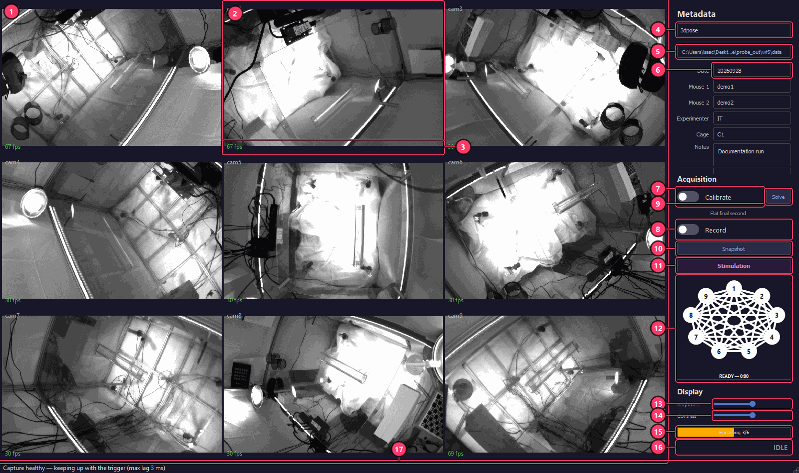
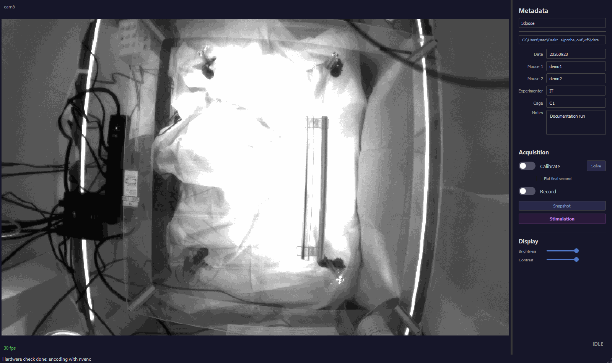
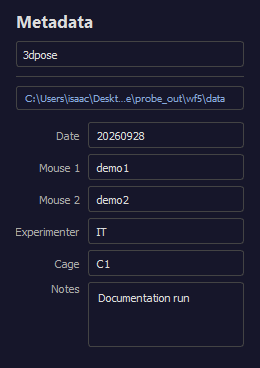
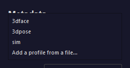
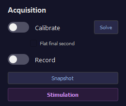
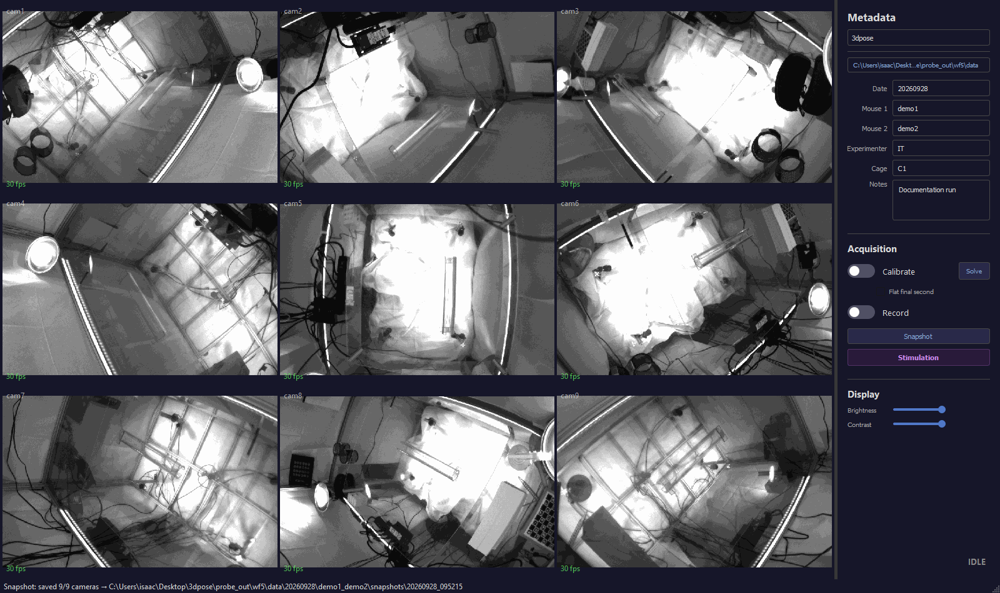
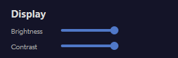
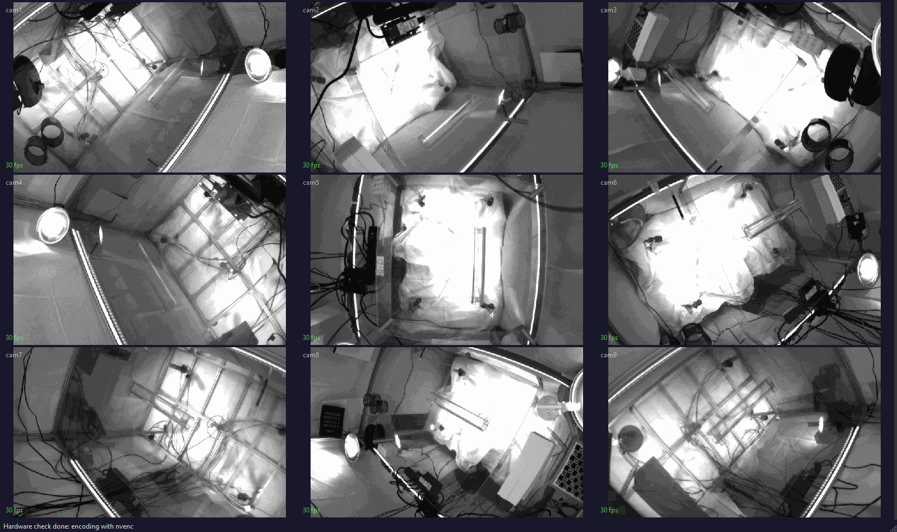
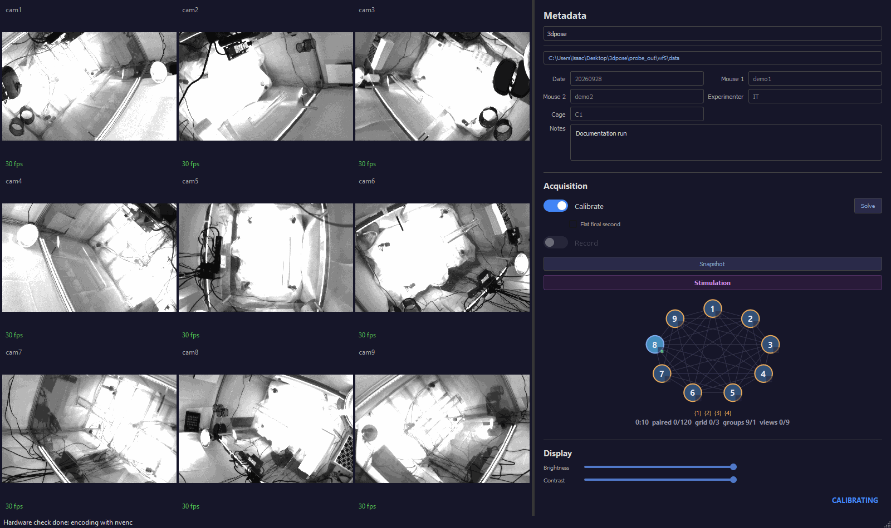

# Overview: the interface

Previous: [INSTALLATION.md](INSTALLATION.md).

Panopticon has two windows. The main window is where you preview the cameras,
calibrate and record. The stimulation editor opens from it and builds the
optogenetic [paradigms](GLOSSARY.md#paradigm) the
[trigger board](GLOSSARY.md#trigger-board) runs. This page names each control,
says what it shows, and says where to look when it shows something else.
[GLOSSARY.md](GLOSSARY.md) defines the terms it uses.

Read it with Panopticon open beside you. Start it with the desktop shortcut
([INSTALLATION.md step 10](INSTALLATION.md#step-10--desktop-shortcut)). The
first picture numbers every control of the main window, and each numbered
heading below describes one of them. Each group of controls also has a picture
of its own, taken on the reference rig.

Your window may not look like the first picture yet. On a computer where no
profile has been chosen, the grid is empty and the state label (16) reads
`Choose a profile`: pick your rig's profile in the dropdown (4) first. The
window then opens the cameras and checks the hardware. Calibrate and Record
stay grey until the status bar (17) reads
`Hardware check done: encoding with <encoder>`.

---

## The main window

The figure shows every control at once. In use, the coverage display (12)
appears only during a calibration and the progress bar (15) only while videos
are finalised. Their values in the picture, and the status bar's message, are
examples set up for it. Callout 9 marks the Solve button, to the right of
Calibrate. Three panes in the picture read above 30 fps, which (3) explains.

The camera grid fills the left of the window, and the sidebar fills the right.
The sidebar holds the Metadata, Acquisition and Display groups, with the state
label at its foot. The status bar is the line of text along the bottom of the
window. Every other setting is in the [rig profile](GLOSSARY.md#rig-profile), the
YAML file that describes your rig ([CONFIGURATION.md](CONFIGURATION.md) lists
its fields). The first launch opens the window at about 80% of the screen
height, shaped to fit the camera grid.

Each later launch puts back what you left:

- the window's position and size, and the sidebar's width, collapsed included;
- the session fields, except the date, which follows the calendar;
- a folder chosen with the output button, for each profile;
- the Display sliders;
- the Stimulation editor's pin, frequency, pulse width and duration fields.

The editor's canvas is not restored, and nothing reaches the trigger board
until Apply.

### Preview

#### 1. Camera grid

Live video from every open camera. The grid has as many rows as the square
root of the camera count, rounded down, and as many columns as it then needs.
That puts 4 cameras in 2 × 2, 6 in two rows of three, 9 in 3 × 3. The preview
is shown at reduced size and refreshes a few times a second, so it never slows
the capture. It freezes on its last frame during a blocking operation, and
[State](#16-state) (16) lists those operations and how long they take.

| State | Cameras | Frames the preview gets |
|---|---|---|
| Idle | free-running at 30 fps | every frame |
| Calibrating | triggered at `calibration_frame_rate` (30 fps on the reference rig) | every frame |
| Recording | triggered at `frame_rate` (100 fps on the reference rig) | every 10th frame |

In detail, the preview shows each frame downsampled 3× per axis, so
1920 × 1200 becomes 640 × 400. It repaints every 33 × N / 6 ms for N cameras,
at least 33 ms and at most 100 ms apart, which keeps display work away from
capture.

#### 2. Camera pane

Each pane carries its camera's name, `cam1` to `camN`, in its top-left corner.
[WORKFLOW.md](WORKFLOW.md#camera-names) explains how names are assigned and
where they are used. Double-click a pane to fill the grid with that camera. The
sidebar and the status bar stay as they were.

Double-click the pane again to go back to the grid. The zoom changes only the
preview, and the hidden cameras go on capturing. A pane that stays black is
covered in [TROUBLESHOOTING.md](TROUBLESHOOTING.md#opening-the-cameras).

#### 3. Frame rate

The camera's delivered frame rate over its last ten frames, refreshed every
tenth repaint (1): about three times a second up to six cameras, and twice a
second on the nine-camera reference rig. It should match the camera rate that
the table under (1) gives for the current state, so at rest every pane reads
about 30 fps. During a recording it shows the camera's rate, 100 fps on the
reference rig, and not the preview's.

The label times those ten frames as the computer takes them in. A pane that
catches up after a moment when the computer was busy reads above its rate for
a refresh or two, as three panes do in the first picture.
One pane reading low while the others are right is usually the first sign of
trouble with that camera's link or trigger.
[TROUBLESHOOTING.md](TROUBLESHOOTING.md#during-an-acquisition) says what to
check.

### Metadata

The Metadata group holds the profile dropdown (4), the output directory button
(5) and the session fields (6). The picture shows it filled in with example
values.

#### 4. Profile

Chooses the rig profile ([CONFIGURATION.md](CONFIGURATION.md)). Click the
dropdown to open its list: every profile in `profiles/` by its `name`, then
`Add a profile from a file…`. The list opens over the top of the sidebar.

On the reference rig choose `3dpose`. `3dface` is the other rig that shares
this software, and `sim` runs simulated cameras for practice
([SIMULATION.md](SIMULATION.md)). A computer shows the profiles in its own
`profiles/` folder, so yours may list other names.

Click a name to switch to that profile. While it switches, the state label (16)
reads `Switching cameras…`. It returns to `IDLE` once the new profile's cameras
show in the grid. [WORKFLOW.md](WORKFLOW.md#2-choose-a-profile) says what a
switch does to the cameras and the trigger board. On a computer with no
remembered profile the dropdown shows `Choose a profile`. Its last entry,
`Add a profile from a file…`, opens a file dialog for a profile kept outside
`profiles/`, switches to it and lists it at every later launch
([CONFIGURATION.md](CONFIGURATION.md#where-settings-live)).

The dropdown is disabled from the start of an acquisition until its videos
are finalised, during a solve, and during a blocking operation (16). A switch
during an editor upload, a stimulation Test or the hardware check is refused
with a dialog that says what to wait for.

#### 5. Output directory

The folder that sessions are written under. The button shows the path
shortened in the middle, with the full path as its tooltip, so hover over the
button to read it. Click the button to choose another folder in the
`Select Output Directory` dialog. The button then shows the new path.
[WORKFLOW.md](WORKFLOW.md#3-set-the-output-directory) says which folder a
profile starts with. The folder in the pictures is a test folder. The
reference rig's sessions go to the `data` folder in the repository.

#### 6. Session fields

Date, Mouse 1, Mouse 2, Experimenter, Cage and Notes, which is three lines
tall.
[WORKFLOW.md](WORKFLOW.md#4-fill-in-the-metadata) says what each one feeds,
gives the defaults and lists the checks.

### Acquisition

The Acquisition group holds Calibrate (7), with Solve (9) beside it and the
Flat final second box under it. Record (8), Snapshot (10) and Stimulation (11)
follow. In the picture both toggles are off, with the knob at the left.

Calibrate and Record are toggles, switches with a round knob. Click a toggle,
or its label, once to start. Its knob slides right and its track fills with
colour, blue for Calibrate and red for Record. Click it again to stop.
[WORKFLOW.md](WORKFLOW.md) calls this flipping the toggle on and off. While one
toggle is on, the other is greyed out and disabled. Solve, Snapshot and
Stimulation are buttons. A typical session goes Calibrate, Solve, Record.

#### 7. Calibrate

Starts and stops a calibration, and shows the coverage display (12). While
Calibrate is on, carry the printed calibration board, a
[ChArUco board](GLOSSARY.md#charuco-board), through every camera's view. Flip
Calibrate off once the coverage display reads READY.
[WORKFLOW.md](WORKFLOW.md#5-calibrate) walks through a take and says what a
calibration does to the cameras and the trigger board.

After the click the state label (16) reads `Checking capacity…`, then
`Starting...`, then `CALIBRATING` in blue. If a paradigm is on the board, a
`Flashing …` state comes first and the preview freezes for about 30 s: wait,
and do not close Panopticon. After the second click it reads `Finishing…`,
then `ENCODING` with the progress bar (15), then `IDLE`.

Flat final second is the small box under Calibrate, left of its words. Tick it
if you will end the take by laying the calibration board flat on the arena
floor and holding it still for the last second. Solve then puts the floor at
height 0 (Z = 0). Leave it unticked otherwise
([WORKFLOW.md](WORKFLOW.md#put-the-floor-at-z--0)).

#### 8. Record

Starts and stops a recording at `frame_rate`. Checks run first, and any of
them can refuse the start. [WORKFLOW.md](WORKFLOW.md#8-record) lists them,
including the prompt before data already in the target folder is deleted. A
recording also stops by itself when a stimulation block marked Ending
finishes.

After the click the state label runs through the same states as for
Calibrate, and then reads `RECORDING` in red. After the second click it reads
`Finishing…`, `ENCODING` and then `IDLE`.

#### 9. Solve

Solve works out each camera's lens and position from the calibration you just
took ([solve](GLOSSARY.md#solve)). It reads the calibration in the session
folder that Date, Mouse 1 and Mouse 2 point to, so leave those fields as they
were for the calibration. While it runs the state label reads `CALIBRATING...`
in purple, close to a calibration's blue, and no camera captures. When it
finishes, the status bar shows the result.
[WORKFLOW.md](WORKFLOW.md#6-solve) says what it reads and writes.

#### 10. Snapshot

Saves one full-resolution PNG per camera into the session folder
([WORKFLOW.md](WORKFLOW.md#4-fill-in-the-metadata)). The status bar reads
`Snapshot: saving N cameras…`, and then confirms
`Snapshot: saved k/N cameras → <folder>`.

A camera that sent no frame is named at the end of the message, after
`no frame from:`. Snapshots come from the full frame, so the brightness and
contrast sliders do not affect them. Use them to judge focus, which the
downsampled preview hides.

#### 11. Stimulation

Opens the stimulation editor ([below](#the-stimulation-editor)). The editor is
not modal, so it can stay open beside the main window. The button stays live
while other controls are busy. It does not open the editor before a profile
is chosen, or on a profile with `trigger_source: external`, which has no
trigger board to run a paradigm on.

#### 12. Coverage display

Appears in this slot during a calibration
([below](#the-calibration-coverage-hud)). It stays hidden when OpenCV is
missing, when the profile's `board_config` file does not exist, and when the
file cannot be used (the log says `[hud] coverage detector unavailable`). The
log is the console window and the launch's file in `logs\`
([WORKFLOW.md](WORKFLOW.md#the-log) says where). The calibration still
records. Before the next take, check that
[`board_config`](CONFIGURATION.md#board_config) names your board's file.

### Display

The Display group holds the Brightness (13) and Contrast (14) sliders. The
progress bar (15), while it is shown, and the state label (16) sit below them.

#### 13 and 14. Brightness and contrast

Both sliders range from -100 to +100 and change only the preview. At 0 the
handle sits in the middle of its track, as in the picture. The part of the
track right of the handle has the colour of the background. At 0 the handle
therefore looks as if it sits at the right end of a short bar, while it is in
the middle. Drag
a slider right to
brighten the preview or raise its contrast, and left for the reverse. The
recording, the snapshots and the board detection use the camera frames as
they arrive. If the panes look black, grey or washed out while their frame
rates count, drag both handles back to the middle.
[WORKFLOW.md](WORKFLOW.md#work-towards-ready) says what to do when the board
is too dark to detect.

#### 15. Progress

Shown while the videos are finalised (`Encoding k/N`) or aligned
(`Aligning k/N`), where N is the number of cameras.
[WORKFLOW.md](WORKFLOW.md#9-after-you-stop) says what each step does.

#### 16. State

The label at the foot of the sidebar names what Panopticon is doing:

| Text | Meaning |
|---|---|
| `IDLE` (grey) | Nothing running. The cameras are in free-run preview |
| `CALIBRATING` (blue) | A calibration is running |
| `RECORDING` (red) | A recording is running |
| `ENCODING`, `ALIGNING` (amber) | Finalising the videos after a stop |
| `CALIBRATING...` (purple) | A solve is running. No camera captures |
| `WAITING FOR TRIGGER`, `STOP YOUR TRIGGER SOURCE` (amber) | Your own trigger source: start it, or stop it, now |
| `NO TRIGGER` (red) | Your own trigger source sent no pulse, and nothing was recorded |
| `Choose a profile`, `No profile` (amber) | No profile is open |

These texts, in amber, mark blocking operations. During one, every control
that could start something is disabled and the cursor shows a wait:

| Text | Operation |
|---|---|
| `Switching cameras…` | Closing the cameras and opening the new profile's, a second or two |
| `Clearing stim firmware…` | The launch flash to the [recording-only sketch](GLOSSARY.md#recording-only-sketch) |
| `Flashing recording-only firmware…` | Before a calibration, when a paradigm was on the board |
| `Flashing recording + stimulation firmware…` | Before a recording, putting the Applied paradigm back |
| `Checking capacity…` | The capacity checks at Calibrate or Record |
| `Starting...` | Arming the cameras and starting the trigger board |
| `Finishing…` | Stopping the cameras and saving the capture, a second or two |
| `Updating the stimulus trace...` | Rewriting `stim_trace.csv` after an alignment |
| `Cancelling…` | Ending a start on your own trigger source that recorded nothing |

A flash writes a new program into the trigger board, and takes about 30 s. The
two `Flashing …` states come right after you press Calibrate or Record. Wait
for them: the acquisition starts when the flash ends, or a dialog says why it
did not. Do not end Panopticon during a flash
([why](WORKFLOW.md#when-the-board-resets)).

While the board is flashed its pins float, and a powered laser driver can read
that as on. Read the [laser warning](WORKFLOW.md#7-optional-stimulation) before
your first Calibrate or Record.

#### 17. Status bar

The line of text along the bottom of the window. It carries the hardware
check's progress, snapshot results, the solve's progress and the encode
summary after a stop. During a recording it reports capture health each time
the frame-rate labels (3) refresh.
[WORKFLOW.md](WORKFLOW.md#while-it-records) lists the messages.

### The sidebar's width

The sidebar opens 260 px wide, its narrowest. A thin divider runs down its left
edge, between the sidebar and the cameras, and it lights up when the pointer is
over it. Drag the divider left to widen the sidebar, up to 900 px.

Drag the divider to the right as far as it goes, and the sidebar collapses. The
camera grid then fills the window above the status bar.

To get the sidebar back, point at the thin strip at the window's right edge
until it lights up, then drag it left.

At about twice its opening width, 520 px, the metadata fields sit two to a
row, and Notes spans the full width. During a calibration the coverage display
(12) takes the height that saves, so a wide sidebar gives a larger graph. The
picture shows a sidebar 640 px wide during a calibration. The panes look
brighter than at rest because the cameras use the profile's calibration
exposure during a calibration.

---

## The calibration coverage HUD

The coverage display shows, while you hold the calibration board
([ChArUco board](GLOSSARY.md#charuco-board)), whether the calibration has
enough views. It opens in the sidebar when you flip Calibrate on, and a
[wider sidebar](#the-sidebars-width) gives a larger graph. Each camera is a
numbered node on a ring, with an edge between every pair. A node shows what one
camera sees. An edge shows what two cameras have seen at the same moment, which
is what the stereo solve needs.
[WORKFLOW.md](WORKFLOW.md#work-towards-ready) shows the display at four stages
and says what to do at each. On a first calibration, follow it there, and come
back here for the detail.

The display counts detection ticks. A tick is one pass of the board detector
over the latest full-resolution frame of every camera, so a tick is a moment,
and several recorded frames can pass between two ticks. The pass visits the
cameras one at a time, and a cluttered scene slows it. The nine-camera
reference rig manages 4 to 5 ticks a second, fewer in a busy arena. The log
line `[hud] coverage ticks/s:` gives the rate.

- A node glows cyan when its camera sees at least 4 board markers in the
  current tick. The glow fades over about 0.4 s.
- An edge thickens and whitens as the pair collects ticks in which both
  cameras saw at least 5 markers. It saturates at 200 such ticks.
- The 2 × 2 badge on each node shows which quadrants of that camera's view the
  board has visited, judged by the centre of its markers.
- The caption reads `<elapsed>  paired <worst>/<target>  grid <worst>/<cells>  groups <n>/1`.
  The two figures are the worst camera's, so they move only when that camera
  improves. Once the groups join, a profile with a connectivity floor shows
  `link <now>/<floor>` in place of `groups`. A profile with view-quality
  thresholds adds `views <good>/<cameras>`.
- An orange line above the caption names what holds READY back. While
  `groups` reads more than `1/1`, it lists the groups, for example
  `{1,2,3} {4,5}`, at most four of them. While `link` is short, it names the
  two sides of the weakest link, for example
  `weakest link {1,4,7,9} to {2,3,5,6,8}`. Then it names the
  cameras short of each view test, for example `closer 1,3  tilt 3  edges 7`.
  Those cameras' nodes have an orange rim.

READY appears once all of these hold at the same time:

1. Every camera has at least `calibration_min_per_cam_shared`
   [co-detection](GLOSSARY.md#co-detection) ticks (120 on the reference rig),
   in which it and at least one other camera saw the board.
2. Every camera has seen the board in at least `calibration_min_grid_cells` of
   its four quadrants, 3 on the reference rig.
3. The pairs with at least `calibration_min_edge` shared ticks
   (20 on the reference rig) join every camera into one group, directly or
   through a chain of pairs.
4. That group is joined firmly enough: its
   [algebraic connectivity](CONFIGURATION.md#calibration_min_connectivity)
   reaches `calibration_min_connectivity` (30 on the reference rig). A weak
   link between groups of cameras keeps it low.
5. Every camera's shared views pass each view test the profile sets. `closer`
   needs the board big enough in 5 views, `tilt` needs it tilted far enough in
   5 views, and `edges` needs marker corners in enough cells of a 4 x 4 grid
   over the view. The reference rig asks for a
   [board size](CONFIGURATION.md#calibration_min_board_size) of 0.10, a tilt
   of 40 degrees and 7 of the 16 cells.

The third condition asks for one connected group, because cameras that face each
other never see the front of the board at the same moment. They join through
their neighbours, and `groups 1/1` is what lets every camera take part in the
solve ([WORKFLOW.md](WORKFLOW.md#which-cameras-made-it-into-the-solve)). The
quadrant condition stops the board being waved in one spot, which gives lens
models that fit the centre of the image and fail towards its edges. The view
tests go further, because the lens fit needs close, tilted views with corners
out to the edges. Every threshold is a profile field
([CONFIGURATION.md](CONFIGURATION.md#calibration_min_per_cam_shared)), and
conditions 4 and 5 are off at 0.

At READY the graph turns solid white and the caption reads `READY — m:ss`, with
the timer stopped. You can flip Calibrate off once READY shows. Detection goes
on if you carry on, and each further sighting still goes into the solve's list
of frames ([WORKFLOW.md](WORKFLOW.md#6-solve)). A longer take gives the solve
more views to choose from, and is optional.

---

## The stimulation editor

The picture shows a loop on pin 53: 5 s of 10 Hz pulses, then 10 s with the
pin LOW, repeated until the recording stops. The arrow back from the second
block to the first runs straight behind the forward arrow and across the
second block. Its status line (9) holds a label written for the picture. For a
loop with no Ending block the editor leaves that line empty. On the reference
rig pin 53 is the laser, so this example drives the laser. The picture's
numbers are the editor's own, and start again at 1.

The editor builds an optogenetic stimulation paradigm before a recording. A
paradigm is a graph of blocks. Each block drives one output pin with one
square wave for a set time. An arrow means "when this block ends, start that
one", so a chain runs in sequence, and chains that are not connected run at
the same time. Every chain starts with the recording's first trigger.
[WORKFLOW.md](WORKFLOW.md#7-optional-stimulation) covers building, testing and
checking a paradigm, and gives the laser warning.

#### 1. Canvas

The canvas opens empty. To add a block, fill in Pin (3), Freq (4), PW (5) and
Dur (6), then click Create Block, the green button beside Ending (8). The block
appears in the middle of the canvas's view, or to the right of any block
already there.

- Drag a block's body to move it. Drag from a port, one of the circles on a
  block's edges, to another block's port to draw an arrow. A block takes any
  number of incoming arrows and at most one outgoing arrow, so a drag from the
  port of a block that already has its outgoing arrow moves the block instead.
- Click a block to select it and load its values into the fields. Drag on
  empty space to select several blocks, and shift-drag to add to the
  selection.
- Delete removes the selection. Ctrl+C and Ctrl+V copy and paste blocks.
  Middle-drag pans, the wheel zooms, and Home fits the graph in view.
- Escape clears the selection and leaves the editor open, so a running Test
  keeps its Stop button in view.
- There is no undo. Save the graph before a large edit.
- Each block shows its pin, frequency, pulse width, duration and mode
  (`10% duty`, `constant ON` or `pin LOW`), and is tinted by its pin.
- A red dot at a block's top right marks the start of its chain, with a white
  ring when Starting was ticked by hand. A hollow amber dashed ring marks a
  block in a loop with no start. A black dot marks the Ending block. Blocks
  that do not start a chain are drawn faded.

#### 2. Waveform preview

One second of the wave the Freq and PW fields describe
([below](#the-waveform-preview)).

#### 3. Pin

The output pin. It has no default, and an empty Pin is refused with
`Enter a pin number.` On the reference rig the laser is on pin 53. Apply,
Test, Calibrate and Record refuse some pins
([WORKFLOW.md](WORKFLOW.md#pins) lists them and says why). Two chains may not
drive one pin. One chain may use a pin in several blocks, because its blocks run one
after another.

#### 4. Freq (Hz)

Pulses per second. 0 holds the pin LOW for the block's duration, which is how
a pause is written.

#### 5. PW (ms)

How long the pin stays HIGH in each cycle. Frequency and pulse width are
separate fields, so check the duty cycle in the preview.

#### 6. Dur (s)

How long the block runs before its chain moves on. It must be above 0 and can
be a fraction.

Enter in any of these four fields applies the values to the selected block.
With nothing selected, Enter creates a block, as Create Block does. A new
block takes 0 Hz, 0 ms and 1 s for the fields left blank.

#### 7. Starting

Marks the selected block as the start of its group. A block with no incoming
arrow already starts a chain. A loop has no such block, so it needs this or
it never runs. Each connected group has one start, so ticking one clears the
others. Available when exactly one block is selected.

#### 8. Ending

Marks the block whose first completion stops the recording. There is at most
one per canvas, and it is available when exactly one block is selected. A
looping chain keeps running until the recording stops, so bound a loop with a
parallel chain that holds the Ending block. Panopticon times the stop from the
canvas when Record starts, and does not ask the board.

#### 9. Status line

What the graph will do, such as `Recording will stop 15 s after start.` In
red, what blocks it: a loop with no start, a pin driven by two chains, an
Ending block that no chain reaches, or numbers that cannot be read. It also
shows upload progress, test countdowns, and whether the last upload or test
stop succeeded.

#### 10. Test

Runs the paradigm on the board for real, with no camera pins. A laser on the
paradigm's pin turns on and off as it would in a recording, and no camera is
triggered or recorded. The button reads Stop Test while
a test runs, and the status line counts down (`Testing — 12 s remaining.`). A
looping test reads `Testing — looping, press Stop Test to end.`, and only Stop
Test or closing the editor ends it.

Test runs whatever the board carries, so when the canvas differs from the last
upload it offers to upload first, and after a failed Apply it refuses. It uses
the main window's serial link, so it does not reset the board while Panopticon
holds the port. [WORKFLOW.md](WORKFLOW.md#when-the-board-resets) lists when a
Test does reset it. If the board does not confirm the stop, the status line
reads
`STOP NOT CONFIRMED — stim may still be running.` and a dialog appears.
Power-cycle the board and switch the laser off.

#### 11. Apply to Arduino

Compiles the graph and flashes it to the board, which takes about 30 s
([State](#16-state)). Apply is refused
during an acquisition, during another flash or a Test, and for a graph with a
blocking problem. On success the status line reads
`Upload successful — press Record to run paradigm.`
[WORKFLOW.md](WORKFLOW.md#when-the-board-resets) says when Panopticon later
swaps it off the board and back. A failed upload leaves the board's contents
unknown, and possibly without its [safe-pins guard](GLOSSARY.md#safe-pin). Switch the laser off and
Apply again: Record, Calibrate and Test refuse until an Apply succeeds.

Load, Clear and Save share the row. Load and Save read and write the graph as
JSON, by default `stim_config.json` in the output directory. Load asks before it
replaces unsaved changes, and leaves the canvas as it was when a file cannot be
read. Clear asks before it empties the canvas. Save writes a file, and only
Apply changes the board.

---

## The waveform preview

Check this plot whenever you type Freq and PW. It draws one second of the wave
the fields describe and captions it, so you see the stimulation's shape before
it reaches the board. The period is `1000 / freq` ms, and the duty cycle is
`pulse width × freq / 10` percent.

| Fields | Preview |
|---|---|
| 10 Hz, 10 ms: period 100 ms, 10% duty |  |
| 40 Hz, 5 ms: period 25 ms, 20% duty |  |
| 20 Hz, 25 ms: period 50 ms, 50% duty |  |
| 0 Hz: pin held LOW |  |
| 10 Hz, 100 ms: period 100 ms, 100% duty |  |

The preview draws at most 400 cycles, so a train above 400 Hz fills only the
first 400/f seconds of the plot, as a solid band.

Read the last row closely. At 10 Hz each period is 100 ms, so a 100 ms
pulse fills it and the pin goes HIGH and stays HIGH for the whole block. The
preview draws one rising edge, turns its border red and reads
`100% duty — constant ON, not 10 Hz`. A pulse longer than its period does the
same, captioned for example `pulse 150 ms > period 100 ms`. The board drives
the pin HIGH in both cases, and the block reads `constant ON`.

---

## Controls that hide, and controls that disable

The coverage display (12) and the progress bar (15) stay hidden until they
have something to show, as their entries say.

Disabled while they would do the wrong thing:

- Record and Calibrate while the hardware check runs, while videos are
  encoded or aligned, during a solve, during an editor upload, and until a
  profile is open.
- Solve during a solve and until a profile is open. During an acquisition,
  an encode or an alignment it stays live, and a press shows
  `Solve unavailable while acquiring/encoding` in the status bar.
- During a blocking operation (the second table under 16): the dropdown, the
  output directory, the toggles, Solve, Snapshot and the session fields. The
  Stimulation button and the two sliders stay live.
- The session fields, the output directory and the dropdown from the start
  of an acquisition until its videos are finalised, and during a solve.
- In the editor: Starting and Ending unless exactly one block is selected,
  Apply and Test during an upload, and Apply during a Test.

Hover over a disabled toggle or Solve to see what holds it.
[WORKFLOW.md](WORKFLOW.md#what-happens-at-launch) describes the launch
hardware check, and [WORKFLOW.md](WORKFLOW.md#quitting-in-the-middle) what
quitting does in each state.

Next: [WORKFLOW.md](WORKFLOW.md) takes you through a session, one step at a time.
