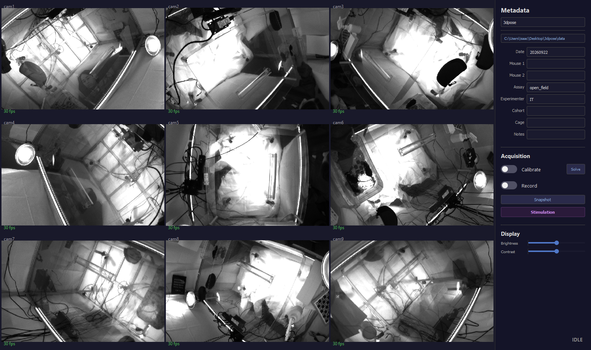
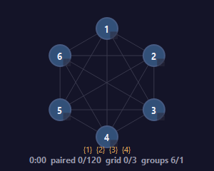
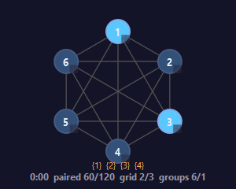
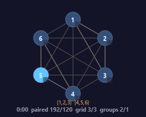

# A session, end to end

A session is one visit to the rig: launch the application, tell it which rig it
is looking at and where to put the data, describe the animals, calibrate the
cameras, solve that calibration into camera geometry, optionally load a
stimulation paradigm, record.

[OVERVIEW.md](OVERVIEW.md) is the reference for what each control does, and the
better page to keep open beside the window. [INSTALLATION.md](INSTALLATION.md)
covers building, wiring and sizing the rig.

- [1. Launch](#1-launch)
- [2. Choose a profile](#2-choose-a-profile)
- [3. Set the output directory](#3-set-the-output-directory)
- [4. Fill in the metadata](#4-fill-in-the-metadata)
- [5. Calibrate](#5-calibrate)
- [6. Solve](#6-solve)
- [7. Optional: stimulation](#7-optional-stimulation)
- [8. Record](#8-record)
- [9. After you stop](#9-after-you-stop)
- [10. What the session leaves on disk](#10-what-the-session-leaves-on-disk)
- [11. Troubleshooting](#11-troubleshooting)

---

## 1. Launch

You are aiming for a window with a live picture from every camera and the word
`IDLE` in the corner. Nothing you do later can be trusted if a camera is missing
here.

Three ways to start, all equivalent:

- Double-click the **Panopticon** desktop shortcut, if one has been made
  (`make_shortcut.ps1` writes one that starts the application with no console
  window).
- Double-click **`_launch.bat`** in the repository folder. This one goes through
  `uv`, so it installs or updates dependencies first if `pyproject.toml` has
  changed; the shortcut does not.
- In a terminal, from the repository folder: `uv run gui.py`. Use this when
  something is going wrong: the diagnostic output appears in the terminal as it
  happens.

A "Panopticon / Loading cameras..." splash shows for a second or two, then the
main window comes up.

Everything printed to the console also goes to
`logs/panopticon_<date>_<time>.log` in the repository folder. It holds the
per-camera detail the window only summarises, so it is the first thing to quote
when reporting a problem.

Two things then happen on their own.

**A hardware check** runs in the background and only interrupts you if the
machine is short of something: fewer than 4 CPU cores, less than 16 GB of RAM,
less than 500 GB free on the output drive, a measured write speed under 500
MB/s, or no NVENC encoder found. NVENC is NVIDIA's on-GPU video-compression
hardware; it compresses six cameras at once without the CPU. Silence here is the
good outcome.

**The trigger board is put back to a stimulation-free state.** The trigger board
is the small Arduino microcontroller wired to every camera; it generates the
pulse train that makes all the cameras expose at the same instant, and on an
optogenetics rig it also drives the laser. A stimulation paradigm lives in its
flash memory, so it survives closing the application, a power cycle and an
unplugged USB cable, and it cannot be read back over the serial link. So the
application reflashes the recording-only firmware at every launch, unless it has
a record of having already put that firmware there, and the sidebar reads
`Clearing stim firmware…` for about 30 seconds. **Stimulation is opt-in per
launch:** unless a paradigm has been applied since this launch, the board
carries none.

The serial port is then opened and held open until you quit. Opening the port
resets the board, and during that reset and the one-to-two-second bootloader
wait that follows, no code runs and every pin floats. A powered laser driver
reads a floating input as "on" and flashes. One connection held open for the
session takes that *port-open* reset out of the start of every recording. **A
flash resets the board too**, and no software can close that window: key the
laser off or block the beam before pressing Apply, Calibrate, or the first
Record after a paradigm change, and use the laser's own interlock if you need a
hard gate. [The safe-pins guard](#the-safe-pins-guard) sets out exactly when a
flash happens.

**What a good launch looks like:**



One live pane per camera, filling the grid, each frame-rate number near **30**.
That is not a mistake: between acquisitions the cameras run free at 30 fps to
feed the preview, and only run at the trigger rate while you calibrate or
record. The state label at the bottom right reads **`IDLE`**, and no dialogs are
up.

If a pane is black or missing, fix it before touching anything else; see
[Troubleshooting](#11-troubleshooting) for the specific messages. Camera names
are assigned by serial-number order, so a camera absent at launch silently
renames every camera after it.

---

## 2. Choose a profile

A **profile** is a small YAML text file describing one physical rig: how many
cameras, how fast they run, which serial port the trigger board is on, which of
the board's pins go where. It is the file a new site edits, and it is why one
application can run two rooms without a code change. The dropdown at the top of
the sidebar lists every file in `profiles/*.yaml`.

Almost everything later inherits from this choice:

| The profile sets | Effect |
|---|---|
| `frame_width`, `frame_height` | Sensor region used |
| `frame_rate` | Trigger rate for a recording |
| `calibration_frame_rate` | Trigger rate for a calibration |
| `pfs_path` | The camera settings file, which is the only source of exposure and gain |
| `board_config` | Which ChArUco board the coverage HUD and the solve expect |
| `serial_port`, `trigger_pins` | Which board, and which of its pins drive the cameras |
| `stim_safe_pins` | Pins forced low the instant the board boots |
| `n_cameras` | How many cameras must be present before anything starts |
| `output_dir` | The default output directory |
| `realtime_encode`, `realtime_kick`, `quality`, `encode_parallel` | How frames are encoded |

`pfs_path` comes up repeatedly later. It points at a `.pfs` file, a dump of the
cameras' own internal registers made in Basler's pylon Viewer rather than by
hand, and it is applied to every camera as it opens. Exposure and gain live
there and nowhere else; the application never writes them into the profile.

Selecting a profile closes and reopens all the cameras, so the sidebar reads
`Switching cameras…` and the controls grey out for a second or two. The choice
is remembered per machine. On a machine where Panopticon has not opened a
profile yet, the window asks you to choose one, and opens no camera and no
serial port until you do. `uv run gui.py --profile <name>` opens the named
profile and remembers it.

One refusal is built in. If the profile sets `n_cameras` to a non-zero number
and a different number of cameras enumerates, the open is refused outright, with
a dialog listing the serial numbers it did find. Positional naming is why: if
camera 3 fails to appear, the physical cameras 4 onwards become `cam3` onwards,
the calibration attaches to the wrong physical cameras, nothing crashes, and the
3D reconstruction is simply wrong. Power-cycle the missing camera and reselect
the profile.

You cannot change profile during an acquisition; the dropdown is disabled until
the rig is idle.

---

## 3. Set the output directory

Below the dropdown is a button showing a folder path. Click it and pick a
folder. Everything a session writes lands beneath it as
`<output>/<date>/<mouse1>_<mouse2>/<calibration|recording>/`.

One ordering trap: selecting a profile resets this button to the profile's own
`output_dir`, so a manual choice made first does not survive a profile switch,
and it does not survive a relaunch either. Set the output directory *after*
choosing the profile, not before.

Choose deliberately. Six cameras of video is a lot of data, and the disk-space
check that runs when you press Record measures whichever drive this points at.
Point it at the fast, large drive.

---

## 4. Fill in the metadata

The first three fields build the folder and file names, so they decide where the
data goes. The rest are recorded alongside the videos so the session can still
be identified months later. Eight in all, in the sidebar:

| Field | Default | Used for |
|---|---|---|
| Date | today, as `YYYYMMDD` | folder name and filename |
| Mouse 1 | blank → `m1` | folder name and filename |
| Mouse 2 | blank → `m2` | folder name and filename |
| Assay | from the profile | recorded in `session_metadata.json` |
| Experimenter | from the profile | recorded in `session_metadata.json` |
| Cohort | from the profile, blank unless it sets one | recorded in `session_metadata.json` |
| Cage | from the profile, blank unless it sets one | recorded in `session_metadata.json` |
| Notes | from the profile, blank unless it sets one | recorded in `session_metadata.json` |

The last five are pre-filled from the selected profile's `metadata_defaults`,
not from anything in the code, and the reference `3dpose` profile fills in its
own operator and assay: `IT` and `open_field`. **Change them in your own
profile.** Whatever stands in a field when an acquisition ends is written into
`session_metadata.json`, so a prefilled value nobody noticed attributes the
session to somebody else. Switching profiles re-fills only the fields you have
not typed into, so a value entered for this session survives the change.

With Date `20260904`, Mouse 1 `m1` and Mouse 2 `m2`, the session folder becomes
`<output>/20260904/m1_m2/` and each video inside it is named
`20260904-m1_m2-cam1-recording.mp4`.

**Fill these in before you calibrate, not after.** Solve looks for the
calibration videos under the path built from the fields as they are *at the
moment you press it*, and Record writes to the path built from them as they
stand then. Change a subject ID between calibrating and solving and Solve goes
looking in a folder that does not exist.

While an acquisition runs the fields lock, grey and read-only, and unlock when
it finishes, so a session cannot be renamed halfway through.

Everything you type here goes into `session_metadata.json` at the end of each
acquisition, alongside a description of the machine: host name, operating
system, Python version, GPU model, **GPU driver version**, GPU memory and the
number of NVENC encode sessions the driver granted. The driver facts matter
because the number of streams a GPU will compress at once is decided by the
driver, not the card, and has changed across driver generations. A driver update
that lowers that cap below the number of cameras quietly pushes the extra
cameras onto the raw fallback, which writes uncompressed frames. Without this
record that is unexplainable afterwards.

**Snapshot is worth pressing here.** It saves one full-resolution PNG per camera
into `<session>/snapshots/<date>_<HHMMSS>/`, and the status bar confirms
`Snapshot: saved 6/6 cameras → <folder>`. Two seconds for a full-resolution look
at focus and exposure, and a record of what the arena looked like.

---

## 5. Calibrate

Calibration is how the software learns where the cameras are: each camera's lens
characteristics, and its position and orientation relative to the others. You
supply that by showing every camera a **ChArUco board**: a printed chessboard
with a unique ArUco marker inside each white square, so software can find the
corners and tell which corner is which. This stage records video of that board
moving through the arena; the next turns the video into numbers.

**Check you have the right board before you start.** Both the coverage HUD
and the solve read the board's description from the file the profile's
`board_config` points at, and if the printed board in your hand is not that
board, the session is wasted. On the reference rig the file is
`configs/boards/charuco_8x8_15mm.yaml`, describing an **8 x 8 board of 15.0 mm
squares, each carrying a 10.0 mm marker from the 4x4 dictionary of 1000
patterns, printed in the pre-OpenCV-4.6 ChArUco layout** (`board_legacy: true`).
Count the squares and measure one against those numbers.

The symptom names the mistake. Wrong **square count, dictionary or legacy
layout** and nothing detects at all: the coverage HUD never lights up and
the solve finds no board. Loud, and you notice in seconds. Wrong **square size**
(the right pattern printed at a different scale, or the right file with a
mismeasured `square_length`) and everything detects beautifully, every quality
number comes out perfect, and every 3D coordinate downstream is uniformly
mis-scaled with nothing reporting a problem. That one is silent, which is why
the ruler is worth ten seconds.

A calibration is a full acquisition, so **every check described under
[Record](#8-record) applies to Calibrate as well**: the same stimulation-graph
refusal, the same RAM, NVENC and disk preflight, and the same overwrite
prompt, naming the `calibration/` folder.

On a *repeat* calibration into the same session, the existing data is
overwritten only after you agree. A dialog headed *Overwrite the existing
data?* warns that the `calibration/` folder will be permanently deleted and
waits. Its two buttons read **Yes** and **Cancel**, and Cancel is the default.
On Yes the `calibration/` folder is deleted, all of it except
`calibration.toml`, and the new capture starts fresh under the same name.
Cancel leaves everything as it was and the acquisition does not start.

The folder is removed whole, so the previous attempt's
`reprojection_error_histogram.png` and `codet_frames.json` cannot be left
beside the new videos. The previous solve's `calibration.toml` stays until the
next Solve replaces it. If you want to keep an earlier calibration, change the
metadata fields so the two attempts land in separate sessions before you start,
or copy the folder aside yourself first. The delete happens once the serial
port has opened, so a start the port refuses leaves the old data in place. A
start refused after that point has already deleted it; see
[Record](#8-record).

Flip the **Calibrate** toggle to begin. Three things change at once: the cameras
switch to hardware-triggered mode at the profile's `calibration_frame_rate` (30
fps on the reference profile), the preview starts showing every frame instead of
every tenth, and the profile's calibration exposure and gain are applied on top
of the `.pfs` values.

That last one is free light with a non-obvious limit. In triggered mode the
camera's frame-rate timer starts *after* exposure ends, so the minimum interval
between frames is `exposure + 1/AcquisitionFrameRate`. With the internal rate
limiter at 165 (the profile's `trigger_rate_limit`) that allowance is 1/165 =
6.06 ms, and the exposure must fit in what the trigger period leaves: a 100 fps
recording has a 10 ms period and a ceiling of about **3.94 ms**, while a 30 fps
calibration has 33.3 ms and allows roughly **27 ms**. The application enforces
90% of those figures, approximately 3.5 ms and 24.5 ms, clamping rather than
trusting the profile and logging a line to explain the clamp, because the
alternative is a silently halved frame rate. The real limit is motion blur: at
15 ms a briskly waved board smears and its corners stop resolving, so slow
movement matters more than more exposure.

Then the part you do: **move the board slowly through the arena and pause at
each pose.** The coverage HUD in the sidebar keeps score and tells you when
to stop. The four figures below are rendered illustrations of particular
moments, not frames from one session. They were drawn on a six-camera rig whose
profile set `calibration_min_per_cam_shared: 250` and `calibration_min_edge: 80`,
and before the caption carried a `groups` segment at all, so read the *shape* of
the graph from them and not their numerals. The caption your own rig prints is
`paired <worst>/<calibration_min_per_cam_shared>  grid <worst>/3  groups <n>/1`,
against your own profile's thresholds.

### Stage 1 — nothing detected yet



Each numbered circle is a camera. Each line is a *pair* of cameras. Everything
is dim, the caption reads
`paired 0/<calibration_min_per_cam_shared>  grid 0/3  groups N/1`, one group per
camera, and the timer has started. The target after the slash is your own
profile's: 120 on the shipped `3dpose` profile, 250 on the rig this figure was
drawn against.

**What to do:** hold the board up where at least two cameras can see it. A node
brightens when that camera can see the board right now. If no node ever
brightens, the board is too dark or the wrong board config is selected; see
[Troubleshooting](#11-troubleshooting).

### Stage 2 — partial



Cameras 1 and 3 are glowing: they see the board at this instant. Lines that have
begun to brighten and thicken are pairs accumulating shared detections. The
four-cell badge on each node is that camera's field of view in quadrants; a cell
turns green once the board's centre has been seen in it. Every number in the
caption reports the **worst** camera on that count, not a total.

**What to do:** carry the board into the regions where two cameras overlap, so
the lines fill in, and into the corners of each view, so the badges fill in. A
board waved in the middle of the arena grows neither.

### Stage 3 — nearly there



Most lines are now thick and bright, `grid 3/3` says every camera has hit its
quadrant minimum, and the `paired` count says the weakest camera is close to
`calibration_min_per_cam_shared`. One pair, the vertical line between 1 and 4,
is still thin and dark.

**What to do:** work that pair. Hold the board where both cameras see it at
once; for opposed cameras, edge-on between them. READY needs the pair graph to
form a *single connected component*, not every pair to be connected, so one thin
line blocks it only when that pair is the sole link between two groups of
cameras. Working it raises both cameras' paired counts either way, which is what
the caption is waiting on.

### Stage 4 — READY


The whole graph freezes solid white and the caption reads `READY — m:ss`.
Counting stops at this point, so the display will not change however much longer
you keep waving.

**What to do:** flip Calibrate off. You are done.

### What READY requires, and why

READY is three conditions holding at once, not a time or a frame count. Each is
measured per camera on every detection tick, and the caption reports the *worst*
camera, which is why it can sit still while one camera catches up.

**Every camera has at least `calibration_min_per_cam_shared` paired detections**,
120 on the reference profile. A tick counts for a camera
only when that camera *and at least one other* saw the board in the same tick,
since a view no one else shares cannot help place that camera. Ticks are best
effort rather than a fixed rate: detection runs over the cameras one at a time
and costs more on a cluttered scene, so nine cameras typically manage 10-20 a
second and fewer when the arena is busy. The log line `[hud] coverage ticks/s:`
reports what the rig is achieving.

**The pair graph is connected**, counting only pairs with at least
`calibration_min_edge` shared
detections. The geometry is built by chaining pairs, so two well-covered
clusters that never once see the board at the same time cannot be expressed in a
single coordinate frame.

**Every camera has seen the board in at least 3 of the 4 quadrants of its field
of view**, the quadrant chosen by the centroid of the detected markers. The
first two conditions can be satisfied by waving the board in one spot, which
produces a calibration that looks healthy in the summary numbers and behaves
badly away from the image centre: lens distortion is only constrained where
there is data.

### If READY does not come

It usually will not, on a first attempt. **READY is a coverage target, not a
gate.** Flip Calibrate off at any moment and you have a perfectly ordinary
calibration recording; the solve decides whether what you captured is usable.

So when the `paired` count sits just short of its target: **if the numbers
are still climbing, keep going.** If they have stopped, the question is *which*
condition is stuck. Grid badge short of 3/3? Carry the board into the corners of
that camera's view. One edge still thin and dark? Work that pair, edge-on
between opposed cameras. A node that never lights? That camera is not detecting
the board, a different problem covered by the Calibration rows in
[Troubleshooting](#11-troubleshooting). The caption reports the *worst* camera
and counts detection ticks rather than frames, so the numbers can crawl for
reasons no extra waving fixes.

Stopping short costs a few minutes: you have risked a re-run of the calibration,
not the session. Press Solve and read the plot.

The brightness and contrast sliders change the preview and nothing else. The
coverage HUD reads the cameras' own full-resolution frames and the solve
reads the recorded file. If the board is genuinely too dark to detect, raise
`calibration_exposure_us` in the profile.

When you flip Calibrate off, the frame indices where cameras co-detected the
board are written to `codet_frames.json`, the file that makes the next stage
take minutes rather than hours, and the videos are finalised the way a recording
is (see [After you stop](#9-after-you-stop)). With no co-detections at all,
nothing is written, which leaves a stale file from a previous attempt in place.

---

## 6. Solve

Solving converts the calibration video into the camera geometry every later
analysis depends on. It is automatic, so the work here is checking the result.

With the state at `IDLE`, press **Solve**. Both toggles and the Solve button
grey out while it works, usually 4 to 5 minutes, with a hard timeout at 30
minutes. The state label reads `CALIBRATING...` in purple throughout, even
though no camera is capturing; the status bar reads `Solving calibration...`
while the solve is launched and then `Running calibration...` for the duration.
Per-camera and per-pair progress goes to the console and the log file.

Behind the button is a script, `1_calibrate.py`, run through `uv` and passed
nothing but the session folder and the profile's `board_config`. Solve is a
convenience wrapper, not a separate implementation, which matters when a
diagnosis calls for an option the button does not expose.

It reads the `*-calibration.mp4` in each `calibration/camN/` folder, and if
`codet_frames.json` is present it decodes only the frames listed there (the
moments cameras co-detected the board) instead of scanning whole videos, which
is the difference between a few minutes and a very long wait. It then calibrates
each camera's **intrinsics** (focal length, optical centre and distortion, all
internal to one camera), works out the geometry of every camera *pair* by stereo
calibration, and chains those pairs into a single coordinate frame with `cam1`
as the reference camera.

The shortcut costs something. Without `codet_frames.json` the script scans the
videos and keeps every third frame (the `--skip` option, default 3, with a short
burst of consecutive frames after each hit); `--skip 10` produces a visibly
degraded calibration, so 3 is the tested value. With `codet_frames.json`
present, `--skip` is ignored and the frame list decides everything. That list is
denser in time than a one-in-three scan, because the coverage HUD looked at
roughly every frame of a 30 fps calibration, but narrower: it holds only the
moments when **two or more** cameras saw the board at once, so views a camera
had to itself are absent even though the intrinsics stage could have used them.
Whether the two paths produce equivalent calibrations has not been measured. So
on a marginal result, before concluding the recording was too thin, re-run the
solve by hand with `codet_frames.json` moved aside, which widens the frame set
and is what makes `--skip` take effect at all.

Two files land in `calibration/`. **`calibration.toml`** holds the result in
aniposelib's layout: per camera a size, a camera matrix, distortion
coefficients, a rotation and a translation.
**`reprojection_error_histogram.png`** is how you judge that result; nothing on
screen opens it, so open the file yourself. (aniposelib and sleap-anipose come
in downstream as the triangulation tools that read the `.toml`.)

`calibration.toml` is then copied into `recording/`, creating that folder if
needed, so every recording carries the calibration it was shot with. The first
time the copy is silent and the status bar confirms
`Calibration solved — copied to <path>`.

A second Solve is normal, since the advice here is to read the plot and
recalibrate if it disappoints you. If `recording/calibration.toml` already
exists and differs from the new solve, the application asks **Replace the
recording's calibration?** and defaults to No. **Say Yes when you have
recalibrated and not yet recorded**, the usual case. **Say No when a recording
already sitting in that folder was made under the calibration that is there**,
since overwriting it would silently rewrite that session's provenance; the fresh
solve stays in `calibration/`, to copy by hand. The status bar is the only
durable trace of the decision:

| Status bar | What happened |
|---|---|
| `Calibration solved — copied to <path>` | The copy was made — either the first one, or a replacement you approved. |
| `Calibration solved — kept in calibration/, recording's copy left unchanged` | You declined the replacement. The recording folder still holds the older calibration. |
| `Calibration solved (no toml found to copy)` | The solve reported success but no `calibration.toml` was found in `calibration/` to copy. Treat this as a failure and check the log. |

A **Calibration Warnings** dialog appears when the solve finished but is not
confident, on two triggers: a camera pair whose stereo RMS is above 20 px, or a
camera with fewer than 30 detection frames. It suggests recording a longer
calibration with the board visible to more cameras at once; the per-pair numbers
are in the console and in the log file. The status bar then reads
`Calibration solved — copied to … (with warnings)`. A calibration with warnings
is still written to disk; the software will not decide for you whether it is
good enough.

Press Solve again while one is running and nothing happens except the status bar
reading `A solve is already running`.

### Which cameras actually made it into the solve

Check this before reading the plot, because the plot cannot show it. A camera
can be dropped while the solve still reports success, so `calibration.toml` can
describe five cameras out of six with everything on screen looking normal. Three
ways a camera leaves, none raising a dialog.

**Fewer than 5 detection frames**: `Dropping (<5 detections): cam4`. Detections
but **too few for its own intrinsics**, which need at least 20 usable frames:
`cam4: FAILED`. And the quiet one: it **never saw the board at the same time as
any other camera**, so it is in no pair and the chained geometry cannot place
it: `Disconnected — isolated: cam4`. In every case the solve continues with the
survivors: no dialog, no status-bar mention, a perfectly valid
`calibration.toml` with one camera missing.

At the end of the solve the console prints the survivors:

```
Calibration complete.
  …\calibration\calibration.toml
  Cameras: cam1 cam2 cam3 cam5 cam6
```

The same line is in `logs/panopticon_<date>_<time>.log`, and `calibration.toml`
carries one block per surviving camera, each with a `name = "camN"`. **Count
them.** A missing camera contributes nothing to 3D however good its video looks;
record the calibration again, holding the board where it and at least one
neighbour can both see it.

The solve refuses outright only when left with fewer than two cameras with
detections, fewer than two with valid intrinsics, no co-detecting pairs at all,
or fewer than two connected cameras. Anything above that floor succeeds with
whatever survived.

### Reading the pairwise calibration plot

Start with the name. **Despite the filename it is not a histogram.** It is a bar
chart with **one bar per camera pair** (for six cameras, 15 bars, `cam1-cam2`
through `cam5-cam6`), not a distribution of individual errors. The title on the
plot is accurate: "Pairwise calibration quality".

The vertical axis is **stereo RMS in pixels**: the root-mean-square distance
between where the board corners actually were in the two images and where that
pair's fitted geometry puts them, over the shared views the fit was given. Those
are frames in which both cameras saw the board, capped at 30 and chosen to span
different board poses rather than whichever pose was held longest. A bar of 1.2
means that pair's geometry predicts corner positions to a pixel; a bar of 25
means the two cameras' positions cannot both be right. The number belongs to the
pair alone and is computed before the pairs are chained into one coordinate
frame, so a green bar says those two cameras agree with each other, not that the
assembled rig is correct.

Bars are coloured by that number, with a dashed grey line across the chart at 10
px labelled "good (<10px)":

| Colour | Stereo RMS | How to treat it |
|---|---|---|
| Green | below 10 px | Good. Nothing to do. |
| Amber | 10 to 20 px | Marginal. Usable at a pinch, worth improving. |
| Red | 20 px and above | Bad. This pair's geometry is wrong. |

A healthy solve looks like this: every pair green and comfortably below the
dashed line.


*Illustrative example with synthetic numbers, drawn by the same function the
real solve uses, so the layout, colours and thresholds are exactly what you will
see.* All 15 pairs land between 0.55 and 1.91 px. The tallest bars are between
opposed cameras, such as `cam1-cam4` at 1.83 px, which is expected: cameras
facing each other across the arena see the board from very different angles.

**A missing bar matters as much as a tall one.** A pair appears only if the two
cameras co-observed at least 3 shared board views, so fewer bars than pairs
means some pair never saw the board together, frequently the real problem.
Compare the bar labels against the pairs you expect before interpreting heights.
It is also why a camera dropped for too few detections shows up as *nothing*
rather than as something bad. Counting bars does not replace the surviving
camera list, though: a camera that formed its own disconnected island with a
neighbour can be dropped while its bars against that neighbour still appear. The
`Cameras:` line, not the plot, is the authority on what went into
`calibration.toml`.

#### What the plot cannot tell you

All-green is not all-clear. Three problems leave every bar under the dashed
line.

**World scale.** Every 3D coordinate downstream is expressed in the units of
`square_length` in the board config, 15.0 mm for the reference board, and that
is the only thing telling the solve how big the board really is. Get it wrong
and the whole reconstruction is uniformly scaled, invisibly: scale the object
points and the camera translations together and every reprojection lands in
exactly the same place, so the residuals do not move. Measure a printed square
with a ruler and check it against the file.

**A camera that is not in the solve**: no bars, not tall bars, and no warning.

**Per-pair figures from a chained solve.** The global camera poses are built by
walking a minimum-RMS spanning tree outwards from `cam1`, with no global bundle
adjustment afterwards, so small pair errors can accumulate along a long chain. A
rig with every pair under a pixel or two is fine in practice.

#### The diagnosis rule: read down the pair names, not the bar heights

When bars *are* bad, read the pair **names** and ask which cameras keep
appearing. That habit separates the two faults that look similar on the chart
and have completely different fixes.


*Illustrative example with synthetic numbers, drawn by the same function the
real solve uses.* The tall bars are `cam1-cam4`, `cam2-cam4`, `cam3-cam4`,
`cam4-cam5`, `cam4-cam6` — every pair containing cam4, at 18 to 26 px, while all
ten pairs without cam4 sit under 2.1 px. **When every pair containing one camera
is bad and everything else is fine, the fault is that one camera, not five
separate pairs.** Usually it is out of focus, or was knocked or moved after the
board was recorded, or contributed too few usable detections. Check it
physically for focus, mounting and anything that might have shifted, then record
the calibration again.

Dropping the camera from the solve is a last resort: it costs every view that
camera contributed, and needs a terminal, since the button exposes no such
option. From the repository folder:

```
uv run 1_calibrate.py <session_dir> --board-config configs/boards/<your_board>.yaml --excluded-views cam4
```

`<session_dir>` is the folder that *contains* `calibration/`, not `calibration/`
itself. `--board-config` is required, and should be the same file the profile's
`board_config` points at, which on the reference rig is
`configs/boards/charuco_8x8_15mm.yaml`; give it a different board and the solve
finds nothing. The result goes into `calibration/` exactly as an in-app solve
would write it, but nothing copies it into `recording/`, so copy
`calibration.toml` across by hand.

**A single bad pair, with both of its cameras healthy elsewhere, means something
different.** If `cam1-cam4` were amber while every other pair including cam1 and
cam4 were green, the problem is the relationship between them: they share too
few views of the board, or only ever saw it from very oblique angles. The fix is
in your board waving, not the rig. Recalibrate, holding the board where both
cameras can see it at once; for opposed cameras, edge-on between them. This is
the same pair the coverage HUD shows as a thin, dark line.

#### When you want a better calibration than the button gives

The in-app Solve is deliberately a fast solve. It reads only the frames
`codet_frames.json` lists, and caps itself at 60 pose-diverse frames for each
camera's intrinsics and 30 shared frames for each pair. Those caps are what let
it finish in a couple of minutes instead of an hour, and for ordinary use the
result is fine.

If the calibration is the limiting factor on your reconstruction, spend time on
a better one. Move `codet_frames.json` out of `calibration/` first, since while
it sits there the frame list decides everything and `--skip` is ignored. Then
run over every frame instead of every third:

```
uv run 1_calibrate.py <session_dir> --board-config configs/boards/<your_board>.yaml --skip 1
```

This takes substantially longer and gives the intrinsics and the pairwise fits
more poses to choose from, including the views a camera had to itself. Going the
other way is a false economy: `--skip 10` runs quickly and visibly degrades the
result, so treat 3 as a floor.

No number of extra frames adds the **global bundle adjustment** the chained
solve lacks, so a mediocre pair on the spanning tree propagates its error to
everything downstream of it. That is the deeper reason to read the pairwise
chart rather than one overall number. For a jointly-optimised calibration, solve
with a package that performs bundle adjustment: `sleap-anipose` and `aniposelib`
already read the `calibration.toml` this writes.

### The rule that keeps a calibration valid

A calibration describes **where the cameras were while the board was being
recorded.** It stops being true the moment that arrangement changes.

**From the moment you press Solve until the last recording of the session, do
not move, re-aim, refocus or re-mount a camera, and do not move the rig.** A
camera is easy to knock while settling an animal; if one is bumped, recalibrate
before recording again. Nothing downstream can detect this. The plot was drawn
before the bump, the frame counts will be perfect, no warning will appear, and
every 3D coordinate from that point on will be wrong.

So record the calibration with the arena, the cameras and the lighting in the
exact configuration the experiment will use. And the copy of `calibration.toml`
inside `recording/` records *which* calibration that recording claims to have
been shot under: provenance, not a guarantee that the claim still holds.

---

## 7. Optional: stimulation

Skip this section if the session has no optogenetic stimulation. A session with
an empty canvas behaves exactly as if this window had never been opened.

If you are stimulating, set it up here: after the cameras are calibrated, before
you press Record. Applying a paradigm recompiles and reflashes the trigger
board, taking about half a minute and resetting the board. Better now than
mid-way through settling an animal.

Press **Stimulation** to open the editor. The block canvas is on top; the
waveform preview, parameter fields and buttons run along the bottom.
[OVERVIEW.md](OVERVIEW.md) has the same window with every control numbered.


### Pins, for a reader who has not used a microcontroller

The trigger board is a small computer with rows of numbered sockets along its
edges, called pins. A **digital output pin** is one the board's program can hold
at either 0 V (LOW) or 5 V (HIGH); instruments that take a TTL input read that
as off or on. The number printed beside the socket *is* the pin number you type
into the editor; there is no mapping table. Wire the instrument's modulation or
gate input to that pin and its ground to any pin marked GND. **Nothing in
software knows what is connected. The pin number is the only link between the
paradigm and the physical world**, so a mistyped one drives the wrong instrument
without an error anywhere.

On the reference rig, pin 53 goes to the laser driver's modulation input. If the
instrument has a TTL/analog mode switch, use TTL: analog maps 0–5 V onto output
power, which would make the delivered power depend on the board's exact rail
voltage.

**The stimulation pin must not be a camera trigger pin.** One board does both
jobs. Its trigger pins (`[2, 4, 6, 8, 10, 12]` on the reference profile) carry
the pulse train that exposes the cameras, and every frame is stamped with a
**block ID**, the ordinal of the trigger pulse that produced it. Same block ID
means same instant, so you can match six independent cameras up afterwards. A
stimulation block on a trigger pin adds extra rising edges to one camera, so its
block IDs advance faster than everyone else's and "frame number N" stops meaning
the same moment in every view. Frame alignment, the kick-out coordinator and the
per-frame stimulus trace all take that identity as given, so nothing downstream
would notice. The editor refuses such a graph outright:

> Pin 2 cannot carry a stim waveform: camera trigger line — extra edges on one
> camera would break cross-camera block-ID alignment.

Pins 0 and 1 are refused for the same class of reason: they are the serial link,
and driving them garbles the protocol and the acknowledgement that confirms a
recording started. Pin 0 is easy to hit by accident, which is why a blank pin
field is refused (`Enter a pin number.`) rather than treated as 0.

### The safe-pins guard

The profile's `stim_safe_pins` (`[53]` on the reference rig) are driven LOW by
the very first statement of the generated firmware's `setup()`, before the
serial link is even opened. The order matters: `setup()` then blocks waiting for
the application's configuration, so anything after that wait would leave the pin
floating for as long as the application takes to connect, and a powered laser
driver reads a floating input as on. The guard sets each pin to OUTPUT first and
then writes LOW, because writing LOW to a pin still configured as an input only
disables its pull-up and leaves it floating. Every pin the loaded paradigm uses
joins this list automatically; the profile entry is the floor, for pins that
must be safe even when no paradigm is loaded.

One window the guard cannot cover: while the board is resetting and waiting in
its bootloader, no program is running and every pin is high-impedance. Two
things reset the board: opening the serial port, and flashing it.

The port-open reset has been engineered away: the application opens the port
once at launch and holds it until you quit. The flash reset has not, because a
flash is how firmware gets onto the board. It happens at launch (the
stimulation-free reflash under [Launch](#1-launch)), at every Apply, and **at
the start of any acquisition that needs different firmware from what the board
is currently carrying.** Two sketches exist, one recording-only and one
recording plus stimulation, and the application swaps them for you, so a
stimulation session swaps twice. Apply puts the stimulation sketch on. Calibrate
flashes back to the recording-only sketch, the sidebar reading
`Flashing recording-only firmware…` for about 30 seconds. Record puts the
stimulation sketch back on, reading `Flashing recording + stimulation firmware…`
for about another 30 seconds. So that recording *does* begin with a reset and a
flash of the laser. If either flash fails, the acquisition is refused rather
than started with unknown firmware.

A calibration is always flashed stimulation-free deliberately: the board's
configuration path starts the stimulation state machine whichever acquisition
asked for triggers, and a calibration is the one acquisition performed with a
**person inside the arena** holding the board.

**Key the laser off, or block the beam, before you press Apply, Calibrate, or
the first Record after a paradigm change.** Software cannot cover the bootloader
window, so fit the laser's own interlock if you want a hard gate rather than a
habit.

### The paradigm is compiled into firmware, not streamed

Nothing is streamed to the board while a recording runs. The block graph you
draw is turned into Arduino source code and **flashed onto the board**, and the
board runs it on its own clock. Almost every stimulation surprise comes from
forgetting that.

**Editing the canvas changes nothing until you press Apply.** Apply compiles and
uploads in about 30 seconds; until it finishes, the board is still running
whatever was flashed last.

**Record does not compile anything.** It sends the same start command it always
sends, and the paradigm already on the board runs from t = 0 alongside the
triggers. No host clock is involved in the timing, which is why the timing is
good.

**Test warns you when the canvas has drifted from the board** and offers to
upload first.

**Record refuses a canvas the board does not carry.** A canvas that was never
Applied in this launch is refused with `Apply the stimulation paradigm first`,
and one edited since the last Apply with `Apply the edited paradigm first`. An
empty canvas while a paradigm Applied earlier is still held is refused with
`Apply the empty canvas first`, because that paradigm would run through a
recording that carries no `stim_paradigm.json`. Any edit after an Apply needs
another Apply before Record. A failed Apply refuses Record, Calibrate and Test
until an Apply succeeds.
[Checking a stimulation session afterwards](#checking-a-stimulation-session-afterwards)
sets out what `matches_uploaded_firmware` records.

**Firmware outlives the application.** A flashed paradigm survives quitting, a
power cycle and an unplugged cable, which is why the board is reflashed to a
stimulation-free sketch at every launch (see [Launch](#1-launch)) and why
stimulation is opt-in per session. To reuse a paradigm saved on a previous day,
**Load** it and then press **Apply**. Loading alone puts it on the canvas, not
on the board.

### Building a paradigm

A **block** is one step of stimulation: a pin, a frequency, a pulse width and a
duration. An **arrow** means "when this block finishes, start that one", so a
chain of blocks is a sequence in time.

1. Type into **Pin**, **Freq** (Hz), **PW** (ms) and **Dur** (s), then press
   **Create Block**. Pin has no default; the other three default to 0, 0 and 1.
2. Drag from a circle on the edge of one block to a circle on another to connect
   them. The target port highlights when you are close enough to snap.
3. Click a block to select it and load its values into the fields; press Enter
   in a field to apply edits to the selected block.
4. Mouse wheel zooms, middle-button drag pans, `Delete` removes the selection,
   `Ctrl+C` / `Ctrl+V` copy and paste blocks.
5. **Save** writes the graph as JSON (offered as `stim_config.json` in the
   output directory); **Load** reads one back; **Clear** empties the canvas
   after a confirmation.

[A worked paradigm](#a-worked-paradigm) below puts those together into a
three-block design.

### Frequency and pulse width: what you actually get

The preview at the bottom left draws one second of the waveform the current
numbers produce. These are rendered illustrations of specific parameter
combinations.

| Preview | Numbers | What the pin does |
|---|---|---|
|  | 10 Hz, 10 ms | A normal train: 10 pulses per second, each 10 ms long, 10% duty |
|  | 40 Hz, 5 ms | A denser train, 20% duty |
|  | 20 Hz, 25 ms | 50% duty — on half the time |
|  | 0 Hz | Pin held LOW. This is how you write an off-period |
|  | 10 Hz, 100 ms | **100% duty — constant ON, not 10 Hz** |

The last row is the trap, and an easy arithmetic slip: at 10 Hz each cycle is
100 ms long, so a 100 ms pulse fills it and the pin never returns low. The
firmware treats a pulse width at or above the period as a deliberate constant
ON, because treating it as unrepresentable would hold the pin LOW for the whole
recording instead, a worse failure since nothing looks wrong. The preview
red-glows and captions it `100% duty — constant ON, not 10 Hz`. A pulse width
*longer* than the period gets the same red treatment, captioned
`pulse 150 ms > period 100 ms`, and also holds the pin HIGH.

Read the caption, not the numbers. It states the duty cycle.

### Starting, Ending, and loops

**Starting** pins a block as the beginning of its sequence. Per group of
connected blocks: an explicit Starting flag wins; failing that, every block with
no incoming arrow starts a chain, which is how parallel chains work. A pure loop
has neither, so it must be pinned by hand or it compiles to nothing. The editor
says so and blocks Apply, Test and Record:

> 2 block(s) form a loop with no start — select one and tick 'Starting'.

Only one Starting flag per connected group; joining two pinned blocks with an
arrow makes the loser give up its flag so the canvas cannot disagree with what
gets uploaded.

**Ending stops the recording, not the chain.** Ticking Ending means: when that
block finishes for the first time, flip Record off. The application arms a timer
and the status line reads `Recording will stop 45 s after start.` The board is
not asked to report back, and it is not told to stop stimulating; a looping
chain keeps running until the recording's stop command reaches it. To bound a
loop, flag an Ending block on a parallel timer chain or stop the recording by
hand.

If the flagged Ending block cannot be reached from any start, the status line
warns
`The 'Ending' block is not reachable from any start — the recording will not stop on its own.`

**One pin per chain.** Chains run at the same time, so two chains driving one
pin fight over the output and the result is neither waveform. That is refused:

> Pin 53 is driven by more than one chain. Chains run at the same time, so they
> would fight over the output and the waveform would be neither one. Give each
> chain its own pin, or merge them into a single chain.

Reusing a pin *within* one chain is fine; those blocks run in sequence.

### Test, then Apply

**Test** runs the paradigm on the board with **zero camera pins**, so the
firmware's camera loops iterate over nothing and no triggers go out. Use it to
watch the laser (behind appropriate protection) without recording. A terminating
paradigm counts down (`Testing — 12 s remaining.`); a looping one reads
`Testing — looping, press Stop Test to end.` **Stop Test** is the only thing
that ends a loop, so if the status turns red with
`STOP NOT CONFIRMED — stim may still be running.`, power-cycle the board and key
off the laser.

**Apply to Arduino** compiles and uploads. On success the status reads
`Upload successful — press Record to run paradigm.` The port is handed to
`arduino-cli` for the upload and reclaimed immediately afterwards, which keeps
the *port-open* reset inside Apply instead of letting the next Record reopen the
port and reset the board again.

Do not quit the application during an Apply. The upload takes about 30 seconds
and killing it part-way can leave the board with firmware that has no safe-pin
boot guard.

Whenever the canvas holds any blocks when a recording starts, Record writes
`stim_paradigm.json` and `stim_paradigm.ino` beside the videos so the session
describes itself.

The paradigm runs from the instant the next recording starts. Because two
sketches are held and swapped automatically per acquisition, you only need Apply
again when the paradigm itself changes, not before every recording. Calibration
never runs stimulation; the recording-only sketch is flashed for it
automatically.

### A worked paradigm

A baseline, a stimulation train, and a post-period, with the recording stopping
itself at the end. Three blocks, all on pin 53, joined in one chain:

1. **0 Hz, 0 ms, 300 s.** The baseline. It has to be written as a block: the
   sequence starts at t = 0 the instant Record is pressed, and there is no
   "delay before the first block" setting, so a pre-stimulus period is an
   explicit 0 Hz block holding the pin LOW.
2. **20 Hz, 10 ms, 30 s.** The stimulation: 20 pulses a second, each 10 ms long,
   20% duty.
3. **0 Hz, 0 ms, 300 s**, with **Ending** ticked. The post-period, and the flag
   that stops the recording when it finishes.

Create each block with **Create Block**, then drag from the edge of block 1 to
block 2 and from block 2 to block 3. With the Ending flag on the third block,
the status line reads `Recording will stop 630 s after start.`, the cumulative
time through that block, which is how you check the arithmetic without doing it
yourself.

`Dur` is in seconds and takes fractions, so 0.5 is half a second. **0 Hz is how
an off-period is written**; there is no "off" block type. **The same pin repeats
in all three blocks and that is fine**: what is refused is two *chains* on one
pin, because chains run at the same time whereas blocks in a chain run in
sequence.

Then the order of operations. Click the middle block and read the preview
caption to confirm it says what you expect. Press **Test** with the beam blocked
to watch the paradigm run once without recording. Press **Apply** and wait out
the ~30 seconds. Only then press **Record**. Record refuses to start if you
edited anything after that Apply.

### Checking a stimulation session afterwards

Three files beside the videos answer "what did the laser do?".
`stim_paradigm.json` says which paradigm the session claims and, through
`matches_uploaded_firmware`, whether that paradigm is the firmware that ran.
That one field decides how much of the rest you can believe:

| `matches_uploaded_firmware` | What it means |
|---|---|
| `true` | The canvas recorded here is the firmware that ran. The files beside the videos describe what the animal received. |
| `false` | It is not. The canvas was edited after the last Apply, so the board kept running the earlier paradigm. Trust the board's last Apply, **not** `stim_trace.csv`. |
| `null` | Nothing was uploaded during that run of the application, so what the board was holding is unknown rather than wrong. |

`stim_paradigm.ino` is the exact firmware source, so it settles any argument
about what that firmware would have done. `stim_trace.csv` gives one row per
recorded frame, which is what analysis usually wants, but it is **a model of
what that firmware should have delivered, not a measurement.** It cannot know
whether the laser was keyed on, whether the interlock was in, or whether
something was sitting in the beam.

A real witness costs something. The laser's sync LED in one camera's field of
view records something genuine, but at 100 fps with a ~3 ms exposure a camera
resolves stimulation **envelopes**, when a train started and stopped, rather
than individual pulses, and a 20 Hz train aliases against the frame rate.
Per-pulse ground truth needs a photodiode wired to a spare board input.

The frame-count checks in
[Telling a good session from a bad one](#telling-a-good-session-from-a-bad-one)
say nothing about the laser. That is why the list ends with a stimulation check.

---

## 8. Record

A mistake here is the most expensive kind: you cannot re-run an animal's first
exposure to something. Flip the **Record** toggle and a sequence of checks runs
before any frame is captured. Each refuses rather than half-recording.

**The stimulation graph** is checked first, if the editor has been opened at
all. A graph with a forbidden pin, a pin driven by two chains, or a loop that
can never start stops the recording with
`Cannot record with this stim workflow`. The canvas can block a recording even
though Record only runs whatever is already on the board, because the canvas is
what `stim_paradigm.json` and `stim_trace.csv` will claim about this session
afterwards. It also compares the canvas with the paradigm Applied in this
launch, and refuses a canvas the board would not run; see
[the paradigm is compiled, not streamed](#the-paradigm-is-compiled-into-firmware-not-streamed)
above.

**Capacity** is checked next, against the open cameras rather than the profile's
expectation. Three hard failures that cannot be overridden:

- `No cameras are open. Recording would run the trigger protocol — and any baked-in stim paradigm — while saving nothing.`
- `Not enough RAM for 6 cameras: …` with the arithmetic (the pylon driver's
  buffer pool plus the ring of NV12 buffers, NV12 being the pixel layout the GPU
  encoder consumes) and the suggestion to lower `MaxNumBuffer` or `kick_max_lag`
  or close other applications.
- `NVENC granted only N concurrent sessions but 6 cameras need one each.` The
  driver caps this, and cameras beyond the cap would silently fall back to
  writing uncompressed frames to disk. The message quotes the cost: **about 129
  GiB per camera per ten minutes** at 1920x1200 and 100 fps, since "raw" means
  the whole 2.3 MB frame every frame. H.264 at `quality: 21` averages about 4.6
  KB a frame, so raw is roughly 500 times larger. Six cameras that fell back
  would want some 770 GiB for ten minutes against about 1.7 GB encoded.

Short disk space is a warning you can override with **Start anyway?**,
because the disk figure assumes a ten-minute recording and a shorter one may
fit.

**An existing recording in the target folder** is checked last, and it is never
overwritten without a prompt. If the folder holds a non-empty `.mp4`,
`raw.bin`, `stream.h264`, `blockids.npy`, `frametimes.npy`, `alignment.npz` or
`stim_paradigm.json`, a dialog headed *Overwrite the existing data?* warns that
the folder will be permanently deleted and waits. Its two buttons read **Yes**
and **Cancel**, and Cancel is the default, so an accidental Enter does not wipe
a session. On Yes the folder is deleted, all of it except `calibration.toml`,
and this acquisition records fresh under the same name; on Cancel nothing
changes and the acquisition does not start. The folder is deleted whole rather
than file by file, which matters because overwriting individual files would
only replace the ones this run writes: a camera that captured nothing would
keep the previous session's mp4 and metadata under identical names, and the
alignment would then intersect two different sessions.

The delete waits until the serial port has opened, so a start the port turns
down leaves the data you agreed to overwrite still in place. Once the port is
held the overwrite is committed: a start refused after that point (a camera
that will not enter trigger mode or arm, a board that does not acknowledge)
has already deleted the old data, and nothing brings it back.

Metadata counts as data here: a folder whose videos have been moved away for
labelling still holds the small files that make those videos interpretable.
Zero-length files do not, so an earlier start that was refused after opening its
streams is not mistaken for a session worth prompting about.

With `trigger_source: external` the old folder is moved aside into a hidden
folder beside it and deleted only when the first trigger arrives; a start that
ends before then puts it back.

With the checks passed, the cameras go to triggered mode at the profile's
`frame_rate` with the `.pfs` exposure and gain *restored*: the original values
put back rather than recalculated, so a long calibration exposure can never leak
into a 100 fps session and silently halve its frame rate.

Next the board is given the firmware this acquisition needs, which can take
about 30 seconds that nothing warned you about. If it already carries the right
sketch, the usual case, nothing happens. If not, the sidebar reads
`Flashing recording + stimulation firmware…` (or
`Flashing recording-only firmware…` before a calibration), and that flash resets
the board and flashes the laser; see
[the safe-pins guard](#the-safe-pins-guard). If the flash fails, the acquisition
is refused rather than started against unknown firmware.

Finally the start command goes to the trigger board, and the board has to
acknowledge it. If it does not acknowledge even after a forced reset, and it has
acknowledged before at some point, the whole start is rolled back:

> The trigger board did not acknowledge the start command, so no triggers would
> be sent.

A mis-parsed configuration looks exactly like a good start right up until the
session comes back with no frames in it.

### While it runs

The state label reads **`RECORDING`** in red, and each pane's frame-rate number
should sit at the trigger rate, 100 on the reference profile. A single pane
reading low is worth stopping for; it usually means an exposure problem on that
camera, and [Troubleshooting](#11-troubleshooting) covers the common case.

The status bar reports how far behind real time the worst camera is:

| Status bar | Meaning |
|---|---|
| `Capture healthy — keeping up with the trigger (max lag 3 ms)` | What you want. The number is shown even when healthy so the claim can be checked. |
| `CAPTURE FALLING BEHIND: cam5 is 0.42 s behind real time and growing. Close other applications.` | Act now. |
| `CAPTURE 2.1 s BEHIND REAL TIME (cam5). Frames will be lost when the buffer pool fills. Stop and investigate.` | Stop. |

The failure that readout catches is invisible otherwise. Each camera has a *grab
loop*: a thread of its own with one trigger period to collect one frame from the
driver and pass it on. A grab loop a fraction of a millisecond over budget loses
nothing at first, because the driver's buffer pool absorbs the deficit, so there
is no error and no dropped frame for up to ten minutes while every frame
retrieved gets staler. A large lag also means the preview is showing you the
past.

The preview updates from every tenth frame during a recording, so it looks less
smooth than during calibration. That is deliberate; the preview never has
priority over capture.

### Stopping

Flip Record off when you are finished. If a stimulation block is flagged
**Ending**, the toggle flips itself the first time that block completes. Either
way, the application takes over from here.

---

## 9. After you stop

The frames still have to become finished, readable video files, with the
bookkeeping that goes with them. Four things happen in sequence, and the state
label names the one you are in.

**`Finishing…`**: the stop command goes to the board (the serial port stays open
so the next recording does not reset it), the encoders drain, the cameras go
back to free-run preview, and the per-camera `frametimes.npy` and `blockids.npy`
are written. Then `session_metadata.json`, then `stim_trace.csv` if a paradigm
was recorded. About a second.

**`ENCODING`**: the sidebar shows `Encoding 3/6`. With real-time encode (the
default) the frames were already compressed on the GPU during capture, so this
is a stream copy of each camera's `stream.h264` into an `.mp4` and finishes in
seconds. In the raw fallback it is a full NVENC encode pass over `raw.bin`,
`encode_parallel` cameras at a time. Either way the source file is deleted only
after the `.mp4` is confirmed to exist and be non-trivial in size; a camera
whose encode failed keeps its source and gets an `encode_error.log`.

**`ALIGNING`**: usually skipped, since with real-time kick-out on a trigger only
reaches the encoders once every camera has captured it. Alignment runs when
kick-out is off, or when something went wrong during capture. It always writes
the index (`aligned/alignment.npz` and `alignment.json`) and, if some camera
really is holding frames another camera is missing, re-encodes each video down
to the frames common to all cameras, replaces the original atomically, and
rewrites that camera's `blockids.npy` and `frametimes.npy` to match. The status
bar then reads `Aligned: 32901 synchronized frames per camera`.

**`IDLE`**: the session is complete, the videos are final, and the rig is ready
for another acquisition.

### Telling a good session from a bad one

Do this before the animal goes back: most problems are much cheaper to fix while
the rig is still set up.

**1. The status line.** Built from every camera, not only the ones that worked:

```
Recording encoded: 6022 frames, 100.0 fps
```

A single frame count means every camera produced the same number. A range means
they did not:

```
Recording encoded: 5980-6022 frames, 99.8 fps
```

and a failure is named outright:

```
Recording encoded: 6022 frames, 100.0 fps  —  1 CAMERA(S) FAILED: cam4
```

The frame rate comes from each camera's own timestamps and should read the
trigger rate.

**2. No `WARNINGS.txt`.** A clean session has none anywhere under its folder.
Any problem worth knowing about months later is written down as well as shown in
a dialog. Stale ones are deleted when a new acquisition starts in the same
folder, so a `WARNINGS.txt` you find always describes the recording next to it.
It appears in two places: `<recording>/WARNINGS.txt`, covering the acquisition
as a whole (capture warnings, retired cameras, cameras that produced no usable
video), and `<recording>/camN/WARNINGS.txt`, meaning that one camera's
frame-to-trigger bookkeeping was repaired or could not be verified.

**3. Equal `blockids.npy` lengths, which one command checks for you.** Each file
holds one trigger ordinal per recorded frame, so in kick-out mode every camera's
array should be identical; if they are not, the videos are not trigger-aligned
whatever else says otherwise. They are NumPy binaries, so run this on the
finished recording folder instead of opening them:

```
uv run python 2_align.py <recording_dir>
```

`uv run python <script>` runs it in the project environment, the one `uv sync`
built. Every script here does: none of them resolves an environment of its own,
so the check works on a rig with no network.

The trigger rate it compares against comes from the recording's own
`session_metadata.json` — `frame_rate` for a recording folder,
`calibration_frame_rate` for a calibration one — and the run prints which field
it read. Pass `--fps <rate>` only when that file is missing, which is when the
command says so and falls back to 100; on a 30 fps calibration folder the
fallback would report every camera as running at a third of the rate.

It prints the camera list, the union trigger span, the number of common
(aligned) frames, and a per-camera table:

```
cam     recorded  dropped   %drop
cam1        6022        0   0.00%
cam2        6022        0   0.00%
```

On a clean kick-out recording every camera's `recorded` equals the common-frame
count and every `%drop` reads `0.00%`. A nonzero `dropped` on **one** camera
means that camera is missing triggers the others captured, so the videos are of
unequal length and need the alignment pass. The **same** nonzero figure on
**every** camera is less alarming: that trigger was withheld from all of them,
which is what kick-out does when one camera failed to deliver in time. Frames
were lost, but the videos are still aligned with each other.

Two things about that command can catch you out. It re-runs the block-ID rate
check on the way past, settling both this check and the "looks perfect and is
not" case below in one go. And it always writes an `aligned/` index, even on a
clean recording, so `aligned/` appearing afterwards is not a symptom (see
[What the session leaves on disk](#10-what-the-session-leaves-on-disk)). Only
`--replace` touches the videos.

Equal lengths are necessary but not sufficient. A camera that ignores triggers
rather than dropping frames leaves the lengths equal and the block IDs gapless
while the videos drift apart in time. The block-ID rate check catches it;
[After a recording](#after-a-recording) in Troubleshooting describes it.

**4. Look at an actual frame.** Nothing above can see whether the images are
usable, and on this rig that is a real failure with a date on it. Open one of
the finished `.mp4`s and confirm the animal is neither crushed into black nor
blown out. To check before recording rather than after, press **Snapshot**:
those PNGs are full resolution and unaffected by the preview's brightness and
contrast sliders.

Exposure and gain live **only** in the `.pfs` camera settings file, and the
preview cannot show a problem with either: it free-runs at 30 fps and is
downsampled, so an exposure that is far too long looks perfectly healthy there.
The reference rig records at **3000 µs and 6.0 dB**; at 2000 µs and 0 dB the
older pair put 65% of pixels in levels 0–15 with
**21.5% clipped at exactly 0**, destroyed at the converter and unrecoverable
however much you brighten the video afterwards. For more light, the order is
**more infrared illumination first, then exposure, then gain**. Step 6 of
[INSTALLATION.md](INSTALLATION.md) has the measured history behind those values
along with the exposure ceiling you must not exceed.

**5. If you stimulated, check the stimulation too.** What the laser did is a
separate question, answered by `stim_paradigm.json`, `stim_paradigm.ino` and
`stim_trace.csv`, with an important caveat about what `stim_trace.csv` can and
cannot know. See
[Checking a stimulation session afterwards](#checking-a-stimulation-session-afterwards).

A clean session produces no dialog at all. Silence at the end is the good
outcome, as it is at launch.

### Quitting in the middle

Closing the window during an acquisition, an encode, an alignment or a solve
asks `State is RECORDING. Quit anyway?` and warns that the unfinished session's
data will be **deleted**. A half-finished recording cannot be interpreted, and
leaving it on disk to be found later is worse than not having it. Answer No if
you want to keep it, and stop the acquisition normally first. Quitting always
sends the stop command to the board, so closing the application cannot leave a
paradigm or a laser running.

---

## 10. What the session leaves on disk

### Paths and names

Every path has the same shape:

```
<output directory>/<date>/<mouse1>_<mouse2>/<calibration|recording>/<camN>/
```

The **date** and the two **subject IDs** come from the sidebar fields, with
blank subject fields becoming `m1` and `m2`. **`calibration/`** and
**`recording/`** are the two acquisition types, separate folders under one
session so a single calibration can serve the recording beside it. **`camN`** is
`cam1`…`camN` in camera serial-number order, the same positional naming that
makes a missing camera at launch such a problem.

Video filenames follow `<date>-<mouse1>_<mouse2>-<camN>-<acquisition type>.mp4`:

```
20260904-m1_m2-cam1-calibration.mp4
20260904-m1_m2-cam1-recording.mp4
```

The acquisition type is part of the name, not decoration: the solve looks for
`.mp4` files with `calibration` in the name, and the alignment pass prefers ones
with `recording` in it.

### Every file a session can contain

**In each `camN/` folder:**

| File | What it is | What reads it |
|---|---|---|
| `<date>-<session>-<cam>-<type>.mp4` | The video. H.264 in `yuv420p`, one IDR per second, `moov` atom at the front. Both exist so the file opens in a browser: without an explicit GOP length a whole recording can come out with a single keyframe, making seeking impossible; with `moov` at the end a browser must download the entire file before showing frame 1. | LUC3D; the calibration solve; any pose pipeline |
| `frametimes.npy` | 2 × N array: frame numbers `1..N` and each frame's timestamp in seconds from the first frame. | the encode worker (frame count), the alignment pass, analysis |
| `blockids.npy` | N int64 values: the GigE block ID (the trigger ordinal) of every recorded frame. A dropped frame shows as a gap, so the cameras can still be aligned after a drop. | `alignment.py`, `stim_trace.py`, `2_align.py` |
| `WARNINGS.txt` | Present only when this camera's frame-to-trigger mapping was repaired or could not be verified. | you |
| `encode_error.log` | Present only when this camera's encode failed. `ffmpeg`'s stderr. Removed on success. | you |
| `stream.h264` | Transient. The GPU-produced elementary stream during real-time capture; remuxed to `.mp4` and deleted. Left behind means the encode failed. | the encode worker |
| `raw.bin` | Transient. Uncompressed frames, written when the profile sets `realtime_encode: false` or for a camera whose GPU encoder failed to start. Deleted after a successful encode. | the encode worker |
| `raw_tail.bin`, `tail.h264` | Transient. Frames captured after a camera's GPU encoder died mid-recording, appended to `stream.h264` before the remux. | the encode worker |
| `aligned_tmp.mp4` | Transient. An alignment pass in progress; renamed over the original on success. | the alignment pass |

**In the acquisition folder (`calibration/` or `recording/`):**

| File | What it is | What reads it |
|---|---|---|
| `calibration.toml` | Camera parameters: per camera a `size`, `matrix`, `distortions`, `rotation` and `translation`, in aniposelib's layout. Written into `calibration/` by the solve and copied into `recording/`. | LUC3D; triangulation (aniposelib / sleap-anipose) |
| `codet_frames.json` | `{"cam1": [frame numbers], …}` — the frames where this camera and at least one other saw the board, collected live by the coverage HUD. Calibration only. | `1_calibrate.py`, to avoid scanning whole videos |
| `reprojection_error_histogram.png` | The solve's quality plot: one bar per camera pair showing that pair's stereo RMS in pixels, despite the "histogram" in the name. Calibration only. See [Reading the pairwise calibration plot](#reading-the-pairwise-calibration-plot). | you |
| `stim_paradigm.json` | The paradigm as it stood when the recording started: `safe_low_pins`, `end_time_s`, `firmware_sha256`, `matches_uploaded_firmware`, the resolved `chains` (pin, frequency, pulse width, duration and duty `mode` per step, plus whether the chain loops) and the raw `blocks`/`edges`. Read `matches_uploaded_firmware` first: `true` means the canvas recorded here is the firmware that ran; `false` means it is not, so trust the board's last Apply rather than `stim_trace.csv`; `null` means nothing was uploaded that run, so the board's contents are unknown rather than wrong. | `stim_trace.py`, `3_stim_trace.py`, you |
| `stim_paradigm.ino` | The exact firmware source the graph compiles to. Nothing reads it; it is the record of what the board would have run. | you |
| `stim_trace.csv` | One row per recorded frame: `frame`, `blockid`, `t_s`, `any_active`, then `chain<i>_step`, `chain<i>_active`, `chain<i>_freq_hz`, `chain<i>_pw_ms` per chain, then a modelled `pin<N>_ttl` per pin. Time comes from `(blockid − 1) / fps`, never the frame index, because cameras drop frames independently and frame *i* is not trigger *i*. **Derived, not observed**: it cannot know whether the laser was keyed on, the interlock in, or the beam unblocked. See [Checking a stimulation session afterwards](#checking-a-stimulation-session-afterwards). | analysis, you |
| `WARNINGS.txt` | Present only when something went wrong: a retired camera, truncated bookkeeping, a camera with no usable video. Its absence is a positive signal. | you |
| `aligned/alignment.npz` | `common_block_ids`, `frame_index` (cameras × common frames) and `camera_names` — the lossless alignment index. Written whenever an alignment pass runs, re-encode or not. | analysis, `2_align.py` |
| `aligned/alignment.json` | The same thing readable: `recording`, `camera_names`, `trigger_span`, `common_frames`, `replaced`, and per camera `recorded` and `dropped`. How to tell a real alignment from a folder left by a check: `replaced: false` with every `dropped` at 0 means somebody ran `2_align.py` on a clean recording. | you |

**In the session folder:**

| File | What it is | What reads it |
|---|---|---|
| `session_metadata.json` | The sidebar fields plus camera names and count, frame rates, resolution, time of day, ISO timestamp, host, OS, Python version, GPU, GPU driver version, GPU memory and the NVENC session count. Rewritten at the end of every acquisition, so its timestamp is the end of the last one. | you |
| `snapshots/<date>_<HHMMSS>/camN.png` | Full-resolution stills, one per camera, one folder per press of Snapshot. | you |

Application logs live outside the session, in
`logs/panopticon_<date>_<time>.log` in the repository folder.

### A calibration-only session

```
data/
└── 20260904/
    └── m1_m2/
        ├── session_metadata.json
        ├── snapshots/
        │   └── 20260904_101500/
        │       ├── cam1.png
        │       └── …  cam2.png … cam6.png
        └── calibration/
            ├── codet_frames.json
            ├── calibration.toml
            ├── reprojection_error_histogram.png
            ├── cam1/
            │   ├── 20260904-m1_m2-cam1-calibration.mp4
            │   ├── blockids.npy
            │   └── frametimes.npy
            └── …  cam2/ … cam6/, each with the same three files
```

Pressing Solve also creates `recording/` containing nothing but the copied
`calibration.toml`, ready for the recording that follows.

### A recording with stimulation

```
data/
└── 20260904/
    └── m1_m2/
        ├── session_metadata.json
        ├── calibration/                          (as above)
        └── recording/
            ├── calibration.toml                  copied by Solve
            ├── stim_paradigm.json
            ├── stim_paradigm.ino
            ├── stim_trace.csv
            ├── cam1/
            │   ├── 20260904-m1_m2-cam1-recording.mp4
            │   ├── blockids.npy
            │   └── frametimes.npy
            └── …  cam2/ … cam6/, each with the same three files
```

That is a clean session: no `WARNINGS.txt`, no leftover `stream.h264` or
`raw.bin`. A session that hit trouble adds `WARNINGS.txt` at the recording level
and possibly inside a camera folder; a session recorded without real-time
kick-out, or one that lost frames unevenly, adds `aligned/`.

`aligned/` means two different things. It appears when the alignment pass ran on
a recording that needed it, and also when somebody ran
`uv run python 2_align.py <recording_dir>` just to check, since that command always
writes the index. Open `aligned/alignment.json` to tell which: `replaced: false`
with every camera's `dropped` at 0 is a check on a clean recording, while
nonzero `dropped` values are the real thing. A re-encode only ever happens with
`--replace`.

---

## 11. Troubleshooting

Grouped by when in a session the problem appears. Messages are quoted as the
software prints them, with the variable parts abbreviated. One entry, the
block-ID rate warning under [After a recording](#after-a-recording), is about a
session that looks fine and is not, so read it before you need it.

### At launch

| What you see | What it means |
|---|---|
| `No cameras found or .pfs missing. Check connections and profile.` | Either nothing enumerated, or the profile's `pfs_path` does not exist. Check the cameras have power and link lights, then check the path in the profile YAML. |
| `Expected 6 cameras but 5 enumerated.` with a list of serial numbers | A camera did not appear: dead switch port, no power, or still booting. The open is refused because camera names are positional by serial number, so a missing camera renames every camera after it and attaches the calibration extrinsics to the wrong physical cameras. Power-cycle the missing camera and reselect the profile. |
| `Camera <serial> failed to open/configure: PixelFormat is Mono12, not Mono8. …` | The settings file was changed in pylon Viewer and the pixel format moved. The capture path assumes 8-bit, and anything wider is truncated silently, producing a full-length, perfectly aligned, visually shredded recording. Fix the `.pfs`. |
| `Camera <serial> failed to open/configure: resolution 1920x1080 differs from camera 1 …` | One camera has a different region of interest. All cameras must match. |
| A `Hardware Check` dialog | Advisory: cores, RAM, free space, measured disk write speed or a missing NVENC encoder. It does not block anything. |
| `Could not clear stim firmware` | The board could not be reflashed, so it may still carry a paradigm from a previous session — including a looping one. Open Stimulation and press Apply with an empty canvas, or key off the laser. |
| The laser flashes briefly at launch | Expected. During the board's reset and bootloader wait no program is running and every pin floats. The board resets whenever it is flashed or the port is opened, so this happens at launch, at every Apply, and at the start of any acquisition that needs the other sketch — after a paradigm has been applied, that means the next calibration and the recording after it. One serial connection held open for the session keeps the *port-open* reset out of a recording; the flash reset remains. Key the laser off or block the beam before Apply, Calibrate or the first Record after a paradigm change, and fit the interlock if you need a hard gate. |
| A pane is black but the frame rate is counting | A display problem, not a capture problem. Check the brightness and contrast sliders — they affect the preview only. |

### Starting an acquisition

| What you see | What it means |
|---|---|
| `No cameras are open. Recording would run the trigger protocol — and any baked-in stim paradigm — while saving nothing.` | The cameras never opened. Fix that first; a recording here would produce triggers, possibly stimulation, and no data. |
| `Not enough RAM for 6 cameras: …` | The pylon buffer pool plus the NV12 ring exceeds available memory. Close other applications, or lower `kick_max_lag` in the profile — the ring scales with it. |
| `NVENC granted only 5 concurrent sessions but 6 cameras need one each.` | The GPU driver caps concurrent encode sessions, and that cap has changed across driver generations. Cameras beyond it would silently fall back to writing raw frames. Close anything else holding encode sessions, record fewer cameras, or set `realtime_encode: false` in the profile to record raw deliberately. |
| `Disk may be short: a 10-minute recording would need ~X GiB and only Y GiB is free.` | A warning, not a refusal: ten minutes is an assumption, not a known recording length. A shorter recording is fine. |
| `Disk is tight: a 10-minute recording needs ~X GiB of Y GiB free.` | The milder version of the same check, raised once ten minutes would use more than 80% of the free space. This session will fit; a second one may not. Clear space now rather than between recordings. |
| `Overwrite the existing data?` | The target folder already holds videos or their metadata. It fires for a calibration as well as a recording, so it is what you see on a second calibration into the same session. The affirmative button reads **Yes** and Cancel is the default; on Yes the whole folder is permanently deleted and the acquisition records fresh under the same name, previous solve output (`calibration.toml`, `reprojection_error_histogram.png`, `codet_frames.json`) included. Cancel abandons the start. Change the metadata fields first if you would rather the two attempts sat in separate sessions. |
| `Could not open serial port COM3. Close Arduino Serial Monitor / other apps holding the port and retry.` | Something else has the port: an Arduino Serial Monitor, a second copy of the application, or the wrong port in the profile. |
| `The trigger board did not acknowledge the start command, so no triggers would be sent.` | The board did not confirm the configuration, even after a forced reset, and it has confirmed before. The cameras are rolled back rather than recording a full-length session with no frames in it. Check the USB cable and that the board is running the Panopticon sketch. |
| `Cannot record with this stim workflow` | The canvas has a forbidden pin, one pin driven by two chains, or a loop with no Starting block. The message names which. Fix the graph. |
| `Solve unavailable while acquiring/encoding` | Solve only runs at `IDLE`. |
| `A solve is already running` | One solve at a time, and it takes 4 to 5 minutes. The state label reads `CALIBRATING...` in purple throughout, even though no camera is capturing, so check there before pressing again. A second press is ignored rather than queued. |

### During a recording

| What you see | What it means |
|---|---|
| `CAPTURE FALLING BEHIND: cam5 is 0.42 s behind real time and growing. Close other applications.` | That camera's grab loop is over budget. Nothing has been lost yet — the driver's buffer pool is absorbing the deficit — but frames will be lost when the pool fills. Close whatever else is using the machine. |
| One pane's frame rate reading about half the trigger rate | Classic symptom of an exposure over the ceiling. In triggered mode the minimum interval is `exposure + 1/AcquisitionFrameRate`, so an exposure that pushes it past the trigger period makes the camera ignore every second trigger — about 3.94 ms is the ceiling at 100 fps with the limiter at 165. Exposure and gain come from the `.pfs`; check it against the rate you are recording at. The reference rig records at 3000 µs, leaving roughly 0.94 ms of margin, so 3500 would leave only 0.44 ms. It looks fine in the preview, which runs free at 30 fps with 33 ms of headroom. |
| The recording stops on its own | A stimulation block flagged **Ending** finished. That is what the flag does. |

### After a recording

| What you see | What it means |
|---|---|
| `1 CAMERA(S) FAILED: cam4` in the status line, and a dialog | That camera produced no usable video. Its source files were **kept** rather than deleted — look for `raw.bin` / `stream.h264` and `encode_error.log` in its folder. |
| `cam3: block-ID bookkeeping claimed 6022 frames but only 5990 were persisted … truncated to 5990 so frame indices still map to the correct triggers` | An encoder fell behind or died. A frame accepted by the queue is not necessarily a frame that got encoded, so the metadata is trimmed to what is actually in the video. Without that repair, frame *i* of the mp4 would map to the wrong trigger and nothing downstream would notice. |
| `cam3: encoder did not finish draining, so the frame-to-trigger mapping is UNVERIFIED.` | Counters were still moving at teardown, so no repair was attempted rather than one guessed from a moving target. Check that camera's mp4 frame count against `blockids.npy` before trusting its alignment. |
| `cam5 was RETIRED mid-recording (…). Its video ends at that point; the other cameras continued and stay aligned with each other.` | That camera's stream stalled, or its trigger ordinals could not be re-established after a restart, so it was dropped from the alignment set. The alternative — publishing frames under a guessed ordinal — would corrupt every camera. The survivors are fine. |
| `Recording did not finish cleanly` | Saving failed, for example a full disk. The raw capture files are still in the folder and have **not** been encoded or deleted. Do not start another recording into that folder. |
| `Alignment failed: … — videos left as-is` | The alignment pass could not complete. The originals are untouched. `uv run python 2_align.py <recording_dir> --replace` retries it from a terminal. |
| `Trigger board did not confirm the stop` | The stop command was not accepted. The board may still be triggering, and a looping stimulation chain never ends on its own. Power-cycle the board and key off the laser. |
| `cam2: block IDs advanced at 99.31/s while the trigger board runs at 100/s …` | That camera did not produce one frame per trigger, so its frames are paired with the other cameras' frames from a different instant. See [When a recording looks perfect and is not](#when-a-recording-looks-perfect-and-is-not) below — this is the one failure that presents as success. |
| `All 6 cameras report the same block-ID rate (99.31/s), which is off the configured 100/s by the same amount.` | Not a camera fault. Cameras do not fail identically, so suspect the reference: the profile's frame rate may not match what the board is driving, or these cameras may not report device timestamps in nanoseconds. The videos are probably aligned with each other; it is the absolute timebase that is in question. |

#### When a recording looks perfect and is not

A camera whose exposure exceeds the ceiling is still busy reading out when the
next trigger pulse arrives, and it **ignores** that pulse rather than dropping a
frame. No frame is acquired, so no block ID is consumed, and from that point on
the camera's block ID N corresponds to trigger N+k.

Nothing you would think to check can see it. The block IDs are **gapless**,
because a gap is what a *dropped* frame leaves behind and nothing here was
dropped. The frame count still **matches** the other cameras, because only the
block IDs common to all cameras are kept. And **no** packet, buffer, underrun or
forced-drop counter has moved. The videos come out equal in length, gapless and
visually perfect, while drifting further apart in time. **Equal frame counts and
gapless block IDs do not prove alignment.**

A second, independent clock settles it. Each camera's device clock is a
free-running hardware oscillator with no connection to its block-ID counter, so
over any span of the recording, block IDs must advance at the trigger rate. That
check runs per camera when a recording stops, and anything it finds appears in
the "Recording completed with problems" dialog and in
`<recording>/WARNINGS.txt`. The tolerance and the measurements behind it are in
[INTERNALS.md](INTERNALS.md#checking-the-axiom-against-an-independent-clock).

It also runs inside the alignment pass, so **`uv run python 2_align.py <recording_dir>`
re-examines an existing recording**, including one made before this check
existed. It writes the alignment index and prints any rate warning without
needing `--replace`, and the check happens even when the recording reports as
already aligned, which is exactly what this failure looks like. If the recording
was not made at 100 fps, pass the real rate with `--fps`.

"No warning" is only informative when the check actually ran. It compares block
IDs against each camera's **own device clock**, so it needs the real
`frametimes.npy` written at capture, sitting beside `blockids.npy` and at least
as long: a camera missing a usable one is skipped without comment, and if no
camera qualifies the function returns nothing at all, indistinguishable on
screen from a clean result. A recording already trimmed by an earlier
`2_align.py --replace` pass may carry a `frametimes.npy` *regenerated* from the
trigger rate rather than measured, in which case the check can never fail;
prefer an untrimmed copy. And it abstains below 300 frames or 2 seconds, where a
skipped trigger and end effects cannot be told apart.

If a warning appears, read whether it names one camera or all of them. **One
camera off the trigger rate is a camera fault**, usually the one above: check
`ExposureTime` in the `.pfs`, remembering that `exposure + 1/trigger_rate_limit`
has to stay under the trigger period, so about 3.94 ms is the ceiling at 100 fps
with the limiter at 165. Nothing can repair that recording: trimming removes
frames, and these frames are misdated rather than missing. Do not use it for 3D
reconstruction. **Every camera off by the same amount is not a camera fault**,
because cameras do not fail identically. You get a warning per camera and then a
final line saying they all agree with each other, and that last line tells you
to distrust the individual warnings and suspect the reference: a profile frame
rate that does not match what the board is really driving, or a camera model
that does not report its device timestamps in nanoseconds. Read to the bottom of
the list; the summary line is the diagnosis.

### Calibration and solve

| What you see | What it means |
|---|---|
| No node ever brightens in the coverage HUD | Nothing is detecting the board. Either it is too dark — raise `calibration_exposure_us`; a 30 fps calibration has room for roughly 27 ms of exposure against about 3.94 ms at 100 fps, of which the application allows 90% — or the profile's `board_config` does not describe the physical board. A board printed before the OpenCV 4.6 layout change needs `board_legacy: true`, without which newer detectors find every marker and return zero board corners, silently. |
| The coverage HUD never appears | OpenCV is missing, or the profile's `board_config` path does not exist. The HUD disables itself so the rest of the application still runs. |
| `paired` climbs but `grid` sticks at `1/3` or `2/3` | The board is being waved in one place. Carry it into the corners of each camera's view. |
| One line stays thin while everything else is bright | That pair rarely sees the board together. READY needs one connected component rather than every pair connected, so a thin line holds READY up only when that pair is the sole link between two groups — but working it raises both cameras' paired counts anyway, and the solve wants that pair. |
| `No ChArUco board detections found.` | The solve found nothing to work with. Check the board was visible to all cameras during the calibration recording and that the board config matches the physical board. |
| `Calibration solve failed (singular matrix).` | Too few detections, or the board only ever seen from one angle. Record a longer calibration with more orientations. |
| `Consider recording calibration longer with the board visible to more cameras simultaneously.` | The solve produced a calibration but is not confident: a pair with a stereo RMS above 20 px, or a camera with fewer than 30 detection frames. The per-pair numbers are in the log, and `reprojection_error_histogram.png` shows them — see [Reading the pairwise calibration plot](#reading-the-pairwise-calibration-plot). |
| Every amber or red bar in the plot contains the same camera | That camera is the fault, not the pairs. Check its focus, check nothing has moved it since the calibration was recorded, and recalibrate. See [the diagnosis rule](#the-diagnosis-rule-read-down-the-pair-names-not-the-bar-heights). |
| One bad bar, with both of its cameras fine in every other pair | Those two cameras share too few views of the board, or only very oblique ones. Recalibrate, holding the board where both can see it — edge-on between them for opposed cameras. Same pair the coverage HUD showed as a thin line. |
| Fewer bars in the plot than there are camera pairs | A pair appears only once the two cameras have co-observed at least 3 board views, so a missing bar means those two never saw the board together. That absence is often the real problem, and no bar height will reveal it. |
| `Calibration timed out (30 min)` | The solve did not finish. Likeliest cause is a calibration recorded with no coverage HUD running: without `codet_frames.json` the solve scans every third frame of every video instead of only the co-detection frames. |
| `calibration.toml` was written but there is no `reprojection_error_histogram.png` beside it | The solve skipped the plot because matplotlib is not installed. It says so — `matplotlib not available, skipping histogram` in the console and the log — and finishes normally, so the calibration itself is fine. `uv sync` restores matplotlib; meanwhile the per-pair RMS numbers are in the log under `Pairwise quality:`. If the `.toml` is missing too, the solve failed rather than skipped, and the failure message is one of the rows above. |
| Fewer cameras in `calibration.toml` than you recorded, with no warning anywhere | A camera was dropped from the solve: too few detection frames, too few for its own intrinsics, or no co-detections with any other camera. No dialog is raised. Read the `Cameras: …` line the solve prints at the end — see [Which cameras actually made it into the solve](#which-cameras-actually-made-it-into-the-solve). |
| `Calibration failed (exit code 1): …` | The tail of the solve's error output. `fewer than 2 cameras with detections`, `fewer than 2 cameras with valid intrinsics` and `no camera pairs with co-detections` all mean the calibration recording was too thin to solve — record it again and watch the coverage HUD. |
| `Board config not found: …  Set board_config in your profile YAML to a valid file in configs/boards/.` | The profile points at a board description that is not there. |
| `uv not found on PATH` | The solve is launched as `uv run 1_calibrate.py`, in the project environment. Install `uv`, or run `1_calibrate.py` by hand with the project's Python. |
| `Calibration directory not found: <path>` or `No calibration videos found in: <path>` | The metadata fields do not match the calibration that was recorded. Solve builds the path from the fields as they are when you press it. |

### Stimulation

| What you see | What it means |
|---|---|
| `arduino-cli was not found, so the stim firmware cannot be compiled or uploaded.` | Install the Arduino IDE (which bundles it), or put `arduino-cli` on `PATH`, or set `PANOPTICON_ARDUINO_CLI` to its full path. Camera acquisition does not need it — only Apply and Test. |
| `Compile failed (arduino-cli exit …)` | A toolchain problem. Nothing was flashed, so the board still runs what it ran before. If the error mentions a missing core: `arduino-cli core install arduino:avr`. |
| `Upload failed on COM3 (…)` | The sketch compiled, so this is the link to the board: the port is held by something else, the profile names the wrong port, or the board is not an Arduino Mega. An upload that failed part-way leaves the firmware — including the laser-pin boot guard — in an unknown state. Power-cycle the board. |
| `Something else is using the serial port — either a running acquisition or a firmware flash.` | Apply and Test need the port. Stop the acquisition first. |
| `2 block(s) form a loop with no starting block, so they would never run.` | Every block in that loop has an incoming arrow, so nothing marks the beginning. Select one and tick **Starting**. |
| `Pin 2 cannot carry a stim waveform: camera trigger line …` | The block is on a camera trigger pin. Extra edges on one camera break the assumption that a given trigger ordinal is the same instant in every view. Move the block to a free pin. |
| `Pin 53 is driven by more than one chain.` | Chains run concurrently and would fight over the output. Give each chain its own pin, or merge them into one chain. |
| The preview is red and says `100% duty — constant ON, not 10 Hz` | The pulse width is at least as long as the period, so the pin never returns low. Almost always an arithmetic slip. Fix the numbers, or keep it if a constant output is what you want. |
| The paradigm did not run at all | Probably never applied. The sequence is compiled into the firmware, so editing the canvas changes nothing until **Apply**. `matches_uploaded_firmware` in `stim_paradigm.json` records whether the canvas matched what was flashed. |
| A paradigm ran that nobody chose | The launch-time reflash prevents this, so it failed — check for the `Could not clear stim firmware` warning at launch. Firmware survives closing the application. |
| `STOP NOT CONFIRMED — stim may still be running.` | The board did not accept the stop. A looping chain never ends on its own. Power-cycle the board and key off the laser. |
