# A session, end to end

Previous: [OVERVIEW.md](OVERVIEW.md).

A session is one visit to the rig. You launch Panopticon, choose the rig's
[profile](GLOSSARY.md#rig-profile) and the output folder, describe the animals,
calibrate, solve the calibration, optionally load a stimulation
[paradigm](GLOSSARY.md#paradigm), and record. Each step below says what to do, what
you should see, and what to do if you see something else.

[CONFIGURATION.md](CONFIGURATION.md) describes every setting of a profile.
[TROUBLESHOOTING.md](TROUBLESHOOTING.md) lists the messages Panopticon shows,
with their causes and fixes, and [GLOSSARY.md](GLOSSARY.md) defines terms such
as [block ID](GLOSSARY.md#block-id) and [kick-out](GLOSSARY.md#kick-out).

The page is written for a rig of N cameras. A value marked "on the reference
rig" comes from `profiles/3dpose.yaml`, which describes one nine-camera Basler
rig. The pictures were taken on the reference rig.

A session runs through these sections in order:

- [1. Launch](#1-launch): start Panopticon, and wait until every pane shows live
  video.
- [2. Choose a profile](#2-choose-a-profile): pick your rig in the dropdown, once per
  computer.
- [3. Set the output directory](#3-set-the-output-directory): choose the folder that
  sessions go into.
- [4. Fill in the metadata](#4-fill-in-the-metadata): type the date and the mouse IDs.
- [5. Calibrate](#5-calibrate): carry the board through the arena until READY, then stop.
- [6. Solve](#6-solve): press Solve and read the result in the status bar.
- [7. Optional: stimulation](#7-optional-stimulation): build a paradigm and Apply it.
- [8. Record](#8-record): flip Record on, watch the status bar, and flip it off.
- [9. After you stop](#9-after-you-stop): wait for `IDLE`, then check the session.
- [10. What the session leaves on disk](#10-what-the-session-leaves-on-disk): the
  folders and files, for reference.

---

## 1. Launch

Two places in the window come up at every step. The state label is the
coloured word at the bottom right of the window, `IDLE` at rest. The status bar
is the line of text along the bottom left. The
[trigger board](GLOSSARY.md#trigger-board) runs a small program, its sketch or
firmware, and flashing means writing a new one onto it
([how long](OVERVIEW.md#16-state)). Launching resets the board, and every pin
floats for a moment while it resets
([what that means for a stimulation device](#7-optional-stimulation)).

1. Double-click the Panopticon shortcut on the desktop, or `_launch.bat` in the
   repository folder if there is no shortcut. The repository folder is the
   folder that holds Panopticon's code. If you followed
   [INSTALLATION.md step 3](INSTALLATION.md#step-3--get-the-code), it is
   `C:\Users\you\Desktop\panopticon`, with your own user name in place of
   `you`.
2. A splash screen names each step, from `Reading the rig profiles…` to each
   camera as it opens. Wait. On the reference rig the window opens after about
   17 s.

   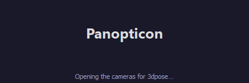

3. The window opens, and each camera's pane fills with live video. The status
   bar reads
   `Checking hardware: Record and Calibrate are available once it reports`,
   and Record and Calibrate stay grey until then. The state label may read
   `Clearing stim firmware…` while the board is flashed. Wait for it.

   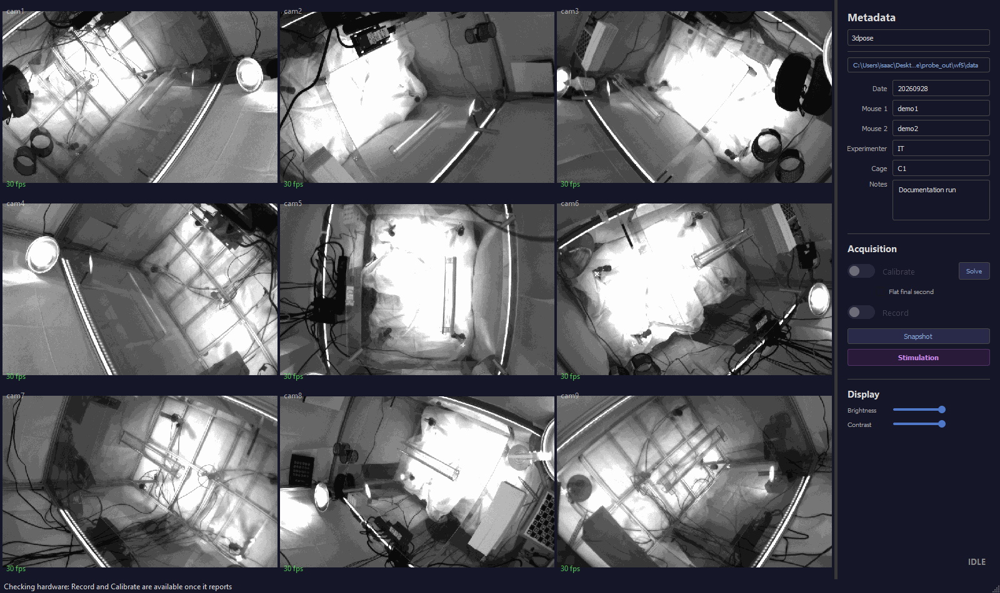

4. If a `Hardware Check` dialog appears, read it
   ([What happens at launch](#what-happens-at-launch) lists what it reports),
   then press OK. It stops nothing.

   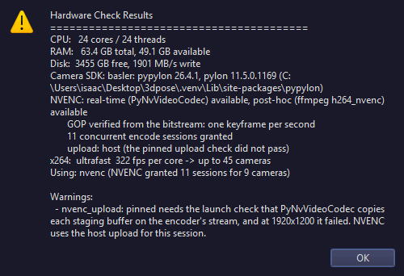

5. Check that the window looks like [A good launch](#a-good-launch).

If a `Panopticon is already running` message appears instead, Panopticon is
open already. Find its window on the taskbar and use that one.

### A good launch

When the launch has finished, the window looks like this:


Every camera has a live pane, and each pane's frame rate reads the
[idle preview rate](OVERVIEW.md#1-camera-grid). The state label at the bottom
right reads `IDLE`, and the status bar reads
`Hardware check done: encoding with <encoder>`.

If a pane is missing or black, fix that before anything else.
[TROUBLESHOOTING.md](TROUBLESHOOTING.md#opening-the-cameras) explains the messages
a camera open can show. If one pane's rate reads well below the others, see
[Frame rate](OVERVIEW.md#3-frame-rate).

### Ways to launch

Panopticon starts from any of these:

- The desktop shortcut, if `make_shortcut.ps1` has made one. It opens no
  console window. It also installs no new dependency, so after an update that
  changes `pyproject.toml`, run `uv sync` once or use `_launch.bat`
  ([INSTALLATION.md](INSTALLATION.md#updating-panopticon)).
- `_launch.bat` in the repository folder. It runs `uv run python gui.py`, which
  first installs any dependency that `pyproject.toml` has gained. Its console
  stays open if Panopticon exits with an error.
- `uv run gui.py` in a terminal in the repository folder. The log then appears
  in the terminal as it is written.

The terminal and `_launch.bat` pass options on
(`.\_launch.bat --profile <name>` in the repository folder), and the shortcut
passes none. `--profile <name>` opens that profile and
remembers it for later launches. `--force` starts a second copy of Panopticon.

Only one copy runs at a time. A second launch, or a launch while one of
Panopticon's probes runs, shows `Panopticon is already running` and exits with
status 3. Two copies would compete for the cameras, the trigger board and the
GPU encoder. Use `--force` only once you know what the other copy is doing.

### The log

Everything Panopticon prints goes to `logs\panopticon_<date>_<time>.log` in the
repository folder, one file per launch. Each line starts with the time, to the
millisecond, and the name of the thread that printed it:

```
2026-09-24 10:15:02.481 [MainThread] [acq] profile: 3dpose
```

The log also repeats each step of the splash screen on a `[startup]` line.
Near the top, the log holds a header of `[header]` lines. It describes the
computer: the Panopticon version and git commit, Python, Windows, the CPU,
RAM, the GPU and NVIDIA driver, the
[NVENC session](GLOSSARY.md#nvenc-session) cap, package versions and
the network links. It then lists every field of the profile and each open
camera. The header is written again at every profile switch and at the start
of every acquisition.

The profile's `log_level` sets how much else the log holds
([CONFIGURATION.md](CONFIGURATION.md#log_level)). The default, `verbose`, adds
the camera settings Panopticon asked for and read back, and a `[state]` line
at each step of an acquisition. If the log writer falls behind, it drops lines
and says so with `[log] N log lines dropped`.

Quote the launch log and the acquisition's `session.log`
([section 10](#10-what-the-session-leaves-on-disk)) when you report a problem.

### What happens at launch

With a profile remembered on this computer, or named with `--profile`,
Panopticon at launch:

1. Opens the profile's cameras and starts the preview. Each camera's pane
   fills with live video.
2. Checks the hardware in the background. The status bar reads
   `Checking hardware: Record and Calibrate are available once it reports`,
   and Record and Calibrate stay grey until then.
   The check measures the output drive, probes how many NVENC sessions the
   GPU driver grants, times a libx264 encode and picks the encoder. A
   `Hardware Check` dialog lists any problem it finds, for example:
   - fewer than 4 CPU cores, under 16 GiB of RAM, under 500 GiB free or under
     500 MiB/s of writing on the output drive;
   - an NVENC path that does not work, or an encoder that ignores the
     keyframe setting, which would leave recordings with one keyframe and
     hard to seek;
   - an encoder choice that will refuse the next Record;
   - a check that could not finish.

   Read the dialog, then press OK. It stops nothing. The status bar then reads
   `Hardware check done: encoding with <encoder>`. Look each finding up in
   [The hardware check](TROUBLESHOOTING.md#the-hardware-check) before you
   record. A finding that names the encoder or NVENC can mean Record will be
   refused. A low-disk finding means choosing another output folder
   ([section 3](#3-set-the-output-directory)). The example above says that the
   pinned upload check failed, and the session encodes with the host upload.
3. Puts the trigger board back to the
   [recording-only sketch](GLOSSARY.md#recording-only-sketch), which
   triggers the cameras and drives no stimulation pin. The state label reads
   `Clearing stim firmware…` while it flashes. A paradigm lives in
   the board's flash memory and survives quitting, a power cycle and an
   unplugged cable. So Panopticon reflashes the board at every launch, unless
   this computer's record says the board already carries the recording-only
   sketch. If the flash fails, a `Could not clear stim firmware` dialog says the
   board may still carry a paradigm, possibly a looping one. Open Stimulation and
   press Apply with an empty canvas before you record.
4. Opens the board's serial port and holds it until you quit. Opening the
   port resets the board. Panopticon then asks the board which sketch it
   runs, and reflashes it once if the answer is not the recording-only sketch.

Stimulation stays off until you Apply a paradigm in this launch
([section 7](#7-optional-stimulation)).

On a computer where Panopticon has not opened a profile yet, the window opens
no camera and no serial port, runs no hardware check and programs no board.
The same holds when the remembered profile, or the one `--profile` names, does
not load. A `Choose your rig's profile` dialog says why. Press OK, then choose the
profile in the dropdown at the top of the sidebar ([section 2](#2-choose-a-profile)).

If no profile loads at all, a `No rig profile` dialog appears instead, and
Record and Calibrate stay disabled. The board has not been cleared then and
may still carry a paradigm, a looping one included. Fix the profile the dialog
names, and start Panopticon again.

---

## 2. Choose a profile

If the box under Metadata, at the top of the sidebar, reads your rig's profile
name (`3dpose` on the reference rig) and every pane is live, skip to
[section 3](#3-set-the-output-directory).

A profile is one YAML file in `profiles/` that describes one rig: its cameras,
frame rates, trigger board and pins, encoder and output folder.
[CONFIGURATION.md](CONFIGURATION.md) describes every field and has templates
to start from.

1. Click the box under Metadata, at the top of the sidebar. It is a dropdown,
   and its list opens with every profile that loaded
   ([OVERVIEW.md](OVERVIEW.md#4-profile) shows it open).
2. Click your rig's profile. The state label reads `Switching cameras…` while
   Panopticon closes the cameras and opens the new profile's.
3. Wait for `IDLE`. The panes then show the new profile's cameras, as in
   [A good launch](#a-good-launch).

If your profile is not in the list, it did not load. A file that fails to load is
left out, and after the window opens a `Rig profiles` dialog names the file and
the field at fault.

Panopticon remembers the choice on this computer and opens it at the next
launch.

When the new profile names a different serial port, Panopticon sends the old
board a stop and closes its link. The new board then gets the launch sequence,
flash included. Choosing a profile on a new computer runs the same sequence on
that profile's board.

[OVERVIEW.md](OVERVIEW.md#4-profile) says when the dropdown is disabled and
when it refuses a switch.

### Camera names

Panopticon names the cameras `cam1` to `camN`. Every file name and the
calibration use these names. With `camera_serials` in the profile, `cam1` is
the first serial in that list. Without it the names follow the serial numbers
in order, so a camera missing from the set renames every camera after it. The
files keep their usual names, and the calibration then describes the wrong
cameras.

Set `camera_serials`, or at least `n_cameras`, so the open is refused instead
([CONFIGURATION.md](CONFIGURATION.md#camera_serials)):

- `Expected N cameras but M are available to open.` lists the serials it
  found.
- `Requested cameras did not enumerate: ...` names the listed cameras that are
  missing.

Power-cycle the missing camera and choose the profile again.

The open is also refused when a camera's pixel format is not Mono8, or when
its image size differs from the profile's `frame_width` and `frame_height`.
A profile with `capture_processes` above 0 opens no camera: capture in several
processes is experimental and the window does not use it
([CONFIGURATION.md](CONFIGURATION.md#capture_processes)).

For FLIR cameras, [FLIR.md](FLIR.md) covers the profile's `camera:` block, the
Spinnaker SDK and `probe_flir.py`, which tests each camera before a first
recording.

A profile with `trigger_source: external` takes its triggers from your own TTL
source. Panopticon then opens no serial port and flashes nothing, and a
recording follows [Your own trigger source](#your-own-trigger-source).

---

## 3. Set the output directory

The output button is the box that shows a folder path, under the profile box. It
shows the folder that sessions are written under. Choose the profile first,
because the folder you choose is remembered for that profile, at the next launch
and when you switch back to it. A profile you have not chosen a folder for uses
its `output_dir`.

1. Click the output button. A `Select Output Directory` dialog opens.
2. Go to the folder, click it once, and click Select Folder. The button then
   shows the new path.

Cancel in the dialog leaves the folder as it was.

Every session is written as `<output>/<date>/<mouse1>_<mouse2>/`, with a
`calibration/` folder and a `<mouse1>_<mouse2>_recording/` folder in it. Put the
output folder on your largest, fastest drive. The disk check at Record measures that
drive. The reference rig writes to the `data` folder in the repository.

---

## 4. Fill in the metadata

The session fields sit under the output button, in the sidebar's Metadata group
([OVERVIEW.md](OVERVIEW.md#metadata) shows them filled in).

1. Click Date and type the session's date as `YYYYMMDD`, or leave today's.
2. Type the animals' IDs in Mouse 1 and Mouse 2. For one animal, leave Mouse 2
   blank, and the folder is named `<mouse1>_m2`.
3. Replace Experimenter with your initials, and check Cage and Notes. They hold
   what was typed last on this computer.

| Field | Default | Used for |
|---|---|---|
| Date | today, as `YYYYMMDD` | folder and file names |
| Mouse 1 | blank, which becomes `m1` | folder and file names |
| Mouse 2 | blank, which becomes `m2` | folder and file names |
| Experimenter, Cage, Notes | what you typed last, else the profile's `metadata_defaults` | `session_metadata.json` |

With Date `20260904` and both mice blank, the session folder is
`<output>/20260904/m1_m2/`, and cam1's recording is
`20260904-m1_m2-cam1-recording.mp4`.

The reference rig's profile fills in Experimenter `IT`. Whatever a field holds
when an acquisition ends goes into `session_metadata.json`, so change a value
that is not yours. A rig's owner sets the defaults in the profile's
`metadata_defaults` ([CONFIGURATION.md](CONFIGURATION.md#metadata_defaults)).
Assay and cohort have no field: the profile's `metadata_defaults` writes them
into `session_metadata.json` as they are (the reference rig's assay is
`open_field`). Switching profiles fills in only the fields you have not typed
into, and what you typed, except the date, is back at the next launch.

Fill in Date and the mice before you calibrate. Solve looks for the
calibration in the folder the fields name when you press it, so a changed
mouse ID sends it to another folder. Until you type into Date, it moves to the
new day when you press Calibrate or Record. A session started after midnight
is then filed under the day it started.

A Date that is not a `YYYYMMDD` calendar date is refused with a
`Check the session details` dialog. So is a value that cannot be part of a
folder name, such as one with a slash, `..`, a reserved Windows name or a
trailing dot or space.

Snapshot saves into `<session>/snapshots/<date>_<HHMMSS>/`.
[OVERVIEW.md](OVERVIEW.md#10-snapshot) says what a snapshot shows.

---

## 5. Calibrate

A calibration records a [ChArUco board](GLOSSARY.md#charuco-board) carried
through the arena. The solve ([section 6](#6-solve)) turns it into each
camera's lens model and the cameras' positions relative to each other.
Calibrate with no animal in the arena.

### Check the board first

Count the squares on your calibration board and measure one with a ruler
before you calibrate. The reference rig's board is 8 squares by 8, each 15 mm
across. If your count or size differs, stop and ask the rig's owner: the
profile describes another board.

The coverage display and the solve read the board's description from the file
the profile's `board_config` names. On the reference rig that is
`configs/boards/charuco_8x8_15mm.yaml`: 8 × 8 squares of 15.0 mm, 10.0 mm
markers from the 4×4 dictionary of 1000, printed in the layout OpenCV used
before 4.6 (`board_legacy: true`).
[CONFIGURATION.md](CONFIGURATION.md#board_config) describes the board file.

### Start

1. Check that the state label reads `IDLE`, and that Date, Mouse 1 and Mouse 2
   name this session.
2. On the reference rig, tick Flat final second, the small box left of those
   words under Calibrate, before you start. A tick appears in the box. It asks
   Solve to put the floor at Z = 0, and the take then ends with the board lying
   still on the floor ([Put the floor at Z = 0](#put-the-floor-at-z--0)).
3. Flip Calibrate on. The state label reads `Checking capacity…` and
   `Starting...` for a moment, then `CALIBRATING`. Each pane's frame rate reads
   `calibration_frame_rate` (30 fps on the reference rig), and the coverage
   display opens in the sidebar, under Stimulation. On the reference rig that
   is also the idle rate, so check the state label and the coverage display to
   see that the calibration started.

   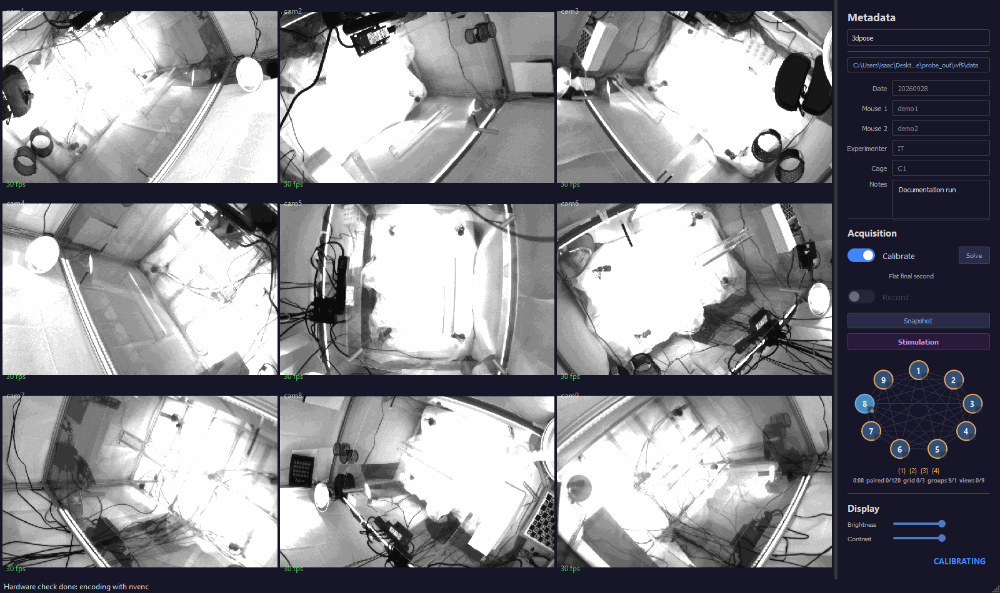

   The coverage display has one numbered node per camera. At the start of a
   take its caption counts nothing yet, as in the picture. Each count reads
   have/need, for the camera furthest behind. `groups 9/1` means the cameras
   still form nine separate groups, which must join into one.
4. If `Overwrite the existing data?` appears, the `calibration/` folder already
   holds a take. Yes deletes it
   ([If the folder already holds data](#if-the-folder-already-holds-data)).
   Answer Yes to replace a take you do not want, and Cancel to keep it.
5. If the state label reads `Flashing recording-only firmware…` first, wait.
   The calibration starts when the flash ends
   ([When the board resets](#when-the-board-resets)).
6. If no coverage display appears, the calibration still records.
   [OVERVIEW.md](OVERVIEW.md#12-coverage-display) lists what hides it.
7. If a dialog refuses the start, it comes from one of the
   [checks before the start](#the-checks-before-the-start).

A calibration is an acquisition, so the checks under [Record](#8-record) run
for it as well. A calibration always runs under the recording-only sketch. If a
paradigm is on the board, Panopticon first flashes the recording-only sketch
(`Flashing recording-only firmware…`). A calibration therefore
never runs stimulation while you stand in the arena.

The cameras switch to triggered mode at `calibration_frame_rate`. The profile's
`calibration_exposure_us` and `calibration_gain_db` replace the recording
exposure and gain for this acquisition only. An exposure of 0 or a gain of -1
keeps the recording value, and the reference rig keeps its recording gain this
way. Panopticon caps the exposure at 90% of the exposure ceiling at the
calibration rate. When it does, the camera's exposure line in the log says
`CLAMPED` ([CONFIGURATION.md](CONFIGURATION.md#calibration_exposure_us)). The
next recording uses the exposure from the camera settings again. The reference
rig calibrates with a longer exposure than it records with, so its panes look
brighter while it calibrates.

Move the board slowly and pause at each pose. A long exposure blurs a moving
board, and a blurred board yields no corners.

### If the board does not match its file

The coverage display counts board markers only, so it catches only some
mismatches between the printed board and its file:

- A board printed from another dictionary than `marker_bits` and `dict_size`
  name can give no detections at all. The coverage display then stays dark.
- A wrong square count or layout (`board_x`, `board_y`, `board_legacy`) still
  finds every marker. The display lights up and can reach READY, and the solve
  then finds few or no board corners.
- A wrong `square_length` gives a solve that looks good and a 3D
  reconstruction at the wrong scale, because every reprojection error is the
  same at any scale.

### Work towards READY

The coverage display in the sidebar shows what the cameras have seen. Drag
the divider on the sidebar's left edge to widen it, and the graph grows with
it ([OVERVIEW.md](OVERVIEW.md#the-sidebars-width)).
[OVERVIEW.md](OVERVIEW.md#the-calibration-coverage-hud) explains each mark and
what READY needs, and gives the caption's format.

The figures come from a real calibration on the nine-camera reference rig. It
reached READY 4 minutes 19 seconds into the take.

| | |
|---|---|
| 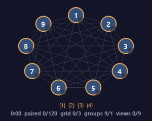 | 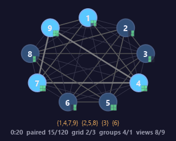 |
| 1. The start. Every camera is its own group. Hold the board where at least two cameras see it. | 2. At 0:20 the caption reads `groups 4/1`, and the orange line lists the groups. Carry the board where their views overlap. |
| 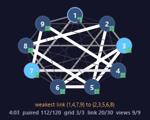 | 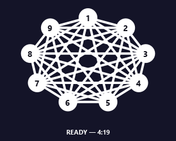 |
| 3. At 4:03 there is one group, but the link is 20 of 30. Cameras 3 and 7, one on each side, see the board. | 4. READY at 4:19. Flip Calibrate off, or keep going to add frames. |

A tick is one pass of the board detector over every camera's latest frame, 4
to 5 a second on the reference rig. A node glows cyan while its camera sees
the board. The orange line lists at most 4 groups, so at the start it names
only 4 of the cameras.

One tick later, at 4:04, cameras 3 and 7 see the board together again:

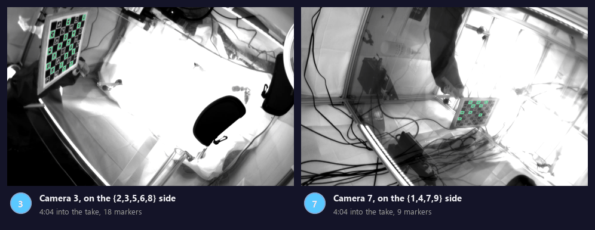

Each camera sees the board small and at a slant, but both see it at the same
moment. It is the pair's 20th shared tick, the reference rig's
`calibration_min_edge`, so the pair now joins the graph and the link jumps from
20 to 30. READY came 16 s later, once camera 1 had 120 paired ticks.

The small 2 x 2 badge on each node is that camera's view cut into quarters. A
quarter lights green once the centre of the board's markers has been in it.
The centre is the mean of the marker corners, the red dot below. On the
reference rig READY needs the centre in at least 3 of the 4 quarters of every
camera's view, and `grid` gives the count of the camera with the fewest.
Camera 5 of the same take shows one view in each quarter:

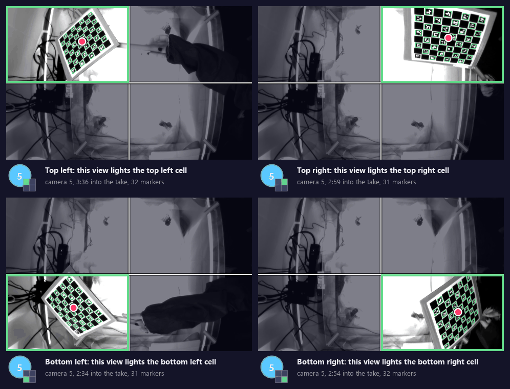

The whole board need not fit inside the quarter. Only its centre has to cross
into it, while the camera still sees at least 5 of its markers. Near a corner
of the view part of the board may leave the image, and the view still counts.

A profile can also set view tests, as the reference rig's does, and the caption
then shows `views`. They count only the views a camera shares with another
camera. `closer` wants the board large in the view, `tilt` wants it turned
away from square-on, and `edges` wants marker corners out near the edges of
the view. Camera 5 again:

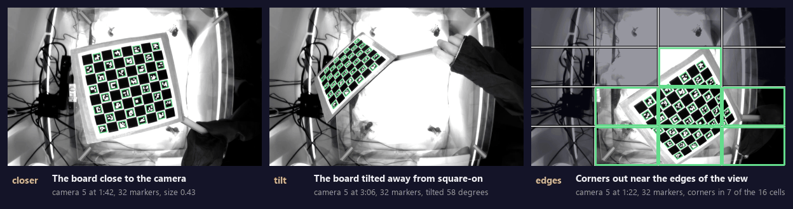

The grid in the last view is the one `edges` counts, 4 x 4 cells. The corners
of all of a camera's shared views together must reach enough of its 16 cells.

When a count stops climbing, find the one that is stuck:

- `grid` below its target: carry the board into the corners of that camera's
  view.
- `groups` above `1/1`: the orange line above the caption lists the groups,
  for example `{1,2,3} {4,5}`. Show the board to one camera of each group at
  the same moment.
- `link` below its floor: the orange line names the two sides of the weakest
  link. Hold the board where cameras from both sides see it at once.
- `views` short: the orange line names the cameras. For `closer`, bring the
  board near that camera. For `tilt`, tilt the board away from square-on to
  it. For `edges`, carry the board to the edges and corners of its view.
- A node that never lights: that camera does not detect the board. Check its
  view, its focus and the board file.
- `paired` slow for one camera: hold the board where that camera and a
  neighbour both see it. For two cameras that face each other, hold it edge-on
  between them.

You can stop before READY appears. The recording is still a valid calibration,
and the solve reports how many cameras it could place.

If the board is too dark to detect, add infrared light first, then raise
`calibration_exposure_us`. The
[brightness and contrast sliders](OVERVIEW.md#13-and-14-brightness-and-contrast)
do not help.

### Put the floor at Z = 0

Tick Flat final second, under Calibrate, to give the calibration a floor. A
tick appears in the box when it is on. Tick it when the board can lie flat on
the arena floor where two or more cameras see it, and leave it off where it
cannot. On the reference rig, tick it unless the rig's owner says otherwise.
The box is read when the take is saved, so a tick at any time before you flip
Calibrate off counts for that take. The box is remembered for each profile.

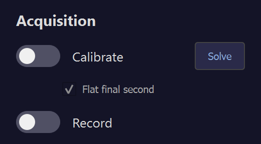

End the take like this:

1. Lay the board flat on the arena floor, printed side up, where two or more
   cameras see it.
2. Let go, and step out of the cameras' view without touching the board.
3. Flip Calibrate off.

The board must not move from step 1 to step 3. Solve reads the last 4 s of each
camera's video and looks for the board lying still at the end. A camera that
cannot see the board then only drops out of the floor step, and the others
still give the floor.

Solve then puts Z = 0 on the board, with Z pointing up at the cameras. The
origin is at the board's first corner, and it sets only where X and Y start.
LUC3D, the 3D labelling tool, draws its floor grid on Z = 0, so the grid then
lies on the arena floor. Each camera that saw the lying board places it on its
own. When one places it more than 2 degrees or 10 mm from where the best view
does, Solve warns, because their poses in `calibration.toml` disagree by as
much.

When the board was still moving at the end, or no camera saw it, Solve skips the
step and says why. The calibration then keeps the reference camera's frame.
Both messages go to the log and the calibration's `session.log`, and a skip
ends the status bar's message with `floor skipped` ([section 6](#6-solve)).
Neither opens a dialog. Only the findings that raise the
`Recalibration recommended` dialog call for a new take
([Which cameras made it into the solve](#which-cameras-made-it-into-the-solve)).
The floor comes only from the end of a take, so to get one after a skip,
calibrate again and end with the board lying still.

### Finish

1. Flip Calibrate off. The state label reads `Finishing…` while the cameras
   stop and the capture is saved ([how long](OVERVIEW.md#16-state)).
   Calibrate, Record, Solve and Snapshot stay grey until it ends.

   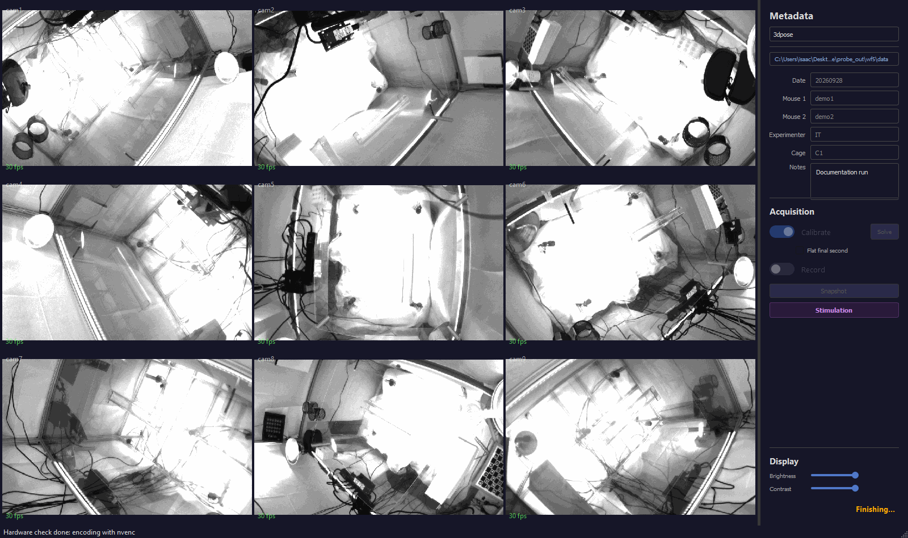

   The Calibrate toggle stays drawn on, greyed, until the files are written.
   Do not flip it again.

2. Wait for `IDLE`. The state label may read `ENCODING` on the way, with
   `Encoding k/N` in the sidebar. The status bar then reads
   `Calibration encoded: F frames, R fps`, and each pane is back at the idle
   preview rate.

   

   [Check the session](#check-the-session) says how to read the frame count.

Panopticon writes `codet_frames.json` beside the videos for the solve
([section 6](#6-solve)) when two or more cameras saw the board together. The
videos are then finalised as for a recording ([section 9](#9-after-you-stop)).

### Keep the cameras still

A calibration describes the cameras as they were while the board was recorded.
From the calibration to the last recording of the session, do not move,
re-aim, refocus or re-mount any camera. If one is bumped, calibrate again
before you record. A moved camera changes no frame count and raises no
warning, and its 3D output is wrong.

---

## 6. Solve

The [solve](GLOSSARY.md#solve) works out each camera's lens and position from
the calibration you just took.

1. Wait for the state label to read `IDLE`. Check that Date, Mouse 1 and Mouse 2
   still name the session you calibrated, because Solve reads the calibration
   from the folder those fields name.
2. Press Solve. The [state label](OVERVIEW.md#16-state) turns purple and shows
   the same word as a calibration. No camera captures while the solve runs, and
   nothing is recorded. Calibrate, Record and Solve turn grey. The status bar
   reads `Solving calibration...`, then the solve's progress, such as
   `Using co-detection hints (...)`.

   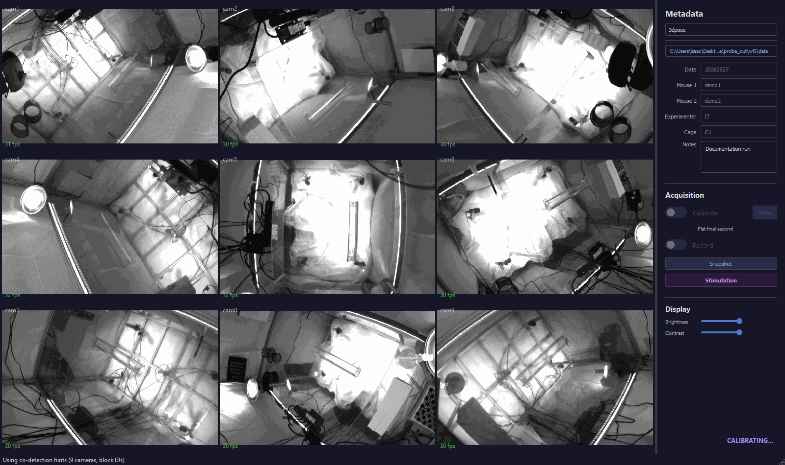

   This solve and the next picture ran on an earlier calibration of the same
   rig, so Date reads 20260927.

3. Wait. On the reference rig a solve of nine cameras took about a minute and
   a half. Solve gives up after 30 minutes.
   [OVERVIEW.md](OVERVIEW.md#controls-that-hide-and-controls-that-disable) lists
   the controls that stay disabled until it ends.
4. When it ends, the state label reads `IDLE` and the status bar reads
   `Solved N of M cameras — copied to <path>`. N equal to M means every camera
   is placed. A lower N, or a `Recalibration recommended` dialog, calls for a new
   take ([Which cameras made it into the solve](#which-cameras-made-it-into-the-solve)).

   

   In the picture every camera is placed, and the status bar ends with the
   count of notes the solve wrote to `session.log`. The table below reads each
   ending.
5. Open `reprojection_error_histogram.png` in the session's `calibration/`
   folder. Every bar should be green
   ([Reading the pairwise calibration plot](#reading-the-pairwise-calibration-plot)).

Solve runs `1_calibrate.py` with Panopticon's own Python on the calibration of
the session the fields name, using the profile's `board_config`. The log gets
the same progress as the status bar.

`codet_frames.json` lists the triggers at which two or more cameras saw the
board. When it matches the videos, the solve decodes only those frames.
Otherwise it scans the videos, looking at every third frame until it
finds the board (`--skip 3`). A hint file it cannot use, for example one
written for other videos, raises a warning.

The solve writes into `calibration/`:

- `calibration.toml`: per camera a size, a camera matrix, distortion, a
  rotation and a translation, in aniposelib's layout. A `[metadata]` block
  holds the solve's quality figures. Match cameras by each section's `name`.
- `calibration_report.json`: the same figures, for the window.
- `reprojection_error_histogram.png`: the pairwise quality plot. Nothing
  opens it for you.

Solve then copies `calibration.toml` into `<mouse1>_<mouse2>_recording/`, so each
recording carries the calibration it was made with. If that copy exists and
differs, Panopticon asks `Replace the recording's calibration?`,
with No as the default. Answer Yes when you have recalibrated and not recorded
yet. Answer No when a recording in that folder was made with the calibration
already there. The new solve then stays in `calibration/`.

| Status bar | Meaning |
|---|---|
| `Solved N of M cameras — copied to <path>` | Copied into `<mouse1>_<mouse2>_recording/`. N below M means the solve dropped cameras |
| `Solved N of M cameras — kept in calibration/, recording's copy left unchanged` | You answered No |
| `...; unreliable: camN` | That camera's lens fit or position in `calibration.toml` is wrong. The warnings say why and what to film |
| `...; floor from camN, camM` | The floor step set Z = 0 from those cameras' views |
| `...; floor skipped` | The board was still moving or not seen at the end. The warnings say which |
| `Calibration solved (no toml found to copy)` | Treat it as a failure and read the log |
| `... — recalibration recommended` | A `Recalibration recommended` dialog says why. Record the calibration again |
| `... (N note(s) in session.log)` | The calibration is sound. Its notes are in `calibration/session.log` and the log |

### Which cameras made it into the solve

The solve drops a camera when:

- it has no calibration video it can read;
- it has fewer than 5 detection frames;
- its lens model fails, which needs 20 or more frames with 6 or more corners
  (`intrinsics FAILED`);
- it is not connected to the largest group of cameras that saw the board
  together.

The solve also skips single views whose corners fit no homography, such as a
view of one row of the board, and says how many it skipped per camera.

A solve that drops cameras still succeeds. The `Recalibration recommended`
dialog then says `PARTIAL: solved N of M cameras.` and names each dropped
camera with its reason. The log then names the cameras that went in:

```
Calibration complete (PARTIAL).
  ...\calibration\calibration.toml
  REPORT_PATH=...\calibration\calibration_report.json
  Cameras: cam1 cam2 cam3 cam5 cam6
```

A dropped camera adds nothing to 3D. Record the calibration again, holding
the board where that camera and a neighbour both see it.

The solve fails, with a `Calibration Failed` dialog, when too few cameras are
left to place: fewer than two with detections or lens models, no pair that saw
the board together, or fewer than two connected. It also fails with a board
file it cannot use. Before any solve runs, a missing calibration folder or
missing videos give a `No Data` dialog, and a missing board file a
`Missing Board Config` dialog.

The `Recalibration recommended` dialog appears only when the calibration
should be recorded again:

- a camera was dropped;
- a camera is unreliable, from a poor lens fit or a poor pair on the chain
  that places it;
- another acquisition of the session records a different serial under a
  camera name, because the calibration then describes other cameras.

Other warnings leave every camera's pose sound. They go to
`calibration/session.log` and the log, without a dialog:

- a pair whose stereo error is poor but that places no camera, or that
  shares fewer than 10 frames;
- a camera with fewer than 30 detection frames;
- a floor step that was skipped.

### Reading the pairwise calibration plot

`reprojection_error_histogram.png` is a bar chart titled
`Pairwise calibration quality`, with one bar per camera pair. Each bar is the
pair's [stereo RMS](GLOSSARY.md#stereo-rms) in pixels. It measures how far
the corners seen by the two cameras land from where that pair's geometry puts
them. The fit uses up to 30 shared views chosen to span different poses. The
number belongs to the pair, before the pairs are chained into one coordinate
frame.

| Colour | Stereo RMS | Meaning |
|---|---|---|
| Green | below 1.5 px | Good |
| Amber | 1.5 to 3 px | Worth a look |
| Red | 3 px and above | Poor, and the solve warns about it |

A dashed line marks 1.5 px and a dotted line 3 px. Read the pair names first,
then the heights:

- Every bad bar includes the same camera and the other pairs are good: that
  camera is the fault. Check its focus, and its mount for anything that moved
  since the calibration, then calibrate again.
- One bad pair whose cameras are good with everyone else: the two cameras
  share too few views, or only oblique ones. Calibrate again, showing the
  board to both at once.
- A missing bar: that pair never shared 5 views, so there is nothing to plot.
  Count the bars against the pairs you expect.

The plot cannot show a wrong `square_length`, which scales every 3D
coordinate and leaves every bar the same. A dropped camera has no bars at all.
The chained solve has no bundle adjustment, so small errors add up along a
long chain of pairs.

### Solving by hand

From the repository folder:

```
uv run python 1_calibrate.py <session_dir> --board-config configs/boards/<your_board>.yaml
```

`<session_dir>` is the folder that holds `calibration/`. Pass the board file
your profile names. Add `--excluded-views cam4` to leave a camera out, or
`--skip 1` to scan every frame. `--skip` counts only when the solve does not
use `codet_frames.json`, so move that file aside first. A solve by hand writes
into `calibration/` and copies nothing into `<mouse1>_<mouse2>_recording/`, so
copy `calibration.toml` yourself.

The solve fits each lens on at most 120 frames spread through the take, and
each pair on at most 30, so that it finishes in minutes. For the best calibration, solve
from full videos with a package that does bundle adjustment. sleap-anipose and
aniposelib both read the `calibration.toml` this writes.

---

## 7. Optional: stimulation

Skip this section when the session has no optogenetic stimulation.

> [!WARNING]
> Panopticon's responsibility ends at the trigger board's TTL outputs. What you
> connect to a stimulation pin, and making that device safe, is your lab's
> responsibility, for a laser, an LED or any other device. Every pin of the
> board floats for a moment whenever the board resets or is flashed.
> `stim_safe_pins` holds the listed pins low from the first line of the sketch.
> A stimulation paradigm reaches the board only through Apply, or a Test of a
> changed canvas.

[When the board resets](#when-the-board-resets) lists every case. A floating
pin is driven neither LOW nor HIGH, so a device wired to it may read it as on.
Panopticon cannot know what is wired to a pin, so the device's own wiring
decides what it does while its input floats. Agree with whoever is in charge of
the device how it stays safe at those moments.

Set up stimulation after calibrating and before recording, so that Record
starts without a flash. Open the editor with the Stimulation button.
[OVERVIEW.md](OVERVIEW.md#the-stimulation-editor) names each of its controls.


The picture shows a two-block loop on pin 53. The arrow back from the second
block to the first runs along the same line as the forward arrow, through the
second block. The red dot marks the block the loop starts from. The faded block
is one that does not start a chain, and it still runs when an arrow reaches it
([OVERVIEW.md](OVERVIEW.md#1-canvas) explains each mark).

### Pins

The trigger board's numbered sockets are its pins. A digital output pin is
either LOW, at 0 V, or HIGH, at the board's logic voltage (5 V on the Mega
2560), which a TTL input reads as off or on. The number you type into Pin is
the number printed beside the socket. Nothing in the software knows what is
wired to a pin, so a wrong number drives the wrong device. On the reference rig
pin 53 is the stimulation pin. Your rig's stimulation pins should be listed in
its profile's `stim_safe_pins`. Open the profile in Notepad to read them
([INSTALLATION.md step 7](INSTALLATION.md#step-7--write-the-rig-profile)). If
that list is empty, or you are unsure, ask the rig's owner before you use a
pin.

A stimulation block cannot use a camera trigger pin, one of the profile's
`trigger_pins` (`[2, 4, 6, 8, 10, 12]` on the reference rig). Extra edges on a
trigger line give one camera extra frames, so its block IDs stop matching the
other cameras'. Every alignment step would then pair the wrong frames. The
editor refuses such a block:

```
Pin 2 cannot carry a stim waveform: camera trigger line — extra edges on one
camera would break cross-camera block-ID alignment.
```

Pins 0 and 1 carry the board's serial link and are refused too, as is a pin
above the profile's [`board_max_pin`](CONFIGURATION.md#board_max_pin), the
board's highest.

### Build a paradigm

[OVERVIEW.md](OVERVIEW.md#the-stimulation-editor) says what blocks and arrows
mean, and describes each field and button and the rules a graph must follow.

1. Type Pin, Freq (Hz), PW (ms) and Dur (s), and press Create Block. PW is the
   pulse width, how long each pulse stays HIGH, and Dur is how long the block
   runs. The block appears on the canvas.
2. To connect two blocks, drag from one of the dots on the first block's edge
   to a dot on the next block. An arrow joins them.
3. For a pause, add a block at [0 Hz](OVERVIEW.md#4-freq-hz). Starting and
   Ending apply to the selected block, so click a block on the canvas first,
   then tick the box. For a loop, tick [Starting](OVERVIEW.md#7-starting) on one
   of its blocks. To stop the recording when a block finishes, tick
   [Ending](OVERVIEW.md#8-ending) on it.
4. Read the preview's caption before you press Apply to Arduino (Apply, from
   here on). A pulse as long as its period
   or longer holds the pin HIGH for the whole block
   ([the waveform preview](OVERVIEW.md#the-waveform-preview)).
5. Save the graph if you will use it again
   ([Load and Save](OVERVIEW.md#11-apply-to-arduino)).

### A worked paradigm

This paradigm gives a 5-minute baseline, 30 s of 20 Hz stimulation and a
5-minute post-period, and stops the recording at the end. It is three blocks
on pin 53, joined in one chain. Put your own stimulation pin in place of 53.

1. 0 Hz, 0 ms, 300 s: the baseline. The sequence starts with the first
   trigger, so a baseline is a block at 0 Hz.
2. 20 Hz, 10 ms, 30 s: 20 pulses a second, 10 ms each, at 20% duty.
3. 0 Hz, 0 ms, 300 s, with Ending ticked.

Join block 1 to block 2, and block 2 to block 3, with arrows. Leave Starting
unticked: block 1 has no incoming arrow, so the chain starts there. The status
line then reads `Recording will stop 630 s after start.`

Test drives the pin for real, so whatever is wired to it runs, a laser
included. A Test of a canvas that changed since the last upload flashes the
board first, and every pin floats during the flash
([When the board resets](#when-the-board-resets)). Then:

1. Press [Test](OVERVIEW.md#10-test). The editor's status line counts down the
   test, and a sync LED wired to the pin, if you have one, follows the
   paradigm. The test runs the whole paradigm, 630 s here, so press Stop Test
   once you have seen it start. A copy with short baselines, saved under
   another name, is quicker to test.
2. Press Apply and wait for
   `Upload successful — press Record to run paradigm.`
3. Close the editor or leave it open, and press Record ([section 8](#8-record)).

### Apply, then Record

The paradigm is compiled into the board's sketch. Nothing you draw reaches the
board until Apply compiles and uploads it. Record then
sends its usual start command, and the board runs the paradigm from the first
trigger on its own clock.

Record refuses to start when the canvas and the board would disagree:

| Dialog | Cause |
|---|---|
| `Apply the stimulation paradigm first` | The canvas holds a paradigm that was never Applied in this launch |
| `Apply the edited paradigm first` | The canvas changed after the last Apply |
| `Apply the empty canvas first` | The canvas is empty, but the board would still run the paradigm Applied earlier |
| `Cannot record with this stim workflow` | A failed Apply, an upload in progress, or a graph problem the editor shows in red, such as a forbidden pin |
| `Stop the stimulation test first` | A Test is running |

The last two refuse Calibrate as well. To reuse a saved paradigm in a later
launch, Load it and press Apply.

### When the board resets

The profile's `stim_safe_pins` (`[53]` on the reference rig) are driven LOW as
the first action of every sketch Panopticon builds, before the board waits for
the host. Every pin a paradigm uses joins that list. While the board resets
and waits in its bootloader, no sketch runs and every pin floats. That happens
whenever the serial port is opened or the board is flashed:

- at launch, and when you choose a profile on a new computer or one on another
  port;
- at every Apply;
- at a Test that uploads a changed canvas first;
- before an acquisition that needs the other sketch. Panopticon holds two
  sketches per launch, recording-only and recording plus stimulation, and
  swaps them itself. After an Apply, a calibration flashes the recording-only
  sketch (`Flashing recording-only firmware…`). The next recording flashes the
  paradigm back (`Flashing recording + stimulation firmware…`). After a failed
  launch flash, the first Calibrate or Record can flash the recording-only
  sketch too;
- at the first Calibrate or Record after a switch between two profiles on the
  same port whose `trigger_pins` or `stim_safe_pins` differ. The switch itself
  flashes nothing, and until that start the board keeps the previous profile's
  boot guard;
- at the first Calibrate, Record or Test after the port could not be opened.
  At launch the log then says `will retry on first use`. After an Apply the
  editor's status line says that Record reopens the port;
- at a Calibrate, Record or Test start that the board does not acknowledge at
  first. Panopticon reopens the port once to reset the board, and the log says
  `[teensy] no ack — reopening port to force a board reset`.

A failed flash refuses the acquisition, because the board's contents are then
unknown. Panopticon refuses to close during a flash, because an interrupted
upload can leave the board without its safe-pins guard, and then the
stimulation pins float at the next power-up. For the same reason, do not end Panopticon from Task
Manager during a flash: while the sidebar reads `Clearing stim firmware…` or a
`Flashing …` state, or the editor reads `Compiling + uploading… (~30 s)`.

### After a stimulated recording

A recording with blocks on the canvas also writes, beside the videos:

- `stim_paradigm.json`: the paradigm as it stood when the recording started,
  the sketch's hash and `matches_uploaded_firmware`. Read that field first.
  `true` means the file describes the sketch the board ran. A recording made
  in this window always reads `true`, because Record refuses to start
  otherwise. A folder written by an earlier version of Panopticon can read
  `false` (the canvas differed from the sketch) or `null` (nothing was
  uploaded), and its file then does not describe what the board ran.
- `stim_paradigm.ino`: the sketch's source.
- `stim_trace.csv`: one row per trigger, with the stimulus the paradigm should
  have delivered at that trigger ([section 10](#stim_tracecsv)).

`stim_trace.csv` is computed from block IDs, as `t = (blockid - 1) / fps`. It
is a model: it cannot know what the device on the pin did. For evidence that
the device fired, put a light that follows it, such as a sync LED, in a
camera's view. At 100 fps with a 3 ms exposure a camera resolves when a train
starts and stops, and a 20 Hz train aliases against the frame rate.
Pulse-level evidence needs a photodiode on a spare board input.

---

## 8. Record

1. Put the animals in the arena and close it.
2. If the session uses a paradigm, check that it is Applied
   ([Apply, then Record](#apply-then-record)). While a paradigm is Applied, a
   Record that follows a calibration flashes the board first, and every pin
   floats for a moment ([stimulation warning](#7-optional-stimulation)).
3. Flip Record on. The state label reads `Checking capacity…`.
4. If `Overwrite the existing data?` appears, read
   [If the folder already holds data](#if-the-folder-already-holds-data) before
   you answer. If a `Proceed?` dialog asks `Start anyway?`, read its reason
   ([Capacity](#capacity)).
5. The state label reads `Starting...`, then `RECORDING`. The Record toggle turns
   red and Calibrate turns grey. Each pane's frame rate reads the trigger rate,
   100 fps on the reference rig, and the status bar starts with `Capture healthy`.

   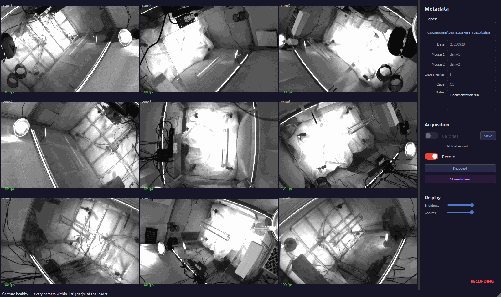

6. If a dialog refuses the start instead,
   [The checks before the start](#the-checks-before-the-start) says which check
   it came from. Nothing has been recorded.
7. Watch the status bar while it records ([While it records](#while-it-records)).
   Flip Record off to stop ([Stopping](#stopping)).

### If the folder already holds data

When the target `<mouse1>_<mouse2>_recording/` or `calibration/` folder holds a
non-empty video,
`raw.bin`, `stream.h264`, `blockids.npy`, `frametimes.npy`, `alignment.npz` or
`stim_paradigm.json`, Panopticon asks `Overwrite the existing data?`. Cancel is
the default and leaves everything as it was.

> [!WARNING]
> Yes deletes that folder, all of it except `calibration.toml`, once Panopticon
> holds the trigger board's serial port. A start refused after that point,
> such as a camera that does not arm or a board that does not acknowledge,
> has already deleted the old data, and nothing brings it back. To keep an
> earlier take, change Date, Mouse 1 or Mouse 2 first, or copy the folder
> elsewhere.

Panopticon deletes the whole folder so that no file of the old take sits
beside the new one. A camera that recorded nothing would otherwise keep the
old take's video and block IDs under the same names, and the alignment would
mix two takes. `calibration.toml` stays because Solve copied it there for the
session. In `calibration/` that means the previous solve's `calibration.toml`
stays until the next Solve replaces it.

The prompt concerns the acquisition folder only. The session folder, its
`snapshots/` and the other acquisition's folder stay as they are.

With `trigger_source: external`, the old folder is moved aside into a hidden
folder beside it, and deleted only when the first trigger arrives. A start
that ends before then puts it back.

### While it records

The state label reads `RECORDING`. Each pane's frame rate should read
the trigger rate, 100 fps on the reference rig. One pane at about half the
rate usually means that camera's exposure is over the ceiling
([CONFIGURATION.md](CONFIGURATION.md#trigger_rate_limit)).

With real-time kick-out (`realtime_kick: true`, the default), Panopticon
drops every trigger that some camera missed while it records, so every video
holds the same triggers. The status bar reports
[capture health](OVERVIEW.md#17-status-bar). In kick-out it
counts how many triggers the slowest camera is behind the fastest, against a
cap of `kick_max_lag` (480 on the reference rig).

| Status bar | Meaning |
|---|---|
| `Capture healthy — every camera within N trigger(s) of the leader` | Every camera is within a quarter of the cap |
| `CAPTURE FALLING BEHIND: camN is N triggers behind the leader (cap C). Close other applications.` | Within three quarters of the cap. Nothing is lost yet |
| `camN IS N TRIGGERS BEHIND THE LEADER (cap C): frames every camera captured are being dropped. Stop and investigate.` | Three quarters of the cap or more. At the cap, triggers are dropped from every camera. Stop, and look the message up in TROUBLESHOOTING.md |
| `... RETIRED: camN` | That camera was [retired](GLOSSARY.md#retirement), and the others stay aligned |
| `EVERY CAMERA IS RETIRED: nothing is being recorded. Stop the recording.` | Stop now |

With kick-out off, the status bar reports how late the slowest camera's frames
arrive. It reads `Capture healthy — keeping up with the trigger (max lag N ms)`
below 0.25 s, `CAPTURE FALLING BEHIND: camN is S s behind real time and growing.`
below 1 s, and `CAPTURE S s BEHIND REAL TIME (camN).` beyond that.

When a camera stops delivering, the status bar reads:

- `NO FRAMES from camN for S s`: one camera.
- `NO FRAMES FROM ANY CAMERA for S s: the trigger board may have stopped.`,
  with a `No frames from any camera` dialog. Check the board and its USB cable.
  A board without power leaves its stimulation pins undriven.

A camera near its shutdown temperature puts `CAMERA TEMPERATURE: camN T C ...`
at the start of the status bar. The alert fires `thermal_warn_margin_c` below
the shutdown temperature the camera reports (at 79 °C on the reference rig's
cameras, which shut down at 81 °C), and whenever a camera reports its own
over-temperature state.
[CONFIGURATION.md](CONFIGURATION.md#thermal_warn_margin_c) says how a camera that
reports no shutdown temperature is judged. The log then says once how it is
judged (`[acq] thermal watch: camN reports no shutdown temperature ...`), or
that it cannot be watched
(`[acq] thermal watch: camN reports neither a shutdown temperature nor a temperature status ...`).

When the alert appears, stop the recording at a point that suits the
experiment, and let the cameras cool before the next take. A camera that
reaches its shutdown temperature stops sending frames.

The warning reaches `WARNINGS.txt` when the recording lost frames, and always
when a camera reached its shutdown point. `camera_thermals` in
`session_metadata.json` records each camera's temperatures. Read `temp_max_c`
there, because the current temperature falls as soon as the load comes off.

### Stopping

Flip Record off, or let a block marked Ending flip it. The state label then names
each step of [section 9](#9-after-you-stop). Panopticon sends the
board a stop and keeps the serial port open, so the next recording does not
reset the board. If the board does not confirm the stop, a
`Trigger board did not confirm the stop` dialog appears. The board may still
be triggering, and a looping paradigm may still drive its pin. Power-cycle the
board: unplug its USB cable, and its power supply if it has one, wait 5 s, and
plug it back in.

### The checks before the start

When you flip Record on, Panopticon runs these checks in order, and each one can
refuse the start before anything is recorded:

1. The stimulation editor: a Test running, a failed Apply, or a canvas the
   board does not carry ([section 7](#apply-then-record)).
2. The session fields ([section 4](#4-fill-in-the-metadata)).
3. The image size. The profile's `frame_width` and `frame_height` must match
   the cameras
   (`The profile records WxH but the cameras are configured for WxH`).
4. Capacity, for the open cameras at this acquisition's frame rate
   ([Capacity](#capacity)).
5. The board's sketch. When the board does not carry the sketch this
   recording needs, Panopticon flashes it first
   ([section 7](#when-the-board-resets)).
6. Data already in the folder
   ([If the folder already holds data](#if-the-folder-already-holds-data)).
7. The serial port. `Could not open the trigger board` means another program
   holds the port, such as the Arduino Serial Monitor. Nothing has been
   deleted at this point.
8. The cameras switch to trigger mode with the exposure and gain from their
   camera settings, so a calibration exposure never carries into a recording.
   A camera that cannot record at the frame rate refuses the start here, as a
   FLIR camera on a slow link does ([FLIR.md](FLIR.md#when-something-refuses)).
   Every camera must fill its frame ring and arm within 30 s.
9. A frame that reached any camera before the board started refuses the start
   (`Frames arrived before the trigger board was started`). Something else is
   triggering the cameras.
10. The board must acknowledge the start. Without the acknowledgement the
    cameras are rolled back and the start is refused
    (`The trigger board did not acknowledge the start command, so no triggers would be sent.`).
    A start the board did not take would record a session with no frames. A
    board that acknowledges with the wrong sketch is refused too, and the next
    start flashes the right one. So is a start whose acknowledgement was lost
    after the cameras had counted frames, because restarting the board then
    would shift every block ID.

### Capacity

Panopticon picks the encoder again at every start, for the cameras that are
open. These refuse the start:

- `No cameras are open.`
- `Not enough RAM for N cameras: ...`: the driver's buffers and the frame
  rings need more memory than is free. Lower `max_num_buffer` or
  `kick_max_lag` in the profile, or close other programs.
- `NVENC granted only S concurrent sessions but N cameras need one each (the driver caps this).`
  With `encoder: auto` this refuses only when libx264 on the CPU cannot take
  the cameras either, and with `encoder: nvenc` it always refuses
  ([INSTALLATION.md](INSTALLATION.md#gpu) sizes the GPU).
- `libx264 encodes about R fps per core at WxH here, enough for K cameras at F fps, but N are open.`
  with `encoder: x264`.
- `encoder: raw` with `realtime_encode: true`
  ([CONFIGURATION.md](CONFIGURATION.md#encoder)).

These warn, in a `Proceed?` dialog that asks `Start anyway?`. Nothing has been
recorded yet, so No is always safe:

- A disk that may be too small for a 10-minute recording (`Disk may be short`
  or `Disk is tight`). Press No, then free space or choose a folder on a larger
  drive ([section 3](#3-set-the-output-directory)). Yes suits only a take you
  know is short.
- An NVENC session cap that could not be probed. Press No, and read the
  hardware check's report in the log
  ([The hardware check](TROUBLESHOOTING.md#the-hardware-check)).
- Encoding on the CPU with libx264, because NVENC granted too few sessions or
  because the CPU's speed was never measured. Yes records, and the CPU encoder
  competes with capture for cores ([CPU_ENCODE.md](CPU_ENCODE.md)). On a rig
  that normally encodes on the GPU, press No and ask the rig's owner.
- Raw capture (`realtime_encode: false`) that writes faster than 1.5 GiB/s, or
  whose encode after the stop has to run on the CPU. Yes suits a drive rated
  for that rate ([INSTALLATION.md](INSTALLATION.md#disk)).

At the start, RAM never warns: a start that does not fit is refused, as above.

### Your own trigger source

Skip this unless your profile sets `trigger_source: external`.

With `trigger_source: external`, a pulse generator or DAQ that you run
triggers the cameras, and Panopticon opens no serial port
([CONFIGURATION.md](CONFIGURATION.md#your-own-ttl-source) says what else the
mode changes, and how to wire it). Stimulation needs Panopticon's board, so a
recording with blocks on the canvas is refused. Every camera must be armed
before the first pulse, so a recording, or a calibration at
`calibration_frame_rate`, runs in this order:

1. Keep the source stopped, and press Record (or Calibrate).
2. Panopticon arms every camera and watches them for at least 0.5 s, or five
   trigger periods if that is longer. A frame on any camera means the source
   was already running. The start is then refused
   (`The trigger was already running`, naming the cameras that
   `received frames before every camera was armed`) and nothing is kept.
3. The label reads `WAITING FOR TRIGGER`, and a `Start your trigger source`
   prompt appears. Start the source at the rate the prompt names:
   `frame_rate`, or `calibration_frame_rate` for a calibration. The recording
   begins with its first pulse. With no pulse within 45 s the start ends in `NO TRIGGER`
   and nothing is kept. Cancel on the prompt also ends the start and keeps
   nothing.
4. To finish, stop the source. The recording ends once no camera has received
   a frame for 2 s, or four trigger periods if that is longer. If you flip
   Record off before you stop the source, the label reads
   `STOP YOUR TRIGGER SOURCE`. Panopticon counts the source stopped after 1 s
   of silence (or two periods). It waits up to 30 s for the source to stop,
   then stops the cameras itself and notes it in `WARNINGS.txt`.

---

## 9. After you stop

The state label names each step as it runs. The first is `Finishing…`:

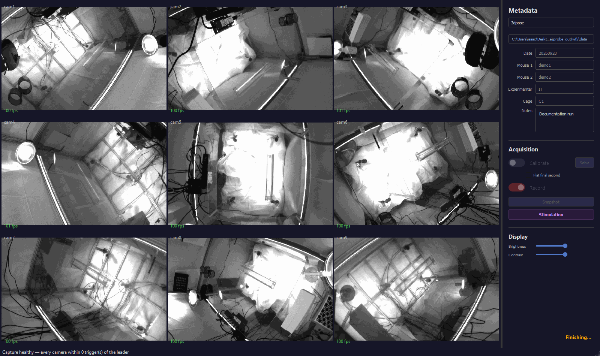

The Record toggle stays drawn on, greyed, until the files are written. Do not
flip it again.

`Finishing…`: the encoders drain and the cameras return to free-run preview.
Panopticon writes each camera's `blockids.npy` and `frametimes.npy`, the
acquisition's `session_metadata.json`, `stim_trace.csv` for a stimulated
recording, and `session.log`. The frame buffers the acquisition used are freed,
so memory use does not grow from one recording to the next.

`ENCODING`: the sidebar shows `Encoding k/N`. With real-time encoding, the
default, each camera's `stream.h264` is copied into an mp4 in seconds. With
`realtime_encode: false`, each `raw.bin` is encoded, `encode_parallel` cameras
at a time. A source file is deleted only after its mp4 has been checked. A
camera whose encode fails keeps its source files and gets an
`encode_error.log`.

What follows depends on the mode:

- With kick-out, the videos already hold the same triggers and nothing is
  re-encoded. If a camera was retired or the cameras kept different frames,
  `WARNINGS.txt` says so and gives the `2_align.py` command to run
  ([Check the block IDs](#check-the-block-ids)).
- Without kick-out (`realtime_kick: false`), or with `realtime_encode: false`,
  the alignment runs when the cameras kept different frames. It shows as
  `ALIGNING` and `Aligning k/N`. It keeps the triggers every camera recorded,
  re-encodes each video to them, and rewrites each camera's block IDs and
  frame times, then `stim_trace.csv`. A retired camera, or one with no frames,
  is left out and named. The status bar ends with
  `Aligned: N synchronized frames per camera`.
- When a camera ended early or stopped for a while, the alignment writes its
  index and replaces no video, because aligning would cut the other cameras.
  A dialog says why, and [Check the block IDs](#check-the-block-ids) gives the
  options.

`IDLE`: the session is complete. Wait for `IDLE` before the next acquisition.

### Check the session

Check the session before the animal goes back, while the rig is still set up:

1. The status bar reads `Recording encoded: F frames, R fps`. One frame count
   means every camera kept the same number. A range (`F1-F2 frames`) means
   they did not. `k CAMERA(S) FAILED: camN` names cameras with no usable
   video. The rate comes from the cameras' own timestamps.

   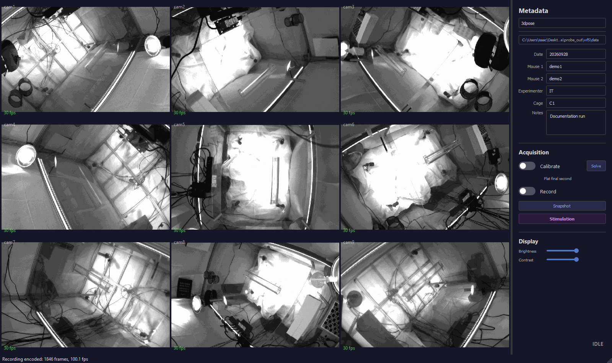

2. No `WARNINGS.txt` anywhere under the acquisition folder. When the take has
   warnings, the status bar ends with their count and the file's path, such as
   `| 1 warning in <folder>\WARNINGS.txt`. No count means none. To be sure,
   open the recording folder in File Explorer and type `WARNINGS` in its
   search box ([Warnings](#warnings)).
3. When step 1 or 2 shows a problem, the block IDs
   ([Check the block IDs](#check-the-block-ids)). Panopticon already ran the
   block-ID rate check when the recording stopped, and wrote any finding to
   `WARNINGS.txt`.
4. One frame of each video. Open an mp4 and check that the animal is neither
   black nor blown out, which the preview cannot show
   ([OVERVIEW.md](OVERVIEW.md#1-camera-grid) says how it differs from a
   recording).
   For more light, add infrared illumination first, then exposure, then gain
   ([CONFIGURATION.md](CONFIGURATION.md#pfs_path)).
5. After a stimulated recording, the stimulation files
   ([section 7](#after-a-stimulated-recording)).

A clean session ends with no dialog.

### Warnings

Problems go to `WARNINGS.txt` in the acquisition folder and to the log, and
the status bar says how many the take has. No dialog opens for them. A camera folder gets its own
`WARNINGS.txt` when that camera's block IDs had to be repaired to match its
video, or its encode lost frames. A new take deletes the old take's
`WARNINGS.txt`, so the file always describes the take beside it.

| Line | Meaning |
|---|---|
| `Effective frame rate X fps (target Y).` | Triggers some camera missed were dropped from every video. The videos stay aligned. The counts are under `kickout` in `session_metadata.json` |
| `N triggers (...) are missing from every camera's video: they were force-dropped ...` | A camera fell more than `kick_max_lag` triggers behind |
| `camN was RETIRED mid-recording (...)` | That camera's video ends early, and the others stay aligned |
| `camN: block IDs advanced at R/s while ...` | Below the trigger rate, that camera ignored triggers: do not use the recording for 3D. TROUBLESHOOTING.md covers the other cases |
| `camN reached T C during this acquisition ...` | A camera ran hot. Shown when frames were lost or a camera reached shutdown |

The effective-frame-rate line appears when more than 0.5% of the triggers were
dropped this way. [TROUBLESHOOTING.md](TROUBLESHOOTING.md) explains every line
and every dialog. After an alignment, its problems go into `WARNINGS.txt`
too.

A `Recording did not finish cleanly` dialog means saving failed, for example
on a full disk. The capture files stay in the folder, neither encoded nor
deleted. Do not start another recording into that folder. Once the cause is
fixed, `uv run python 0_encode.py "<folder>"` turns them into mp4s. The cameras
are closed. Switch profile and back, or restart Panopticon, to reopen them.

### Check the block IDs

`blockids.npy` holds each frame's trigger number. To check a recording:

1. In File Explorer, open the session folder. Hold Shift, right-click the
   `<mouse1>_<mouse2>_recording` folder and choose Copy as path. Windows copies
   the path with quotes around it.
2. Open PowerShell in the repository folder: in File Explorer, open that
   folder, click the address bar, type `powershell` and press Enter.
3. Type the command below. In place of `"<recording folder>"`, press Ctrl+V to
   paste the path, then press Enter.

```
uv run python 2_align.py "<recording folder>"
```

It reads the frame rate from the acquisition's `session_metadata.json`, and
prints the cameras, the triggers every camera recorded and a table:

```
cam     recorded  dropped   %drop    first     last
cam1        6022        0   0.00%        1     6022
cam2        6022        0   0.00%        1     6022
```

On a clean kick-out recording every `dropped` is 0. The same non-zero
`dropped` on every camera means kick-out removed those triggers from all of
them, and the videos are still aligned. A different count on one camera means
the videos are not aligned yet. Run the command again with `--replace` to
re-encode them to the common triggers.

`--replace` refuses while a camera ended early, started late or stopped for
more than about a second. Aligning to that camera would cut the others down to
it. `--exclude camN` aligns the other cameras and leaves that one as recorded,
and `--truncate-to-shortest` cuts every camera anyway. A camera with a
`RETIRED.json` is left out unless you pass `--include-retired`.

The command also runs the block-ID rate check on every camera. A camera that
ignores triggers keeps equal frame counts and gapless block IDs while its
frames drift in time, and this check is what names it. The command always writes
the `aligned/` index, even for a clean recording. Only `--replace` changes the
videos. Its exit status is 0 when all is well, 2 for a warning such as a rate
warning, and 1 for an error or a refused replace.

### Quitting in the middle

Closing the window while work runs asks first, with No as the default:

| State | What Yes does |
|---|---|
| `RECORDING` or `CALIBRATING` | Deletes the unfinished capture |
| `ENCODING` | Keeps the capture. Run `0_encode.py`, then `2_align.py` on the folder, with `--replace` for a recording made without kick-out |
| `ALIGNING` | Keeps the videos, partly aligned. Run `2_align.py --replace`, then `3_stim_trace.py` |
| A solve, a profile switch or a camera operation | Cancels it, and deletes no data |

The dialog names the commands for your folder. Panopticon does not close
during a firmware flash.

Quitting sends the board a stop whenever Panopticon holds its serial port. If
the board does not confirm it, the `Trigger board did not confirm the stop`
dialog of [Stopping](#stopping) appears before the window closes. Power-cycle
the board as [Stopping](#stopping) describes.

### The next animals

Changing Mouse 1 or Mouse 2 starts a new session folder, with no calibration
in it. For the next animals, either:

- calibrate again, then Solve and Record as above; or
- if no camera has moved since the last calibration, copy `calibration.toml`
  from the first session's `calibration/` folder into the new
  `<mouse1>_<mouse2>_recording/` folder, then Record. Create that folder in
  File Explorer if it does not exist yet.

Recording into a folder that holds only `calibration.toml` raises no overwrite
prompt, and the file stays.

### When you are done

At `IDLE`, close the window. It closes without asking. Copy the session
folders to wherever your lab keeps its data.

---

## 10. What the session leaves on disk

### Paths and names

```
<output>/<date>/<mouse1>_<mouse2>/calibration/<camN>/
<output>/<date>/<mouse1>_<mouse2>/<mouse1>_<mouse2>_recording/<camN>/
```

The date and the mouse IDs come from the sidebar, and blank mice become `m1`
and `m2`. `calibration/` and the recording folder sit side by side in one
session, so one calibration serves the recording beside it. The recording
folder carries the mouse IDs so that recordings uploaded together, to LUC3D
for example, keep distinct names. Videos are named
`<date>-<mouse1>_<mouse2>-<camN>-<calibration|recording>.mp4`, for example
`20260904-m1_m2-cam1-recording.mp4`. The solve finds its videos by
`calibration` in the name.

### Every file a session can contain

In each camera folder:

| File | What it is |
|---|---|
| `<date>-<session>-<camN>-<type>.mp4` | The video: H.264, one keyframe per second, index at the front so a browser can seek |
| `blockids.npy` | One trigger number (block ID) per frame. A dropped frame leaves a gap |
| `frametimes.npy` | 2 × F: frame numbers 1 to F, and each frame's device time in seconds from the first |
| `WARNINGS.txt` | Written when this camera's block IDs had to be repaired to match its video, or its encode lost frames |
| `RETIRED.json` | Written when the camera was retired: why, and its last block ID |
| `encode_error.log`, `tail_error.log` | Written when an encode failed: ffmpeg's output |
| `stream.h264`, `raw.bin` | Capture files, deleted once the mp4 is checked. Left behind, they mean the encode did not finish |
| `raw_tail.bin`, `encoded.json` | Frames written raw after a camera's encoder failed, and where they start. The encode merges them |
| `blockids.full.npy`, `frametimes.full.npy` | The full arrays, kept when a failed merge cut the metadata to the mp4 |
| `frametimes_synthesized.json`, `frametimes.orig.npy` | An alignment made the frame times from block IDs. The rate check then skips this camera |
| `aligned_tmp.mp4` | An alignment in progress |

In the acquisition folder, `calibration/` or `<mouse1>_<mouse2>_recording/`:

| File | What it is |
|---|---|
| `session_metadata.json` | This acquisition's metadata ([below](#session_metadatajson)) |
| `session.log` | The log from arming the cameras to the end of the encode |
| `WARNINGS.txt` | Written when something went wrong |
| `calibration.toml` | The solve's result, copied into the recording folder by Solve |
| `skeleton.json` | The profile's [skeleton](CONFIGURATION.md#skeleton), which LUC3D loads with the session. Recording only, when the profile names one |
| `calibration_report.json`, `reprojection_error_histogram.png` | The solve's figures and plot. Calibration only |
| `codet_frames.json` | The triggers at which two or more cameras saw the board. Calibration only |
| `stim_paradigm.json`, `stim_paradigm.ino`, `stim_trace.csv` | The paradigm, its sketch and the modelled stimulus per trigger ([section 7](#after-a-stimulated-recording)) |
| `aligned/alignment.npz`, `aligned/alignment.json` | The alignment index, written whenever an alignment runs ([below](#aligned)) |

The session folder holds a copy of `session_metadata.json` from the session's
first acquisition, which is never overwritten, and
`snapshots/<date>_<HHMMSS>/camN.png`. The launch log stays in `logs\` in the
repository folder.

### session_metadata.json

Each acquisition writes its own copy when it stops. It holds:

- the sidebar fields and the profile's name;
- the cameras' names, serials and models, in cam1 to camN order;
- the frame rates, the resolution and the time;
- the host, the OS, Python, the GPU with its driver and memory, and the NVENC
  sessions available;
- each camera's temperatures (`camera_thermals`, where `temp_max_c` is the
  one to read);
- the encoder used and the one the profile asked for;
- settings the videos cannot show, among them `trigger_source`, `log_level`,
  `nvenc_upload`, `thermal_warn_margin_c` and `capture_processes`;
- `kickout`: the triggers decided, kept, kicked out and force-dropped, and the
  [effective frame rate](GLOSSARY.md#effective-frame-rate);
- `log`: the log's level and file, and the lines this acquisition lost;
- `camera_stream_stats` and `nvenc_upload_used`.

The GPU driver and its session count are there because the driver's NVENC
session cap changes between driver versions. A cap below the camera count
changes how a session records, with nothing else on the machine changing.

### stim_trace.csv

One row per trigger:

- `frame`: the frame's index in the reference camera's video, counted from 0;
- `blockid`, `t_s` and `any_active`;
- per chain, `chain<i>_step`, `chain<i>_active`, `chain<i>_freq_hz` and
  `chain<i>_pw_ms`;
- a modelled `pin<N>_ttl` per pin;
- a `frame_<cam>` column per camera, blank where that camera has no frame for
  the trigger.

When the videos are aligned, every `frame_<cam>` equals `frame`.
`2_align.py --replace` rewrites the file, and `3_stim_trace.py` writes it again
by hand.

### aligned/

`alignment.npz` holds `common_block_ids`, `frame_index` (cameras × common
triggers), `camera_names` and `video_is_common`. `alignment.json` holds a
readable summary:

- `trigger_span`, `common_frames`, whether alignment was `needed`, and
  whether the videos were `replaced`;
- per camera, `recorded`, `dropped`, `video_is_common` and
  `frametimes_synthesized`;
- any `excluded` or `short_cams`, a `refused` replace, `failures` and the rate
  warnings.

An `aligned/` folder beside a clean recording usually means someone ran
`2_align.py` to check it. Its `alignment.json` then reads `replaced: false`
with every `dropped` at 0.

### An example session

A session on the reference rig, recorded with Mouse 1 `demo1` and Mouse 2 `demo2`,
with one calibration, one recording and one snapshot:

```
demo1_demo2/
├── calibration/
│   ├── cam1/
│   │   ├── 20260928-demo1_demo2-cam1-calibration.mp4
│   │   ├── blockids.npy
│   │   └── frametimes.npy
│   ├── cam2/ … cam9/
│   ├── session.log
│   └── session_metadata.json
├── demo1_demo2_recording/
│   ├── cam1/
│   │   ├── 20260928-demo1_demo2-cam1-recording.mp4
│   │   ├── blockids.npy
│   │   └── frametimes.npy
│   ├── cam2/ … cam9/
│   ├── session.log
│   ├── session_metadata.json
│   └── skeleton.json
├── snapshots/
│   └── 20260928_095215/
│       └── cam1.png … cam9.png
└── session_metadata.json
```

`cam2/ … cam9/` stands for the other camera folders, which hold the same files
as `cam1/`. The calibration saw no board, so it has no `codet_frames.json`, and it
was not solved. The recording ran with an empty canvas, so it has no
stimulation files.

A solved calibration on the same rig also holds the solve's files. Solve has
created the recording folder to hold its copy of `calibration.toml`:

```
demo1_demo2/
├── calibration/
│   ├── cam1/ … cam9/
│   ├── calibration.toml
│   ├── calibration_report.json
│   ├── codet_frames.json
│   ├── reprojection_error_histogram.png
│   ├── session.log
│   └── session_metadata.json
└── demo1_demo2_recording/
    └── calibration.toml
```

A stimulated recording also holds `stim_paradigm.json`, `stim_paradigm.ino` and
`stim_trace.csv` beside its `session.log`. A clean take has no `WARNINGS.txt`,
and no `stream.h264` or `raw.bin` left behind. A take whose cameras kept
different frames without kick-out also has `aligned/`, and so does one checked
later with `2_align.py`.

### The command-line tools

Each runs in the project environment, from the repository folder, and takes
`--help`:

| Command | What it does | Exit status |
|---|---|---|
| `uv run python 0_encode.py <folder>` | Turns an acquisition's capture files into mp4s when the window's encode did not finish | 0 done; 1 a camera failed; 2 a camera holds fewer frames than captured |
| `uv run python 1_calibrate.py <session> --board-config <file>` | The solve ([Solving by hand](#solving-by-hand)) | 0 solved, also when cameras were dropped; 1 failed |
| `uv run python 2_align.py <folder> [--replace]` | Checks the block IDs and their rate. Aligns the videos with `--replace` | 0 fine; 2 a warning; 1 an error or a refused replace |
| `uv run python 3_stim_trace.py <folder>` | Writes `stim_trace.csv` again | 0 fine; 2 the cameras disagree; 1 skipped |

For FLIR cameras, `probe_flir.py` tests each camera before a first recording
([FLIR.md](FLIR.md)).

---

Next: [CONFIGURATION.md](CONFIGURATION.md) describes every setting of a
profile. When Panopticon shows a message, look it up in
[TROUBLESHOOTING.md](TROUBLESHOOTING.md).
